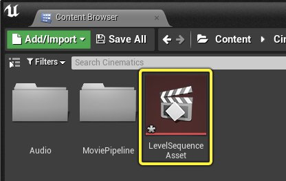
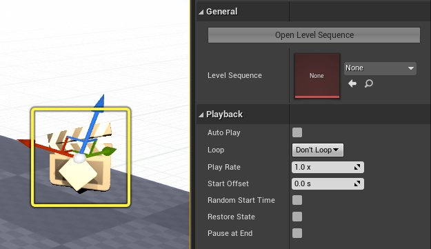
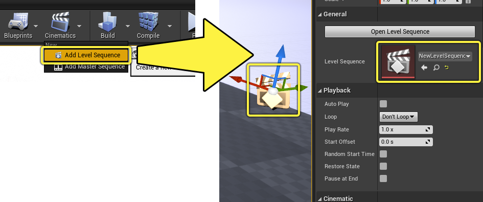
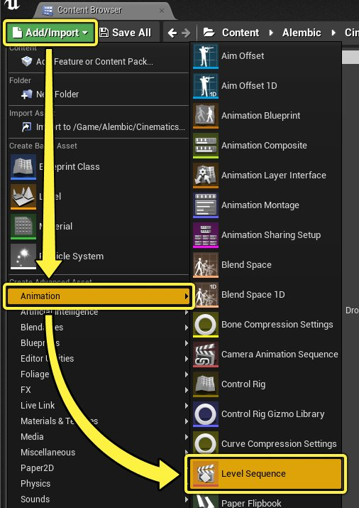
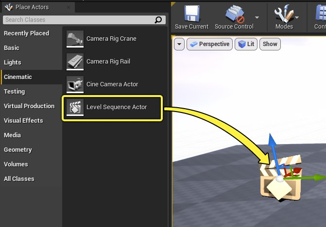
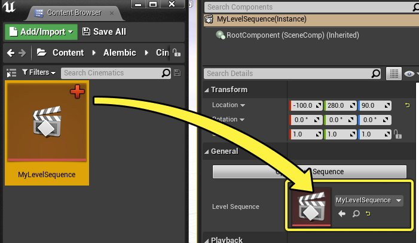
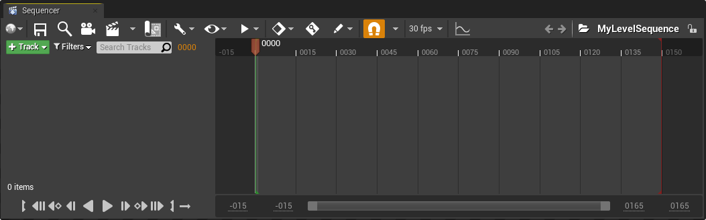
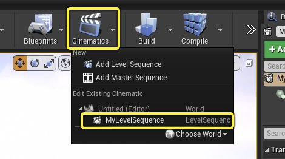

# Sequencer概述

> 路径：虚幻引擎5.7文档 / 为角色和对象制作动画 / 过场动画和Sequencer / Sequencer概述

> 原始页面：https://dev.epicgames.com/documentation/unreal-engine/unreal-engine-sequencer-movie-tool-overview

用户可以使用Sequencer中的多轨道编辑器来创建游戏过场动画。通过创建关卡序列、添加轨道和创建关键帧，你可以为对象、角色和摄像机添加动画。

本页将介绍Sequencer Actor、关卡序列资产和Sequencer的主要功能。

## Sequencer资产和Actor

虚幻引擎中的Sequencer主要有2个部分：**关卡序列资产（Level Sequence Asset）** 和 **关卡序列Actor（Level Sequence Actor）** 。

**关卡序列资产（Level Sequence Asset）** 位于内容浏览器（Content Browser）中，包含Sequencer的数据。这包括轨道、摄像机、关键帧和动画。此资产将分配到 **关卡序列Actor（Level Sequence Actor）** ，以便将其数据绑定到关卡。

**关卡序列Actor（Level Sequence Actor）** 位于关卡中，是 **关卡序列资产（Level Sequence Asset）** 的容器。你可以选择它，以便在 **细节（Details）** 面板中查看其细节。

| 名称 | 说明 |
| --- | --- |
| **打开关卡序列（Open Level Sequence）** | 打开当前绑定关卡序列资产的序列编辑器。 |
| **关卡序列（Level Sequence）** | 当前绑定的关卡序列资产。 |
| 播放 |  |
| **自动播放（Auto Play）** | 创建Actor时，序列将自动播放。 |
| **循环（Loop）** | 序列的循环选项。不循环（Don't Loop）将导致序列在播放一次后结束。无限循环（Loop Indefinitely）将导致序列永久循环。精确循环...（Loop Exactly...）将显示次数条目，你可以在其中指定序列的循环次数，达到次数后循环将结束。 |
| **播放速度（Play Rate）** | 播放序列的速度。不影响时间膨胀。 |
| **起始偏移（Start Offset）** | 序列应该相对于起始时间开始的时间量（以秒为单位）。 |
| **随机开始时间（Random Start Time）** | 在开始时间和结束时间之间的随机点开始播放序列。启用此选项将禁用起始偏移。 |
| **恢复状态（Restore State）** | 将所有Actor恢复到序列开始之前的状态。 |
| **结束时暂停（Pause at End）** | 序列将在结束时暂停，使所有Actor保持在序列的最终位置。 |
| 过场动画 |  |
| **禁用运动输入（Disable Movement Input）** | 在序列期间禁用来自玩家Pawn的平移输入。 |
| **禁用查看输入（Disable Look At Input）** | 在序期间禁用来自玩家Pawn的旋转输入。 |
| **隐藏玩家（Hide Player）** | 在序列期间禁用玩家Pawn的可视性。 |
| **隐藏Hud（Hide Hud）** | 在序列期间隐藏所有平视显示器（HUD）元素。 |
| **禁用镜头切换（Disable Camera Cuts）** | 禁用镜头切换轨道，使序列无法控制摄像机。 |

### Sequencer创建

你可以通过多种方式创建和指定关卡序列。

最快的方法之一是，点击关卡编辑器（Level Editor）主工具栏中的 **过场动画（Cinematics）** 下拉菜单，然后选择 **添加关卡序列（Add Level Sequence）** 。系统将提示你在内容浏览器（Content Browser）中创建新的 **关卡序列资产（Level Sequence Asset）** 。命名该关卡序列资产，然后点击 **保存（Save）** 。创建后，你的关卡现在将包含 **关卡序列Actor（Level Sequence Actor）** ，并引用新创建的 **关卡序列资产（Level Sequence Asset）** 。

创建和指定序列的另一种方法是，点击 **[内容浏览器](../../../understanding-the-basics/content-browser/index.md)** 中的 **添加/导入（Add/Import）> 动画（Animation）> 关卡序列（Level Sequence）** 。系统还将提示你创建新的 **关卡序列资产（Level Sequence** Asset）。

创建序列资产后，找到 **[放置Actor](../../../understanding-the-basics/actors-and-geometry/placing-actors/index.md)** 面板，并从 **过场动画（Cinematic）** 类别中拖入 **关卡序列Actor（Level Sequence Actor）** 。

然后将资产拖放到关卡序列属性（Level Sequence），将你的关卡序列资产绑定到关卡序列Actor。

## Sequencer编辑器

Sequencer选项卡将包含Sequencer编辑器（Sequencer Editor），它提供了用于创建过场动画内容的用户界面。

你可以通过多种方式打开此窗口。

一种方法是，点击关卡编辑器（Level Editor）主工具栏中的 **过场动画（Cinematics）** 下拉菜单，然后从列表中选择你的序列。你的序列必须指定给关卡中的关卡序列Actor才能显示在此处。

另一种方法是，在 **细节（Details）** 面板中点击关卡序列Actor（Level Sequence Actor）的 **打开关卡序列（Open Level Sequence）** 按钮。

> 图片已省略：打开Sequencer

或者双击 **细节（Details）** 面板中的 **关卡序列** 属性图标。

> 图片已省略：打开Sequencer

在 **内容浏览器（Content Browser）** 中双击关卡序列资产（Level Sequence Asset）也可以打开它。

> 图片已省略：打开Sequencer

> [!NOTE]
> 从内容浏览器（Content Browser）打开序列时，你当前必须有一个已打开的关卡，并且在该关卡中引用了该序列。否则内容将不会绑定。

最后，找到主菜单栏并点击 **窗口（Window）>过场动画（Cinematics）>Sequencer** 可以打开它。

> 图片已省略：打开Sequencer

访问 页面，了解有关Sequencer编辑器的更多信息。

- [使用模板序列](template-sequences/index.md) - 学习如何在摄像机动画中使用模板序列。

- [曲线编辑器](animation-curve-editor/index.md) - 使用曲线编辑器及其中的工具调整关键帧和曲线。

- [轨道](sequencer-track-list/index.md) - 在Sequencer中创建影响Actor的轨道。

- [序列、镜头和镜头试拍](sequences-shots-and-takes/index.md) - 使用序列、镜头和镜头试拍，在非线性编辑器中编辑过场动画。

- [Actor Sequence组件](sequencer-blueprint-component/index.md) - 说明如何使用 Actor 序列组件在 Actor 蓝图中嵌入序列。

- [Take Recorder](take-recorder/index.md) - Take Recorder的录制编辑器、Gameplay和Live Link Actor。

- [关键帧](creating-animation-keyframes/index.md) - 在Sequencer中为Object、Actor和属性设置关键帧并使用分段，以便添加动画。

- [编辑器偏好设置和项目设置](cinematic-editor-and-project-settings/index.md) - 使用编辑器和项目设置调整Sequencer的行为。

- [渲染电影设置](old-render-movie/index.md) - 介绍渲染过场动画序列时的可用选项。

- [导出和导入FBX文件](import-and-export-cinematic-fbx-animations/index.md) - 介绍如何将FBX文件导出和导入Sequencer。

- [Sequencer标签和分组](cinematic-tags-and-groups/index.md) - 在蓝图脚本中，使用标签来引用Sequencer Actor，并使用分组来组织轨道。

- [动态绑定](dynamic-binding-in-sequencer/index.md) - 动态绑定提供自定义蓝图逻辑，用于选择在关卡中要持有的对象或要生成的对象。

- [Sequencer播放列表](sequencer-playlists/index.md) - 在虚拟制片会话期间准备和触发序列。

- [Sequencer中的Python脚本](python-scripting-in-sequencer/index.md) - 了解用于Sequencer的常见Python脚本命令和功能。

## Sequencer功能

以下页面详细说明了Sequencer主要的动画和电影制作功能。

- [使用模板序列](template-sequences/index.md) - 学习如何在摄像机动画中使用模板序列。

- [曲线编辑器](animation-curve-editor/index.md) - 使用曲线编辑器及其中的工具调整关键帧和曲线。

- [轨道](sequencer-track-list/index.md) - 在Sequencer中创建影响Actor的轨道。

- [序列、镜头和镜头试拍](sequences-shots-and-takes/index.md) - 使用序列、镜头和镜头试拍，在非线性编辑器中编辑过场动画。

- [Actor Sequence组件](sequencer-blueprint-component/index.md) - 说明如何使用 Actor 序列组件在 Actor 蓝图中嵌入序列。

- [Take Recorder](take-recorder/index.md) - Take Recorder的录制编辑器、Gameplay和Live Link Actor。

- [关键帧](creating-animation-keyframes/index.md) - 在Sequencer中为Object、Actor和属性设置关键帧并使用分段，以便添加动画。

- [编辑器偏好设置和项目设置](cinematic-editor-and-project-settings/index.md) - 使用编辑器和项目设置调整Sequencer的行为。

- [渲染电影设置](old-render-movie/index.md) - 介绍渲染过场动画序列时的可用选项。

- [导出和导入FBX文件](import-and-export-cinematic-fbx-animations/index.md) - 介绍如何将FBX文件导出和导入Sequencer。

- [Sequencer标签和分组](cinematic-tags-and-groups/index.md) - 在蓝图脚本中，使用标签来引用Sequencer Actor，并使用分组来组织轨道。

- [动态绑定](dynamic-binding-in-sequencer/index.md) - 动态绑定提供自定义蓝图逻辑，用于选择在关卡中要持有的对象或要生成的对象。

- [Sequencer播放列表](sequencer-playlists/index.md) - 在虚拟制片会话期间准备和触发序列。

- [Sequencer中的Python脚本](python-scripting-in-sequencer/index.md) - 了解用于Sequencer的常见Python脚本命令和功能。
