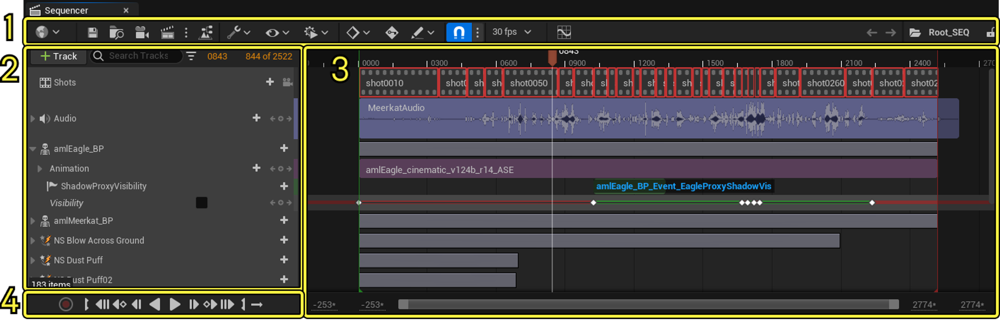
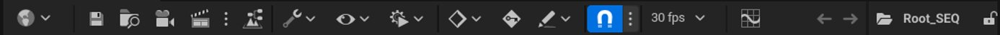
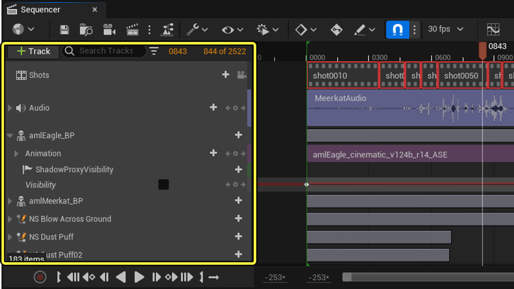
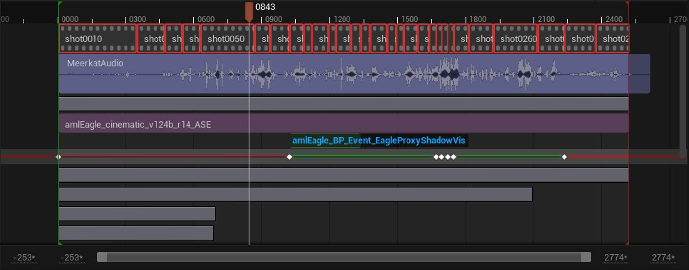
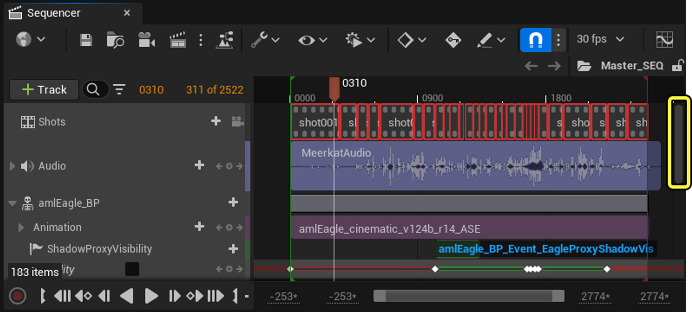
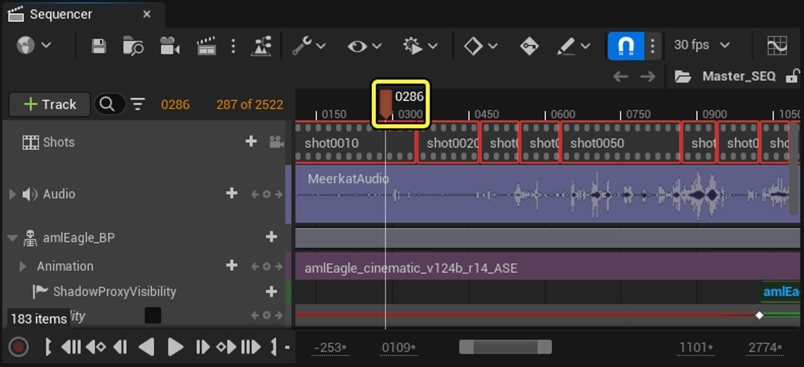
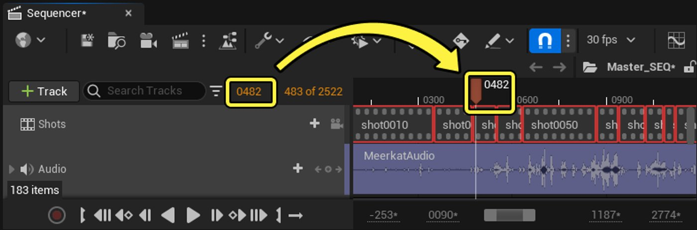
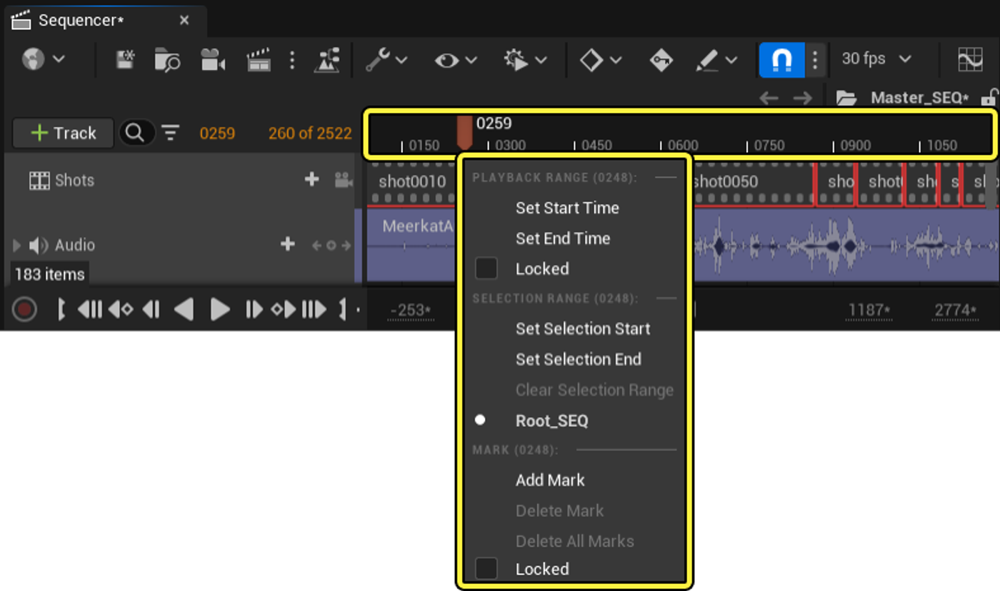

# Sequencer Editor

> 路径：虚幻引擎5.7文档 / 为角色和对象制作动画 / 过场动画和Sequencer / Sequencer概述 / Sequencer Editor

> 原始页面：https://dev.epicgames.com/documentation/unreal-engine/sequencer-cinematic-editor-unreal-engine

该页面没有可用的官方中文版本；以下内容保留原文，并按本项目人工译文规则逐步回译。

**Sequencer Editor（Sequencer 编辑器）** 是用于编辑 [Level Sequence asset](../index.md)以在 **Unreal Engine**.

本文档概述 Sequencer Editor 的用户界面、工具和属性。

1. [工具栏](index.md#toolbar)
2. [Outliner](index.md#outliner)
3. [Timeline](index.md#timeline)
4. [播放控制](index.md#playback-controls)

## 工具栏

Sequencer Editor 工具栏包含一组工具、选项和设置，可用于与 Level Sequence asset 交互。

| 名称 | 图标 | 说明 |
| --- | --- | --- |
| [World](sequencer-cinematic-toolbar/index.md) | [sequencer world](https://dev.epicgames.com/community/api/documentation/image/dc5caa23-d662-4f46-9e8a-f33f95c24a36?resizing_type=fit) | 列出当前 world context、Level Sequence Actor 和 playback realm 的信息。它包含用于指定 sequence 是否自动绑定到 Play In Editor（PIE）、Simulation 或其它 runtime session 的选项。 |
| **Save** | [sequencer save](https://dev.epicgames.com/community/api/documentation/image/1eefd7cc-eb88-4f34-85df-853b00128fc8?resizing_type=fit) | 保存当前 sequence 以及所有 subscene 或 shot。 |
| **Find in Content Browser** | [sequencer find](https://dev.epicgames.com/community/api/documentation/image/bf37f8bc-8f92-405c-a0aa-6a5b6c1702f9?resizing_type=fit) | 在 Content Browser 中定位当前 sequence 的 Level Sequence asset。 |
| [Create Camera](sequencer-cinematic-toolbar/index.md) | [sequencer camera](https://dev.epicgames.com/community/api/documentation/image/52b93f05-a804-4d5b-9b92-1b5940186aa6?resizing_type=fit) | 创建新的 **[Cine Camera Actor](../../movie-and-cinematic-cameras/cinematic-cameras/index.md)**。新的 **[Camera Cut Track](../sequencer-track-list/cinematic-camera-cut-track/index.md)** 也会被创建；如果尚未创建，它会引用此 camera。 |
| [Render](sequencer-cinematic-toolbar/index.md) | [sequencer render](https://dev.epicgames.com/community/api/documentation/image/7359ff39-ee0a-4abc-8d7d-f30933b5a58b?resizing_type=fit) | 打开 Settings 对话框，或在插件已启用时打开 **[Movie Render Queue](https://dev.epicgames.com/documentation/assets/animating-characters-and-objects/Sequencer/movie-render-pipeline#movierenderqueue)** 。 |
| [Director Blueprint](sequencer-cinematic-toolbar/index.md) | [sequencer director](https://dev.epicgames.com/community/api/documentation/image/fd2fee70-e35a-4ec3-b9b8-3534e9670e3f?resizing_type=fit) | 打开此 sequence 的 Director Blueprint，可从中访问 **[Event Track](../sequencer-track-list/cinematic-event-track/index.md)** 逻辑。 |
| [Actions](sequencer-cinematic-toolbar/index.md) | [sequencer actions](https://dev.epicgames.com/community/api/documentation/image/d8b0d06e-04a0-41b7-9d4f-feb727e323f3?resizing_type=fit) | 列出各种 sequence editor 操作，例如保存、导入/导出、烘焙和选择编辑。 |
| [View Options](sequencer-cinematic-toolbar/index.md) | [sequencer view options](https://dev.epicgames.com/community/api/documentation/image/49a637c6-35d5-4a8a-94ab-1dc61d84e4c9?resizing_type=fit) | 列出各种 sequence 视图选项。 |
| [Playback Options](sequencer-cinematic-toolbar/index.md) | [sequencer playback options](https://dev.epicgames.com/community/api/documentation/image/c1072739-d497-4cb7-bf75-5e08aa27d982?resizing_type=fit) | 列出各种播放选项，例如 playrate、开始/结束时间和 playhead 行为。 |
| [Keyframe Options](sequencer-cinematic-toolbar/index.md) | [sequencer keyframe options](https://dev.epicgames.com/community/api/documentation/image/7f634ee6-8154-46f0-90b7-a30b2dd91bcb?resizing_type=fit) | 列出 Auto Key transform 关键帧行为，以及默认创建哪些 tangent 的设置。 |
| [Auto Key](sequencer-cinematic-toolbar/index.md) | [sequencer autokey](https://dev.epicgames.com/community/api/documentation/image/ebeaa4ec-51e6-483a-ac39-a718afc452e9?resizing_type=fit) | 启用 Autokey 模式；当属性或 transform 变化时，会自动创建 keyframe。 |
| [Edit Options](sequencer-cinematic-toolbar/index.md) | [sequencer edit options](https://dev.epicgames.com/community/api/documentation/image/48d756c5-0538-40e1-974f-c36f0a4a9415?resizing_type=fit) | 列出使用 Auto Key 时，Sequencer 如何解释 Details 面板编辑的设置。 |
| [Snapping](sequencer-cinematic-toolbar/index.md) | [sequencer snapping](https://dev.epicgames.com/community/api/documentation/image/e8e50238-8312-46bd-a3c6-be3d7282f0d0?resizing_type=fit) | 启用 snapping。旁边的下拉菜单列出用于设置 keyframe、section 和 timeline snapping 规则的选项。 |
| [Frames Per Second](sequencer-cinematic-toolbar/index.md) | [sequencer fps](https://dev.epicgames.com/community/api/documentation/image/0c206d89-4346-49c9-bc74-3d3ba82bea2e?resizing_type=fit) | 列出运行时各种 Frames Per Second（FPS）目标的设置。还包含允许运行时锁定到所选帧率的选项。 |
| [Curve Editor](sequencer-cinematic-toolbar/index.md) | [sequencer curve editor](https://dev.epicgames.com/community/api/documentation/image/502793cc-5899-4338-bb55-dbb51548ce3c?resizing_type=fit) | 打开 **[Curve Editor](../animation-curve-editor/index.md)** 用于精细调整动画 keyframe 和 tangent。 |
| [Breadcrumbs](sequencer-cinematic-toolbar/index.md) | [sequencer breadcrumbs](https://dev.epicgames.com/community/api/documentation/image/b8b6bfcb-cd15-4563-b81c-e9561d9a2a45?resizing_type=fit) | 显示当前 sequence 名称，并用于在 master sequence 和 shot 之间导航。 |
| **Lock** | [sequencer lock](https://dev.epicgames.com/community/api/documentation/image/e42accf1-0fe4-488f-983b-5e0e90db20ad?resizing_type=fit) | 锁定整个 sequence 以防止编辑。 |

请参阅 [Sequence Editor 工具栏](sequencer-cinematic-toolbar/index.md) 了解有关 Sequencer 工具栏的更多信息。

## Outliner

Sequencer Editor 的 Outliner 包含 Level Sequence asset 的 track 列表，以及添加、筛选和搜索 track 的工具。Track 可以表示附加到 Level Sequence 的 Actor，例如 Camera、Character、Audio 和 Effect。

请参阅 [Sequencer Track](../sequencer-track-list/index.md) 了解不同 track 类型的更多信息。

## Timeline

Sequencer 的 Timeline 是非线性编辑环境，表示 Level Sequence asset 的整个可播放区域。Timeline 为每个 Track 包含水平区域，并可包含 asset、keyframe 和 timeline control。

Level Sequence asset 的播放范围包含在 **Start**（绿色）和 **End**（红色）标记之间。当前播放位置由 [Playhead](index.md#playhead).

### 导航

要在 Sequencer Editor 中导航 Level Sequence asset，可以在 timeline 中 [pan](index.md#panning) and [zoom](index.md#zooming) 。

#### 平移

可以上下拖动右侧滚动条，垂直平移 Timeline 视图，以查看额外 track 区域。

可以使用 timeline 底部的 **Range Slider** 水平平移和缩放 Timeline 视图，以查看播放中的不同内容。

拖动滑块中间区域会平移；拖动左右边界会缩放视图。

> [!NOTE]
> Range Slider 默认启用，可从 Sequencer 工具栏中的 **View Options** 下拉菜单禁用。
>
> 图片

按住鼠标右键并沿 timeline 拖动，可进行水平和垂直平移。

滚动会让 timeline 上下平移；按住 **Shift**并滚动鼠标滚轮会让 timeline 左右平移。

#### 缩放

可以按住 **CTRL**并滚动鼠标滚轮来缩放 timeline。

> 动图已省略：horizontal scrolling

按住 **ALT** + **Shift**并使用鼠标右键左右点击拖动，可进行自由缩放。

> 动图已省略：horizontal scrolling

按住 **CTRL**并沿 time bar 向 **右**拖动，可以定义 zoom region。按住 **CTRL**并沿 time bar 向 **左**拖动，会将缩放重置为完整范围。

> 动图已省略：horizontal scrolling

默认情况下，zoom pivot 相对于 playhead；可通过找到 **Zoom Position** 偏好设置来更改，该设置位于 **Level Sequence Editor** 部分，该部分位于 **Editor Preferences**.

如果 zoom 和 timeline framing 过度扩展，可以按 **Home**键重置 zoom 和 timeline framing，这也会重置 range slider 边界。

> 动图已省略：home button horizontal zoom scrolling

### Playhead

playhead 显示 sequence 中的当前时间，是 timeline 交互的主要控制项之一。播放期间，它会按指定 playrate 穿过 timeline；暂停时可停在当前位置。

可以 **Left Mouse Button**(**LMB**)拖动 playhead 以更改 sequence 当前时间，并在 viewport 中预览变化。这通常称为“scrubbing”。请参阅 [Scrubbing 响应性](index.md#scrubbing-responsiveness) and [Synchronous Scrubbing（同步 Scrubbing）](index.md#synchronous-scrubbing) 了解更多信息。

**Middle Mouse Button** (**MMB**拖动会让 playhead 移动到所选位置，但不会触发 sequence evaluate。此技术用于更改时间而不改变属性值，也可用于快速创建相同值的 keyframe。以这种方式操作 playhead 时，它会变为 **黄色**，表示 sequence 未在 evaluate。

playhead 的当前时间会显示在 sequence outliner 中，并可从中操作。可以按 **CTRL + T** 将焦点放到此字段，并输入新的时间值。

也可以右键点击 playhead 或 time bar 上任意位置，以显示附加选项。

| 名称 | 说明 | 热键 |
| --- | --- | --- |
| **Set Start Time** | 将 sequence 开始时间设置为光标当前位置。 | **[** |
| **Set End Time** | 将 sequence 结束时间设置为光标位置。 | **]** |
| **Set Selection Start** | 将自定义 timeline selection range 的起点设置为光标位置。 | **i** |
| **Set Selection End** | 将自定义 timeline selection range 的终点设置为光标位置。 | **o** |
| **Clear Selection Range** | 移除所选范围。 |  |
| **Add Mark** | 在当前 playhead 时间创建自定义 timeline mark。 | **m** |
| **Delete All Marks** | 从 sequence 中移除所有自定义 mark。 |  |
| **Locked** | 启用后，所有 mark 会被锁定，防止 mark 被编辑，从而允许自由 scrub timeline slider。 |  |

> [!NOTE]
> 如果当前时间位于 sub-frame 或帧之间，Playhead 时间指示器会显示 **星号** （*）。如果 [snapping](sequencer-cinematic-toolbar/index.md) 禁用，可能出现这种情况。
>
> > 图片已省略：sequencer sub frames asterisk

#### Scrubbing 响应性

在 Sequencer 中定位特定位置和沿 track scrub 都是异步非阻塞操作，其响应性取决于使用的视频编解码器。

- **Apple ProRes** 提供最佳 scrubbing 体验。
- **H.264/5** 有效，但即使启用硬件解码，也会显示数帧延迟。

#### Media Player Info

为方便起见，Media Section 会直接在 Sequencer UI 中显示 media player 和 media file 信息。这会直观确认当前用于播放的 media player。

> [!NOTE]
> 某些 GOP codec（如下方截图中的 H.264）可能导致 scrubbing 性能较慢；这种情况下会显示黄色警告消息。

> 图片已省略：Codec warning message in Sequencer UI

#### Synchronous Scrubbing（同步 Scrubbing）

对于 scrub 时需要完美帧对齐的用例，例如在 Sequencer 中对照参考视频素材制作动画，可以启用 **Synchronous Scrubbing（同步 Scrubbing）** Sequencer media track 选项。它会将视频帧和动画帧精确对齐到 playhead 所在位置，从而确保完美对齐，但会牺牲一些编辑器 scrubbing 响应性。该选项默认禁用，以优先保证速度和响应性。

> [!NOTE]
> 此设置只影响 scrubbing，对始终帧精确的 playback 没有影响。

> 图片已省略：Synchronous Scrubbing

### Selection Range

Selection range 是可以在 sequence 中定义的自定义区域，用于辅助 timeline 选择和播放。

要创建 selection range，请右键点击 timeline bar 中的某个点并设置 **Start**and **End Selection Range**.

> 图片已省略：sequencer selection range start end

selection range handle 可以像 sequence 的开始和结束时间一样调整。

> 动图已省略：sequencer selection range manipulation

也可以将 sequence 播放设置为在 selection range 内循环。

Selection range 还可用于选择其中的 keyframe 和 section，方法是点击 **Actions**工具栏按钮并选择 **选择 Selection Range 中的 Key** or **选择 Selection Range 中的 Section**.

> 图片已省略：sequencer selection range settings

要移除 selection range，请右键点击 time bar 并选择 **Clear Selection Range**.

### Custom Frame Mark（自定义帧标记）

Custom frame mark 是可添加的点，用于提醒注意某些区域，或为 sequence 提供注释。

要创建 mark，请右键点击 timeline bar 中的某个点并选择 **Add Mark**.

> 图片已省略：sequencer add mark option

可以在 Sequencer Timeline 中选择和多选 Frame Mark，以编辑其位置。

要编辑 mark，请右键点击 Sequencer Timeline 中的 mark flag 以访问上下文菜单。可在这里自定义其属性，例如 **Frame Number、Label** and **Color**.

> 图片已省略：sequencer mark properties

在 Sequencer Editor 中创建 cinematic 时，可使用这些属性查看和设置 Custom Frame Mark 行为：

| 属性 | 说明 |
| --- | --- |
| **Marked Frame** | 设置或引用 **frame number** ，即 mark 在 Level Sequence 中所在的帧。 |
| **Label** | 设置 Custom Frame Mark 的名称。设置的值会显示在 Sequencer Timeline 中 Mark flag 顶部。 |
| **Comment** | 添加与自定义 mark 关联的注释。 |
| **Color** | 为 Sequencer Timeline 中的 Mark flag 设置自定义颜色。 |
| **Is Determinism Fence?** | 启用后，Mark 会被视为 **Determinism Fence**，这会确保所有 Sequencer Component 都在 Sequencer Timeline 中 Mark 所在位置进行 evaluate。Determinism Fence 不能通过单次 evaluation 跨越，会强制 evaluation 分为两个独立部分执行，以确保准确 evaluate 所有当前 Sequencer component。建议在 Level Sequence 的重要帧上添加启用了 **Is Determinism Fence** 属性的 Mark，以确保运行时准确播放。 |
| **Add Mark** | 在光标所在 timecode 创建新的自定义 mark。每个 level sequence frame 只能存在一个自定义 mark。 |
| **Delete Mark** | 删除当前选中的 mark。 |
| **Delete All Marks** | 删除 level sequence asset 内的所有自定义 mark。 |

## 播放控制

播放控制位于 Sequencer 左下角，其工作方式类似标准媒体播放应用。

这里提供用于切换播放、暂停和其它播放相关功能的按钮。

> 图片已省略：sequencer add mark option

| 图标 | 说明 |
| --- | --- |
| [sequencer record button take recorder](https://dev.epicgames.com/community/api/documentation/image/cc94a050-e237-4998-9d39-1694ec05e5e8?resizing_type=fit) | 使用 **Take Recorder**.记录 Sequencer Outliner 中选中 Actor 的运动。要使用此播放控制，必须安装 Take Recorder 插件。更多信息请参阅 [Take Recorder](../take-recorder/index.md) 文档。 |
|  | 将 sequence 开始时间设置为 playhead 的当前位置。 |
|  | 跳转到 sequence 开始位置。 |
|  | 跳转到所选 track 中的上一 keyframe。 |
|  | 跳转到上一帧。 |
|  | 从 playhead 当前位置反向播放或暂停 sequence。 |
|  | 从 playhead 位置播放或暂停 sequence。 |
|  | 跳转到下一帧。 |
|  | 跳转到所选 track 中的下一 keyframe。 |
|  | 跳转到 sequence 结束位置。 |
|  | 将 sequence 结束时间设置为 playhead 的当前位置。 |
|  | 在循环和不循环之间切换。如果 timeline 中使用了 selection range，则会加入 selection range 循环。 |

### Playback and Looping

播放和循环性能是视频播放中最重要的功能。不过，Sequencer timeline 可以形成多种 Media Track section 配置，包括原生、裁剪、扩展、扩展并裁剪，以及带或不带 pre-roll/post-roll。这些配置会产生导致循环问题的边界情况。下面示例是当前支持的循环用例。

#### Baseline Looping

Baseline looping 适用于以下用例：

- Media Section 长度未更改，也就是与视频片段持续时间一致。
- Sequencer 播放范围位于 Media Section pre-roll 和 post-roll 边界内。

> 图片已省略：Sequencer baseline looping

在此配置中，视频片段为完整长度并位于 T=0，这会阻止使用 pre-roll section。由于红色和绿色裁剪线位于片段边缘，Media Section 实现会保持 Player 存活，并能在 playhead 到达 Sequencer 播放范围末尾时执行正确的无缝循环。

为防止用户错误，并且由于在 Sequencer 中精确设置红色裁剪线较困难，建议在放置红线时格外小心，或使用 Media Section post-roll 功能，防止 Player 过早释放。

#### 内部裁剪循环（Internal Clipped Looping）

Internal clipped looping 适用于完成以下任一操作的用例：

- 通过在 Media Section 内移动绿色和红色裁剪线，在 Sequencer 中裁剪视频。

  - 例如，当 Media Section 有 1000 帧时，将绿线放在第 100 帧，将红线放在第 700 帧。
- 通过调整视频片段持续时间内的开始点和结束点，手动裁剪 Media Section。

  - 例如，如果 Media Section 初始有 1000 帧，则从第 100 帧开始并在第 700 帧结束。

> 图片已省略：Sequencer internal clipped looping

此用例完全受支持，因为 media player 会正确获知这些新的开始帧和结束帧，并能相应缓存正确帧。
