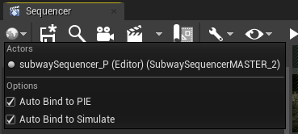
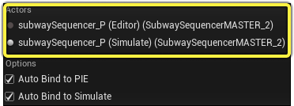
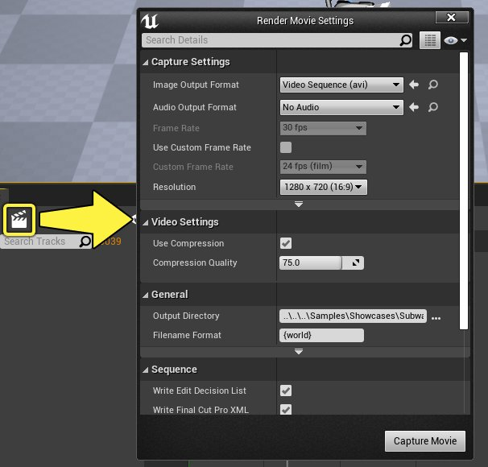
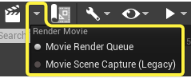
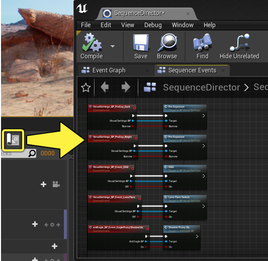
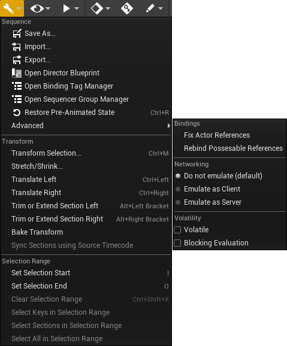
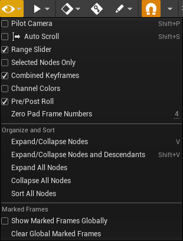

# Sequencer工具栏参考

> 路径：虚幻引擎5.7文档 / 为角色和对象制作动画 / 过场动画和Sequencer / Sequencer概述 / Sequencer Editor / Sequencer工具栏参考

> 原始页面：https://dev.epicgames.com/documentation/unreal-engine/sequencer-cinematic-toolbar-in-unreal-engine

本页提供Sequencer工具栏的参考。

| 名称 | 图标 | 描述 |
| --- | --- | --- |
| [**世界场景（World）**](#%E4%B8%96%E7%95%8C%E5%9C%BA%E6%99%AF) | sequencer world | 列出当前全局上下文、关卡序列Actor和播放领域的信息。它包含各种选项，可以指定是否希望将序列自动绑定到编辑器中运行（PIE）、模拟或其他运行时会话。 |
| **保存（Save）** | sequencer save | 保存当前序列和任何子场景或镜头。 |
| **在内容浏览器中查找（Find in Content Browser）** | sequencer find | 在内容浏览器中查找当前序列的关卡序列资产。 |
| [**创建摄像机（Create Camera）**](#%E5%88%9B%E5%BB%BA%E6%91%84%E5%83%8F%E6%9C%BA) | sequencer camera | 创建新的 **[过场动画摄像机Actor](../../../movie-and-cinematic-cameras/cinematic-cameras/index.md)**。还将创建一个新的 **[镜头切换轨道](../../sequencer-track-list/cinematic-camera-cut-track/index.md)** 并将引用此摄像机（如果尚未创建）。 |
| [**渲染（Render）**](#%E6%B8%B2%E6%9F%93) | sequencer render | 如果其插件已启用，打开 **[渲染电影设置](../../old-render-movie/index.md)** 设置对话框，或 。 |
| [**导演蓝图（Director Blueprint）**](#%E5%AF%BC%E6%BC%94%E8%93%9D%E5%9B%BE) | sequencer director | 打开此序列的导演蓝图，从中可以访问 **[事件轨道](../../sequencer-track-list/cinematic-event-track/index.md)** 逻辑。 |
| [**操作（Actions）**](#%E6%93%8D%E4%BD%9C) | sequencer actions | 列出各种序列编辑器操作，如保存、导入/导出、烘焙和选择编辑。 |
| [**视图选项（View Options）**](#%E8%A7%86%E5%9B%BE%E9%80%89%E9%A1%B9) | sequencer view options | 列出各种序列视图选项。 |
| [**播放选项（Playback Options）**](#%E6%92%AD%E6%94%BE%E9%80%89%E9%A1%B9) | sequencer playback options | 列出各种播放选项，如播放速率、开始/结束时间和播放头行为。 |
| [**关键帧选项（Keyframe Options）**](#%E5%85%B3%E9%94%AE%E5%B8%A7%E9%80%89%E9%A1%B9) | sequencer keyframe options | 列出自动关键帧变换关键帧行为的设置，以及创建的默认切线。 |
| [**自动关键帧（Auto Key）**](#%E8%87%AA%E5%8A%A8%E5%85%B3%E9%94%AE%E5%B8%A7) | sequencer autokey | 启用自动关键帧模式，只要属性或变换出现变动，就会自动创建关键帧。 |
| [**编辑选项（Edit Options）**](#%E7%BC%96%E8%BE%91%E9%80%89%E9%A1%B9) | sequencer edit options | 列出Sequencer在使用自动关键帧时如何解释来自细节面板的编辑的设置。 |
| [**对齐（Snapping）**](#%E5%AF%B9%E9%BD%90) | sequencer snapping | 启用对齐。旁边的下拉菜单列出了用于设置关键帧、分段和时间轴的对齐规则的选项。 |
| [**每秒帧数（Frames Per Second）**](#%E6%AF%8F%E7%A7%92%E5%B8%A7%E6%95%B0) | sequencer fps | 列出运行时的各种每秒帧数（FPS）目标的设置。还包含允许运行时锁定到选定帧率的选项。 |
| [**曲线编辑器（Curve Editor）**](#%E6%9B%B2%E7%BA%BF%E7%BC%96%E8%BE%91%E5%99%A8) | sequencer curve editor | 打开 **[曲线编辑器](../../animation-curve-editor/index.md)**，这可用于微调动画关键帧和切线。 |
| [**操作记录（Breadcrumbs）**](#%E6%93%8D%E4%BD%9C%E8%AE%B0%E5%BD%95) | sequencer breadcrumbs | 显示当前序列名称，可用于导航主序列和镜头。 |
| **锁定（Lock）** | sequencer lock | 锁定整个序列以防止编辑。 |

## 世界场景

Sequencer的"世界场景（World）"菜单包含与当前关卡、会话和关卡序列名称相关的选项。

**Actors** 选项类别列出Sequencer可以绑定到的运行中的会话，并提供在它们之间切换绑定的选项。

在本例中，你可以看到，当前有两个会话正在运行中：**编辑器** 和 **模拟**。你可以看到在它们之间切换的选项，这将导致Sequencer绑定到该领域。

开始运行后，**自动绑定到PIE** 和 **模拟** 使Sequencer能够自动绑定到各自领域。

## 创建摄像机

点击 **创建摄像机** 按钮将自动创建一个 **[过场动画摄像机Actor](../../../movie-and-cinematic-cameras/cinematic-cameras/index.md)** 和一个 **[镜头切换轨道](../../sequencer-track-list/cinematic-camera-cut-track/index.md)** 并绑定到新摄像机。你的视口也将开始引导摄像机，这会让你准备好开始取景。

> 动图已省略：sequencer create camera

通过在 **[编辑器偏好设置和项目设置](../../cinematic-editor-and-project-settings/index.md)** 窗口中切换 **创建可生成摄像机**，你可以指定此摄像机是可生成还是可拥有。

## 渲染

点击"渲染"按钮将打开 **[渲染电影设置](../../old-render-movie/index.md)** 设置对话框，从中可以将序列渲染为一系列图像。

如果已启用 （MRQ）插件，则该按钮会有一个下拉菜单，可在此选择启动新MRQ工具或传统渲染工具。

## 导演蓝图

点击"导演蓝图"按钮打开"序列导演"窗口，从中可以看到序列的 **[事件轨道](../../sequencer-track-list/cinematic-event-track/index.md)** 事件。

## 操作

"操作"按钮会显示一个下拉菜单，其中包含以下工具、命令和选项：

| 名称 | 说明 |
| --- | --- |
| **另存为…** | 保存当前序列并提供选择其他名称的选项。 |
| **导入…** | 将FBX动画文件导入到选定的Actor。如果未选择任何Actor，则导入器会尝试将动画应用于整个序列。有关更多信息，请访问 **[导出和导入FBX文件](../../import-and-export-cinematic-fbx-animations/index.md)** 页面。 |
| **导出…** | 将选定的Actor导出到FBX文件。如果未选择任何Actor，则将导出整个序列。有关更多信息，请访问 **[导出和导入FBX文件](../../import-and-export-cinematic-fbx-animations/index.md)** 页面。 |
| **打开导演蓝图** | 打开此序列的导演蓝图，从中可以访问事件跟踪逻辑。 |
| **打开绑定标签管理器** | 打开一个可以创建标签的工具。这些标签被应用到Actor，在蓝图中被识别，从而执行特殊函数。有关更多信息，请访问 **[Sequencer标签和分组](../../cinematic-tags-and-groups/index.md)** 页面。 |
| **打开Sequencer组管理器** | 打开一个工具，显示自定义组及其应用的轨道。有关更多信息，请访问 **[Sequencer标签和分组](../../cinematic-tags-and-groups/index.md)** 页面。 |
| **恢复设置动画前的状态** | 将所有Actor对齐回其默认编辑器位置。播放或拖动序列将使其回到Sequencer确定的位置。 |
| 变换 |  |
| **变换选择** | 打开一个工具，相对于播放头时间来修改关键帧和分段。你可以沿正负数字方向移动关键点，或乘除关键点与播放头的相对距离。 sequencer transform selection |
| **拉伸/收缩** | 打开一个工具，在序列中相对于播放头时间增加和移除时间。 sequencer stretch shrink |
| **向左平移** | 相对于序列的帧率向左移动选定关键帧1帧。 |
| **向右平移** | 相对于序列的帧率向右移动选定关键帧1帧。 |
| **从左修剪或延伸分段** | 将选定轨道的分段从其左侧/起点修剪或延伸到播放头位置。如果未选择轨道，则将修剪或延伸所有分段。 |
| **从右修剪或延伸分段** | 将选定轨道的分段从其右侧/末端边距修剪或延伸到播放头位置。如果未选择轨道，则将修剪或延伸所有分段。 |
| **烘焙变换** | 选择此选项将在全局空间中烘焙选定Actor的变换。任何现有的附件或变换轨道都将被禁用。通过在 **[编辑器偏好设置和项目设置](../../cinematic-editor-and-project-settings/index.md)** 窗口中找到 **烘焙后禁用分段** 偏好设置，即可更改此行为。如果禁用该选项，将删除烘焙期间覆写的所有现有轨道。 |
| **使用源时间码同步分段** | 使用其源时间码将分段与第一个选定分段同步。 |
| 选择范围 |  |
| **设置选择开始** | 将自定义时间轴选择范围的开始点设置为播放头时间。 |
| **设置选择结束** | 将自定义时间轴选择范围的结束点设置为播放头时间。 |
| **清除选择范围** | 移除选择范围。 |
| **选择选择范围中的关键帧** | 选择选择范围内的所有关键帧。不选择分段。 |
| **选择选择范围中的分段** | 选择选择范围内的所有分段。不选择关键帧。 |
| **选择选择范围内中所有关键帧** | 选择选择范围内的所有关键帧和分段。 |
| 高级 |  |
| **修复Actor引用** | 尝试通过将对象绑定名称与拥有相同名称的关卡中的Actor匹配，自动修复损坏的Actor绑定。 |
| **重新绑定可拥有引用** | 重新绑定当前序列中所有可拥有Actor，确保它们使用最可靠的引用机制。 |
| **网络** | 列出在客户端或服务器上下文中模拟当前序列的选项。 |
| **波动** | 表示此序列可以在运行时或游戏期间动态更改。如果在游戏中对源序列数据进行任何程序更改，则必须设置此属性。 |
| **阻塞计算** | 允许序列在每次更新时完全计算并应用其状态。 |

## 视图选项

"视图选项"按钮会显示一个下拉菜单，其中包含以下工具、命令和选项：

| 名称 | 说明 |
| --- | --- |
| **引导摄像机** | 在视口摄像机和摄像机剪切轨道摄像机之间切换引导摄像机。 |
| **自动滚动** | 在"时间轴"视图中启用自动平移，以在播放时保持播放头在视图中。 sequencer auto scroll |
| **范围滑块** | 在Maya样式范围滑块和第二时间轴栏之间切换底部时间轴区域的显示。 sequencer range slider |
| **仅选定节点** | 如果启用，将自动过滤轨道，仅列出与选定Actor匹配的轨道或子轨道。 |
| **组合关键帧** | 如果折叠，将显示或隐藏轨道关键帧的预览。 |
| **频道颜色** | 启用"时间轴"视图中的常用变换轴颜色的可视化。红色 = X，绿色 = Y，蓝色 = Z。 sequencer channel colors |
| **前/后旋转** | 切换分段的前和后旋转可视化显示。 |
| **零填充帧数** | 将选定的数字填充量应用到显示的时间。仅在显示时间为帧时适用。 |
| 组织和排序 |  |
| **展开/折叠节点** | 展开或折叠选定轨道。 |
| **展开/折叠节点和后代** | 展开或折叠选定轨道，包括所有子轨道。 |
| **展开所有节点** | 展开序列中的所有轨道和子轨道。 |
| **折叠所有节点** | 折叠序列中的所有轨道。 |
| **对所有节点进行排序** | 按类型对所有轨道进行排序，然后在类型内按字母顺序进行排序。 |
| **全局显示标记帧** | 使子序列中的标记帧对其父序列或同级序列可见。 |
| **清除全局标记帧** | 将所有子序列中的所有标记帧设置为不显示。 |

## 播放选项

"播放选项"按钮会显示一个下拉菜单，其中包含以下工具、命令和选项：

> 图片已省略：sequencer playback options

| 名称 | 说明 |
| --- | --- |
| **开始** | 设置序列的开始时间。 |
| **结束** | 设置序列的结束时间。 |
| **播放速度** | 显示以不同速度预览当前序列播放的选项。 |
| **播放范围已锁定** | 锁定序列的开始和结束时间，并防止编辑。 |
| **游戏视图（清晰播放模式）** | 只要播放sequencer，就自动启用游戏视图。 |
| **重新运行构造脚本** | 使蓝图Actors的构造脚本能够运行每个tick。这还要求你在蓝图的类设置中启用 **在Sequencer中运行构造脚本** 属性。 |
| **异步计算** | 每帧启用单个异步计算一次。如果禁用，这将强制在每次计算序列时执行完全阻塞计算。应为实时运行的序列启用此选项。 |
| **计算隔离中的子序列** | 查看时，从主序列隔离子序列或镜头。这将禁用可能从主序列传播的任何轨道或内容，以及禁用镜头范围预览。 |
| **拖动时保持光标在播放范围内** | 拖动时，将播放头限制在序列的开始和结束区域内。 sequencer clamp scrub |
| **链接曲线编辑器时间范围** | 将曲线编辑器的视图与Sequencer的时间轴同步。 sequencer sync view |
| **跳转帧增量** | 设置按Shift + 左/右箭头在时间轴中前后跳转时的跳转帧数。 |

## 关键帧选项

"关键帧选项"按钮显示拥有以下选项的下拉菜单：

> 图片已省略：keyframe options

| 名称 | 说明 |
| --- | --- |
| **为所有设置关键帧** | 当值出现变动且启用了自动关键帧时，所有变换通道都将设置关键帧。 |
| **为分组设置关键帧** | 当值出现变动且启用了自动关键帧时，通道内的所有轴都将设置关键帧。 |
| **为变更设置关键帧** | 如果启用了自动关键帧，仅更改的轴将设置关键帧。这是默认行为。 |
| **Cubic（自动）** | 创建新关键帧时，切线将在更改期间自动管理和平滑。这是默认行为。 |
| **Cubic（用户）** | 创建新关键帧时，切线将由用户控制，并且在调整关键帧时不会更改。 |
| *Cubic（断开）** | 创建新关键帧时，切线将使用立方体插值并断开，以允许对输入/输出角度进行单独编辑。 |
| **线性** | 创建新关键帧时，切线将使用线性插值。 |
| **常量** | 创建新关键帧时，切线将使用阶梯插值，这意味着它们将保留上一个关键帧的值，直到下一个关键帧。 |

## 自动关键帧

"自动关键帧"按钮启用"自动关键帧"模式，该模式在更改通道或特性时自动创建关键帧。

> 动图已省略：sequencer auto key

> [!NOTE]
> 仅当轨道已经包含至少一个关键帧时，"自动关键帧"才会添加关键帧。

## 编辑选项

"编辑选项"按钮显示操作"Sequencer绑定"和"关卡绑定"Actor时的自动行为选项。

> 图片已省略：sequencer edit options

| 名称 | 说明 |
| --- | --- |
| **允许所有编辑** | 启用与Sequencer绑定和关卡绑定Actor的交互。两种编辑操作都发生在各自的领域（Sequencer或关卡）。 |
| **仅允许Sequencer编辑** | 操纵任何关卡绑定的Actor会将该Actor自动添加到文件夹Autotracked Changes下的当前序列中。 allow sequencer edits only |
| **仅允许关卡编辑** | 禁用与Sequencer的所有交互。不得设置任何关键帧，任何编辑只能在关卡中进行。 |

## 对齐

使用"对齐"按钮可以将关键帧或播放头标识对齐到增量或时间轴内的其他关键帧。

"对齐"下拉菜单包含用于自定义对齐行为的选项。

> 图片已省略：sequencer snapping

| 名称 | 说明 |
| --- | --- |
| 关键帧对齐 |  |
| *对齐到时间间隔** | 沿时间轴移动时，对齐关键帧到时间间隔。 snap keys time |
| **对齐到关键帧和分段** | 沿时间轴移动时，对齐关键帧到其他关键帧，或对齐到分段的开始和结束。 snap keys |
| 分段对齐 |  |
| **对齐到时间间隔** | 在时间轴中缩放或移动节时，对齐分段到时间间隔。 snap sections time |
| **对齐到关键帧和分段** | 沿时间轴移动时，对齐分段到其他关键帧，或对齐到分段的开始和结束。 snap sections keys |
| 关键帧和分段对齐 |  |
| **对齐关键帧和分段到播放范围** | 将关键帧和分段放置限制在播放范围内。 clamp keys |
| 播放时间对齐 |  |
| **拖动时对齐到时间间隔** | 拖动时，将播放头标识对齐到时间间隔。 snap playhead time |
| **拖动时对齐到关键帧** | 拖动时，将播放头标识对齐到其他关键帧，或分段的开始和结束。 snap playhead keys |
| **对齐到按下的关键帧** | 点击后，弹出播放头标识到关键帧。如果禁用此选项，也可以按住Shift键并点击关键帧来执行此操作。 pop playhead key |
| **对齐到拖动的关键帧** | 沿时间轴拖动关键帧时，保持播放头标记与关键帧同步。 snap playhead dragging |
| 曲线对齐 |  |
| **对齐曲线关键帧值** | 在"曲线编辑器"中切换值对齐。 snap curve key |

## 每秒帧数

每秒帧数（FPS）菜单显示指定序列帧率、要使用的时间单位和其他计时相关选项的选项。

> 图片已省略：sequencer fps

| 名称 | 说明 |
| --- | --- |
| **时间显示为** | 指定按帧、秒或时间码顺序显示的时间单位。这会影响序列中的所有时间显示。 show time as |
| **时钟源** | 指示Sequencer以以下方式之一推进时间： Tick使用默认机制来确定引擎的时间推进方式。 平台使用系统时间。 音频使用音频时钟，这对保持音频和视频同步非常有用。 时间码使用绝对时间码（如果正在使用）。 按"播放"时，相对时间码相对于时间码前进。 |
| **运行时锁定显示速率** | 将此序列的播放锁定为选定的FPS显示速率。 |
| **高级选项** | 打开一个窗口，你可在其中为序列指定不同的tick间隔。 advanced time properties |

## 曲线编辑器

"曲线编辑器"按钮显示"曲线编辑器"选项卡，这可用于微调关键帧和切线。

欲知更多信息，请访问 **[曲线编辑器](../../animation-curve-editor/index.md)** 页面。

> 图片已省略：sequencer curve editor

## 操作记录

工具栏的操作记录区域显示当前序列的名称。使用主序列和镜头时，它可用于在镜头和主序列之间导航。

使用"前进"和"后退"按钮浏览视图历史记录，或使用"文件夹"按钮浏览树状图中的所有镜头。

> 动图已省略：sequencer breadcrumbs navigate
