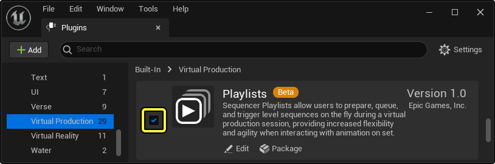
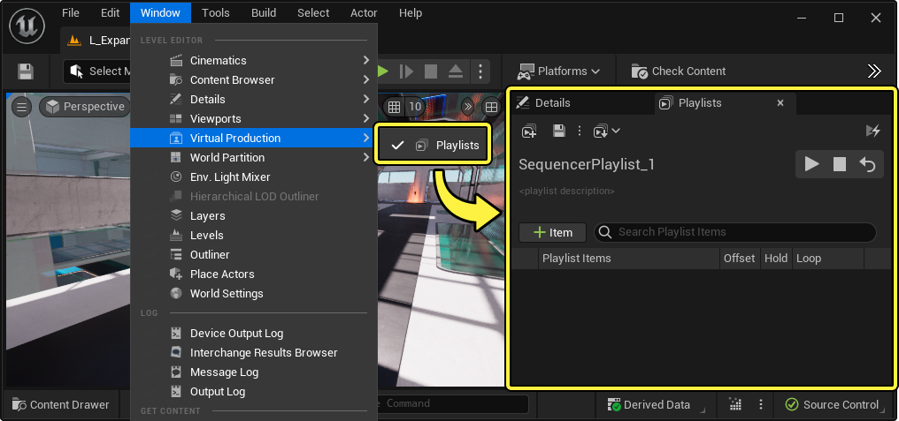
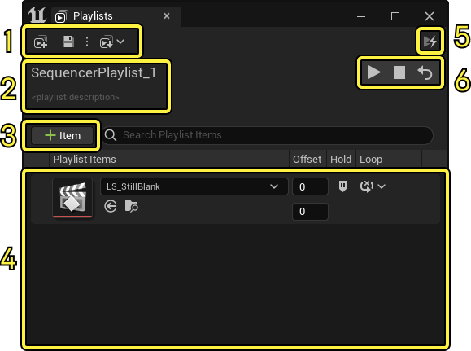
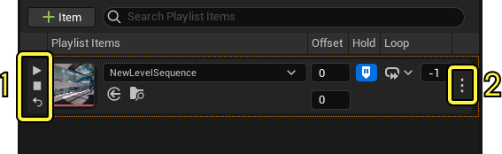
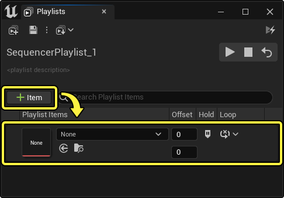
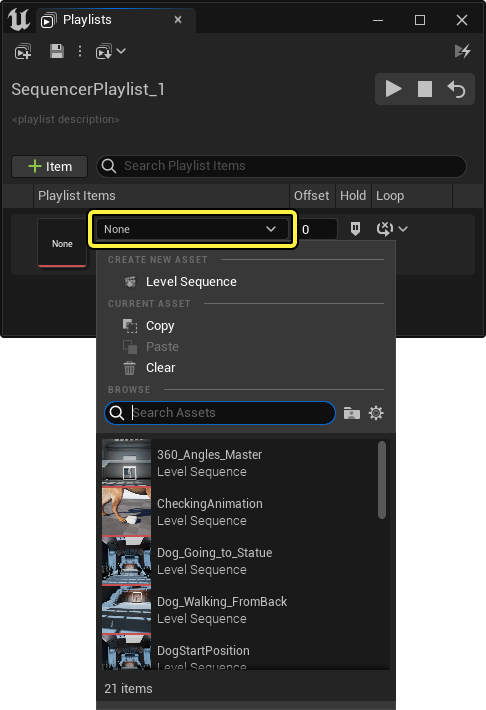
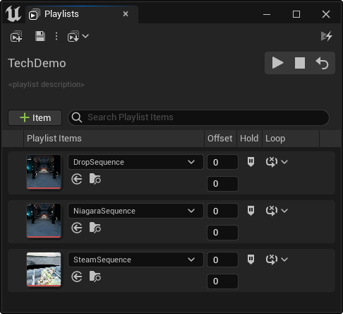
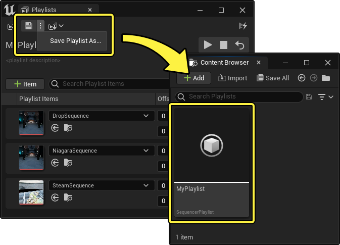

# Sequencer播放列表

> 路径：虚幻引擎5.7文档 / 为角色和对象制作动画 / 过场动画和Sequencer / Sequencer概述 / Sequencer播放列表

> 原始页面：https://dev.epicgames.com/documentation/unreal-engine/sequencer-playlists-in-unreal-engine

对于广播、现场活动或计时敏感型节目，你有时需要在任意一个指定的时间点播放一段序列。你可以使用 **Sequencer播放列表（Sequencer Playlists）** 执行此操作，以此在虚拟制片会话中触发序列播放。

本文档概括介绍了如何使用Sequencer播放列表。

#### 先决条件

- Sequencer播放列表是一种必须在启用后才能使用的[插件](../../../../understanding-the-basics/foundational-knowledge-in/working-with-plugins/index.md)。在虚幻引擎菜单中找到 **编辑（Edit） > 插件（Plugins）** ，在 **虚拟制片（Virtual Production）** 分段中找到 **播放列表（Playlists）** ，并将其启用。之后你将需要重启编辑器。

  
- 你的项目已经包含你可以在播放列表中引用的一些

  关卡序列

  。

## 概述

要开始使用Sequencer播放列表，请找到虚幻引擎主菜单，并点击 **窗口（Window） > 虚拟制片（Virtual Production） > 播放列表（Playlists）** 。这将打开 **播放列表（Playlists）** 面板。

**播放列表（Playlists）** 面板包含以下界面：

1. 工具栏（Toolbar）

   ，你可以在其中

   保存（Save）

   、

   加载（Load）

   和

   创建新播放列表（create new playlists）

   。
2. 当前播放列表的名称和简短说明。你可以通过

   保存（Save）

   播放列表来对其命名，并可以点击播放列表说明字段来编辑说明。
3. 将

   Sequencer项目

   添加到播放列表。添加一个项目后，你需要在该项目的主下拉菜单中指定你想播放的

   序列（Sequence）

   。
4. **播放列表（Playlist）** ，其中将显示添加到播放列表的序列的列表。每个项目上还可以设置以下属性：

   - 偏移（Offset）

     ，用于在播放时控制序列的开始和结束剪辑。
   - 保留（Hold）

     ，用于在播放前保留序列的第一帧。具体做法是创建序列的第二个实例，并将其

     时标（Time Scale）

     设置为

     0

     。
   - 循环（Loop）

     ，用于让序列在触发时循环。如果启用了循环，那么你还必须设置在停止之前的循环次数。
5. 播放模式（Play Mode）

   ，它将为你的项目启用更精简的覆层，从而更容易为每个序列选择

   播放（Play）

   和

   停止（Stop）

   。
6. **播放功能按钮（Playback Controls）** ，其中包含以下按钮：

   - 全部播放（Play All）

     ：开始同时播放所有播放列表项目。
   - 全部停止（Stop All）

     ：停止所有播放列表项目。
   - 全部重置（Reset All）

     ：停止所有播放列表项目，并为启用了

     保留（Hold）

     的所有序列重新保留第一帧。

将光标悬停在序列项目上还会显示更多按钮和属性。

1. 播放功能按钮（Playback Controls）

   ，你可以在其中

   播放（Play）

   、

   停止（Stop）

   和

   重置（Reset）

   该序列。
2. 该序列的 **设置（Settings）** ，其中包含以下各项：

   - 播放功能按钮（Playback Controls）

     。
   - 播放速度（Playback Speed）

     ，用于控制序列在触发时的播放速度。
   - 静音（Mute）

     ，用于在点击

     全部播放（Play All）

     时禁止触发该序列。该序列仍可通过点击

     播放（Play）

     直接触发。
   - 从播放列表删除（Remove from Playlist）

     ，用于从播放列表删除该序列。

## 工作流程示例

Sequencer播放列表的主要用途是将预先创建的序列添加到"播放列表"，这样你可以在播放或录制另一个序列期间触发序列，以作为[子序列](../sequencer-track-list/cinematic-subscequences-track/index.md)播放。在大部分情况下，这是在使用[镜头试拍录制器](../take-recorder/index.md)录制期间。

### 创建和填充播放列表

点击 **添加 (+) 项目（Add (+) Item）** 按钮，开始将序列添加到播放列表。

接下来，点击 **下拉菜单** 并选择一个 **序列** ，将序列分配给项目。

继续添加和分配序列到播放列表，直至你对列表满意为止。

### 触发播放列表播放

要触发整个播放列表的播放，请点击 **全部播放（Play All）** 。如果尚未打开序列，这将打开新的待定序列，并无限播放所有序列，直至你停止播放为止。播放列表子序列将存储在名为 **播放列表（Playlist） - （你的播放列表名称）** 的文件夹中。

> 动图已省略：触发播放列表播放

播放列表的最典型用例是在 **镜头试拍录制器（Take Recorder）** 会话期间将其触发。录制期间，你可以点击每个序列的播放功能按钮，在不同时间触发序列播放。在录制和播放过程期间，序列可以多次开始、停止和重置。

> 动图已省略：镜头试拍录制器会话期间触发

> [!NOTE]
> 你还可以启用 **播放模式（Play Mode）**，它会为你的项目启用更精简的覆层，从而更容易为每个序列选择播放（Play）和停止（Stop）。
>
> > 动图已省略：播放模式更容易选择

### 保存和管理播放列表

你可以点击 **保存（Save）** 或打开保存（Save）**下拉菜单** 以点击 **播放列表另存为（Save Playlist As）** 来保存序列播放列表。保存的播放列表在 **内容浏览器（Content Browser）** 中存储为 **Sequencer播放列表资产（SequencerPlaylist Assets）** 。

点击 **加载（Load）** 将显示项目中所有播放列表的列表。选择一个播放列表会将其加载为当前播放列表。

> 图片已省略：加载播放列表

你可以点击 **创建新播放列表（Create New Playlist）** 来清除当前播放列表。

> 图片已省略：创建新播放列表
