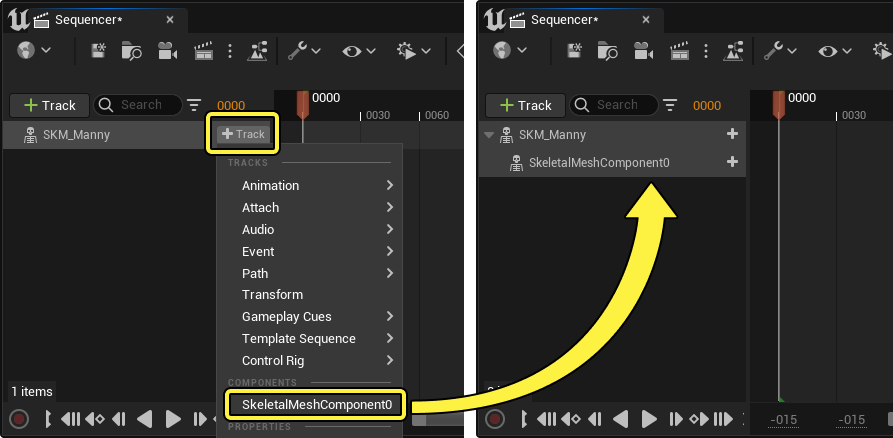
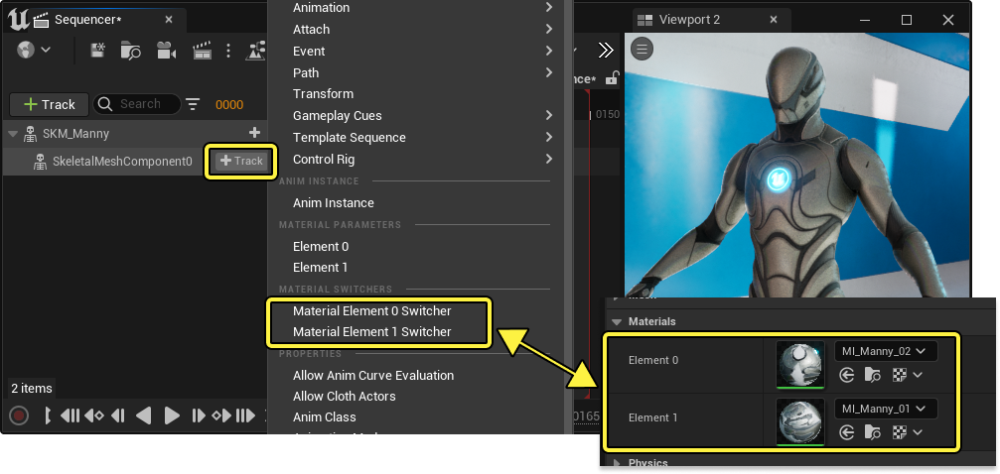
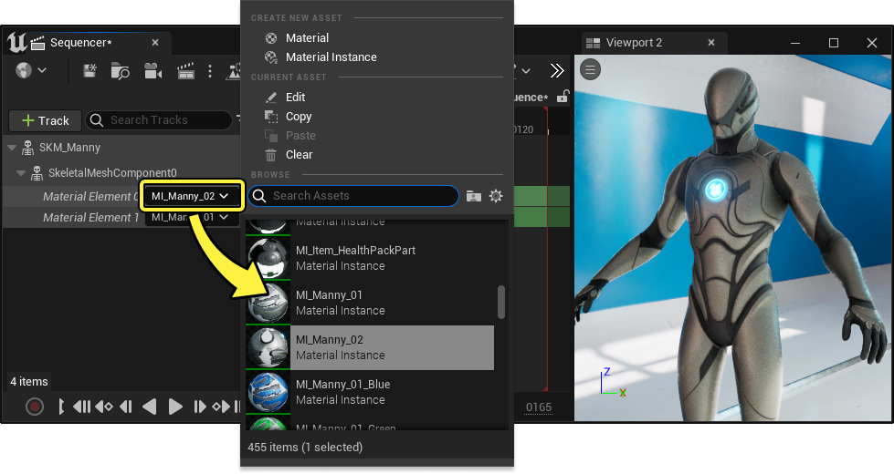
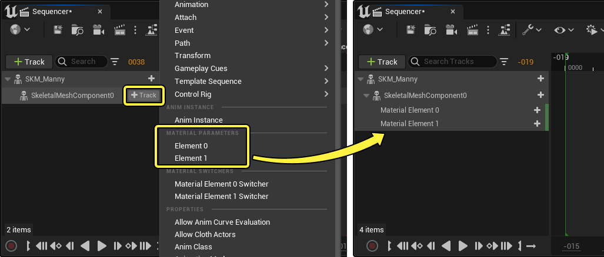
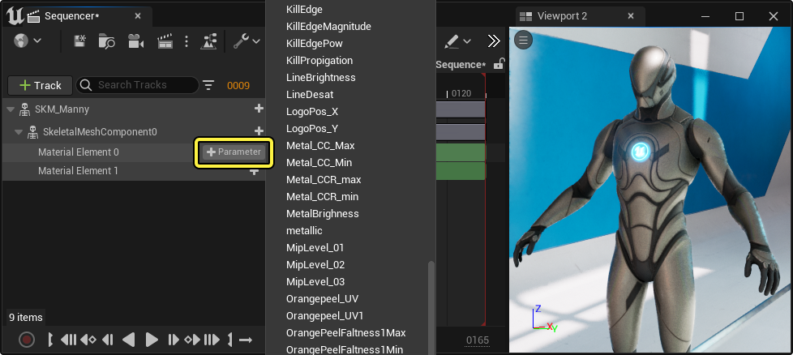
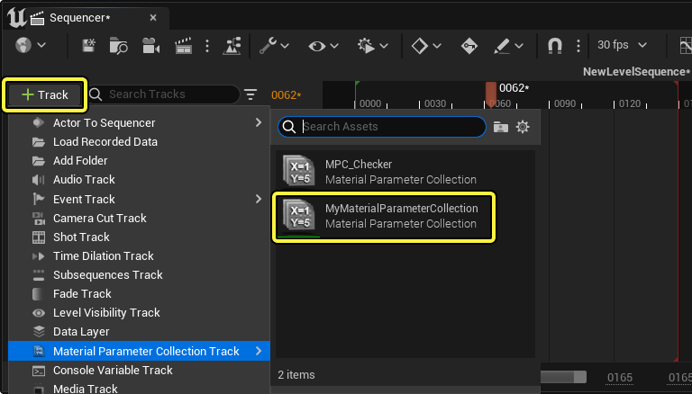
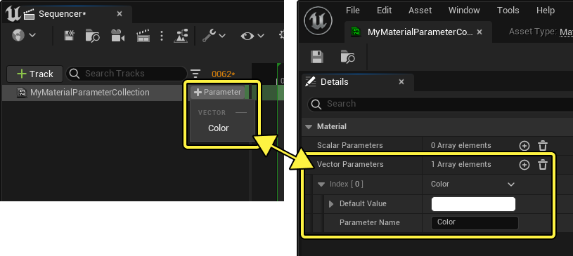

# 材质轨道

> 路径：虚幻引擎5.7文档 / 为角色和对象制作动画 / 过场动画和Sequencer / Sequencer概述 / 轨道 / 材质轨道

> 原始页面：https://dev.epicgames.com/documentation/unreal-engine/animate-materials-in-unreal-engine-cinematic

在 **Sequencer** 中，你可以通过各种方式更改你的 **Actor** 上的 **材质** 以及为其制作动画。使用 **材质切换器轨道（Material Switcher Track）** 更改哪个材质当前应用于Actor，使用 **材质参数轨道（Material Parameter Track）** 为[材质参数](../../../../../designing-visuals-rendering-and-graphics/unreal-engine-materials/instanced-materials/index.md#materialparameterization)制作动画，或使用 **材质参数集合轨道（Material Parameter Collection Track）** 同时为多个材质制作动画。

本页面将介绍在Sequencer中为Actor上的材质制作动画的各种方法。

#### 先决条件

- 你了解

  Sequencer

  及其

  接口

  。
- 您基本了解如何创建

  材质

  、

  材质参数

  、

  材质参数集合

  。

## 切换材质

要在播放序列期间将Actor的材质切换为不同的材质，请使用 **材质切换轨道（Material Switch Track）** 。如果你已经创建预设材质实例并想立即在它们之间切换，此轨道会很有用。

要切换你的Actor上的材质，请首先在Sequencer中添加该Actor的网格体组件轨道。点击 **添加轨道（Add Track (+)）** 并选择 **网格体组件（Mesh Component）** 。

接下来，在 **组件轨道（Component Track）** 上点击 **添加轨道（Add Track (+)）** 并添加 **材质元素切换器（Material Element Switcher）** ，从而添加此组件的材质切换器轨道。元素编号对应于当前分配给网格体的 **材质元素（Material Elements）** 。要更改多个材质，请添加所有必要元素的切换器。

添加轨道后，你可以将其[设为关键帧](../../creating-animation-keyframes/index.md)，以设置你想在特定时间应用的材质。要更改分配的材质，请点击材质切换器轨道上的下拉菜单，并选择不同的材质。

现在你可以推移或播放序列，并观察材质切换。

> 动图已省略：材质切换器

## 为材质参数制作动画

要在材质中随时间推移为特定[材质参数](../../../../../designing-visuals-rendering-and-graphics/unreal-engine-materials/instanced-materials/index.md#%E6%9D%90%E8%B4%A8%E5%8F%82%E6%95%B0%E5%8C%96)制作动画，请使用 **材质参数轨道（Material Parameter Track）** 。

类似于切换材质，你必须先在Sequencer中添加该Actor的网格体组件轨道。在Actor轨道上点击 **添加轨道（Add Track (+)）** 并选择 **网格体组件（Mesh Component）** 。

接下来，在 **组件轨道（Component Track）** 上点击 **添加轨道（Add Track (+)）** 并添加 **材质参数元素（Material Parameter Element）** ，从而添加此组件的材质参数轨道。元素编号对应于当前分配给网格体的 **材质元素（Material Elements）** 。要为多个材质上的参数制作动画，请添加所有必要元素的材质参数轨道。

添加元素轨道后，添加要制作动画的特定材质参数。在 **材质元素轨道（Material Element Track）** 上点击 **添加参数（Add Parameter (+)）** ，然后选择参数。根据需要为你的元素添加任意数量的参数轨道。

> [!NOTE]
> 根据添加的参数类型，Sequencer将使用兼容的[属性轨道](../../../unreal-engine-sequencer-fa6b165a/sequencer-track-list/cinematic-transform-and-property-tracks/index.md#%E5%B1%9E%E6%80%A7%E8%BD%A8%E9%81%93)与之交互。例如，添加 **向量参数（Vector Parameter）** 将创建[颜色轨道](../../../unreal-engine-sequencer-fa6b165a/sequencer-track-list/cinematic-transform-and-property-tracks/index.md#%E9%A2%9C%E8%89%B2)

添加参数轨道后，你可以照常将其[设为关键帧](../../creating-animation-keyframes/index.md)，为参数制作动画。此后，推移或播放序列，观察参数更改的效果。

> 动图已省略：为材质参数制作动画

> [!NOTE]
> 正如常规的分段用法那样，材质参数分段可以通过重叠其分段来彼此[混合](../../creating-animation-keyframes/index.md#%E6%B7%B7%E5%90%88)。这很适合用于在不同的预设材质状态之间混合，而不是直接为其制作动画。
>
> > 动图已省略：混合材质参数分段

## 为材质参数集合制作动画

Sequencer还包含用于为[材质参数集合](../../../../../designing-visuals-rendering-and-graphics/unreal-engine-materials/instanced-materials/using-material-parameter-collections/index.md)制作动画的 **材质参数集合轨道（Material Parameter Collection Track）** 。使用它直接为引用集合的材质制作动画，这样Sequencer可以同时影响多个材质。

要创建材质参数集合轨道，点击 **Sequencer** 中的 **添加轨道（Add Track (+)）** ，然后从 **材质参数集合轨道（Material Parameter Collection Track）** 菜单中选择你的 **材质参数集合资产** 。

然后，你可以点击轨道上的 **添加参数（Add Parameter (+)）** 并选择一个参数，从该集合中添加单个参数。此处列出的参数基于在集合资产中创建的参数。选择参数后，将使用在当前时间沿时间轴设置的关键帧为其创建相应的轨道。

鉴于材质参数集合具有任意性，而且它们在每个材质的图表中有不同的设置，材质参数集合轨道可以通过多种方式影响你的场景。在此示例中，向量参数用于控制角色上的其他色调。更改此参数会影响此材质的所有子实例。

> 图片已省略：材质参数集合材质设置

添加参数轨道后，你可以照常将其[设为关键帧](../../creating-animation-keyframes/index.md)，为参数制作动画。此后，推移或播放序列，观察制作动画的参数集合的效果。

> 动图已省略：为材质参数集合制作动画
