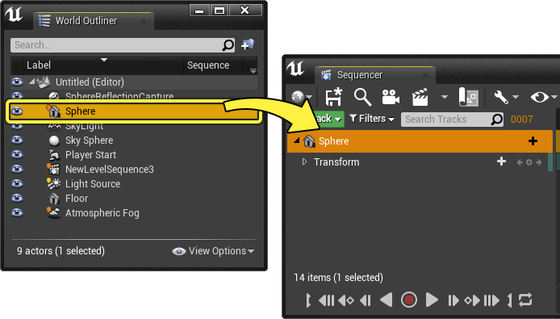
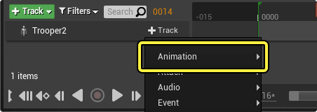
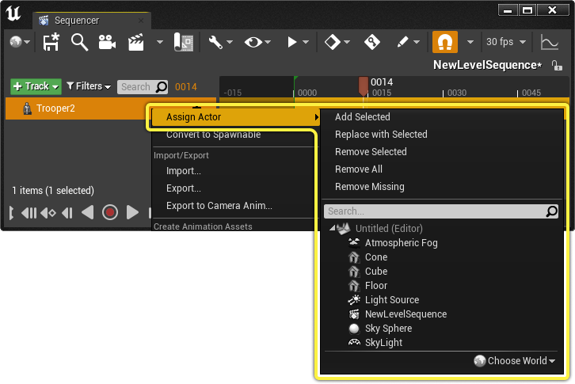
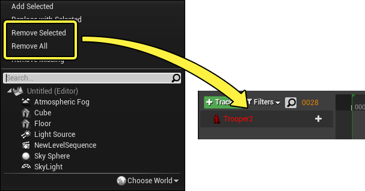
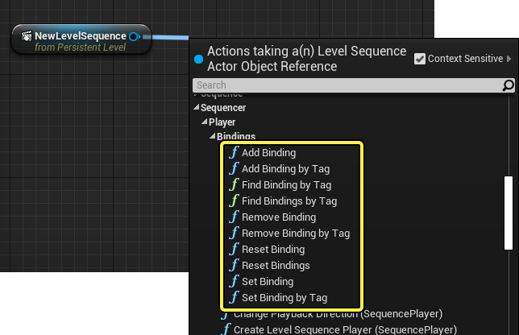
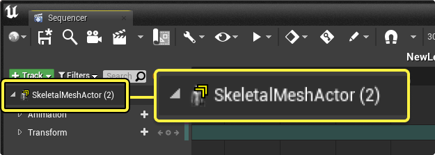
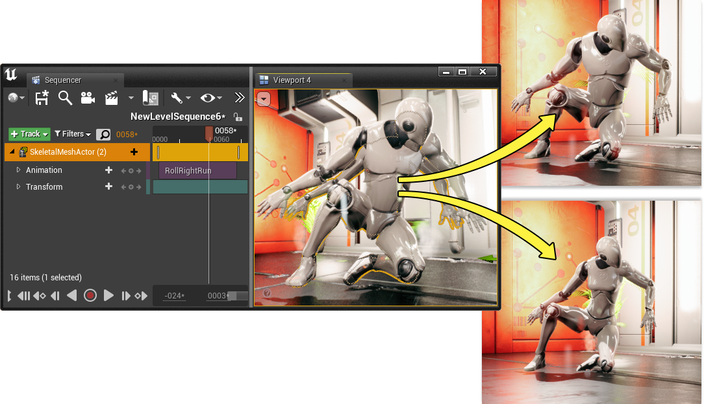
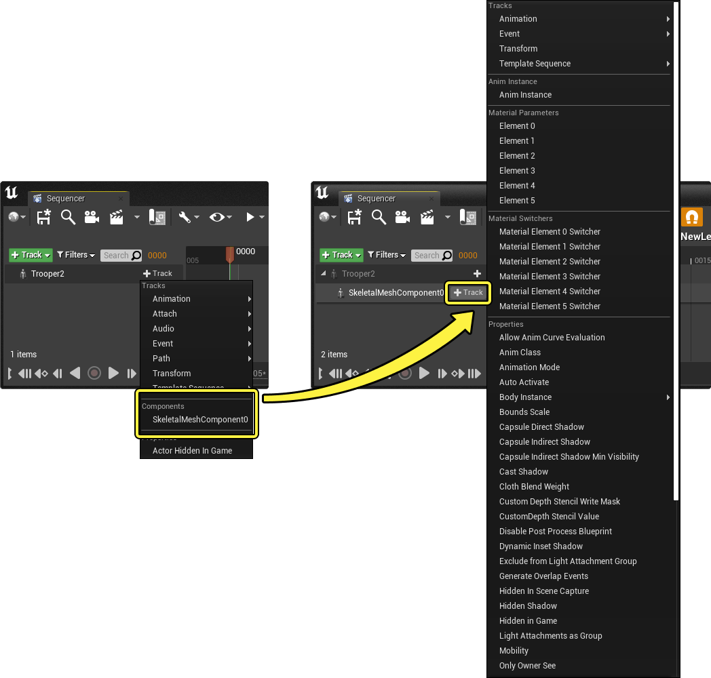

# Object绑定轨道

> 路径：虚幻引擎5.7文档 / 为角色和对象制作动画 / 过场动画和Sequencer / Sequencer概述 / 轨道 / Object绑定轨道

> 原始页面：https://dev.epicgames.com/documentation/unreal-engine/cinematic-actor-tracks-in-unreal-engine

在Sequencer中，你可以添加 ***[静态网格体Actor](../../../../../understanding-the-basics/actors-and-geometry/unreal-engine-actors-reference/static-mesh-actors/index.md)**、**[骨骼网格体Actor](../../../../../understanding-the-basics/actors-and-geometry/unreal-engine-actors-reference/skeletal-mesh-actors/index.md)** 和其他类型的Actor来制作动画。Sequencer中的所有Actor都使用 **Object绑定轨道** 进行引用，从而访问其属性、组件和变量。

本指南概述了Object绑定轨道、绑定如何使用它、如何访问Sequencer中的Actor组件，以及如何使用自动轨道创建。

#### 准备工作

- 确保你已了解

  Sequencer

  及其

  界面

  。
- 确保你已了解

  蓝图可视化脚本

  。

## 创建

当你通过各种方法向Sequencer添加Actor时，就会创建Object绑定轨道。

在 **轨道(+)** 菜单内前往 **Actor到Sequencer（Actor To Sequencer）** 子菜单，可以将Actor添加到序列。从这里，你可以选择当前处于你的关卡中的任何Actor以添加到序列，或使用搜索栏搜索特定Actor。

> 动图已省略：actor to sequencer

> [!NOTE]
> 如果已经选择了关卡中的一个Actor，为了方便起见，其将在 **Actor到Sequencer** 列表的顶部列出。

你还可以从其他窗口（如 **[大纲视图](../../../../../building-virtual-worlds/level-editor/outliner/index.md)** ）拖动Actor，并将其添加到Sequencer中。

### 绑定

将Actor添加到Sequencer后，将创建Object绑定轨道并绑定到选定的Actor。绑定使某些属性轨道和组件变得可用，具体取决于Actor的类。

举例而言，将轨道绑定到 **[骨骼网格体Actor](../../../../../understanding-the-basics/actors-and-geometry/unreal-engine-actors-reference/skeletal-mesh-actors/index.md)** 后，可以创建 **[动画轨道](../cinematic-animation-track/index.md)**，这是 **骨骼网格体组件** 特定的轨道。

右键点击轨道并导航到 **指定Actor** 菜单，即可变更或删除Actor绑定。

要变更Object绑定轨道的绑定，可以直接从 **指定Actor** 菜单中的Actor列表中选择新Actor，或选择新Actor并点击 **用选定项替换**。

> 动图已省略：replace with selected

> [!NOTE]
> 在不同类的Actor之间重新绑定时，将会保留任何类特定的轨道，但它们已没有功能，除非新的绑定包含轨道的兼容组件。

要移除绑定，右键点击"Object绑定轨道"，导航到"指定Actor"菜单，然后选择 **移除全部**。如果在视口中选择了相同的Actor，还可以选择 **移除选定项**。

你还可以使用 **[蓝图函数](../../../../../blueprints-visual-scripting/index.md)** 来变更绑定。导航到 **Sequencer > 播放器 > 绑定** 以从关卡序列引用Object调用蓝图函数时，就可以找到绑定函数。可以在此选择使用显式绑定函数，如 **设置绑定**，或[**按标签**](../../cinematic-tags-and-groups/index.md#%E6%A0%87%E7%AD%BE)变更绑定。

### 多重绑定

还可以将多个Actor绑定到轨道，从而使单个轨道能够同时控制多个Actor。绑定多个Actor时，轨道使用 **黄色V形符号**表示，绑定的Actor数量显示在轨道名称旁边的括号中。

如果希望同时变更多个Actor的属性，绑定多个Actor会十分实用，例如调整某个区域的所有光源时。

> 动图已省略：multiple binding lights

你还可以在过场动画中的多个角色之间共享数据，然后控制其在运行时期间的可见性，使条件角色或Object在播放场景时可见。

要将多个Actor绑定到同一轨道，从视口选择所需的Actor，右键点击当前存在的Object绑定轨道，然后选择 **指定Actor > 添加选定项**。

> 动图已省略：create multiple bindings sequencer

> [!NOTE]
> 你可以将不同类的Actor绑定在一起，但只能访问首个绑定Actor的组件。不过，[**变换**](../../../unreal-engine-sequencer-fa6b165a/sequencer-track-list/cinematic-transform-and-property-tracks/index.md#transformtrack)等共享属性仍能正常运行。

## 访问组件

通常，Actor只有一个组件，添加轨道到Actor时过滤掉该组件的最常用属性。添加组件轨道并添加来自该组件的属性后，你可以访问Actor属性的全部范围。

点击Object绑定轨道上的 **轨道(+)** 下拉列表，并从 **组件** 类别中选择组件，即可完成此操作。然后，点击组件轨道上的 **轨道(+)** 下拉列表来查看所有可用的组件属性。

Actor蓝图或拥有多个组件的蓝图也可以以相同的方式访问其组件。在此示例中，Actor蓝图包含 **骨骼网格体组件**、**点光源组件** 和 **摄像机组件**。点击 **轨道(+)** 下拉列表时，可在 **组件** 类别中访问这些组件及其子组件。

> 图片已省略：blueprint actor sequencer components

## 自动轨道创建

向Sequencer添加某些Actor时，你可能会注意到轨道是自动创建的。例如：

- **[静态网格体Actor](../../../../../understanding-the-basics/actors-and-geometry/unreal-engine-actors-reference/static-mesh-actors/index.md)** 将自动创建一条[**变换轨道**](../../../unreal-engine-sequencer-fa6b165a/sequencer-track-list/cinematic-transform-and-property-tracks/index.md#transformtrack)。

  > 图片已省略：static mesh sequencer auto track
- **[骨骼网格体Actor](../../../../../understanding-the-basics/actors-and-geometry/unreal-engine-actors-reference/skeletal-mesh-actors/index.md)** 将自动创建一条 [**变换轨道**](../../../unreal-engine-sequencer-fa6b165a/sequencer-track-list/cinematic-transform-and-property-tracks/index.md#transformtrack) 和一条 **[动画轨道](../cinematic-animation-track/index.md)**。

  > 图片已省略：skeletal mesh sequencer auto track
- **[电影摄像机Actor](../../../movie-and-cinematic-cameras/cinematic-cameras/index.md)** 将自动创建一条 [**变换轨道**](../../../unreal-engine-sequencer-fa6b165a/sequencer-track-list/cinematic-transform-and-property-tracks/index.md#transformtrack) 和一个 **摄像机组件**（带 **光圈**、**焦距** 和 **对焦距离** 属性轨道）。

  > 图片已省略：camera actor sequencer auto track
- **[光源Actor](../../../../../building-virtual-worlds/lighting-the-environment/light-types-and-their-mobility/index.md)** 将自动创建 **光源组件**，带 **强度** 和 **光源颜色** 属性轨道。

  > 图片已省略：lights sequencer auto track

出现这种情况的原因是[**Sequencer插件项目设置**](../../cinematic-editor-and-project-settings/index.md#%E9%A1%B9%E7%9B%AE%E8%AE%BE%E7%BD%AE)中的 **轨道设置**。可以打开 **项目设置** 窗口，并找到 **插件** 类别中的 **关卡Sequencer** 来查找这些设置。

> 图片已省略：sequencer track settings

默认情况下，使用前面提到的轨道设置来填充 **轨道设置** 数组。你可以点击 **添加 (+)** 按钮来添加一个新的数组项目，每个数组拥有以下类别：

> 图片已省略：add track setting

| 名称 | 说明 |
| --- | --- |
| **匹配Actor类** | 你可以在此指定Actor类，以在将其添加到Sequencer时自动为其创建轨道。 matching actor class |
| **默认轨道** | 此数组用于指定将 **匹配Actor类** 添加到Sequencer时添加的轨道。点击 **添加(+)** 按钮，然后点击下拉菜单浏览 **Sequencer** 轨道类型。 default tracks |
| **排除默认轨道** | 此数组用于指定不希望添加到此Actor类的轨道。如果指定其他轨道进行添加，如当你的类从父类继承时（该父类也在此指定了默认轨道），则可能需要使用此选项。 |
| **默认属性轨道** | 此数组用于指定将Actor添加到Sequencer时添加的属性轨道。点击 **添加(+)** 按钮将新属性项添加到数组中。 default property tracks **组件路径** 用于指定要从中添加属性的Actor的组件。 **属性路径** 用于指定要自动添加的属性名称。 |
| **排除默认属性轨道** | 此数组用于指定不希望添加到此Actor类的属性轨道。如果指定其他轨道进行添加，如当你的类从父类继承时（该父类也在此指定了默认属性轨道），则可能需要使用此选项。 |
