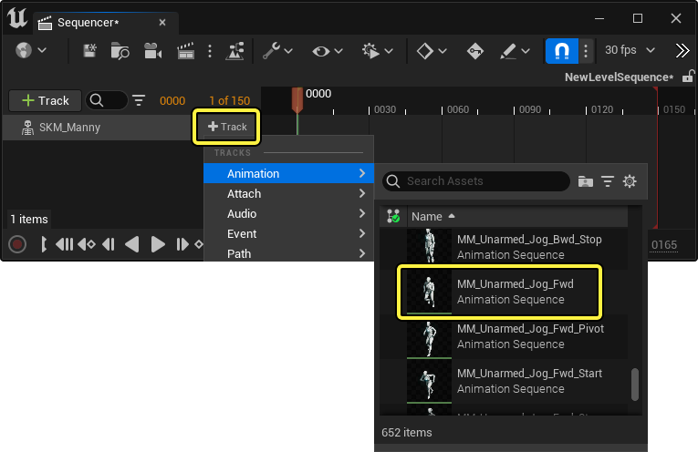
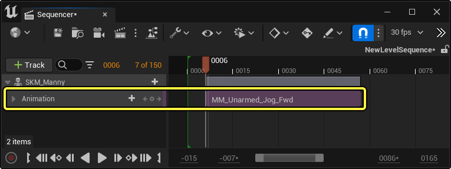
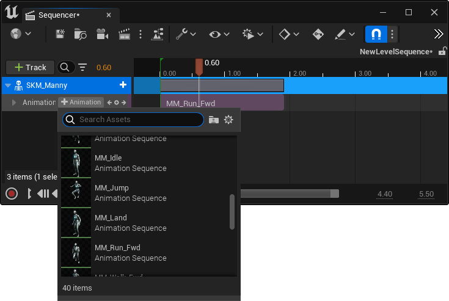
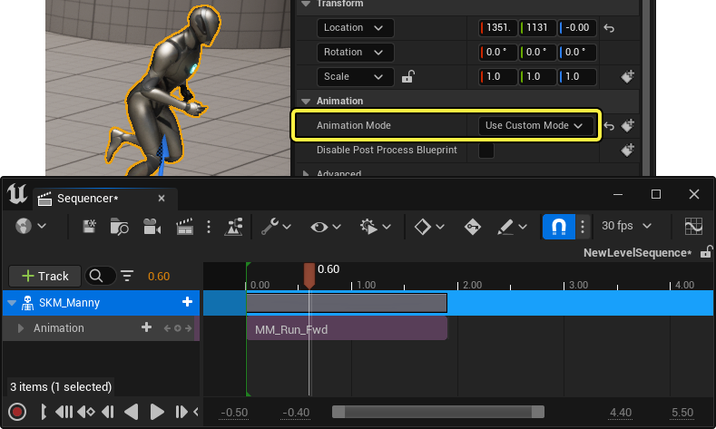
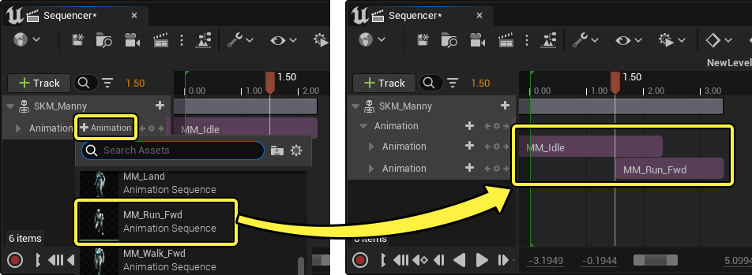
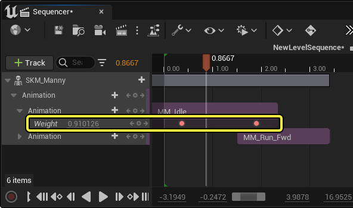
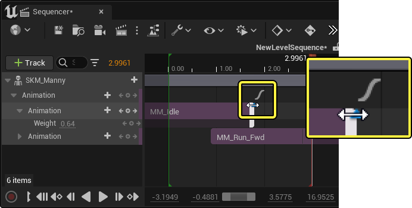
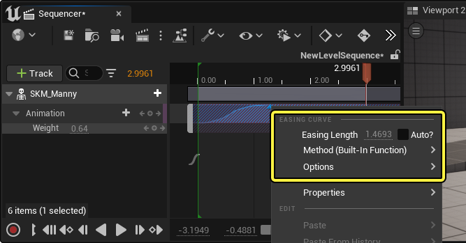

# 动画轨道

> 路径：虚幻引擎5.7文档 / 为角色和对象制作动画 / 过场动画和Sequencer / Sequencer概述 / 轨道 / 动画轨道

> 原始页面：https://dev.epicgames.com/documentation/unreal-engine/cinematic-animation-track-in-unreal-engine

借助Sequencer中的动画序列资产，动画轨道可以将动画用于骨骼网格体Actor。本指南将介绍此轨道的用法及其属性。

#### 先决条件

- 你已了解

  Sequencer

  及其

  界面

  。
- 你的项目使用了

  骨架网格体

  Actor，并且能够运行其中的

  动画序列

  。

## 创建

默认情况下，当骨架网格体Actor类添加到Sequencer时，动画轨道会在Actor的轨道下[自动创建](../../cinematic-editor-and-project-settings/index.md#%E6%8F%92%E4%BB%B6)。如果你已添加支持动画的不同Actor类，或已删除轨道，你可以点击Actor轨道上的 **添加轨道（+）> 动画（Animation）**，并选择 **动画序列（Animation Sequence）**，手动添加轨道。

此操作将在播放头位置创建带有动画序列分段的动画轨道。

### 添加动画

创建动画轨道后，你可以在上面添加动画。有具体方法有：

点击动画轨道上的 **添加动画（+）**，选择动画序列。此处所列的动画经过筛选，仅显示[兼容](../../../../skeletal-mesh-animation-system/animation-assets-and-features/skeletons/index.md#%E5%8F%AF%E5%85%BC%E5%AE%B9%E7%9A%84%E9%AA%A8%E6%9E%B6)骨架网格体的动画。

你还可以从 **[内容浏览器](../../../../../understanding-the-basics/content-browser/index.md)** 中将动画序列拖到Sequencer的时间轴区域。当你沿动画轨道拖动时，此操作可以预览剪辑片段的长度和放置点。

> 动图已省略：拖放并添加动画Sequencer

> [!NOTE]
> 拖动到另一剪辑片段，将创建此动画的另一轨道。

## 用途

### 动画模式

在Sequencer中为骨架网格体制作动画时，其 **动画模式（Animation Mode）** 属性将切换至 **使用自定义模式（Use Custom Mode）**。此操作旨在确保Sequencer使用特殊的 **[动画蓝图](../../../../skeletal-mesh-animation-system/animation-blueprints/index.md)** 驱动Actor的动画。

> [!NOTE]
> 如果骨架网格体已经被分配了动画蓝图，其动画模式将不会切换到 **使用自定义模式（Use Custom Mode）**。在这种情况下，你需要确保动画蓝图包含一个[插槽](../../../../skeletal-mesh-animation-system/animation-blueprints/animation-slots/index.md)，以便从Sequencer接收动画。

### 层和混合

动画轨道支持多个轨道层、动画，并支持以各种方式混合动画。

> 动图已省略：Sequencer动画层混合

你可以点击 **添加动画—（+）**，选择另一动画序列。此操作会将新序列添加到你当前的播放头时间。如果你的播放头放置在动画上，那么它将为动画创建新的轨道层。

展开动画轨道，显示分段的权重（Weight）属性，其值范围 0-1。权重可以设置关键帧，以允许对动画分段进行动态加权和混合。

在轨道间上下拖动动画，可以将动画在轨道之间移动。

> 动图已省略：Sequencer动画层堆栈上下移动

若两个动画分段相交，将在它们间创建一条自动混合曲线，在相交的持续时间内混合动画。

> 动图已省略：Sequencer混合剪辑片段

混合曲线控点位于动画分段边缘上部，你可以选中控点后移动来调整 **开始（Start）** 和 **结束（End）** 混合曲线。光标上方将出现一个曲线符号，帮助你准确选择。

右键点击混合曲线，显示混合专用的快捷菜单命令。

| 名称 | 说明 |
| --- | --- |
| **缓动长度（Easing Length）** | 混合曲线的长度。启用 **自动（Auto）** 将导致混合曲线返回默认行为，并支持分段相交时自动计算长度。 混合曲线长度 |
| **方法（Method）** | **方法（Method）** 可控制应用于混合的曲线类型，可以基于函数启用自定义外部混合。 |
| **选项（Options）** | 选项（Options）菜单将显示你可以应用于混合曲线的曲线形状列表。选择其中一个，所选曲线将替代当前的曲线形状。 混合曲线形状 |

### 裁剪、循环和播放速度

你可以用多种方法编辑剪辑片段，比如循环、修剪和时间缩放。

选择该分段的任一边缘并向内拖动可修剪该分段。

> 动图已省略：Sequencer修剪动画

你还可以按 **Ctrl + /**，在当前播放头时间分割选定的动画分段。

> 动图已省略：Sequencer分割剪切动画

> [!NOTE]
> 右键点击某个分段，可在 **编辑（Edit）** 菜单中找到修剪和分割命令。

将右侧边缘向外拖动可循环分段。循环片段由该分段中的档位表示。

> 动图已省略：Sequencer循环动画

将鼠标悬停在分段边缘时，按住 **Ctrl** 将启用 **播放速度（Play Rate）** 修饰符。

> 图片已省略：Sequencer缩放动画时间、播放速度

启用 **播放速度（Play Rate）** 修饰符后，拖动剪辑片段边缘将缩放剪辑片段的播放速度，而不是循环或修剪。

> 动图已省略：Sequencer播放速度动画

> [!NOTE]
> 如果你之前修剪或循环了一个动画，但想将其恢复到原始长度，你可以右键点击它并选择 **编辑（Edit）> 自动调整大小（Auto Size）**。

## 属性

右键点击动画轨道，并进入 **属性（Properties）** 菜单时，动画轨道会显示以下属性。

> 图片已省略：Sequencer动画属性

| 名称 | 说明 |
| --- | --- |
| **分段范围开始（Section Range Start）** | 动画分段的开始时间。 |
| **分段范围结束（Section Range End）** | 分段动画的结束时间。 |
| **完成时（When Finished）** | 确定当动画分段完成时Actor应该做什么。 **保持状态（Keep State）** 将使Actor保持在Sequencer的动画模式中。这样Actor不会恢复到先前的状态，而是会保持最后一个动画帧。 **恢复状态（Restore State）** 会使Actor返回到Sequencer对其进行动画处理之前的状态。 **项目默认值（Project Default）** 是默认行为，将使用 **DefaultEngine.ini** 项目文件中定义的设置。将以下行添加到.ini文件，将设置项目默认值。 `[/Script/LevelSequence.LevelSequence]` `DefaultCompletionMode=KeepState` 或 `DefaultCompletionMode=RestoreState` |
| **时间码源（Timecode Source）** | 剪辑片段的时间码信息（如果正在使用时间码）。你还可以在此处指定增量帧来控制偏移信息。 |
| **激活（Is Active）** | 激活所选分段。这与[**静音轨道**](../index.md#%E9%9D%99%E9%9F%B3)类似，但用于分段而不是轨道。 |
| **锁定（Is Locked）** | 锁定所选分段。这与[**锁定轨道**](../index.md#%E9%94%81%E5%AE%9A)类似，但用于分段而不是轨道。 |
| **滚动帧前/后（Pre/Post Roll Frames）** | 指定要应用于动画轨道的开始和结束区域的额外填充。此填充会使动画的第一帧和最后一帧保持指定时长。可以在 **[Sequencer的编辑器偏好设置](../../cinematic-editor-and-project-settings/index.md#editorpreferences)** 中启用或禁用滚动视觉效果，以在时间轴中预览此填充。 滚动前后保持开始结束帧 |
| **动画（Animation）** | 引用的 **[动画序列](../../../../skeletal-mesh-animation-system/animation-assets-and-features/animation-sequences/index.md)**。 |
| **第一个循环起始帧偏移（First Loop Start Frame Offset）** | 当序列循环时，此属性将控制应用到序列第一个循环的初始修剪量。随后的循环将为全长。 按住 **Shift**键时，也可以左右拖动鼠标来直接更改此值。 第一个循环开始帧偏移 |
| **开始/结束帧偏移（Start/End Frame Offsets）** | 帧偏移属性控制应用到分段始末的偏移量。结果是类似于修剪的效果，但循环现在会将这些修剪过的区域视为新的循环片段。 |
| **播放速度（Play Rate）** | 分段的播放速度。值为 **1.0** 代表以正常速度播放，值越低代表播放速度越慢，值越高代表播放速度越快。 |
| **反向（Reverse）** | 启用此选项后，序列倒放，动画倒转。 |
| **插槽名称（Slot Name）** | 指定用于播放动画的起始[动画插槽](../../../../skeletal-mesh-animation-system/animation-blueprints/animation-slots/index.md)。为了使用 **插槽名称（Slot Name）**，你还必须设置骨架网格体的 **动画模式（Animation Mode）**，以便使用适当的动画蓝图。 Sequencer动画插槽 |
| **镜像数据表（Mirror Data Table）** | 根据分配的镜像数据表资产[镜像](../../../../skeletal-mesh-animation-system/animation-assets-and-features/mirroring-animation/index.md)此动画。 |
| **跳过动画通知程序（Skip Anim Notifiers）** | 启用后，此动画的任何 **[动画通知](../../../../skeletal-mesh-animation-system/animation-assets-and-features/animation-sequences/animation-notifies/index.md)** 都将被忽略，不会被触发。 |
| **强制采用自定义模式（Force Custom Mode）** | 启用后，骨架网格体的 **动画模式（Animation Mode）** 将在此动画时段强制使用 **自定义模式（Custom Mode）**。 |
| **交换根骨骼（Swap Root Bone）** | 此类选项可以将骨架网格体的根骨骼与以下项目互换： **组件（Component）**，使骨架网格体组件跟随根骨骼。 **Actor**，使Actor跟随根骨骼。 **无（None）**，不交换根骨骼。 |
| **起始位置偏移（Start Location Offset）** | 如果使用根骨骼运动，指定在动画开始时应用到Actor的位置偏移。 |
| **起始旋转偏移（Start Location Offset）** | 如何使用根骨骼运动，指定在动画开始时应用到Actor的旋转偏移。 |
| **显示骨架（Show Skeleton）** | 在此动画序列的视口中绘制骨架。你也可以同时启用多个动画序列骨架，从而在同一角色的每个动画中显示多个骨架。使用Sequencer的 **[运动混合](../../../unreal-engine-se-fa6b165a/sequencer-track-list/cinematic-animation-track/motion-blending-tools/index.md)** 时，此功能很有用。 Sequencer显示骨架动画 |

## 混合工具

动画轨道还支持对齐骨架，以便更好地支持动态混合。请访问 **[运动混合](../../../unreal-engine-se-fa6b165a/sequencer-track-list/cinematic-animation-track/motion-blending-tools/index.md)** 页面了解关于此功能的更多信息。

- [运动混合](../../../unreal-engine-se-fa6b165a/sequencer-track-list/cinematic-animation-track/motion-blending-tools/index.md) - 使用运动混合工具在Sequencer中的动画断之间平滑地过渡动画动作。
