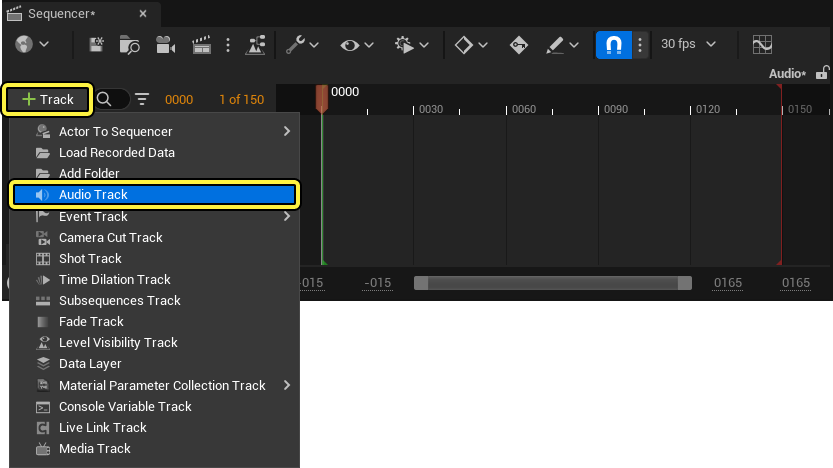
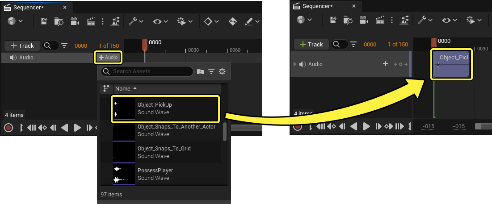
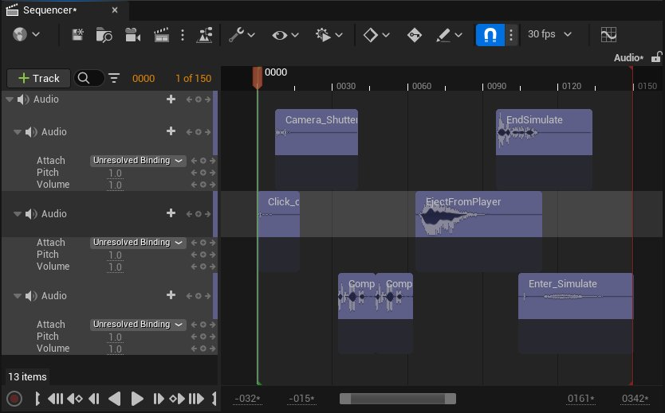
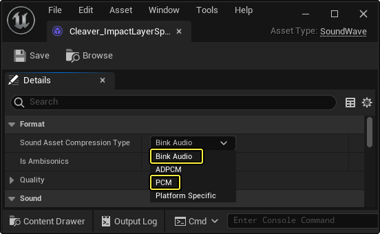
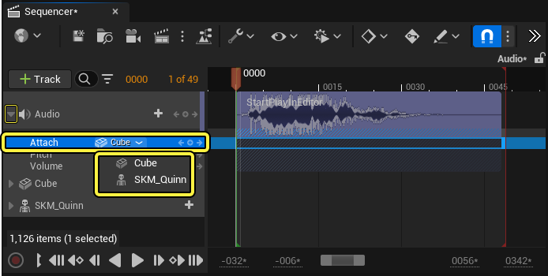
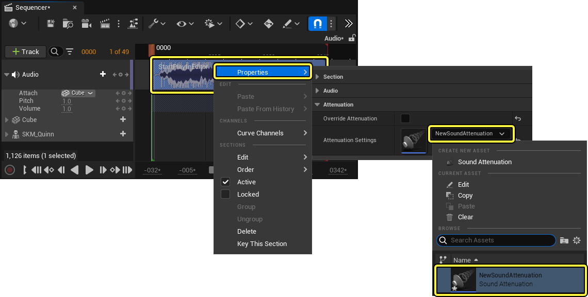
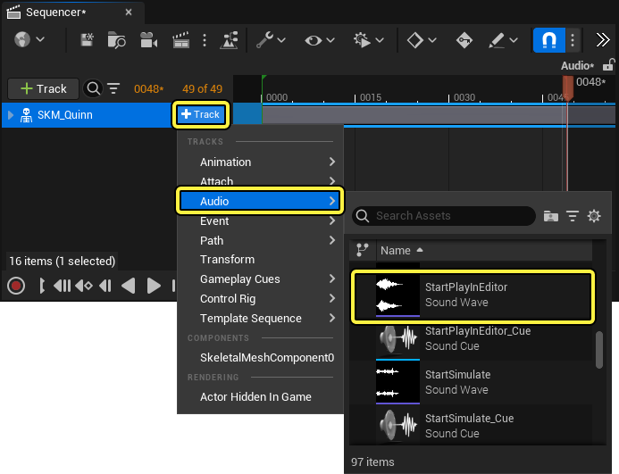
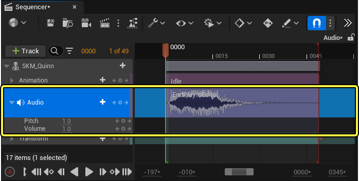

# 音轨

> 路径：虚幻引擎5.7文档 / 为角色和对象制作动画 / 过场动画和Sequencer / Sequencer概述 / 轨道 / 音轨

> 原始页面：https://dev.epicgames.com/documentation/unreal-engine/cinematic-audio-track-in-unreal-engine

你可以在Seqeuncer的 **音轨（Audio Track）** 中添加[声波（Sound Wave）](../../../../../working-with-audio/sound-source/sound-waves/index.md)和[Sound Cue](../../../../../working-with-audio/sound-source/sound-cue/index.md)，从而为虚幻引擎中的过场动画添加声音。和其他电影编辑软件一样，音轨提供了用于调整音量、音高以及声音过渡的功能按钮。

本文将简要介绍音轨的创建和用法。

#### 先决条件

- 你了解[Sequencer](../../../how-to-make-movies/index.md)及其[界面](https://dev.epicgames.com/documentation/404)。
- 你基本了解[如何导入音频文件](../../../../../working-with-audio/sound-source/sound-waves/importing-audio-files/index.md)，或者你的项目已经包含音频文件。

## 创建音轨

要创建新音轨，请在[Sequencer编辑器](https://dev.epicgames.com/documentation/404)中打开 **关卡序列（Level Sequence）** 并使用 **轨道（Track）** （ **+** ）选择 **音轨（Audio Track）** 。

在关卡序列中创建音轨之后，你可以在[播放头](https://dev.epicgames.com/documentation/404)位置处向轨道添加音频分段，方法是点击轨道上的 **音频（Audio）** （ **+** ）下拉菜单，并选择[声波](../../../../../working-with-audio/sound-source/sound-waves/index.md)和[Sound Cue](../../../../../working-with-audio/sound-source/sound-cue/index.md)资产。

你还可以从[内容浏览器](../../../../../understanding-the-basics/content-browser/index.md)将 **声波（Sound Waves）** 和 **Sound Cue** 拖入序列中，这将自动创建音轨并添加声音。

> 动图已省略：添加音频资产演示

更多音频剪辑分段可以添加到相同音轨进行线性播放。你还可以添加更多音轨进行分层音频播放与混合，每个音轨都有其自己的混合与对象绑定属性。

## 使用音频分段

类似于大部分[Sequencer分段](../../creating-animation-keyframes/index.md#%E5%88%86%E6%AE%B5)， **音频分段（Audio Sections）** 可以通过在Sequencer编辑器中修剪、循环和移动分段来编辑。音频分段还可以附加到其他[骨骼网格体](../../../../../working-with-content/skeletal-mesh-assets/index.md)和[对象Actor](../../../../../understanding-the-basics/actors-and-geometry/unreal-engine-actors-reference/index.md)，以便创建动态[声源](../../../../../working-with-audio/sound-source/index.md)和[空间音效](../../../../../working-with-audio/spatialization-and-sound-attenuation/spatialization-overview/index.md)。

### 编辑音频分段

类似于Sequencer中的大部分分段，音频分段可以按以下方式[编辑](../../creating-animation-keyframes/index.md#%E4%BA%A4%E4%BA%92%E5%92%8C%E6%98%BE%E7%A4%BA)：

- 拖动音频分段的左右边缘将修剪 **开始（Start）** 和 **结束（End）** 时间。
- 将结束时间拖到超过剪辑时长会导致声音在修剪的时长内 **循环** 。

> 动图已省略：修剪音频资产

> [!NOTE]
> 若音频分段的默认长度经过修剪或编辑，可能由于 **特定于平台** 的编码解码器设置而无法正确播放。要修复此问题，你必须确保 **声音资产压缩类型（Sound Asset Compression Type）** 设置为 **Bink音频（Bink Audio）** 或 **PCM** 。此属性位于声波资产中。
>
> 

### 混合音频分段

拖动音频分段的上角边将导致音量在混合的时长内上下混合。

> 动图已省略：音频资产过渡控点

使两个或更多声音分段相交，将导致它们在重叠的时长内交叉过渡。你可以独立点击和拖动每个剪辑片段上的过渡控点，从而调整剪辑片段之间的交叉过渡。

> 动图已省略：混合音频资产

> [!NOTE]
> 如需详细了解你可以在音频分段上使用的混合技术和属性，请参阅[关键帧混合](../../creating-animation-keyframes/index.md#%E6%B7%B7%E5%90%88)文档。

### 附加声音

你可以创建空间音频效果以实现更有身临其境感、更富于动态变化的过场动画音频，例如3D声音和距离衰减，方法是将音轨附加到关卡序列中的角色和对象。要将音轨附加到关卡序列中的源，请在序列编辑器的大纲中展开该音轨，并从 **附加（Attach）** 属性的下拉菜单选择源。

> [!NOTE]
> 你只能将音轨附加到关卡序列中当前引用的Actor。

附加音轨后，你必须为轨道中的每个音频剪辑片段指定[衰减模式](../../../../../working-with-audio/spatialization-and-sound-attenuation/sound-attenuation/index.md)，驱动其3D音频行为。要指定衰减模式，请右键点击音频分段并找到 **属性（Properties）** 分段。然后从 **衰减（Attenuation）** 模式属性的下拉菜单选择模式，或 **创建新资产（Create New Asset）** 。

> [!NOTE]
> 如果声波或Sound Cue资产已指定声音衰减，你不需要为音频分段指定声音衰减资产。

> [!NOTE]
> 如果你不熟悉 **声音衰减（Sound Attenuation）** 资产，[狐獴Sequencer演示](../../../../../samples-and-tutorials/engine-feature-examples/meerkat-sample-project/index.md)包含一个声音衰减资产，可供你参考和使用。此外，你还可以参考[声音衰减(working-with-audio\spatialization-and-sound-attenuation\attenuation-overview)页面，了解详情。

音轨的附加轨道还可以[设置关键帧](../../creating-animation-keyframes/index.md)，这样你可以在播放期间的任意时间点更改音频源附件。将音轨附加到多个源时，选择 **附加（Attach）** 轨道将在所有附加的源上显示声音图标。音频附加到该源时，声音图标将在播放或推移期间高亮显示为 **绿色** 。

> 动图已省略：使用关键帧附加音频资产

你还可以点击Actor的 **轨道(+)（Track (+)）** 下拉菜单，然后从 **音频（Audio）** 菜单选择音频资产，以在添加到Sequencer的Actor下创建专用音轨。这会自动将声源附加到该Actor。

> [!NOTE]
> 为Sequencer中的Actor创建专用音轨时，音轨附件无法更改为其他Actor，正因如此，此处没有 **附加（Attach）** 轨道。
>
> 

### 将声音附加到骨骼

如果你要将音轨附加到带有 **骨骼网格体组件（Skeletal Mesh Component）** 的Actor，你可以将声音附加到特定骨骼，更好地控制音频源。在音轨的附加属性中选择骨骼网格体Actor后，你可以指定骨骼网格体组件以及角色的骨架中的特定骨骼。

> 图片已省略：选择要附加音轨的骨骼

## 音轨属性

声音资产添加到音频轨道后可以展开，显示以下可设置关键帧的轨道。

> 图片已省略：音轨设置

| 名称 | 说明 |
| --- | --- |
| **附加（Attach）** | 设置关卡序列中要[将声音附加到](#%E9%99%84%E5%8A%A0%E5%A3%B0%E9%9F%B3)其中以用于空间音频用途的Actor。 |
| **音高（Pitch）** | 设置音频剪辑的音高值。值越高，音高越高，值越低，音高越低。值 `1` 是默认音高。 |
| **音量（Volume）** | 设置音频剪辑片段的音量。值越高，音量越高，值越低，音量越低。值 `1` 是默认音量。 |

### 音频分段属性

右键点击音频分段并前往 **属性（Properties）** 菜单，界面上将显示以下属性。

> 图片已省略：音频分段属性

| 名称 | 说明 |
| --- | --- |
| **声音（Sound）** | 设置音频分段的[声波](../../../../../working-with-audio/sound-source/sound-waves/index.md)或[Sound Cue](../../../../../working-with-audio/sound-source/sound-cue/index.md)资产。 |
| **开始帧偏移（Start Frame Offset）** | 设置要将此音频分段的开始时间偏移的帧数。此值提供了类似于[滑移式编辑](https://support.apple.com/zh-cn/guide/final-cut-pro/ver1632d8e4/mac)的效果，因为它可以调整声音的可播放区域，而不影响时长。 按住 **Shift** 键的同时在剪辑片段上拖动，这是使用鼠标更改此属性的快捷方式。 |
| **循环（Looping）** | 切换音频分段是否能够循环。 |
| **禁止字幕（Suppress Subtitles）** | 启用后，如果资产上使用了字幕，将禁止显示字幕。 |
| **覆盖衰减（Override Attenuation）** | 启用后，将使用 **衰减设置（Attenuation Settings）** 中指定的衰减覆盖声波衰减资产。 |
| **衰减设置（Attenuation Settings）** | 设置[声音衰减](../../../../../working-with-audio/spatialization-and-sound-attenuation/sound-attenuation/index.md)资产以驱动音频分段的3D音频行为。 |
