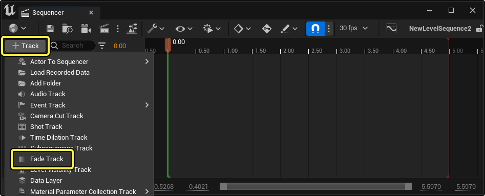
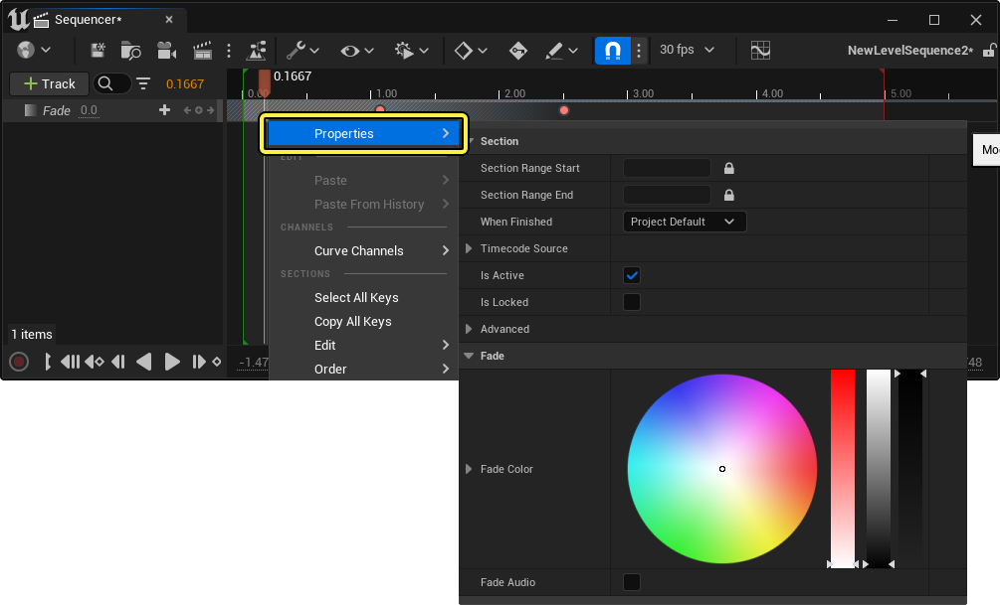
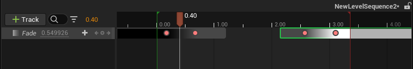
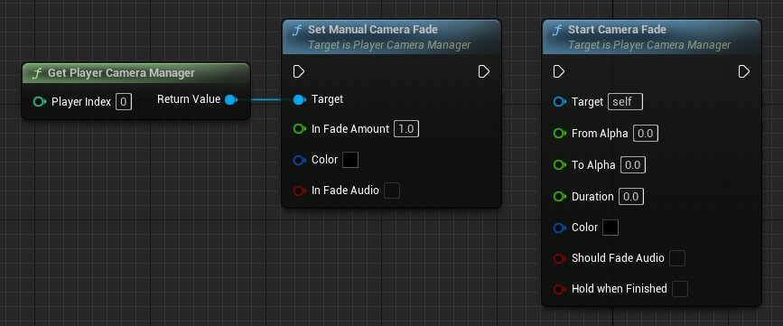
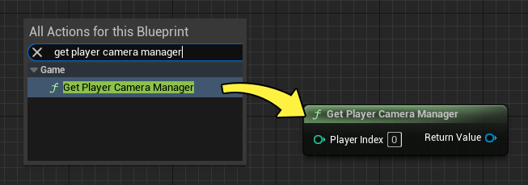
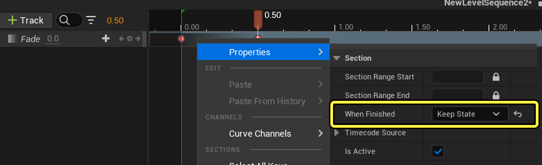
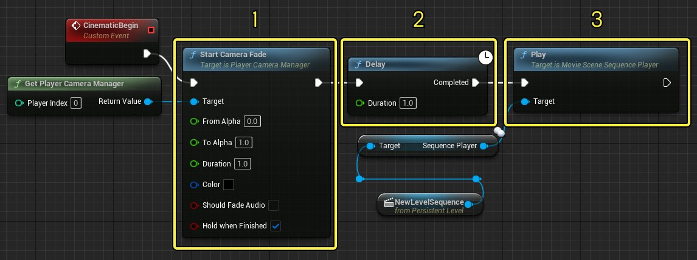
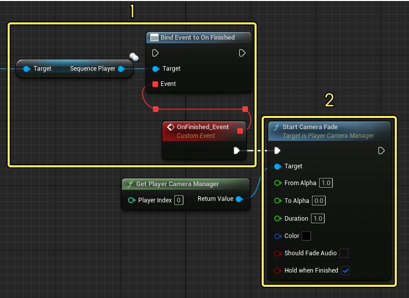

# 淡入淡出轨道

> 路径：虚幻引擎5.7文档 / 为角色和对象制作动画 / 过场动画和Sequencer / Sequencer概述 / 轨道 / 淡入淡出轨道

> 原始页面：https://dev.epicgames.com/documentation/unreal-engine/cinematic-color-fade-track-in-unreal-engine

有时，你可能希望关卡序列能够淡入或淡出。你可以使用淡入淡出轨道实现此目的。本页面概述淡入淡出轨道以及过场动画淡入淡出时的其他注意事项。

#### 先决条件

- 你了解

  Sequencer

  。
- 如果你要在Gameplay和过场动画之间淡入淡出，则应了解

  蓝图

  。

## 淡入淡出轨道概述

### 创建和用法

要创建淡入淡出轨道，请点击 **添加轨道（+）** 并选择 **淡入淡出轨道（Fade Track）** 。

淡入淡出轨道是一种[浮点属性轨道](../../../unreal-engine-sequencer-fa6b165a/sequencer-track-list/cinematic-transform-and-property-tracks/index.md#%E6%B5%AE%E7%82%B9)，你可以在数值 **0** （无淡入淡出）和 **1** （完全淡入淡出）之间对其制作动画。

选择淡入淡出轨道（Fade Track）并按 **Enter** （即设置默认值 **0** 的关键帧），在轨道上设置关键帧。接下来，将播放头移动到新时间，并将轨道数值更改为 **1** ，这会在播放头时间设置一个具有该数值的新关键帧。

> 动图已省略：关键帧淡入淡出轨道

现在，播放序列时，你应该会看到淡入淡出逐渐发生。

> 动图已省略：淡入淡出轨道播放

### 淡入淡出颜色和设置

右键点击淡入淡出分段并找到 **属性（Properties）** 菜单，可更改淡入淡出的颜色和调整其他淡入淡出设置。

以下属性与 **淡入淡出轨道（Fade Track）** 有特殊交互：

| 名称 | 说明 |
| --- | --- |
| **完成时（When Finished）** | 确定该属性在分段完成时该执行的操作。你可以选择以下任一项： **保持状态（Keep State）** ，可用于让淡入淡出在序列结束后于淡入淡出分段的时长内继续存在。 **恢复状态（Restore State）** ，会使淡入淡出恢复到对其制作动画之前的状态。 **项目默认值（Project Default）** ，它使用在你的 `DefaultEngine.ini` 项目文件中定义的设置。默认设为 **恢复状态（Restore State）** 。 |
| **淡入淡出颜色（Fade Color）** | 你可以将淡入淡出效果的颜色更改为所需的颜色。在某些情况下，你可能希望淡入淡出为白色而不是黑色。轨道分段将继承此处指定的颜色，以指示淡入淡出轨道将淡入淡出的颜色。 |
| **淡入淡出音频（Fade Audio）** | 启用此项会使淡入淡出效果在运行时也减少所有正在播放的音效的音频，包括来自[音轨](../cinematic-audio-track/index.md)的音效。 |

> [!NOTE]
> 由于淡入淡出颜色（Fade Color）在[分段](../../creating-animation-keyframes/index.md#%E5%88%86%E6%AE%B5)上设置，因此如果你要在单个序列中具有不同颜色的淡入淡出，则需要创建两个不同的淡入淡出分段。
>
> 

## 在Gameplay和过场动画之间淡入淡出

淡入淡出轨道本质上是 **Set Manual Camera Fade** 蓝图函数的轨道版本。因此，编写淡入淡出行为的脚本时，使用淡入淡出轨道和摄影机淡入淡出函数皆可。如果项目要求你在Gameplay和过场动画之间创建淡入淡出过渡，这可能会有帮助。

若使用这些蓝图函数进行淡入淡出，需要以 **玩家摄像机管理器（Player Camera Manager）** 为目标。你可以右键点击图表，选择 **Get Player Camera Manager** 来获取对该对象的引用。

在序列中，你还必须将淡入淡出分段属性 **完成时（When Finished）** 设置为 **保持状态（Keep State）** 。默认情况下，当序列结束时，淡入淡出会恢复到Sequencer开始播放前的上一个状态。保持状态（Keep State）会使用来自淡入淡出轨道的最终数值覆盖此值。在某些情况下可能必须如此，以确保淡入淡出轨道在序列结束之后传播。

### Gameplay到过场动画的过渡

如果你需要使用淡入淡出覆盖从Gameplay到过场动画的过渡，请执行以下操作：

1. 创建一个 **Start Camera Fade** 节点并在其上设置以下参数：

   - 将

     Get Player Camera Manager

     连接到

     目标（Target）

     。
   - 将

     至Alpha（To Alpha）

     设置为

     1

     。
   - 将

     时长（Duration）

     设置为大于

     0

     的任意数字，表示混合的长度（以秒为单位）。如果时长（Duration）为0，淡入淡出将不起作用。
   - 启用

     完成时保持（Hold when Finished）

     ，它会保持淡入淡出，直到Sequencer使用淡入淡出轨道（Fade Track）淡入。
2. 添加一个在Start Camera Fade之后执行的

   Delay

   节点，并将

   时长（Duration）

   设置为与Start Camera Fade的时长相同的数字。Start Camera Fade的淡出执行不会在淡入淡出完成时发生，因此你需要一段延迟，等待淡入淡出完成后再继续。
3. 播放你的序列（其中包含一个

   淡入淡出轨道（Fade Track）

   淡入，并且

   完成时（When Finished）

   设置为

   保持状态（Keep State）

   ，以确保在序列结束后不会恢复淡入淡出。

### 过场动画到Gameplay的过渡

如果你需要使用淡入淡出覆盖从过场动画到Gameplay的过渡，请执行以下操作：

1. 创建一个绑定到序列的

   完成时（On Finished）

   事件，其中包含一个

   淡入淡出轨道（Fade Track）

   淡出，并且

   完成时（When Finished）

   设置为

   保持状态（Keep State）

   。
2. 创建一个 **Start Camera Fade** 节点并在其上设置以下参数：

   - 将

     Get Player Camera Manager

     连接到

     目标（Target）

     。
   - 将

     自Alpha（From Alpha）

     设置为

     1

     。
   - 将

     时长（Duration）

     设置为大于

     0

     的任意数字，表示混合的长度（以秒为单位）。如果时长（Duration）为0，淡入淡出将不起作用。
   - 启用

     完成时保持（Hold when Finished）

     ，它会保持淡入，不会恢复到淡出，因为Sequencer保持了淡入淡出轨道（Fade Track）状态。
