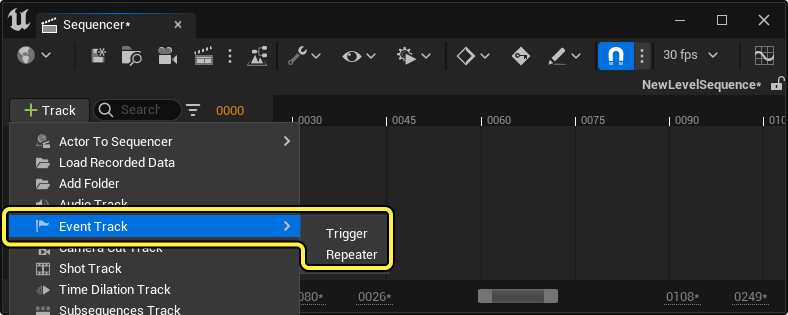
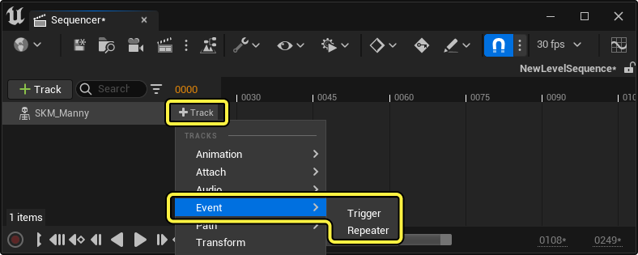
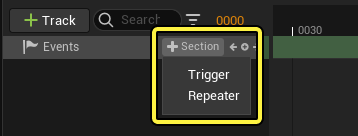
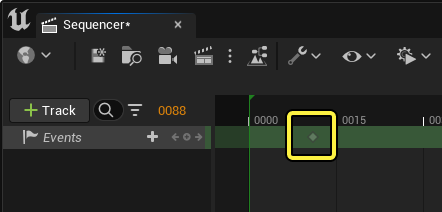
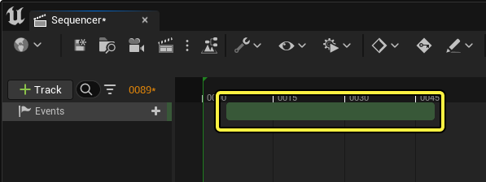
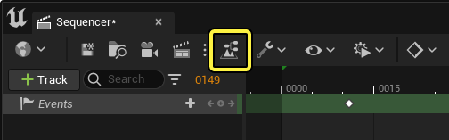
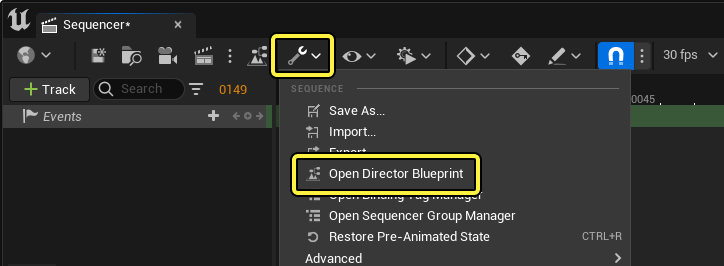
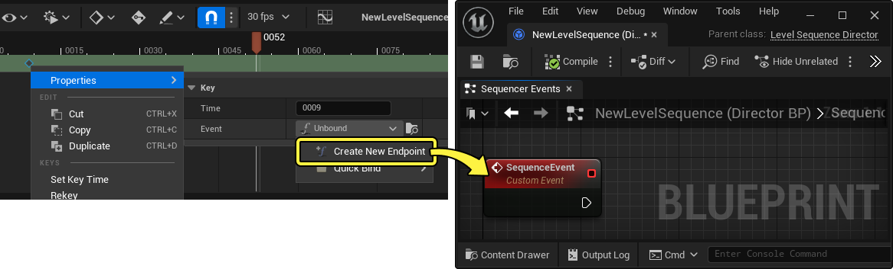

# 事件轨道

> 路径：虚幻引擎5.7文档 / 为角色和对象制作动画 / 过场动画和Sequencer / Sequencer概述 / 轨道 / 事件轨道

> 原始页面：https://dev.epicgames.com/documentation/unreal-engine/cinematic-event-track-in-unreal-engine

在Sequencer中，你可以在要执行[蓝图脚本](../../../../../blueprints-visual-scripting/index.md)功能的序列中定义帧。这是使用 **事件轨道（Event Track）** 实现的。

本指南将概述事件轨道，包括创建方式，访问导演蓝图，以及你可以创建的事件类型。

#### 先决条件

- 你已了解

  Sequencer

  及其

  界面

  。
- 你已了解

  蓝图可视化脚本

  。

## 创建

要创建事件轨道，请点击Sequencer中的 **添加轨道（+）** ，找到 **事件轨道（Event Track）**，然后选择[触发器（Trigger）](#%E8%A7%A6%E5%8F%91%E5%99%A8%E4%BA%8B%E4%BB%B6)或[重复器（Repeater）](#%E9%87%8D%E5%A4%8D%E5%99%A8%E4%BA%8B%E4%BB%B6)事件类型。

事件轨道还可以在[Object绑定轨道](../cinematic-actor-tracks/index.md)下创建，这会[将事件绑定到该对象](#%E5%AF%B9%E8%B1%A1%E7%BB%91%E5%AE%9A)。

创建事件轨道后，你可以创建额外的事件[分段](../../creating-animation-keyframes/index.md#%E5%88%86%E6%AE%B5)，方法是点击该事件轨道上的 **添加分段（+）**，然后选择事件类型。

添加事件时，你可以选择添加 **触发器（Trigger）** 或 **重复器（Repeater）** 类型事件。触发器事件会导致事件在与关键帧相同的帧上求值，而重复器事件将事件分段的时长内为每个帧求值。

### 触发器事件

触发器事件是针对每个关键帧求值一次的事件。创建此轨道后，你就可以对其 **[设置关键帧](../../creating-animation-keyframes/index.md)** 以创建事件关键帧。

### 重复器事件

重复器事件是将在事件分段的时长内针对序列的每个帧连续触发或求值的事件。调整序列的[每秒帧数（Frames Per Second）](../../sequencer-editor/sequencer-cinematic-toolbar/index.md#%E6%AF%8F%E7%A7%92%E5%B8%A7%E6%95%B0)还将调整重复器的求值速率以匹配。创建此轨道后，它将包含有限的[分段（Section）](../../creating-animation-keyframes/index.md#%E5%88%86%E6%AE%B5)范围，从而控制其求值时间。

你可以[编辑、移动和修剪](../../creating-animation-keyframes/index.md#%E4%BA%A4%E4%BA%92%E5%92%8C%E6%98%BE%E7%A4%BA)此事件分段，就像对Sequencer中的其他分段那样。

## 导演蓝图

导演蓝图是事件轨道的逻辑中心，其中你将从事件端点执行[蓝图可视化脚本（Blueprint Visual Scripting）](../../../../../blueprints-visual-scripting/index.md)。你还可以在蓝图中指定 **参数（Parameters）** 和 **对象绑定（Object Bindings）**，以便在整个脚本中传递变量和对象信息。每个 **关卡序列（Level Sequence）** 都有自己的导演蓝图，其中包含该序列中事件的所有逻辑。

你可以使用多种方式打开导演蓝图：

1. 双击事件关键帧或分段。如果事件当前未绑定，此方法还会将事件绑定到新的[**端点**](#%E4%BA%8B%E4%BB%B6%E7%AB%AF%E7%82%B9)。

   > 动图已省略：双击事件
2. 点击[导演蓝图工具栏按钮（Director Blueprint Toolbar button）](../../sequencer-editor/sequencer-cinematic-toolbar/index.md#%E5%AF%BC%E6%BC%94%E8%93%9D%E5%9B%BE)。

   
3. 点击[操作工具栏按钮（Actions Toolbar button）](../../sequencer-editor/sequencer-cinematic-toolbar/index.md#%E6%93%8D%E4%BD%9C)，然后选择 **打开导演蓝图（Open Director Blueprint）**。

   

### 事件端点

无论是创建触发器事件还是重复器事件，你都必须将其绑定到 **事件端点（Event Endpoint）**，以便向其添加逻辑。为此，请右键点击关键帧（如果使用触发器）或分段（如果使用重复器），然后选择 **属性（Properties）> 未绑定（Unbound）> 创建新端点（Create New Endpoint）**。这样做会将事件关键帧或分段绑定到新的端点节点并打开 **导演蓝图（Director Blueprint）**。

事件端点可以通过蓝图的"细节（Details）"面板中的 **名称（Name）** 属性重命名。

> 图片已省略：重命名事件

你可以根据需要创建任意数量的事件关键帧或分段。你还可以使用 **快速绑定（Quick Bind）** 或 **重新绑定到（Rebind To）** 菜单来共享事件节点。

> 图片已省略：事件轨道链接

### 参数和事件有效负载

与蓝图[自定义事件（Custom Events）](../../../../../blueprints-visual-scripting/specialized-blueprint-visual-scripting-node-groups/events/custom-events/index.md)相似，事件轨道可以有与之关联的输入参数。你可以使用事件参数和有效负载在事件触发时将属性值发送到目标。

要将参数添加到事件，请选择事件端点，然后点击细节面板中的 **添加参数（+）**。这样做将在细节中以及脚本的节点上创建新参数

> 图片已省略：事件轨道参数属性

右键点击事件关键帧或分段时，参数的额外属性将显示在 **有效负载（Payload）** 类别下。你可以在此定义参数上的值，而事件在执行时将发送这些值。

> 图片已省略：有效负载

### 对象绑定

在Sequencer中的绑定对象下创建事件轨道时，将为事件轨道创建 **对象绑定（Object Binding）**，其中事件节点的目标对象将绑定到事件轨道添加到的对象。这样就更容易对序列中的特定Actor编写脚本函数，因为现在可以直接对对象调用函数。

> 图片已省略：事件轨道Actor绑定

关键帧或分段属性上下文菜单上还会公开一个额外的属性。**将绑定的对象传递到（Pass Bound Object To）** 将控制此事件应绑定到哪个对象参数。如果你已将额外的 **对象（Object）** 或[蓝图接口（Blueprint Interface）](../../../../../blueprints-visual-scripting/specialized-blueprint-visual-scripting-node-groups/types-of-blueprints/blueprint-interface/index.md)添加到端点节点，它们在这里就是可选择的。

> 图片已省略：将绑定的对象传递到

如果尚未对你的对象绑定事件指定一个端点节点，你可以使用 **快速绑定（Quick Bind）** 命令添加与绑定的对象直接相关的脚本函数，类似于从蓝图中的对象引用调用函数。

> 图片已省略：快速绑定事件Actor

## 事件属性

右键点击触发器关键帧或重复器分段时，你可以在 **属性（Properties）** 上下文菜单中查看以下属性。

> 图片已省略：事件属性

| 名称 | 说明 |
| --- | --- |
| **事件（Event）** | 此关键帧或分段在[导演蓝图（Director Blueprint）](#%E5%AF%BC%E6%BC%94%E8%93%9D%E5%9B%BE)中绑定到的 **事件端点（Event Endpoint）**。 默认情况下，这是未绑定的，要进行绑定，可以点击下拉菜单，然后选择 **Create New Endpoint** 或其他现有端点节点。 未绑定创建新端点 **快速绑定（Quick Bind）** 包含此事件的兼容函数列表，在事件轨道绑定到对象时还包括对象绑定。 快速绑定 |
| **在编辑器中调用（Call In Editor）** | 启用此项将导致事件逻辑在编辑器会话中求值，而不需要你[在编辑器中播放或模拟（Play or Simulate in Editor）](../../../../../building-virtual-worlds/level-editor/ineditor-testing-play-and-simulate/index.md)。事件绑定到端点节点后，此属性会立即显示。 |

你还可以右键点击事件轨道，在 **属性（Properties）** 上下文菜单中查看以下属性。

> 图片已省略：事件轨道属性

| 名称 | 说明 |
| --- | --- |
| 向前时触发事件（Fire Event when Forwards） | 启用此属性将导致事件在序列正常向前播放时触发。 |
| 向后时触发事件（Fire Event when Backwards） | 启用此属性将导致事件在序列逆向播放时触发。 如果你需要在预览序列时多次将事件链重置回正常，使用 **向前（Forwards）** 和 **向后（Backwards）** 属性可能很有用。你可以将一个事件轨道设置为仅向前触发，将另一个事件轨道设置为仅向后触发。此后，你可以将向前事件连接到正常事件链，并将向后事件连接到重置链。 |
| 事件位置（Event Position） | 定义事件应该在求值中的什么位置触发。 **在求值开始时（At Start Of Evaluation）** 将导致该事件首先触发，然后再对序列中的其他全部内容求值。 **在求值结束时（At End Of Evaluation）** 将导致该事件最后触发，在此之前对序列中的其他全部内容求值。 **在生成之后（After Spawn）** 将导致事件在[可生成](https://dev.epicgames.com/documentation/404)生成并求值之后触发。 |
