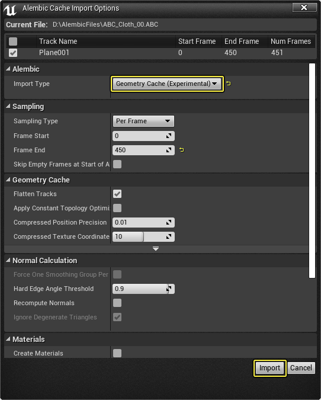
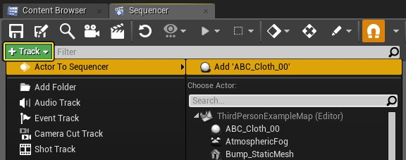
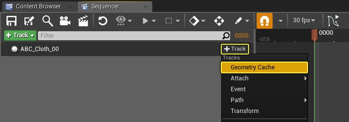
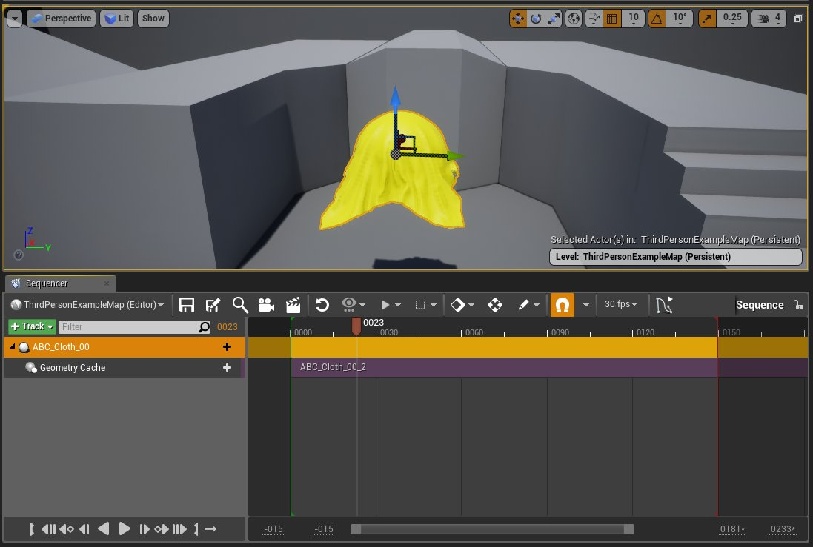
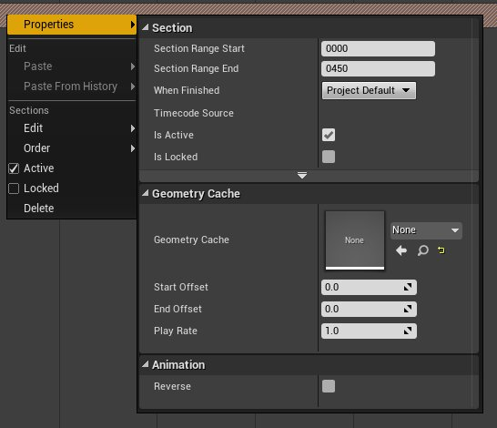

# 几何体缓存轨道

> 路径：虚幻引擎5.7文档 / 为角色和对象制作动画 / 过场动画和Sequencer / Sequencer概述 / 轨道 / 几何体缓存轨道

> 原始页面：https://dev.epicgames.com/documentation/unreal-engine/cinematic-geometry-cache-track-in-unreal-engine

**几何体缓存轨迹（Geometry Cache Track）** 使您可以拉动播放 **几何体缓存** 并以帧精度将其渲染出来。将Alembic文件导入虚幻引擎并添加到关卡后，可以将其添加到 **关卡序列** 并添加 **几何体缓存轨迹** 来播放内容。

## 步骤

> [!NOTE]
> 在本操作指南中，我们使用 **蓝图第三人称** 模板项目。您还需要一个Alembic文件来导入到引擎中。如果您没有自己的资源，下载该[样本文件](https://epicgames.box.com/s/l74nagy14ttaium5j41gu61ljz4v5rul)。

1. 将Alembic文件作为[几何体缓存](../../../../../working-with-content/alembic-file-importer/index.md#%E5%AF%BC%E5%85%A5%E4%B8%BA%E5%87%A0%E4%BD%95%E4%BD%93%E7%BC%93%E5%AD%98)导入虚幻引擎，并定义您所需的设置。

   
2. 将 **几何体缓存** 放入关卡，然后创建 **关卡序列**，并使用 **添加轨迹（+ Track）** 按钮将其添加到 **Sequencer**。

   
3. 单击新建轨迹的 **添加轨迹（+ Track）** 按钮，然后从 **轨迹（Tracks）** 菜单中选择 **几何体缓存（Geometry Cache）**。

   
4. 拉动 **时间轴（Timeline）** 以查看播放效果。

   

   > [!NOTE]
   > 在关卡中选择"播放"（Play）之前，还可以将 **关卡序列** 设置为 **自动播放（Auto Play）**。

## 最终结果

设置 **几何体缓存轨道** 后，可以拉动播放内容，内容也会在关卡序列播放时自动播放。

在 **轨迹（Tracks）窗口** 中右键单击轨迹，可以访问几何体缓存的属性。从属性菜单，更改当前使用的 **几何体缓存** 资源，添加 **起点偏移（Start Offset）** 或 **终点偏移** **（End Offset）**，或者调整 **播放速度（Play Rate）**。现在有调整 **分段（Section）** 本身的选项以及是否在 **反向（Reverse）** 播放动画。

右键单击快捷菜单中的 **属性（Properties）** 下面，提供几何体缓存轨迹的下列属性：

| 属性 | 说明 |
| --- | --- |
| **几何体缓存（Geometry Cache）** | 指定要播放的几何体缓存资源。 |
| **起点偏移（Start Offset）** | 动画剪辑起始位置的偏移帧数。 |
| **终点偏移（End Offset）** | 动画剪辑终点位置的偏移帧数。 |
| **播放速度（Play Rate）** | 定义动画剪辑的播放速度（小值降速，大值加速）。 |
