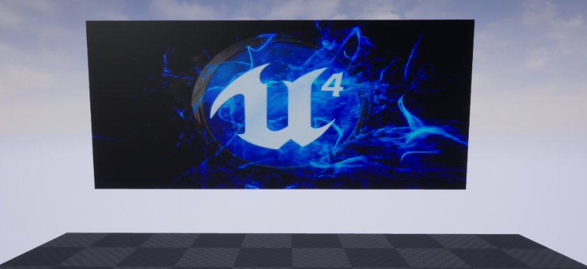
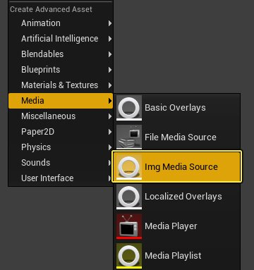
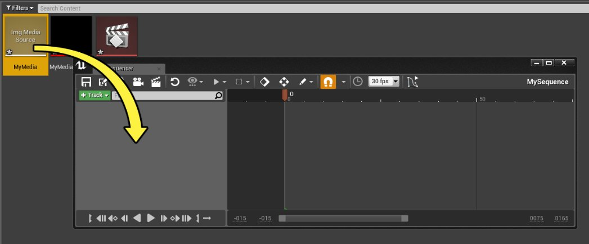
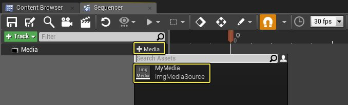
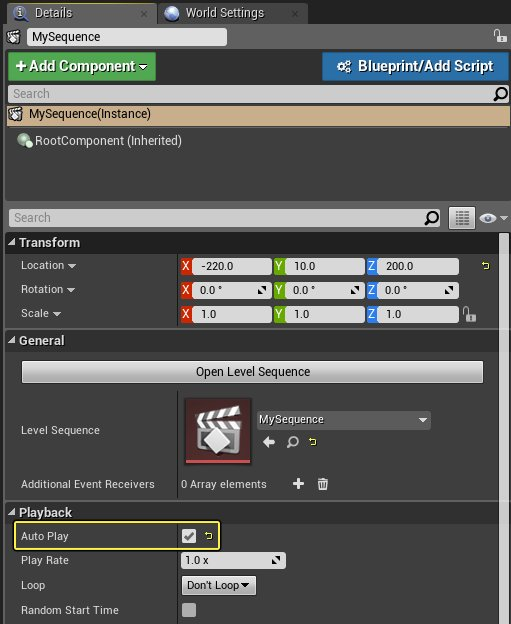
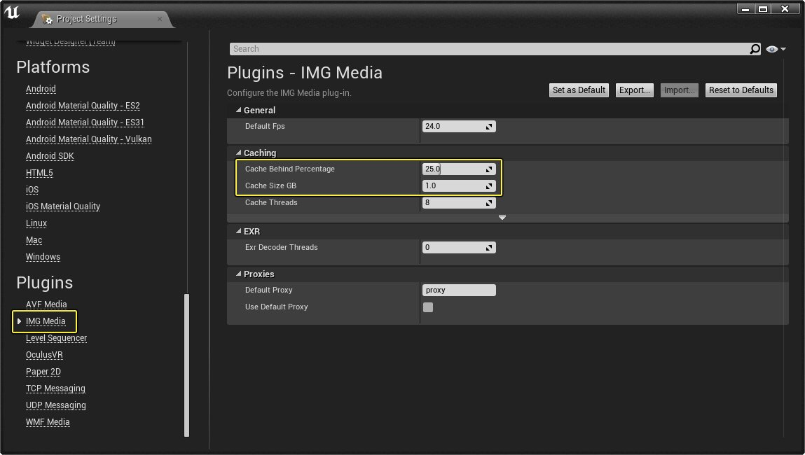

# 媒体轨道

> 路径：虚幻引擎5.7文档 / 为角色和对象制作动画 / 过场动画和Sequencer / Sequencer概述 / 轨道 / 媒体轨道

> 原始页面：https://dev.epicgames.com/documentation/unreal-engine/cinematic-movie-media-track-in-unreal-engine

Sequencer可以使用 **媒体轨道** 以及分配的 **媒体源** 和 **媒体纹理** 资源来控制任何媒体源的播放。Sequencer还会在播放媒体源时创建内部媒体播放器，这样你就无需创建媒体播放器资源。

在以下操作指南中，我们将创建一个新的关卡序列，分配媒体轨道并将其指定给EXR图像序列，当我们在关卡中播放时，它便会进行播放。

## 步骤

> [!NOTE]
> 在本操作指南中，我们将使用一个新的 **空白蓝图项目**。你还需要一系列EXR或PNG图像以用于媒体源。如果你没有可以使用的图像集，可以下载这组[UE4徽标](https://epicgames.box.com/s/fsxw4c9llathxzk8dwof302d1tba4ow1)图像以在本指南中使用。

1. 在项目中，右键单击

   内容浏览器

   ，然后在

   媒体（Media）

   下面，选择

   图像媒体源（Img Media Source）

   并指定名称。

   
2. 打开 **图像媒体源（Img Media Source）** 资源，然后将 **序列路径（Sequence Path）** 指向示例EXR图像并打开第一个图像。 MediaTrack_03.png
3. 在 **内容浏览器** 中单击右键，然后在 **媒体（Media）** 下面创建 **媒体纹理（Media Texture）** 资源。 MediaTrack_04-1.png

   > [!NOTE]
   > 通常，你会创建一个 **媒体播放器（Media Player）** 资源和关联的 **媒体纹理（Media Texture）**。当我们在 **Sequencer** 中使用 **媒体轨道（Media Track）** 时，每个媒体轨道都会自动创建一个内部媒体播放器来按需处理播放。
4. 从主工具栏中，单击 **过场动画（Cinematics）**，然后选择 **添加关卡序列（Add Level Sequence）**，并选择任意名称和保存位置。 MediaTrack_06.png
5. 打开该关卡序列，单击 **轨道（Track）** 按钮并选择 **媒体轨道（Media Track）** 选项。 MediaTrack_07.png 或者，你可以将 **媒体源（Media Source）** 资源从 **内容浏览器** 拖到 **Sequencer** 以创建 **媒体轨道（Media Track）**。

   
6. 在

   媒体轨道（Media Track）

   上，单击

   添加媒体（+ Media）

   按钮并选择你的

   图像媒体源（Img Media Source）

   资源。

   
7. 将媒体拉伸到第 **520** 帧，并将末端标记移到序列末端。 MediaTrack_10.png

   > [!NOTE]
   > 目前，"媒体（Media）"分段不会自动将大小调节到与媒体长度相同，因此我们才需要拉伸来填满整个分段。在未来的版本中，我们希望能让其自动调节自身大小。
8. 右键单击媒体，然后在 **属性（Properties）** 下面，将 **媒体纹理（Media Texture）** 设置为 **媒体播放器（Media Player）** 资源。 MediaTrack_11-1.png 每当添加媒体轨道时，你都需要转至 **属性（Properties）** 并定义 **媒体纹理（Media Texture）** 以与媒体轨道关联。该媒体纹理将接收所播放视频的视频输出。

   > [!TIP]
   > 你可以在多个分段中重复使用同一个媒体纹理，但需要确保不会有两个分段同时向同一个媒体纹理进行写入。
9. 在关卡中选择关卡序列，然后在

   细节（Details）

   面板中，启用

   自动播放（Auto Play）

   。

   
10. 从 **模式（Modes）** 面板中的 **基本（Basic）** 下面，将 **平面（Plane）** 拖到关卡中并根据需要调节大小和旋转。
11. 将 **媒体纹理（Media Texture）** 资源从 **内容浏览器** 拖到关卡中的 **平面（Plane）** 上。

    这样会自动创建并分配一个新的 **材质（Material）**，它将使用这个 **媒体纹理（Media Texture）**。
12. 单击

    播放（Play）

    按钮以在编辑器中播放。

## 最终结果

在编辑器中播放时，视频将开始按照设为自动播放的关卡序列的指示进行播放。你还可以在Sequencer编辑器内部拉动媒体，这样将拉动视频播放。

## 附加信息

**媒体轨道（Media Track）** 目前最适合用于 **图像媒体源（Img Media Source）** 对象来制作图像序列，尤其是EXR序列。

> [!WARNING]
> MP4 影片和其他影片格式虽受支持但仍在试验阶段，在媒体轨道上原样渲染。

在优化媒体轨道播放时，需要进行一些配置。

首先，**项目设置（Project Settings）>插件（Plugins）>图像媒体（IMG Media）** 中有一个全局设置。**缓存大小GB（Cache Size GB）** 是每个有效媒体播放器将会缓存的千兆字节数。你需要将该值设置为一个合理的数字，具体取决于一次处于活动状态的媒体播放器数量和视频帧的内存占用量。建议的比较合适的数字通常是0.5或1.0，但需求因人而异。

**已放完缓存百分比（Cache Behind Percentage）** 是将用于缓存当前播放位置之前已播放分段的帧的缓存百分比。对于实时播放，你需要将该值设置为0，因为你只需要缓存还未播放的帧。

其次，每个媒体轨道分段都需要配置 **预卷（Pre-roll）** 时间，以便及时预载入帧。同样，正确的时长取决于多个因素，例如你播放的视频数量、帧数或机器的运行速度。

一般而言，你需要确保视频帧预卷时间足够提前，这样在需要时才能使用视频帧，但也不能过于提前，因为可能会干扰仍在播放和载入视频帧的其他分段的性能。对缓存大小和预卷设置的调节应遵循这样一个原则，即在任何给定的时间点应预先卷入最小数量的视频帧，同时保证所有帧在需要时已经准备就绪。
