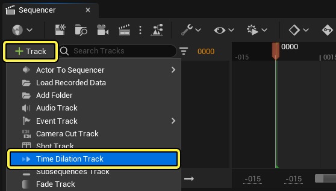
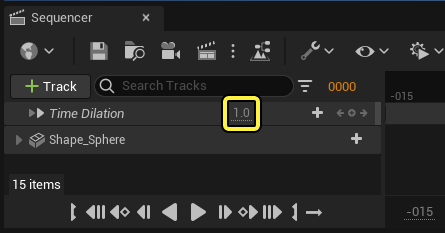

# 时间膨胀轨道

> 路径：虚幻引擎5.7文档 / 为角色和对象制作动画 / 过场动画和Sequencer / Sequencer概述 / 轨道 / 时间膨胀轨道

> 原始页面：https://dev.epicgames.com/documentation/unreal-engine/cinematic-playback-rate-in-unreal-engine

**时间膨胀轨道（Time Dilation Track）** 可以让你加快或放慢过场动画的播放速度。你还可以用它添加关键帧，为序列添加时间扭曲效果。

本文将介绍如何创建、使用和理解时间膨胀轨道。

#### 先决条件

- 创建并打开一个关卡序列资产。
- Sequencer中有一个带动画的Actor，以便预览时间膨胀（Time Dilation）效果。

## 创建

要创建时间膨胀轨道，请点击 **添加轨道（+）** 并选择 **时间膨胀轨道（Time Dilation Track）**。

新建的时间膨胀轨道的值为 **1.0**，这是游戏模拟的默认速度。

## 用法

你可以在播放序列时修改轨道的值，预览不同的播放速率。

> 动图已省略：time dilation warp

你也可以在时间膨胀轨道上设置关键帧，从而为序列创建时间扭曲效果。

选择轨道并按下 **回车键** 即可添加起始关键帧，然后沿着时间轴拖动时间标记（Time Marker），并修改时间膨胀（Time Dilation）值。这将自动创建一个使用该设置值的关键帧。

> 动图已省略：time dilation warp

## 时间膨胀效果

时间膨胀轨道不仅仅影响过场动画中包含的轨道。它也会放慢关卡中所有模拟的全局时间尺度。这意味着关卡中的所有材质、例子或其他动态对象的模拟速度都会受到时间膨胀效果（Time Dilation）的影响，无论序列中的轨道是否引用了它们。

下面的示例展示了时间膨胀轨道对 **粒子模拟速度** 以及背景云层的 **平移纹理** 的影响。这些资产并未被序列中的任何轨道直接引用。

> 动图已省略：time dilation world level
