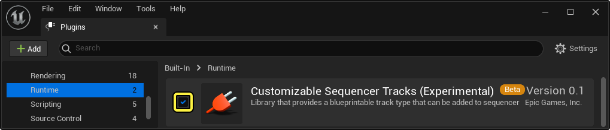
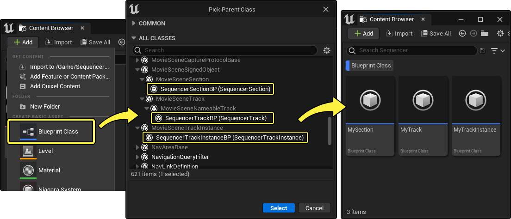
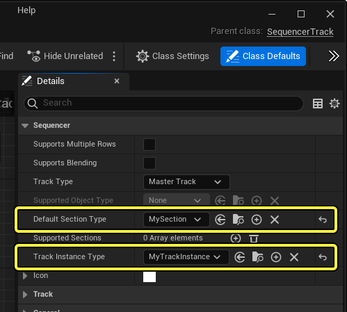
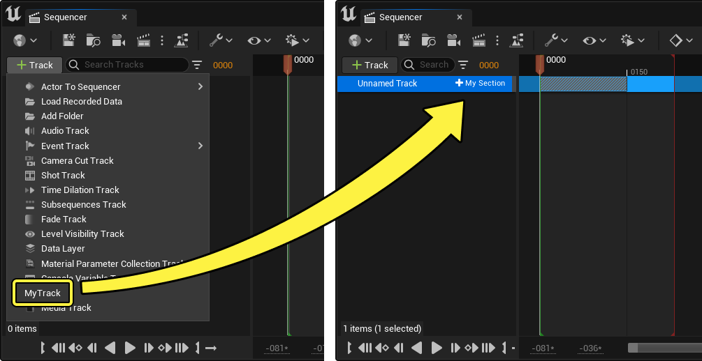
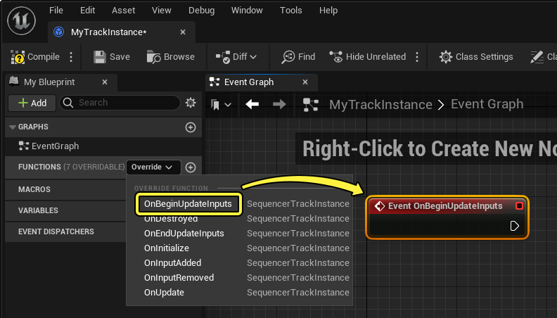
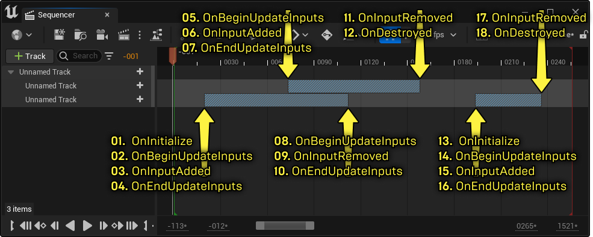
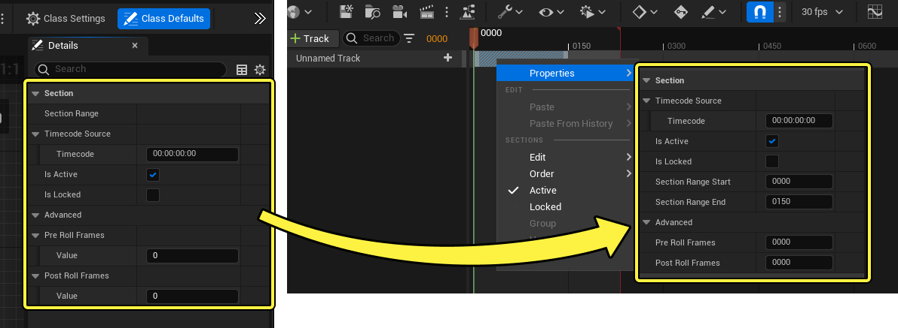
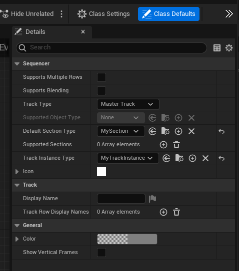

# 可自定义的Sequencer轨道

> 路径：虚幻引擎5.7文档 / 为角色和对象制作动画 / 过场动画和Sequencer / Sequencer概述 / 轨道 / 可自定义的Sequencer轨道

> 原始页面：https://dev.epicgames.com/documentation/unreal-engine/customizable-sequencer-track-in-unreal-engine

通过使用蓝图和子类，你可以创建自定义类型的Sequencer轨道。这样，无需C++代码你就能扩展Sequencer轨道的功能。这在设计或实现项目新轨道时非常有用。

该文档介绍了自定义Sequencer轨道功能、如何创建新的轨道类型，以及用来与普通Sequencer对象通信的函数。

#### 先决条件

- 可自定义Sequencer轨道功能是一种[插件](../../../../../understanding-the-basics/foundational-knowledge-in/working-with-plugins/index.md)，使用前必须先启用。在虚幻引擎的主菜单中，前往 **编辑（Edit） > 插件（Plugins）**，在**运行时（Runtime）** 部分找到 **可自定义Sequencer轨道（Customizable Sequencer Tracks）**，之后点击复选框来将其启用，然后重启虚幻引擎。

  
- 你应该熟悉如何创建并使用

  蓝图

  。

## 创建新轨道

新建自定义Sequencer轨道需要先创建继承自以下蓝图的三个不同蓝图类：

- SequencerSectionBP
- SequencerTrackBP
- SequencerTrackInstanceBP

要完成这步，在 **内容浏览器（Content Browser）** 中，点击 **添加 (+) > 蓝图类（Blueprint Class）**，然后在 **所有类（All Classes）** 部分中找到这三个类。每个都创建一个新的子级蓝图类。

接下来，你需要将不同的类进行关联来让它们互相沟通。要完成这步，打开继承自 `SequencerTrackBP` 的新蓝图，并在 **细节（Details）** 面板的 **类默认（Class Defaults）** 部分设置以下属性：

- 将

  默认分区类型（Default Section Type）

  设为继承自

  SequencerSectionBP

  的新蓝图。
- 将

  轨道实例类型（Track Instance Type）

  设为继承自

  SequencerTrackInstanceBP

  的新蓝图。

编译并保存蓝图后，现在可以从Sequencer的主 **添加轨道（Add Track） (+)** 菜单添加一个主要轨道。

## 创建轨道逻辑

虽然现在你可以在Sequencer中创建你的新轨道，但是其分区中不包含逻辑，所以在创建轨道时什么都不会发生。要开始为你的轨道创建逻辑，打开继承自 `SequencerTrackInstanceBP` 的蓝图。在其函数部分中，你可以覆盖事件来将其添加到事件图表，从中可以创建蓝图逻辑。

### 分区事件

以下分区事件可以在 `SequencerTrackInstanceBP` 的事件图表中覆盖。

| 名称 | 图片 | 描述 |
| --- | --- | --- |
| **OnBeginUpdateInputs** |  | 该事件在分区将要开始或结束时执行。它首先执行，但是在 **OnInitialize** 之后。 |
| **OnEndUpdateInputs** |  | 该事件在分区完成开始或结束时执行。它在 **OnBeginUpdateInputs** 和 **OnInputAdded/Removed**之后执行。 |
| **OnDestroyed** |  | 该事件在分区结束并且没有其它分区在播放的时候执行。它最后执行。 |
| **OnInitialize** |  | 该事件在分区开始并且没有其它分区在播放的时候执行。它最先执行。 |
| **OnInputAdded** |  | 该事件在分区开始的时候执行。它在 **OnBeginUpdateInputs** 之后执行。 |
| **OnInputRemoved** |  | 该事件在分区结束的时候执行。它在 **OnBeginUpdateInputs** 之后执行。 |
| **OnUpdate** |  | 该事件每帧持续执行，只要任意一个分区处于激活状态。最开始激活一个分区的时候，它在 **OnEndUpdateInputs** 之后执行。 |

举个例子，下图展示了有多个分区的情况下所有单个事件的整体执行顺序：

> [!NOTE]
> 自定义Sequencer轨道只使用[分区](../../creating-animation-keyframes/index.md#sections)，不使用关键帧。

### 分区函数

在 `SequencerTrackInstanceBP` 子蓝图中构建逻辑时，你可以使用以下函数来获取分区或者其对象的信息：

| 名称 | 图片 | 描述 |
| --- | --- | --- |
| Get Animated Object |  | 如果[轨道类型](#sequencertrackbp) 设为 **对象轨道（Object Track）**，获取该轨道父级的对象或者Actor。该函数应该与一个 **Cast** 函数配对来获取一个可用的返回对象的蓝图引用。 |
| Get Input |  | 根据序数获取当前正在播放的分区（如果有多个分区正在播放）。默认的返回引脚是一个结构体，必须打破才能访问实际的分区对象。你可以使用 **Break SequencerTrackInstanceInput**，或者通过右键点击引脚并选择 **分离结构体引脚（Split Struct Pin）**。 |
| Get Inputs |  | 返回一个数组，包含当前播放的分区。 |
| Get Num Inputs |  | 获取当前播放的分区的数量。 |

## 类的概览

这一小节介绍三个组成自定义轨道的蓝图类以及其属性。

### SequencerSectionBP

SequencerSectionBP 是一个临时类，在运行时构建。你也可以用它来设置默认的分区属性，可以在Sequencer中覆盖到分区属性。要访问并修改这些属性，前往 **细节（Details）** 面板的 **类默认（Class Defaults）** 部分。

| 名称 | 描述 |
| --- | --- |
| **Timecode Source** | 分区使用的默认时间码信息，如果使用了时间码的话。你还可以指定差值帧来控制偏离信息。 |
| **Is Active** | 设置分区是否默认[激活](../index.md#mute)。 |
| **Is Locked** | 设置分区是否默认[锁定](../index.md#lock)。 |
| **Pre / Post Roll Frames** | 指定默认应用到分区起始和结束部分的额外空间，可以将分区的第一帧和最后一帧保持指定的时间。 |

### SequencerTrackBP

该类用于为轨道设置通用的属性和规则，比如名称、类型和支持的分区。要访问并改变这些属性，前往 **细节（Details）** 面板的 **类默认（Class Defaults）** 部分。

| 名称 | 描述 |
| --- | --- |
| **支持多行（Supports Multiple Rows）** | 启用后，会允许轨道包括多个子轨道（行）。这样可以使用该轨道将数据堆层。 |
| **支持混合（Supports Blending）** | 启用后，会允许分区之间互相混合。 |
| **轨道类型（Track Type）** | 设置在什么情况下该轨道可以添加到并存续于Sequencer。可以选择： **主要轨道（Master Track）**，会将轨道添加至Sequencer的主要添加轨道（+）菜单。这会将轨道变为顶部等级的Sequencer轨道。 **对象轨道（Object Track）**，会将轨道添加至另一个轨道的添加（+）菜单。父级轨道取决于 **支持的对象类型（Supported Object Type）** 中定义的对象类。 |
| **支持的对象类型（Supported Object Type）** | 如果 **轨道类型（Track Type）** 设为 **对象轨道（Object Track）**，该属性可以指定该轨道可以添加至哪个类型的对象之下。 |
| **默认分区类型（Default Section Type）** | 指定作为必须的轨道设置中，继承的基础 `SequencerSectionBP` 类。 |
| **支持的分区（Supported Sections）** | 一个数组，可以向其中添加额外的 `SequencerSectionBP` 类来从轨道的 **添加分区（Add Section）（+）** 菜单进行添加。你可以使用各种 **Get Input** 函数创建逻辑来区分这些分区。 |
| **轨道实例类型（Track Instance Type）** | 指定作为必须的轨道设置中，继承的基础 `SequencerTrackInstanceBP` 类。 |
| **图标（Icon）** | 显示预览轨道的图标。展开该属性会i西安市以下图标属性： **图片（Image）**：使用作图标的纹理或材质。 **图片尺寸（Image Size）**：图片的大小和X/Y尺寸。 **着色（Tint）**：图片的颜色。启用 **继承（Inherit）** 后会禁用着色并使用父级控件颜色。 **绘制为（Draw As）**：可以选择绘制图标的不同方式：**箱型（Box）**、 **边框（Border）**、 **图片（Image）**、 或者 **圆角箱型（Rounded Box）**。 **平铺（Tiling）**：启用以 **水平（horizontal）**、 **垂直（vertical）**、 或者 **两者都（both）** 将图片平铺。 **预览（Preview）**：用于预览图标最终样式和尺寸的区域。 |
| **显示名称（Display Name）** | 轨道的默认名称。可以通过普通的轨道重命名操作来覆盖。 |
| **轨道行显示名称（Track Row Display Names）** | 一个数字，启用 **支持多行（Supports Multiple Rows）** 后可以指定行名称。如果添加了多于一个数组元素，那么添加分区行会直接添加所有命名的行。 |
| **颜色（Color）** | 为轨道及其分区设置默认颜色。确保颜色的alpha值不为0，否则颜色会变透明并显示为默认的灰色。 |
| **显示垂直帧（Show Vertical Frames）** | 启用后，会导致时间轴中分区起始和结束位置显示垂直的分割线。 |

### SequencerTrackInstanceBP

该类通过[覆盖事件](#sectionevents) 和 [创建函数](#sectionfunctions)在 **事件图表（Event Graph）** 中为轨道创建主要逻辑和行为。

> 图片已省略：轨道实例类
