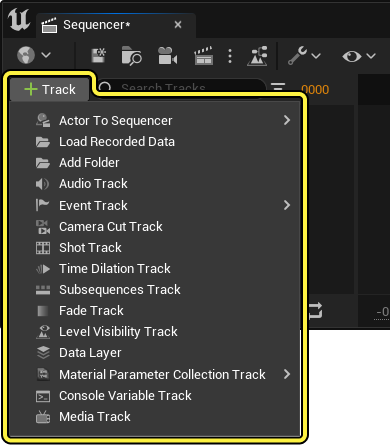
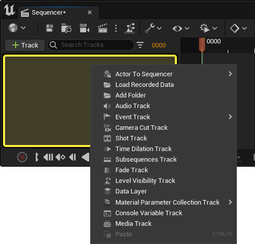
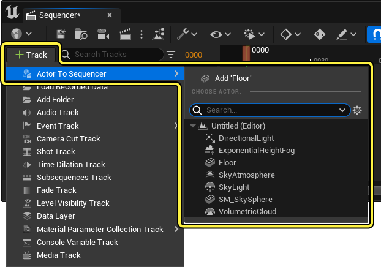
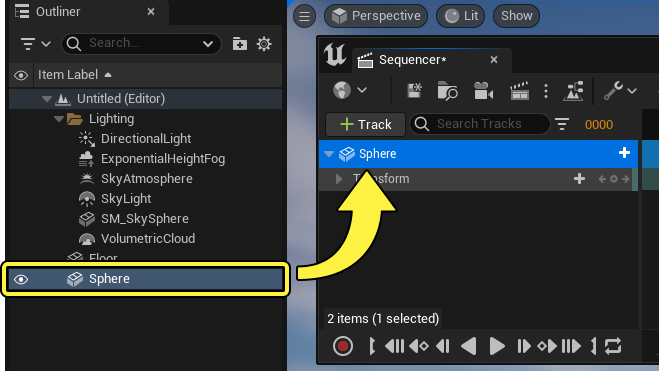
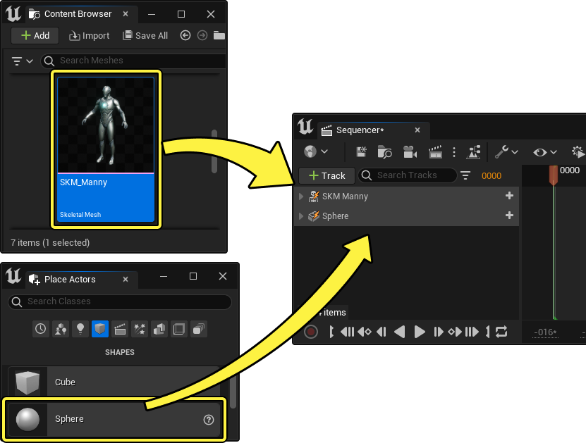
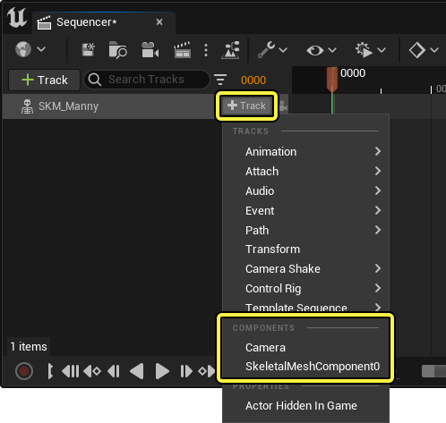
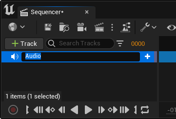
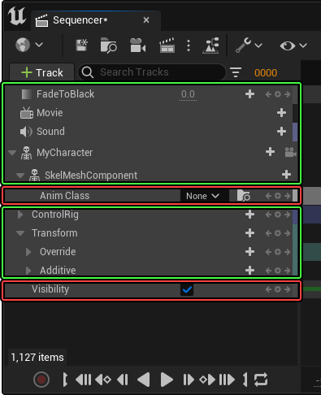

# 轨道

> 路径：虚幻引擎5.7文档 / 为角色和对象制作动画 / 过场动画和Sequencer / Sequencer概述 / 轨道

> 原始页面：https://dev.epicgames.com/documentation/unreal-engine/sequencer-track-list-in-unreal-engine

在Sequencer中，Actor属性和其他元素是通过向时间轴添加轨道来访问的。根据轨道类型，它们可用于组织轨道、创建关键帧或启用其他辅助函数。

#### 先决条件

- 你已了解

  Sequencer

  及其

  界面

  。

## 轨道列表

下表列出了你可以在Sequencer中添加的主要轨道。

- [Object绑定轨道](cinematic-actor-tracks/index.md) - Object绑定轨道将Actor和Object绑定到Sequencer，并提供控制方法来操纵其专用属性或组件。

- [动画轨道](cinematic-animation-track/index.md) - 借助动画轨道，可以将动画序列添加到你的骨骼网格体轨道。

- [音轨](cinematic-audio-track/index.md) - 非线性动画的动画混合工具概述。

- [事件轨道](cinematic-event-track/index.md) - 事件轨道支持创建在专用Sequencer蓝图层中编写脚本的自定义事件。

- [几何体缓存轨道](cinematic-geometry-cache-track/index.md) - 说明如何添加和使用几何体缓存轨迹在Sequencer中拉动播放和利用几何体轨迹资源。

- [淡入淡出轨道](cinematic-color-fade-track/index.md) - Sequencer中的淡入淡出轨道用于将整个画面淡入淡出为纯色。你可以通过它淡入淡出为黑色、白色或其他颜色。

- [关卡可视性轨道](../../unreal-engine-sequencer-movie-t-fa6b165a/sequencer-track-list/cinematic-level-visibility-track/index.md) - 如何控制关卡可见性的示例。

- [材质轨道](animate-materials-in-edf571c0/index.md) - 将材质轨道用于不同的功能，以各种方式在Sequencer中为材质制作动画。

- [时间膨胀轨道](cinematic-playback-rate/index.md) - 使用时间膨胀轨道加快或放慢过场动画的播放速度。

- [子序列轨道](cinematic-subscequences-track/index.md) - 使用Subsequence轨道进行整理，使多个美术师能处理同一序列的工作。

- [媒体轨道](cinematic-movie-media-track/index.md) - 媒体轨道可以使用虚幻引擎的媒体框架功能控制Sequencer中的影片和图像的播放。

- [镜头切换轨道](cinematic-camera-cut-track/index.md) - 在Sequencer中可以使用镜头切换轨道控制在播放期间当前激活的电影摄像机Actor。

- [文件夹轨道](organize-cinematic-tracks/index.md) - 文件夹轨道可用于整理Sequencer大纲视图中的轨道。

- [变换和属性轨道](../../unreal-engine-sequencer-fa6b165a/sequencer-track-list/cinematic-transform-and-property-tracks/index.md) - Sequencer的属性轨道用于为Actor的常见变量或属性（例如变换、浮点或颜色）制作动画。

- [控制台变量轨道](../../unreal-engine-sequencer-movie-t-fa6b165a/sequencer-track-list/cinematic-console-variable-track/index.md) - 使用控制台变量轨道在实时动画中调整渲染设置和其它控制台变量

- [可自定义的Sequencer轨道](customizable-sequencer-track/index.md) - 通过蓝图和可自定义Sequencer轨道功能创建你自己的轨道来在Sequencer中使用

## 添加轨道

Sequencer提供了多种将轨道添加到时间轴的方法。

点击Sequencer的大纲视图中的 **添加轨道（+）** 按钮，界面上将显示可添加到序列中的轨道列表。在此处选择一个轨道，添加到Sequencer。

右键点击大纲视图的空白区域也会显示轨道列表。

### 添加Actor

Sequencer中最常用的轨道之一是[对象绑定归档](cinematic-actor-tracks/index.md)。这些轨道绑定到关卡中的 **骨架网格体**、**静态网格体**、**效果**、**蓝图**、**组件** 和其他对象。

打开 **添加轨道（+）** 菜单的 **Actor到Sequencer子菜单（Actor To Sequencer）** 子菜单，将Actor添加到你的序列中。你可以在此将关卡中当前已有的任何Actor添加到序列中，也可以使用搜索栏搜索特定Actor。

> [!NOTE]
> 如果你选择了关卡中一个Actor，为了方便起见，它将列在 **Actor到Sequencer（Actor To Sequencer）** 列表的顶部。

你还可以从其他窗口拖动Actor，例如[大纲视图](../../../../building-virtual-worlds/level-editor/outliner/index.md)，将其添加到Sequencer。

也可将Actor从[内容浏览器](../../../../understanding-the-basics/content-browser/index.md)或[Place Actors](../../../../understanding-the-basics/actors-and-geometry/placing-actors/index.md)面板拖放，将其作为[可生成物](https://dev.epicgames.com/documentation/404)添加。

### 添加组件

某些轨道允许将组件和其他轨道类型添加在其主标题轨道下。这样做是为了访问特定的轨道功能，例如变换、组件、属性和其他类似功能。

要添加组件轨道，请将鼠标悬停在轨道上，点击 **添加轨道（+）**，查看可用于所选轨道的轨道列表。通常，该轨道或该Actor支持哪些类型的轨道和组件，决定了列表中将显示的内容。

和虚幻引擎中的大部分菜单一样，你可以在 **添加轨道（+）** 中输入关键词以筛选结果，从而更轻松地找到要添加的特定属性、组件或其他轨道。t

> 动图已省略：输入关键词筛选轨道

## 组织

大多数轨道具有属性，属性的存在让轨道能够以不同方式编辑和显示。这些属性保存在Sequencer中，可以分享给项目组的其他人。

### 重命名

为了便于整理，所有最高层级的轨道和组件都可以在Sequencer中重命名。要重命名轨道，可三击轨道文本，也可右键点击后选择 **重命名（Rename）** 或按 **F2**。

> [!NOTE]
> 在重命名绑定到关卡中某个Actor的轨道时，关卡中的Actor也会被重命名。
>
> > 动图已省略：重命名轨道将重命名Actor

大部分轨道都可以被重命名，但不是全部。通常，属性轨道不能被重命名。但某些属性轨道可以，例如变换（Transform）。

绿色的轨道可以被重命名，红色的不行。

### 锁定

轨道可以锁定，以防轨道上的关键帧及其子轨道被编辑。右键点击轨道后选择 **锁定（Locked）**，即可锁定该轨道。轨道锁定后，它下面的所有可键入轨道将显示红色边框，表示锁定状态。

> 图片已省略：锁定轨道

### 固定

轨道可以 **固定（Pin）** ，固定后的轨道会出现在Sequencer大纲顶部的单独大纲视图分段中。右键点击轨道后选择 **固定（Pinned）**，即可固定该轨道。

> 图片已省略：固定轨道

> [!NOTE]
> 每个序列中只能固定一个轨道。

### 禁用

将轨道禁用会导致轨道变为非活动状态，并且不显示此轨道的任何属性或来自Sequencer的关键帧结果。右键点击轨道后选择 **禁用（Mute）**，即可将该轨道禁用。

> 图片已省略：将轨道禁用

> [!NOTE]
> 如果 **[Object绑定轨道](cinematic-actor-tracks/index.md)** 被禁用，它还会在视口中隐藏Actor。

### 单独启用

**单独启用** 某个轨道时，其他轨道都将禁用，从而可以单独查看处于单独启用状态的轨道。右键点击轨道后选择 **单独启用（Solo）**，即可单独启用该轨道。

> 图片已省略：单独启用轨道

> [!NOTE]
> 单独启用和禁用是仅限编辑器的操作，除非你通过 **[在编辑器中运行](../../../../building-virtual-worlds/level-editor/ineditor-testing-play-and-simulate/index.md)**** 进行预览，否则不会在运行时影响关卡。

### 重新排序

你可以在大纲视图中上下拖动轨道，对其进行重新排序。在拖动时出现的Cue将指示轨道的最终落位。

> 动图已省略：对轨道重新排序

## 搜索和筛选

你可以使用Sequencer的搜索字段搜索和筛选特定轨道名称。输入轨道的全称或部分名称，将筛选掉与该名称不匹配的轨道，但是会包括符合部分搜索词的子轨道。

> 图片已省略：搜索轨道

点击 **筛选器（Filters）** 按钮还将显示你可以筛选的常见轨道类型列表。

> 图片已省略：筛选轨道

> [!NOTE]
> 对于使用中的筛选器，其 **筛选器** 按钮上将出现红点指示。
>
> > 图片已省略：筛选器指示
