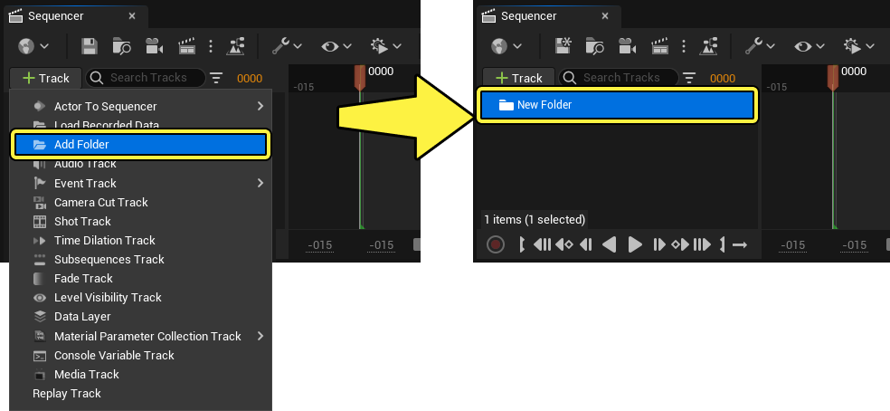
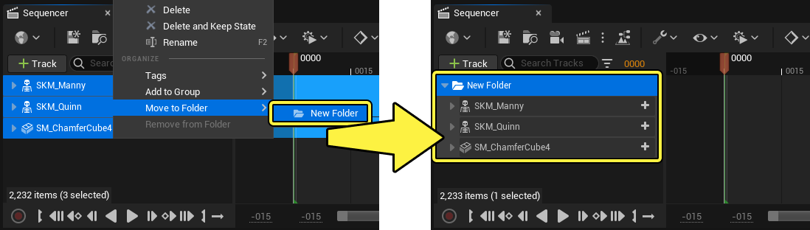
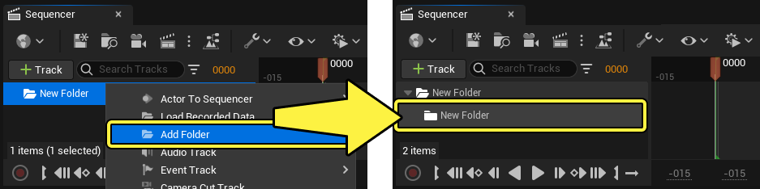
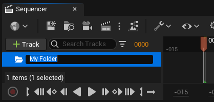
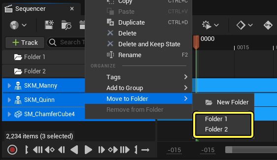

# 文件夹轨道

> 路径：虚幻引擎5.7文档 / 为角色和对象制作动画 / 过场动画和Sequencer / Sequencer概述 / 轨道 / 文件夹轨道

> 原始页面：https://dev.epicgames.com/documentation/unreal-engine/organize-cinematic-tracks-in-unreal-engine

Sequencer中的文件夹轨道用于整理自定义文件夹中的内容和其他轨道。本页面概述了文件夹轨道的创建方法与用法。

#### 先决条件

- 你已了解

  Sequencer

  及其

  界面

  。

## 创建

最常用的文件夹轨道创建方法是，点击Sequencer中的 **+ 轨道（+ Track）** 按钮，然后选择 **添加文件夹（Add Folder）**。

右键点击单个轨道或一组轨道，然后选择 **移动到文件夹（Move to Folder）> 新建文件夹（New Folder）**，也可以创建文件夹。这样做将创建一个新的文件夹轨道，选定的轨道会移动到它下面。

你也可以选择一个或多个轨道，然后在键盘上按 **Ctrl + G**。这样做将创建一个新的文件夹，选定的轨道会移动到它下面。

> 动图已省略：Sequencer文件夹轨道热键

右键点击文件夹，选择 **添加文件夹（Add Folder）**，这还会在该文件夹轨道上创建一个子文件夹。

## 用途

文件夹轨道支持各种直观的移动和整理操作。

### 重命名

与大多数最高层级的轨道一样，三击轨道文本，右键点击后选择 **重命名（Rename）** 或按 **F2** 可重命名文件夹。

### 添加到文件夹

将轨道拖动到Sequencer大纲视图中的文件夹，可以将轨道添加到文件夹中。

> 动图已省略：将轨道添加到文件夹拖动

右键点击轨道并从 **移动到文件夹（Move to Folder）** 菜单中选择文件夹，这样也可以将轨道添加到任何现有文件夹中。

### 从文件夹删除

将轨道从文件夹拖到Sequencer大纲视图中的空白区域，即可从文件夹中删除轨道。

> 动图已省略：删除轨道文件夹拖动

### 设置文件夹颜色

你可以为每个文件夹轨道的图标应用颜色，以便于区分。

为此，请右键点击文件夹后选择 **设置颜色（Set Color）**。此时会出现"颜色拾取器"窗口，你可以从中选择颜色。选择颜色后，点击 **确定（OK）** 按钮，文件夹图标将变为所选颜色。

> 动图已省略：Sequencer文件夹颜色
