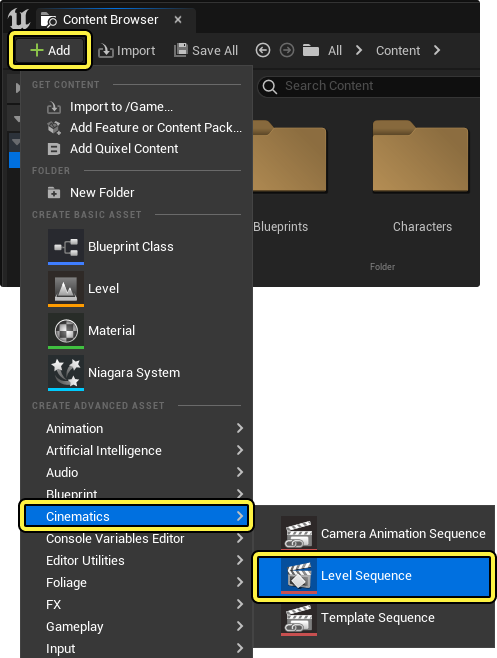
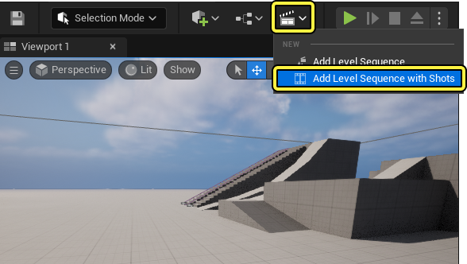
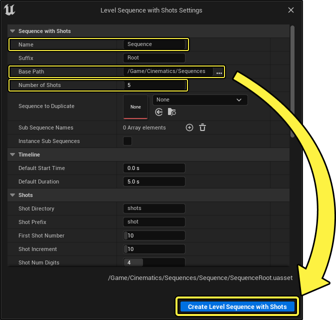
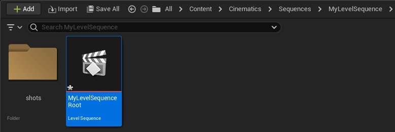
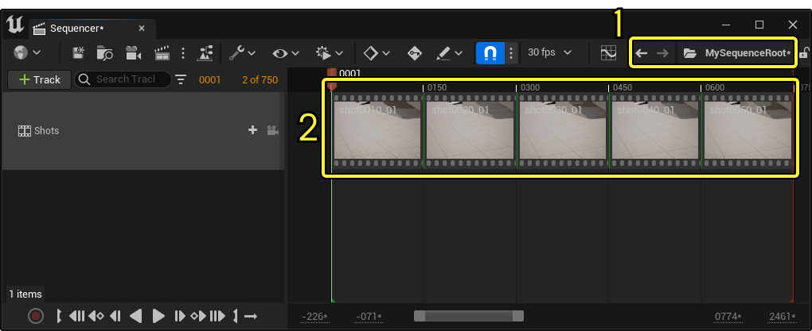
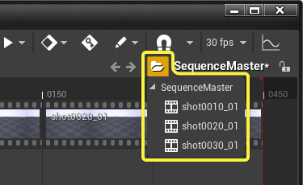
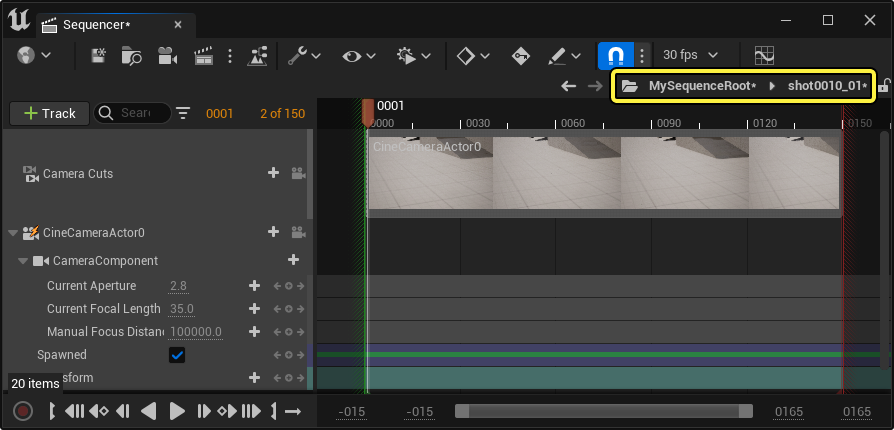
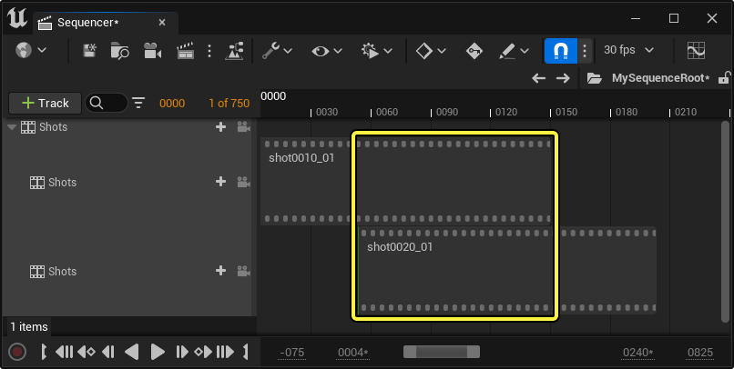

# 序列、镜头和镜头试拍

> 路径：虚幻引擎5.7文档 / 为角色和对象制作动画 / 过场动画和Sequencer / Sequencer概述 / 序列、镜头和镜头试拍

> 原始页面：https://dev.epicgames.com/documentation/unreal-engine/sequences-shots-and-takes-in-unreal-engine

在 **虚幻引擎** 中创建过场动画内容时，可以使用多个 **子序列（Sub-Sequences）**，制作更为复杂的 **序列（Sequences）**。 通过将序列作为子序列添加到更大的关卡序列中，可以将更大的过场动画内容组织成为更具表现力的分段，让团队成员能够分别进行处理。 类似于其他非线性编辑器，你可以在一个序列或子序列中创建 **镜头（Shots）**，也可以在过场动画中创建单独的镜头切换。

可以向镜头中添加内容和游戏对象，如摄像机、角色和其他Actor。 镜头可以修剪并移动到序列中的任意位置，实现完整的非线性编辑体验。 还可以使用"镜头试拍（Take）"系统，将各个镜头彼此区分开，以便在不修改原始镜头的情况下，试验不同的镜头和内容。

可以参考以下文档，详细了解如何使用序列、镜头和镜头试拍，在虚幻引擎中制作过场动画内容。

#### 先决条件

- 已了解

  Sequencer

  及其

  界面

  。

## 关卡序列

**关卡序列Actor（Level Sequence Actor）** 是用于在虚幻引擎中为游戏和传统动画创建过场动画内容的基础资产。关卡序列可包含摄像机、角色和其他游戏对象，你可以对它们进行动画处理，然后在游戏中播放或进行渲染。可以将子序列和镜头添加到关卡序列中，以获得更加逼真复杂的过场动画。

要创建新的关卡序列，请在 **内容浏览器（Content Browser）** 中依次单击（**+**）**添加（Add）** > **过场动画（Cinematics）** > **关卡序列（Level Sequence）**。

也可以通过在菜单栏中找到 **过场动画（Cinematics）** 按钮，选择 **添加带有镜头的关卡序列（Add Level Sequence with Shots）**，创建一个预配置了镜头的新序列资产。

在新的 **带有镜头的关卡序列设置（Level Sequence with Shots Settings）** 窗口中，可以设置资产 **名称（Name）**、保存位置以及要添加的 **镜头数（Number of Shots）**。

"带有镜头的关卡序列设置（Level Sequence with Shots Settings）"属性列表及相关功能描述如下：

| 属性 | 描述 |
| --- | --- |
| **名称（Name）** | 为正在创建的关卡序列资产及其包含的文件夹指定一个名称。 |
| **后缀（Suffix）** | 设置一个将要应用到关卡序列名称的后缀名，以便将主序列资产或根序列资产与子序列镜头资产区分开来。 |
| **基本路径（Base Path）** | 设置用于保存关卡序列资产及其包含的镜头资产的基本文件目录。 关卡序列将存储在与此相对应的文件夹中。 序列的镜头随后将存储在相对于关卡序列文件夹且以镜头命名的嵌套文件夹中。 |
| **镜头数量（Number of Shots）** | 设置要作为镜头创建并添加到关卡序列中的子序列资产的数量。 每个镜头都将自动添加到关卡序列中，根据你设定的镜头设置进行命名、加长和递增。 |
| **要复制的序列（Sequence to Duplicate）** | 如果已经有了一个包含过场动画内容的关卡序列，而你想要进行复制，则可以使用资产下拉菜单，在这里指定。 指定现有关卡序列后，其内容将被复制，复制份数为你指定的镜头数量。 如果未指定任何序列，那么将创建所有的镜头，并预先配置一个[摄像机](../../movie-and-cinematic-cameras/cinematic-cameras/index.md)和一个[镜头切换轨道](../sequencer-track-list/cinematic-camera-cut-track/index.md)。 如果你想在镜头中自动填充Actor和摄像机，这会很有用。 |
| **子序列名称（Sub-Sequence Names）** | 可以通过这个属性添加和命名将要在每个镜头内创建的[子序列](../sequencer-track-list/cinematic-subscequences-track/index.md)。 要为每个关卡序列的镜头添加一个子序列，请选择（**+**）**添加（Add）**，然后使用数组实例设置一个 **名称（Name）**。 |
| **实例子序列（Instance Sub Sequences）** | 启用后，将仅为第一个镜头生成子序列资产。 其他所有镜头都将引用该子序列，而不是为每个镜头都创建一个独特的子序列。 |
| **默认开始时间（Default Start Time）** | 为新关卡序列设置默认的开始时间，以秒为单位。 |
| **默认时长（Default Duration）** | 为新关卡序列设置默认的时长，以秒为单位。 |
| **镜头目录（Shot Directory）** | 可以通过此属性设置文件夹名称，该文件夹中将包含你的关卡序列的镜头资产。 这个文件夹将在关卡序列的父文件夹中创建，紧邻关卡序列资产。 |
| **镜头前缀（Shot Prefix）** | 设置一个将要应用到生成的每个镜头资产的前缀名，以便将你的关卡序列的镜头与其他序列资产区分开来。 |
| **第一个镜头编号（First Shot Number）** | 设置添加到第一个生成的镜头名称末尾的数值。这个值将被添加到镜头资源名称的末尾，例如`{ShotName}{0000}`。 |
| **镜头增量（Shot Increment）** | 设置一个数值，每个生成资源的 **第一个镜头编号（First Shot Number）** 属性值都将加上这个值。 |
| **镜头数字位数（Shot Num Digits）** | 设置添加到生成的镜头资产名称末尾的总数字位数。 |
| **第一个镜头试拍编号（First Take Number）** | 设置添加到新镜头试拍资产名称末尾的总数字位数。 |
| **镜头试拍分隔符（Take Separator）** | 设置用于分隔新镜头试拍资产名称和编号的字符。 |
| **子序列分隔符（Sub Sequence Separator）** | 设置用于分隔子序列资产名称和编号的字符。 |
| **FBX设置（FBX Settings）** | 可以通过这个属性设置FBX属性读取器，用于[在Sequencer中导入FBX](../import-and-export-cinematic-fbx-animations/index.md)时，将属性及其关键帧映射到相关的轨道上。可以使用（**+**）**添加（Add）**，为你的关卡序列添加新的FBX设置。 默认情况下，该数组包含常见FBX摄像机属性（如 **FieldOfView**、**FocalLength** 和 **FocusDistance**）的属性映射。 添加完新的FBX设置数组后，可以在每个数组中设置以下属性： **FBX属性名称（Fbx Property Name）**：设置FBX属性的名称，你希望在关卡序列内为该属性生成一个轨道。 **组件名称（Component Name）**：为关卡序列中包含的FBX Actor设置ActorComponent标签，你想为属性轨道引用该标签。 **属性名称（Property Name）**：设置Actor或组件的属性，你希望在关卡序列中创建一个相关的序列轨道。 **属性类型（Property Type）**：设置属性轨道的数据类型。你可以选择 **浮点型轨道（Float Track）** 或 **Double型轨道（Double Track）**。 |

用镜头的设置设定完新的关卡序列后，将采用包含子序列镜头资产的文件夹结构，把资产保存在指定的位置。

> [!NOTE]
> 可以在这些文件夹中保存替代版本的镜头（叫作"镜头试拍(Take)"），以组织你的序列。

### 用户界面

查看带有镜头的关卡序列时，有两个主区域用于导航和交互。

1. [**操作记录（Breadcrumbs）**](#%E6%93%8D%E4%BD%9C%E8%AE%B0%E5%BD%95)
2. [**镜头分段（Shot Sections）**](#%E9%95%9C%E5%A4%B4%E5%88%86%E6%AE%B5)

#### 操作记录

编辑带有镜头的关卡序列时，工具栏的操作记录区域会展开，可用于在你的主序列及其镜头之间导航。

单击文件夹下拉菜单将显示一个树状图列表，其中包含关卡序列以及内含的镜头。 选择其中的一个项目将打开该序列。

查看镜头或子序列时，序列的名称区域也将显示其所属的主关卡序列。选择主关卡序列即可返回。在子序列或镜头中，你还可以观察"查看上下文（Viewing Context）"，或影响你正在查看的子序列或镜头内容的主关卡序列内容。

可以使用 **向前（Forward）** 和 **向后（Backward）** 按钮，逐步浏览你的序列查看历史记录。

> 动图已省略：sequencer浏览记录导航演示

#### 镜头分段

**镜头（Shots）** 在Sequencer的时间轴中显示为 **分段（Sections）**。每个镜头分段的运作方式类似于大多数[分段](../creating-animation-keyframes/index.md#%E5%88%86%E6%AE%B5)，可以移动、修剪或编辑。双击可打开镜头。

> 动图已省略：sequencer选择操控编辑镜头演示

使用多个镜头轨道时，将优先考虑放在顶端轨道中的镜头分段。这意味着，如果其分段与下面的其他分段重叠，最顶端轨道（而不是底部轨道）上的分段范围将求值。

也可以通过单击并拖动时间轴上的镜头，使其在同一轨道上相互重叠，让镜头混合在一起。

> 动图已省略：sequencer混合镜头

可以通过单击并拖动镜头缩略图上显示的手柄来调整镜头之间的混合。

> 图片已省略：sequencer混合镜头手柄

也可以使用关卡序列蓝图中的 **设置权重（Set Weight）** 节点来控制混合。

> 图片已省略：sequencer混合权重镜头设置权重属性

## 镜头

镜头是关卡序列中的单个序列，可用于在虚幻引擎中创建更复杂的过场动画。每个镜头都对应于自己的序列资产。设置过场动画内容时，建议在镜头中添加Actor、摄像机和其他过场动画组件，然后可以在主关卡序列中作为整个序列进行编辑。

> 图片已省略：sequencer镜头组织文件结构

### 创建

通过在序列编辑器中依次单击 **轨道（Tracks）**（**+**）按钮 > **镜头轨道（Shots Track）**，可以向现有关卡序列添加镜头。然后可以在镜头轨道内选择（**+**）**镜头（Shot）** > **插入镜头（Insert Shot）**，创建一个新的关卡序列资产，该资产将作为子序列镜头添加至你的主关卡序列。

> 图片已省略：sequencer在镜头轨道中使用添加功能插入镜头

选择 **插入镜头（Insert Shot）** 时，界面上将显示资产创建对话框窗口，要求你将镜头序列资产保存到项目中的某个位置。默认情况下，该目录将相对于主关卡序列，放到一个镜头子目录中，前提是[编辑器项目设置（Editor Project Settings）](../cinematic-editor-and-project-settings/index.md#%E7%BC%96%E8%BE%91%E5%99%A8)中定义了子目录。

> 图片已省略：将资产作为设置菜单数据关联保存到关卡序列项目设置

或者，也可以将现有关卡序列资产作为镜头添加，具体方法是使用（**+**）**镜头（Shot）**，然后选择你希望作为子序列镜头添加的序列资产。

> 图片已省略：通过在镜头轨道中选择添加镜头并在下拉菜单中选择资产，将现有关卡序列资产添加为镜头

也可以通过将关卡序列资产从[内容浏览器（Content Browser）](../../../../understanding-the-basics/content-browser/index.md)拖动到主关卡序列时间轴的镜头轨道中来添加镜头。

> 动图已省略：将现有关卡序列拖放到镜头轨道中

### 细节和交互

可以在时间轴上右键单击一个镜头，然后在上下文菜单中导航到 **属性（Properties）** 以查看其细节。

> 图片已省略：在镜头轨道中右键点击镜头，找到要设置的属性并观察镜头属性

镜头的属性列表及相关功能描述如下：

| 名称 | 描述 |
| --- | --- |
| **开始帧偏移（Start Frame Offset）** | 设置此镜头开始时间的偏移帧数。此值提供了类似于[滑移编辑（Slip Editing）](https://support.apple.com/en-ca/guide/final-cut-pro/ver1632d8e4/mac)的效果，因为它会调整剪辑片段的可播放区域，而不影响时长。 或者，你也可以在按住 ****Shift****键的同时，沿着**Sequencer时间轴（Sequencer Timeline）** 中的剪辑片段拖动以编辑此属性。 |
| **可以循环（Can Loop）** | 如果启用，选定的镜头将在其分段长度超出其默认可播放区域时循环。 |
| **结束帧偏移（End Frame Offset）** | 如果启用了 **可以循环（Can Loop）** 属性，该属性可用于偏移循环区域结束时间。 |
| **第一个循环开始帧（First Loop Start Frame）** | 如果启用了 **可以循环（Can Loop）**，该属性可用于偏移第一个循环开始时间。 |
| **时标（Time Scale）** | 控制镜头的播放速率。值`1`是正常速度，数字越大就越快，数字越小就越慢。 |
| **层级偏差（Hierarchical Bias）** | 控制镜头的[层级偏差（Hierarchical Bias）](#%E5%B1%82%E7%BA%A7%E5%81%8F%E5%B7%AE)。如果数字更大，此镜头就会在引用相同Actor时优先于其他源。 |
| **子序列（Sub Sequence）** | 选定镜头播放的指定序列资产。 |

右键单击镜头并前往上下文菜单底部，将显示特定于镜头的操作。

> 图片已省略：特定于镜头的右键点击菜单项和操作

镜头操作列表以及可用于编辑关卡序列中镜头的相关功能描述如下：

| 名称 | 描述 |
| --- | --- |
| **缩略图（Thumbnails）** | 打开[缩略图（Thumbnails）](#%E7%BC%A9%E7%95%A5%E5%9B%BE)菜单，用于控制镜头分段上的图像预览。 |
| **镜头试拍（Takes）** | 打开[镜头试拍（Takes）](#%E9%95%9C%E5%A4%B4%E8%AF%95%E6%8B%8D)列表，用于切换镜头的当前镜头试拍。 |
| **新建镜头试拍（New Take）** | 基于此当前镜头创建新的镜头试拍。 |
| **插入镜头（Insert Shot）** | 在播放头的位置创建新的镜头。 |
| **复制镜头（Duplicate Shot）** | 通过复制当前选中的镜头数据，创建一个新的序列资产。 |
| **渲染镜头（Render Shot）** | 打开[渲染电影设置](../old-render-movie/index.md)对话框窗口。如果启用了，则将打开 **影片渲染队列（Movie Render Queue）** 窗口，并指定选定的镜头以 **进行渲染**。 |
| **重命名镜头（Rename Shot）** | 重命名该镜头。 |

#### 编辑镜头元数据

你可以编辑每个镜头试拍或镜头的元数据，以追踪更改并留下有用的注释。在有多个用户处理同一个场景时，这尤其很有用。

要编辑镜头的元数据，请右键点击时间轴中的 **镜头（Shot）** 并选择 **编辑元数据（Edit Meta Data）** 。

> 图片已省略：右键点击时间轴中的镜头并选择编辑元数据

输入你的 **姓名** 、 **日期和时间** 以及你的 **说明** 。关闭窗口。

> 图片已省略：输入你的姓名、日期和时间以及你的说明

当你将鼠标悬停在时间轴中的镜头上时，此信息将做为提示文本显示。

> 图片已省略：此信息将显示为提示文本

### 镜头颜色

可以对根关卡序列中的镜头进行颜色编码，以组织复杂的过场动画。

> 图片已省略：根关卡序列中的镜头颜色编码

要对镜头进行颜色编码，请右键单击该镜头并在上下文菜单中依次单击 **属性（Properties）** > **色调（Color Tint）** ，然后使用 **色轮** 、 **RGBA** 颜色值或 **滴管** 工具来设置所需的颜色。

> 动图已省略：颜色编码演示

### 缩略图

缩略图是显示在Sequencer时间轴中镜头分段上的图像，用于提供镜头的预览图像。在放大时间轴时，缩略图会更新，以便显示镜头特定区域的准确预览。

(convert:false)

可以通过右键单击时间轴中的任一镜头并导航到 **缩略图（Thumbnails）** 菜单，对镜头的缩略图显示进行自定义。

> 图片已省略：缩略图下的右键点击菜单中的缩略图设置

缩略图属性列表及相关功能描述如下：

| 名称 | 描述 |
| --- | --- |
| **刷新（Refresh）** | 重新生成此镜头的缩略图。如果缩略图图像已过期或显示不正确，此选项将非常有用。 |
| **将缩略图时间设置为…（Set Thumbnail Time to…）** | 如果启用了 **绘制单个缩略图（Draw Single Thumbnail）** 属性，就可以设置一个时间值来显示当前镜头的特定帧，将其用作单个缩略图图像。 |
| **全部刷新（Refresh All）** | 重新生成所有镜头的缩略图。如果缩略图图像已过期或显示不正确，此选项将非常有用。 |
| **绘制缩略图（Draw Thumbnails）** | 控制所有镜头的缩略图显示。如果禁用，则不会显示缩略图，轨道也将变小。 |
| **绘制单个缩略图（Draw Single Thumbnail）** | 启用此属性后，将仅显示一个缩略图，它会锚定到镜头的开始区域。这模仿了Adobe Premiere等其他编辑器中的缩略图显示。 |
| **缩略图大小（Thumbnail Size）** | 控制缩略图的宽度和高度。调整缩略图高度将增大或减小镜头轨道大小。 |
| **质量（Quality）** | 缩略图图像的渲染质量。 |

### 序列上下文

在关卡序列中打开镜头时，它将显示在根关卡序列的上下文中。其中将包含该序列和其他相邻镜头中的元素，以便提供完整的场景上下文。

从关卡序列上下文中查看镜头时，将针对基础镜头序列以及实际修剪的镜头显示开始和结束时间。在本示例中，你可以看到 **开始（Start）** 和 **结束（End）** 时间在根关卡序列中被修剪，以及该信息在镜头视图中的显示方式。

> 图片已省略：用于指示相对于根关卡序列的镜头的上下文标识

1. 经过修剪的区域。这是将从根关卡序列播放的区域。
2. 完整序列可播放区域。此区域会被编辑掉，并且不会播放。

反过来，你还可以修剪镜头中的 **开始（Start）** 和 **结束（End）** 时间，并从根关卡序列观察镜头上经过修剪的区域。

> 图片已省略：用于指示相对于根关卡序列中的镜头上下文的上下文镜头修剪线

如果通过[**播放菜单（Playback Menu）**](../sequencer-editor/sequencer-cinematic-toolbar/index.md#%E6%92%AD%E6%94%BE%E9%80%89%E9%A1%B9)禁用了 **擦除时将光标保持在播放范围内（Keep Cursor in Playback Range While Scrubbing）** ，就可以在修剪的区域边界外擦除，从而进一步利用根关卡序列上下文，并查看之前或后续的镜头。将当前镜头与相邻镜头的编辑内容对齐时，这会很有用。

> 动图已省略：在擦除属性时使光标保持在播放范围内

可以通过Sequencer的[**播放菜单（Playback Menu）**](../sequencer-editor/sequencer-cinematic-toolbar/index.md#%E6%92%AD%E6%94%BE%E9%80%89%E9%A1%B9)启用 **对子序列单独求值（Evaluate Sub Sequences In Isolation）**，来禁用此上下文视图。 如果你想将特定镜头序列从其根关卡序列中隔离出来，此选项很有用，因为不在此序列中的轨道将不再与你当前正在查看的序列一起进行求值。

> 图片已省略：对隔离属性中子序列求值

### 层级偏差

鉴于根关卡序列、镜头和子序列系统的性质，可能在一些情况下，镜头和根关卡序列引用了同一个Actor，从而导致冲突。 **层级偏差（Hierarchical Bias）** 可用于裁定该Actor的哪个引用应优先于其他源进行求值。右键单击 **镜头（Shots）** 或[子序列（Subsequences）](../sequencer-track-list/cinematic-subscequences-track/index.md)，找到 **属性（Properties）** 菜单，然后查找 **层级偏差（Hierarchical Bias）**，即可找到此属性。

> 图片已省略：在镜头属性菜单中设置层级偏差值

增大某个源上的偏差数字将导致该源"胜出"，减小该数字将导致该源"输掉"，各个源的偏差值相等将导致所有源一起求值并混合（如果可能）。

顶级（根）序列上的层级偏差的默认值是 **0**，而对于子序列，则为 **100**。 这将导致镜头源优先于根关卡序列源。偏差还会针对添加的每个子序列层复合，因此，如果某个镜头序列包含子项子序列，其总偏差将为 **200**（100 + 100），导致默认情况下级别最深的影响"胜出"。

此效果如下图所示，其中：

1. 根序列，默认偏差为0，累积偏差为 **0**。
2. 第一个子序列，默认偏差为100，累积偏差为 **100**。
3. 第二个子序列，默认偏差为100，累积偏差为 **200**。

#### 偏差示例

以下示例演示了如何利用序列中的层级偏差值。

**光源Actor（Light Actor）** 放置在关卡中，并由三个不同的序列引用：

- 根关卡序列（Root Level Sequence）

  将引用此光源，其颜色在关键帧中设置为

  红色

  。

> 图片已省略：根关卡序列偏差0红色光源

- 根关卡序列中有一个

  镜头（Shot）

  ，其颜色在关键帧中设置为

  绿色

  。

> 图片已省略：镜头序列偏差100绿色光源

- 镜头中有一个

  Sub Sequence（子序列）

  ，其颜色在关键帧中设置为

  蓝色

  。

> 图片已省略：子序列偏差100累积偏差200蓝色光源

默认情况下，**子序列（Sub Sequnce）** 和 **蓝色** 光源优先，因为其累积偏差最大。下面列出了每个序列的偏差值，以供参考：

- 根关卡序列 = **0**
- 第一个子序列 = **100**
- 第二个子序列 = **200** (**100** + **100**)

> 图片已省略：根关卡序列设为红色关键帧，但由于偏差而显示为蓝色

如果右键单击子序列分段并将其层级偏差降低为 **-50**，这将导致 **镜头（Shot）** 和 **绿色** 光源优先。这是因为，子序列的累积偏差现在小于其父项，导致绿色光源的偏差最大。

此时，每个序列的偏差值将为：

- 根序列 = **0**
- 第一个子序列 = **100**
- 第二个子序列 = **50** (**100** - **50**)

> 图片已省略：负偏差减少了资产影响

将所有偏差值设置为 **0** 会导致所有序列一起求值，并且结果将混合。在本示例中，红色、绿色和蓝色光源颜色值将组合在一起，变为 **白色**。

此时，每个序列的偏差值将为：

- 根序列 = **0**
- 第一个子序列 = **0**
- 第二个子序列 = **0** (**0** + **0**)

> 图片已省略：将所有偏差设置为零会均匀混合镜头

## 镜头试拍

创建过场动画内容时，有时你可能想在不修改原始镜头的情况下试验镜头。 **镜头试拍（Takes）** 可用于创建镜头的单独副本，你可以编辑这些副本，而不改动原始镜头。

要创建镜头试拍，请右键单击镜头，然后选择 **新建镜头试拍（New Take）**。界面上将显示新的资产窗口，目录指向与原始镜头相同的文件夹。单击 **保存（Save）** 以保存新的镜头试拍。

> 图片已省略：新镜头试拍

> [!NOTE]
> 默认情况下，新的镜头试拍将采用镜头的名称加上数字后缀来命名。你可以在 **[编辑器项目设置页面（Editor Project Settings Page）](../cinematic-editor-and-project-settings/index.md#%E7%BC%96%E8%BE%91%E5%99%A8)** 中自定义此后缀。

创建新的镜头试拍时，镜头将切换为使用它，而不是使用原始镜头。可以右键单击并前往 **镜头试拍（Takes）** 菜单，在原始镜头试拍（**镜头试拍1(Take 1)**） 与其他镜头试拍之间切换。活动镜头试拍由条目旁边的 **星形图标** 表示。

> 图片已省略：找到镜头试拍菜单来选择镜头试拍
