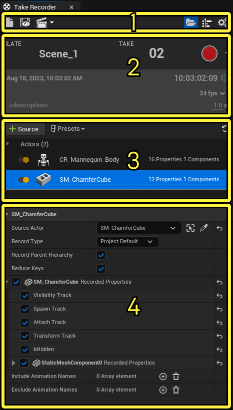
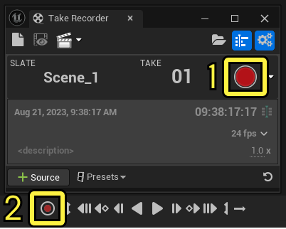
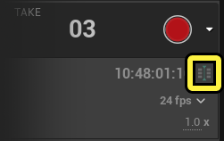
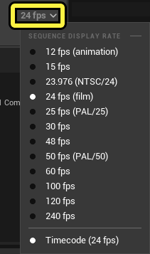
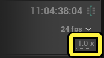
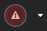
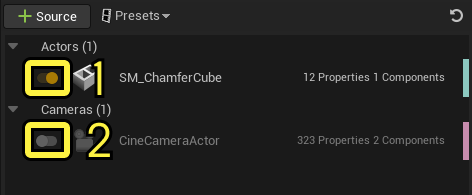
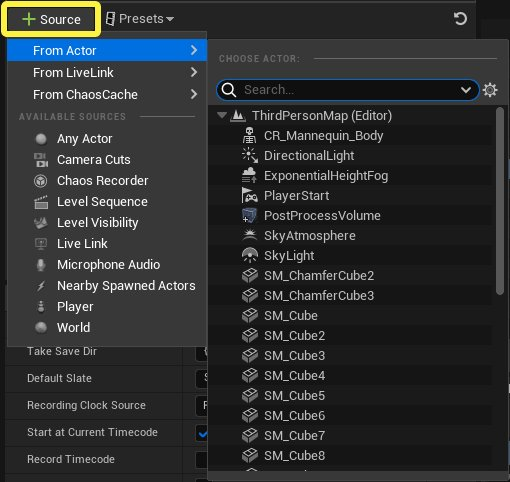

# Take Recorder

> 路径：虚幻引擎5.7文档 / 为角色和对象制作动画 / 过场动画和Sequencer / Sequencer概述 / Take Recorder

> 原始页面：https://dev.epicgames.com/documentation/unreal-engine/take-recorder-in-unreal-engine

**Take Recorder** 可以直接将Gameplay动画、现场表演和其他源录制到虚幻引擎中。通过在Sequencer中录制和管理镜头试拍，你可以在虚拟制片中实现高度迭代的工作流程。

## 常见用法

**Take Recorder** 的一些主要用例和功能如下：

- 动画录制（Animation Recording）

  ：录制游戏世界中角色或对象的动画和动作。这样你可以直接在关卡中操控角色来创建自定义动画。
- 摄像机录制

  ：捕获摄像机移动、角度和焦距。这适合用于为游戏内和非游戏过场动画创建动态摄像机镜头。
- Sequencer

  集成：与虚幻引擎的

  Sequencer

  无缝集成，后者是基于时间轴的过场动画编辑工具。此集成可以直接在Sequencer中使用录制的镜头试拍，用于进一步编辑与合成。
- 多个镜头试拍

  ：为相同场景或操作创建多个镜头试拍。这样你可以灵活地尝试不同的变体或表演，而不必从头开始重新录制一切。
- 非破坏性工作流程

  ：非破坏性工作流程可确保你的原始动画和Gameplay数据保持不变，这样你做出更改和调整后不会丢失之前的录制文件。
- 元数据支持

  ：与录制的镜头试拍一起存储元数据。此元数据可以包括角色名称、镜头说明和其他相关信息，这有助于整理和管理你的录制文件。
- 表演捕获支持

  ：对于高级设置，Take Recorder支持动作捕获（MoCap）系统之类的表演捕获解决方案，可使用外部硬件录制高质量的角色动画。
- 实时录制

  ：根据你的硬件和设置，Take Recorder可以实时操作，支持Gameplay期间对录制的表演立即进行反馈。

## 先决条件

- Take Recorder

  一种

  插件

  ，启用后才能使用。在主菜单中前往

  编辑（Edit）> 插件（Plugins）

  ，找到

  Take Recorder

  ，点击复选框启用。你需要重启虚幻引擎才能启用插件。Take Recorder需要此插件才能正常运行。
- 要根据动作捕获和其他现场表演录制动画，你可以选择启用

  Live Link

  。从主菜单前往

  编辑（Edit）> 插件（Plugins）

  ，找到

  Live Link）

  ，点击复选框启用。你需要重启虚幻引擎才能启用插件。
- 你还需要一个项目，其中包含要录制的可操作角色和Actor。你也可以使用通过

  第三人称模板

  创建的项目。

## 打开Take Recorder

要开始使用 **Take Recorder** ，请点击 **窗口（Window）> 过场动画（Cinematics）> Take Recorder** ，这将打开Take Recorder面板。如果尚未打开序列，Take Recorder会打开新的空序列。 新序列的时间显示设置为与Take Recorder的时间显示相匹配的时间码。

## 界面概述

**Take Recorder** 用户界面主要有四个分段：

1. 工具栏（Toolbar）

   ：

   Take Recorder

   工具栏宝包含多个按钮和开关，用于控制Sequencer集成、镜头试拍浏览、选项显示和

   用户/项目设置

   。
2. Slate

   ：Slate分段显示有关待定镜头试拍和时间码的信息。指定镜头试拍名称、镜头试拍编号，设置标识帧，调整每秒帧数（fps），添加有关镜头试拍的说明，并设置录制速度。

   开始录制（Start Recording）

   按钮位于此处，用于启动镜头试拍录制。
3. 源（Sources）

   ：源分段包含的选项用于指定要录制到序列中的源。源可以从关卡中的Actor捕获，也可以从Live Link会话、其他序列、麦克风或世界状态捕获。
4. 细节（Details）

   ：细节分段包含

   Take Recorder

   的用户和项目设置，以及源的设置。

### 工具栏

**Take Recorder** 工具栏包含多个按钮和开关，用于控制Sequencer集成、镜头试拍浏览和选项显示。

| 名称 | 图标 | 说明 |
| --- | --- | --- |
| **清除待定镜头试拍（Clear Pending Take）** | 清除待处理镜头试拍 | 将当前打开的序列恢复为空的待定序列。删除 **录制到序列（Record to Sequence）** 按钮中指定的全部序列。 |
| **审核上次录制（Review Last Recording）** | 审核上次录制 | 打开最近录制的序列。创建录制文件之后，才可点击。 |
| **录制到序列（Record to Sequence）** | 录制到序列 | 打开下拉菜单，你可以在其中指定要将镜头试拍录制到的另一个序列。点击"清除待定镜头试拍（Clear Pending Take）"按钮，即可将其清除。 录制到序列 |
| **镜头试拍浏览器（Takes Browser）** | 镜头试拍浏览器 | 打开内容浏览器窗口，用于找到保存的镜头试拍。使用列视图模式时，将显示与镜头试拍相关的元数据信息。 镜头试拍浏览器 |
| **显示/隐藏序列（Show / Hide Sequence）** | 显示/隐藏序列 | 显示或隐藏用于设置此镜头试拍的关卡序列。 |
| **设置（Settings）** | 设置 | 在Take Recorder的细节区域显示或隐藏项目和用户设置。 |
| **返回（Return）** | 返回 | 在审核之前的镜头试拍时，返回到待定镜头试拍序列。在审核之前的录制文件时，可访问此功能。 |
| **Slate信息锁定（Slate Info Lock）** | Slate信息锁定 | 在审核之前的镜头试拍时，锁定或解锁修改Slate的能力。在审核之前的录制文件时，可访问此功能。 |
| **开始新录制（Start New Recording）** | 开始新录制 | 使用当前所选镜头试拍作为基础，开始新的录制。审核上次录制时，可访问此功能。 |

### Slate

**Slate** 区域显示有关当前待定镜头试拍、当前时间和录制功能的信息。点击 **Slate** 或 **镜头试拍（Take）** 文本字段并修改文本，为Slate和镜头试拍编号设置自定义名称和数字条目。在Slate主体中点击 **\** 字段也可以自定义。

> [!NOTE]
> 面板初始加载时， **Take Recorder** 未运行。当前时间码显示运行中的时间码提供程序（默认为UE的时间码提供程序）中的当前时间。请参阅[Take Recorder](#take%20recorder)分段中的 **录制时钟源（Recording Clock Source）** ，获取时间码选项。

要开始新录制，请点击Take Recorder窗口或Sequencer播放功能按钮中的红色 **录制（Record）** 按钮。使用Sequencer的录制按钮会开始将选定的Actor录制到当前序列中，且无需开启Take Recorder窗口。再次点击该按钮或按Esc键可停止录制，并保存当前镜头试拍。

1. Take Recorder

   窗口录制按钮。
2. Sequencer

   录制按钮。

在录制会话期间，点击 **添加标记的帧（Add Marked Frame）** 按钮，可将自定义标识添加到录制文件的当前时间。

点击 **每秒帧数（Frames Per Second）** （fps）菜单，系统将弹出包含不同帧率的下拉列表，你可在此为你的待定镜头试拍选择帧率。

编辑 **录制速度（Record Speed）** 数字，即可更改引擎的录制速度和总体时间膨胀。这在录制到填充的序列时很有用，可使动画以更慢的速度播放，确保你能够以更舒适的节奏观察和匹配动画。

#### 警告

如果你没有可供录制的有效源，或者如果你尝试将镜头试拍命名为与之前录制的镜头试拍相同的名称， **Take Recorder** 会显示警告信息。

如果你没有可供录制的有效源，录制按钮会变为无效源图标。确保你选择了可录制的源之后再尝试进行录制。

如果你尝试使用与之前镜头试拍相同的编号， **Take Recorder** 会发出警告，称已存在有相同编号的镜头试拍，并告诉你之前的镜头试拍在哪里。如果你点击该警告，系统会自动将镜头试拍编号更改为下一个可用的镜头试拍编号。

### 源

**源（Source）** 分段是你指定录制源的地方。源在此处列出，并可以从录制文件启用或禁用。 启用源后，开关图标为橙色。禁用源后，开关图标为灰色。

1. 启用的源
2. 禁用的源

每个源在 **源（Source）** 面板中的最右端还有一个颜色条。每个源的颜色对应于录制的子序列。

> [!NOTE]
> **Take Recorder** **仅当** 源有以下两项时才会录制源。源有录制器 **和** Sequencer可以播放的对应轨道。
>
> 例如，可以设为关键帧的轨道都可以录制。如果Actor的某个属性无法设为关键帧，它将无法录制。

要添加源，请点击 **+源（Source）** 并从可用源列表中选择。你可以从以下选项中选择：

- 关卡中的

  任意Actor（Any Actor）
- 镜头切换（Camera Cuts）
- 关卡序列（Level Sequences）
- Live Link
- 一个或多个

  麦克风（microphones）
- 附近生成的Actor（Nearby Spawned Actors）
- 一个

  玩家（Player）

  Actor
- 世界（World）

  /

  关卡资产（Level assets）

> [!NOTE]
> 将Actor从 **[大纲视图（Outliner）](../../../../building-virtual-worlds/level-editor/outliner/index.md)** 拖入 **源面板（Source panel）** 中，即可将源添加到 **Take Recorder** 。

| 源 | 说明 |
| --- | --- |
| **任意Actor（Any Actor）** | **Take Recorder源（Take Recorder Source）** 根据世界的属性录制Actor。录制Actor的属性和Actor上的组件，并安全地处理生成的新组件和销毁的Actor。 若选择 **任意Actor（Any Actor）** 作为源，会使用以下详情创建Actor源。 **源Actor（Source Actor）** ：世界中引用的Actor。 录制类型： 指定将Actor录制为 **[可生成对象或可持有对象（Spawnable or Possessable）](https://dev.epicgames.com/documentation/404)** 。 **项目默认值（Project Default）** ：根据项目的默认设置，将录制类型设置为可持有对象或可生成对象。设置[Take Recorder设置](#%E7%94%A8%E6%88%B7%E5%92%8C%E9%A1%B9%E7%9B%AE%E8%AE%BE%E7%BD%AE)中的"录制到可持有对象"字段中的值（true或false）。 **可持有对象（Possessable）** ：覆盖Take Recorder设置，并将镜头试拍资产录制为可持有对象。 **可生成对象（Spawnable）** ：覆盖Take Recorder设置，并将镜头试拍资产录制为可生成对象。 **录制父层级（Record Parent Hierarchy）** ：此Actor附加到父级时是否同时包括父层级。 如果 **禁用** 此项，而你要录制到 **可持有对象Actor** ，则生成的变换在本地空间中，因为此Actor仍附加到父级。 如果 **禁用** 此项，而你要录制到 **可生成对象Actor** ，则生成的变换在全局空间中，因为该Actor是生成的副本，并未附加到任何对象。 **减少关键帧（Reduce Keys）** ：启用后，录制完成后，这会对所有关键帧执行[简化](../animation-curve-editor/index.md#%E7%AE%80%E5%8C%96)操作。 **录制的属性（Recorded Properties）** ：此Actor和组件中可以启用或禁用的默认属性列表。如果禁用属性，录制完成后，不会将该属性纳为轨道。 **包括动画名称（Include Animation Names）** ：这是一个数组，其中你指定要包括在录制文件中的[曲线](../../../skeletal-mesh-animation-system/animation-assets-and-features/animation-sequences/animation-curves/index.md)名称。如果你使用条目填充此数组，只会包括骨骼或曲线。例如，如果你指定"root"，则只会录制根骨骼。 **排除动画名称（Exclude Animation Names）** ：这是一个数组，你可在其中指定要从录制中排除的骨骼或曲线名称。 任意Actor面板的源 |
| **镜头切换（Camera Cuts）** | 如果 **镜头切换（Camera Cuts）** 添加为源， **Take Recorder** 会录制会话期间的所有活动摄像机。只要活动摄像机发生更改，就会创建新的摄像机Actor和镜头切换分段。 |
| **关卡序列（Level Sequence）** | 若选择 **关卡序列（Level Sequence）** 作为源，可提供要在录制会话期间播放的其他序列。从此源的细节区域指定要播放的序列数量。在Gameplay或模拟会话中的录制期间支持仅播放序列。 **要触发的关卡序列（Level Sequences to Trigger）** ： 用于选择一个或多个关卡序列的选项。 关卡序列的源 |
| **关卡可视性（Level Visibility）** | **关卡可视性（Level Visibility）** 源会在录制开始时录制所有关卡的可视性状态。它不会录制关卡更改，仅录制可见状态。它不会录制在录制会话期间发生的更改。 |
| **Live Link** | **Live Link** 连接到当前活动的所有Live Link会话。Live Link会话必须在 **主题名称（Subject Name）** 细节字段中指定。找到 **添加源（Add Source (+)）> 从Live Link（From Live Link）** ，直接选择Live Link会话。 **减少关键帧（Reduce Keys）** ：启用后，录制完成后，这会对所有关键帧执行[简化](../animation-curve-editor/index.md#%E7%AE%80%E5%8C%96)操作。 **主题名称（Subject Name）** ：要录制的主题的名称。 **保存主题设置（Save Subject Settings）** ：使用Live Link时切换为保存主题设置。如果你想保留Live Link Actor的预处理器、平移和插值设置，请启用此选项。 **使用源时间码（Use Source Timecode）** ：切换为在录制时使用主题的时间码或系统时间。 如果启用此选项，将使用Live Link主题的时间码，即使它不匹配UE的时间码。 如果禁用此选项，数据会在LiveLink线程而不是游戏线程上设为关键帧。对于使用引擎的时间到达的每个样本，将标记一个关键帧。不会创建时间码轨道，因此源的时间码与录制的关卡序列之间的关系会丢失。 **在开始之前废弃样本（Discard Samples Before Start）** ：如果启用，并且启用了 **[在当前时间码开始](#%E5%9C%A8%E5%BD%93%E5%89%8D%E6%97%B6%E9%97%B4%E7%A0%81%E5%BC%80%E5%A7%8B)** ，UE会废弃使用在录制之前发生的时间码的Live Link样本。 Live Link的源 |
| **麦克风音频（Microphone Audio）** | **麦克风音频（Microphone Audio）** 允许在录制会话期间录制你的设备的麦克风。完成后， **Take Recorder** 会创建一个声音文件，其中包含你录制的音频。细节区域包含音频录制、轨道名称和录制目录的设置。 **音频增益（Audio Gain）** ： 要应用于所录音频的增益，以分贝为单位。 **替换所录音频（Replace Recorded Audio）** ：将现有所录音频替换为新录制的音频。默认情况下启用。 **音频输入设备（Audio Input Device）** ：此源的细节面板中当前选择的通道。 **音频源名称（Audio Source Name）** ：音频源的名称 **音频轨道名称（Audio Track Name）** ：录制的音频轨道的名称 **音频资产名称（Audio Asset Name）** ：音频资产的名称。支持在录制时替换的以下所有格式说明符： **{day}** ：录制开始时的时间戳的号数。 **{month}** ：录制开始时的时间戳的月份。 **{year}** ：录制开始时的时间戳的年份。 **{hour}** ：录制开始时的时间戳的小时。 **{minute}** ：录制开始时的时间戳的分钟。 **{second}** ：录制开始时的时间戳的秒。 **{take}** ：镜头试拍编号。 **{slate}** ：Slate字符串。 **音频子目录（Audio Sub Directory）** ：音频保存到的子目录的名称。将此字段留空可放置在与序列基本路径相同的目录中。支持在录制时替换的以下所有格式说明符： **{day}** ：录制开始时的时间戳的号数。 **{month}** ：录制开始时的时间戳的月份。 **{year}** ：录制开始时的时间戳的年份。 **{hour}** ：录制开始时的时间戳的小时。 **{minute}** ：录制开始时的时间戳的分钟。 **{second}** ：录制开始时的时间戳的秒。 **{take}** ：镜头试拍编号。 **{slate}** ：Slate字符串。 麦克风音频的源 |
| **附近生成的Actor（Nearby Spawned actors）** | **附近生成的Actor（Nearby Spawned Actors）** 源将录制位于距离摄像机位置在指定半径之内的所有生成的Actor。细节面板包括用于定义范围和指定筛选器的选项。如果你要使用筛选器，只有筛选的Actor才会添加到镜头试拍。只会添加在Gameplay会话期间生成的Actor。已经生成的Actor不受影响。 **生成距离（Spawn Proximity）** ：Actor必须在与当前摄像机相距多远时生成，才能录制为可生成对象。如果距离设置为0厘米，将录制所有生成的Actor。 **筛选的生成的Actor（Filtered Spawned Actors）** ：仅筛选器类型列表中列出的录制Actor。默认为禁用。 **筛选器类型（Filter Types）** ：要应用于生成的Actor的筛选器类型。 附近生成的Actor的源 |
| **玩家（Player）** | **玩家（Player）** 源录制玩家控制的Actor。如果你的玩家是动态生成的，在Gameplay开始之后才作为Actor存在于关卡中，使用此源可能很有用。 |
| **世界（World）** | 如果 **世界（World）** 添加为源，关卡中的所有内容都会录制（默认为true）。使用 **Spawn Emitter** 函数创建的粒子仅在使用此源时捕获。 |

你可以将源列表保存为预设，以后进行复用。要保存你的源列表，请执行以下操作：

1. 点击源面板旁边的

   预设（Presets）

   按钮。
2. 选择

   保存为预设（Save As Preset）

   。
3. 保存镜头试拍预设（Save Take Preset）

   窗口会显示，并提示你选择

   路径（Path）

   位置（此预设保存到的文件夹）和预设的

   名称（Name）

   。
4. 点击

   保存（Save）

   按钮保存你的预设。

> 图片已省略：保存源预设

**预设（Presets）** 菜单将列出所有保存的预设。

从列表删除所有源，或点击 **恢复（Revert）** 按钮恢复为预设的选择。将显示一条警告消息，确认你是否确定要恢复更改。如果你想废弃更改，请点击"是（Yes）"。

> 图片已省略：删除所有源

### 细节

**Take Recorder** 的细节区域包含你的源以及Take Recorder的项目属性和设置。点击工具栏中的 **设置（Settings）** 按钮，即可将其启用。在此处为源指定默认设置时，这些设置会传播到源。你仍可以从项目自定义个别源。

> 图片已省略：Take Recorder的细节面板

"麦克风音频录制器的音频子目录"属性覆盖Take Recorder细节面板中的"麦克风音频源的音频子目录"的示例。

#### 用户和项目设置

启用"显示/隐藏通用用户和项目设置"按钮（右上角的齿轮图标），可找到以下 **用户和项目设置** 。

##### Take Recorder

| 名称 | 说明 |
| --- | --- |
| **镜头试拍保存根目录（Root Take Save Dir）** | 所录镜头试拍要保存到的根目录。点击省略号图标（三个点）可选择不同的文件夹。 |
| **镜头试拍保存目录（Take Save Dir）** | 相对于根目录的子目录，用于进一步整理保存的镜头试拍。支持以下全部格式标记，录制镜头试拍时将替换这些标记： **{day}** ：录制开始时的时间戳的号数。 **{month}** ：录制开始时的时间戳的月份。 **{year}** ：录制开始时的时间戳的年份。 **{hour}** ：录制开始时的时间戳的小时。 **{minute}** ：录制开始时的时间戳的分钟。 **{second}** ：录制开始时的时间戳的秒。 **{take}** ：镜头试拍编号。 **{slate}** ：Slate名称。 |
| **默认Slate（Default Slate）** | Slate的项目默认名称。 |
| **录制时钟源（Recording Clock Source）** | 录制时要使用的时钟源。从以下选项中选择： **更新（Tick）** ：将默认世界更新增量用于计时。此模式会响应世界和Actor暂停状态，但容易受累积错误影响。 **平台（Platform）** ：将平台的时钟用于计时。此模式不响应世界和Actor暂停状态。 **音频（Audio）** ：将音频时钟用于计时。此模式不响应世界和Actor暂停状态。 **相对时间码（Relative Timecode）** ：将相对于时间码提供程序的时间用于计时。此模式不响应世界和Actor暂停状态。 **时间码（Timecode）** ：将当前时间码提供程序用于计时。此模式不响应世界和Actor暂停状态。 **播放每帧（Play Every Frame）** ：这是一种调试模式，其中每个帧会保持长达 **Sequencer.SecondsPerFrame** 的挂钟秒，然后再推进到下一个帧。此模式不响应世界和Actor暂停状态及时间膨胀。音频没有同步。 **自定义（Custom）** ：在外部创建和定义的自定义时钟源。 |
| **在当前时间码开始** | 如果启用，录制将在Slate中描述的当前日期的时间码开始。否则，将在时间0开始录制。 |
| **录制时间码（Record Timecode）** | 如果启用，会将时间码元数据写入每个Actor的每个轨道分段。要查看此信息，可以右键点击轨道分段，并找到 **属性（Properties）> 分段（Section）> 分段范围开始/结束（Section Range Start/End）** 。 |
| **将源录制到子序列（Record Sources Into Sub Sequences）** | 如果启用，每个源会录制到单独的序列，并嵌入通过子场景轨道链接到它们的根序列中。如果禁用，所有源会录制到根序列中，并且你不能使用序列镜头试拍UI在特定源的各个镜头试拍之间切换。你仍可以在序列之间复制和粘贴来实现操作。 |
| **录制到可持有（Record to Possessable）** | 如果启用，将所有Actor录制到可持有类型的轨道，而不是可生成类型的轨道。这会逐Actor源进行覆盖。 |
| **默认轨道（Default Tracks）** | 指定Actor类及其组件，以便录制会话期间始终会捕获这些组件。 |
| **显示通知（Show Notifications）** | 在录制之前和期间显示或隐藏Take Recorder通知。 录制开始之前的录制通知 |

##### 电影场景镜头试拍设置

指定小时、分钟、秒、帧、子帧和Slate的项目名称。这会影响在 **镜头试拍轨道（Takes Track）** 中为Actor创建的轨道的名称。

| 名称 | 说明 |
| --- | --- |
| **小时名称（Hours Name）** | 默认为TCHour。 |
| **分钟名称（Minutes Name）** | 默认为TCminute。 |
| **秒名称（Seconds Name）** | 默认为TCSecond。 |
| **帧名称（Frames Name）** | 默认为TCFrame。 |
| **子帧名称（Sub Frames Name）** | 默认为TCSubframe。 |
| **状态名称（State Name）** | 默认为TCSlate。 |

##### 麦克风音频录制器

| 名称 | 说明 |
| --- | --- |
| **音频源名称（Audio Source Name）** | 音频源的名称。用于设置源的名称。接受 **{channel}** 标记，这将替换为 **音频输入设备（Audio Input Device）** 通道菜单中分配的通道编号。请注意，为了确保此名称唯一，如果不存在{channel}标记，UE可能会附加通道编号。 |
| **音频轨道名称（Audio Track Name）** | 录制的音频轨道的名称。 |
| **音频资产名称（Audio Asset Name）** | 音频资产的名称。支持在录制时替换的以下所有格式说明符： **{day}** ：录制开始时的时间戳的号数。 **{month}** ：录制开始时的时间戳的月份。 **{year}** ：录制开始时的时间戳的年份。 **{hour}** ：录制开始时的时间戳的小时。 **{minute}** ：录制开始时的时间戳的分钟。 **{second}** ：录制开始时的时间戳的秒。 **{take}** ：镜头试拍编号。 **{slate}** ：Slate字符串。 |
| **音频子目录（Audio Sub Directory）** | 音频保存到的子目录的名称。将此字段留空可放置在与序列基本路径相同的目录中。支持在录制时替换的以下所有格式说明符： **{day}** ：录制开始时的时间戳的号数。 **{month}** ：录制开始时的时间戳的月份。 **{year}** ：录制开始时的时间戳的年份。 **{hour}** ：录制开始时的时间戳的小时。 **{minute}** ：录制开始时的时间戳的分钟。 **{second}** ：录制开始时的时间戳的秒。 **{take}** ：镜头试拍编号。 **{slate}** ：Slate字符串。 |

##### 音频输入设备

| 名称 | 说明 |
| --- | --- |
| **使用系统默认音频设备（Use System Default Audio Device）** | 使用系统选择的音频设备的选项。启用后，Take Recorder将回退到主机操作系统中选择的音频设备。 |
| **音频输入设备（Audio Input Device）** | 如果禁用 **使用系统默认音频设备（Use System Default Audio Device）** 开关，请在主机计算机上选择可用的音频设备。用于设置在录制此源的音频时要使用的音频设备的物理通道。 |
| **音频输入缓冲区大小（Audio Input Buffer Size）** | 将用于缓存所捕获的音频的缓冲区的大小，以样本为单位。缓冲区较大可防止数据溢出，但会消耗更多内存。 |

##### 动画录制器

| 名称 | 说明 |
| --- | --- |
| **动画轨道名称（Animation Track Name）** | 录制的动画轨道的名称。 |
| **动画资产名称（Animation Asset Name）** | 保存的动画序列的名称。 |
| **动画子目录（Animation Sub Directory）** | 动画序列保存到的子目录的名称。如果这为空，则序列保存到镜头试拍保存根目录。 |
| **删除根骨骼动画（Remove Root Animation）** | 如果启用，骨骼网格体将基于变换轨道移动。如果禁用，动作将在动画序列中的根骨骼上发生。 |
| **时间码骨骼方法（Timecode Bone Method）** | 用于录制[骨骼网格体上的时间码](#%E5%BD%95%E5%88%B6%E6%97%B6%E9%97%B4%E7%A0%81)的功能按钮。 **全部（All）** ：将骨架中的每个骨骼上的时间码元数据录制为[动画属性](../../../skeletal-mesh-animation-system/animation-assets-and-features/animation-sequences/fbx-attributes/index.md)。 **根骨骼（Root）** ：录制骨架层级中最顶层的骨骼上的时间码元数据。在大部分情况下，这是"根"骨骼。 **用户定义（User Defined）** ：录制骨骼名称属性中指定的骨骼上的时间码元数据。 |

##### 世界录制器

| 名称 | 说明 |
| --- | --- |
| **录制世界设置（Record World Settings）** | 是否录制序列中的世界设置Actor。一些项目使用此项来附加世界音效。 |
| **自动轨道Actor（Autotrack Actors）** | 为未显式录制的所有Actor添加绑定和轨道。 |

##### 用户设置

| 名称 | 说明 |
| --- | --- |
| **最大化视口（Maximize Viewport）** | 在录制期间启用[沉浸式模式](https://dev.epicgames.com/documentation/unreal-engine/using-editor-viewports-in-unreal-engine#%E6%B2%89%E6%B5%B8%E5%BC%8F%E6%A8%A1%E5%BC%8F)。 |
| **倒计时（Countdown）** | 按"录制（Record）"按钮后，Take Recorder会对此处列出的时间秒数完成倒计时，然后再开始录制会话。 |
| **引擎时间膨胀（Engine Time Dilation）** | 要应用于录制会话的时间膨胀量。 |
| **在播放结束时停止（Stop at Playback End）** | 录制在到达序列的结束时间时停止。在新序列上，结束时间默认为5秒。 |
| **删除冗余轨道（Remove Redundant Tracks）** | 默认情况下，Take Recorder会录制源中所有可能的轨道。启用此选项时，录制文件只会保留有更改的轨道。 |
| **减少关键帧公差（Reduce Keys Tolerance）** | 减少录制期间创建的关键帧时使用的公差。如果这些数字包含的值差不超出公差值，那么数值越大，要删除的关键帧就越多。 |
| **保存录制的资产（Save Recorded Assets）** | 完成录制时自动保存录制的序列和子场景。如果不保存，这些资产会丢失。 |
| **自动锁定（Auto Lock）** | 录制会话结束后，锁定镜头试拍以防止编辑。在 **[Sequencer工具栏](../sequencer-editor/sequencer-cinematic-toolbar/index.md)** 中切换锁定按钮，即可解锁镜头试拍。 |
| **自动序列化（Auto Serialize）** | 一边录制一边存储捕获数据，而不是在录制结束时一次性存储全部数据。 这是试验性的功能，使用时风险自担，因为它尚未经过充分测试。 |
| **预设保存位置（Preset Save Location）** | 源预设文件要保存到的目录。 |

### 录制时间码

**Take Recorder** 可以录制时间码元数据。它提供了一些功能按钮，用于录制相对于场景、单独Actor和骨骼网格体骨骼的时间码。这适合用于相对于相同镜头试拍中的其他表演来更改表演，同时维持其他时间码值。

对于摄像机和非骨骼网格体Actor，录制的时间码信息显示在子序列中的 **镜头试拍轨道（Take Track）** 下。

> 图片已省略：时间码元数据的示例

录制后，在[动画序列](../../../skeletal-mesh-animation-system/animation-assets-and-features/animation-sequences/index.md)时间轴中的 **属性（Attributes）** 轨道下查看骨骼网格体时间码数据。

### 查看子场景和资产

双击 **子场景（subscene）** 分段，打开Actor的序列并查看录制的关键帧，例如变换和动画。

> 图片已省略：打开子场景

## 编辑镜头试拍

有两种方式可在录制之前或之后解锁镜头试拍，以便编辑录制的数据：禁用 **自动解锁（Auto Lock）** ，或解锁序列。

如果你确定要在录制之后编辑镜头试拍，请在录制之前禁用自动锁定。

1. 在

   Take Recorder

   中，显示

   用户/项目设置

   （齿轮图标）。
2. 在用户设置中，禁用

   自动锁定（Auto Lock）

   。
3. 完成镜头试拍录制。
4. 在

   Sequencer

   中审核镜头试拍，注意所有录制的源都没有显示为灰色，然后根据需要进行编辑。

如果你需要在录制之后编辑镜头试拍，请点击 **Sequencer** 中的 **锁定（Lock）** 按钮将其解锁。

> 图片已省略：解锁序列以编辑录制的数据
