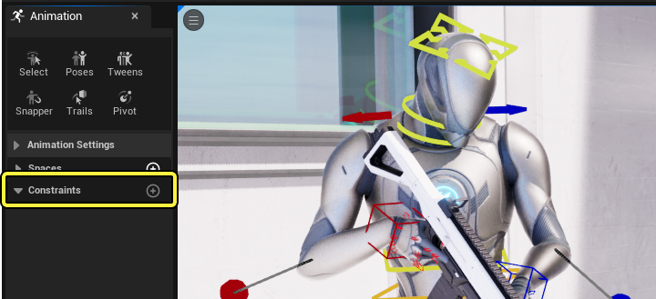
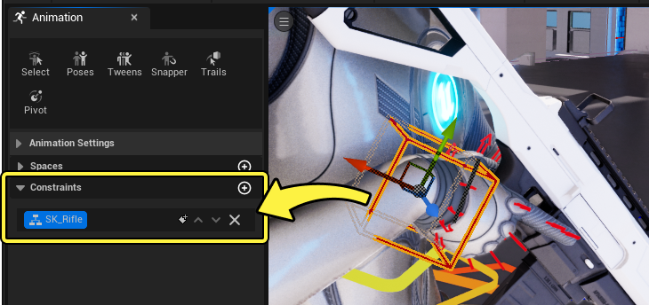
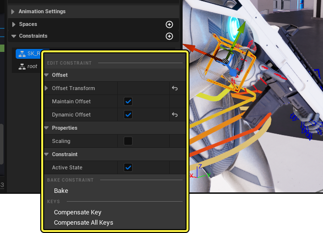
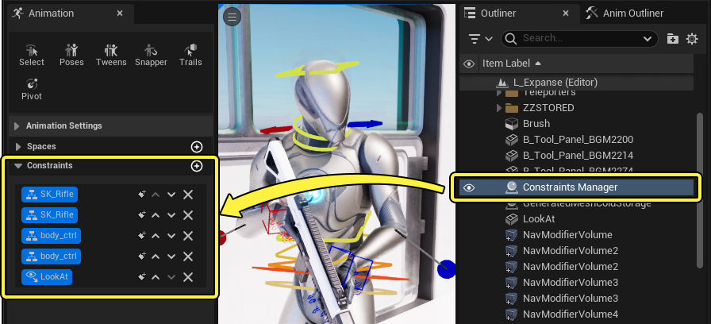
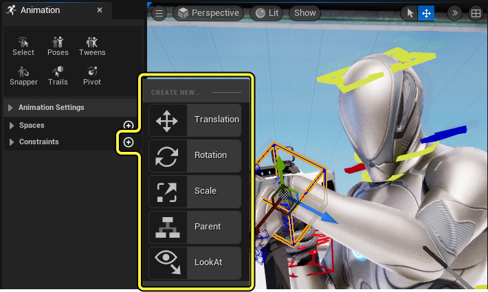
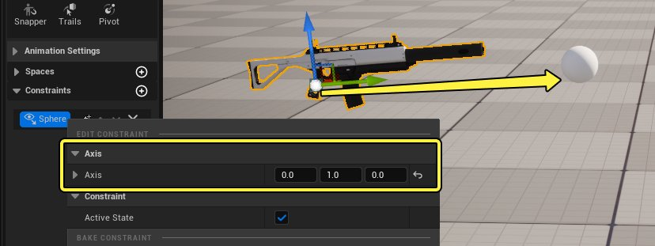

# 约束

> 路径：虚幻引擎5.7文档 / 为角色和对象制作动画 / 控制绑定 / 使用控制绑定实现动画效果 / 约束

> 原始页面：https://dev.epicgames.com/documentation/unreal-engine/animation-constraint-tools-in-unreal-engine

动画过程中，可能在一些情况下你需要将元素附加到一起，而不在大纲视图或控制点层级中造成更改。这种附加称为 **约束** 。虚幻引擎中的约束分解为不同的方法：**位置（Position）** 、 **旋转（Rotation）** 、 **缩放（Scale）** 、 **父节点（Parent）** 和 **LookAt** 。通过这些方法，你可以设置选项来控制这些约束的运作方式，例如控制附加偏移和将约束烘焙回法线关键帧。

本文档概述了Sequencer中的约束，以及每种约束方法的不同工作流程。

#### 先决条件

- 你已经创建

  控制绑定资产（Control Rig Asset）

  。有关如何执行此操作的信息，请参阅

  控制绑定快速入门指南

  页面。
- 动画过程中的约束通过

  动画模式

  面板访问，因此需要启用

  动画模式（Animation Mode）

  。
- 约束主要依赖于使用在

  Sequencer

  中使用控制绑定，因此需要具备Sequencer的

  基础知识

  。

## 创建约束

- 在启用

  动画模式

  后，约束信息以及用于添加约束的工作流程位于"动画（Animation）"面板中。

约束通过在两个或更多对象之间创建 **父子（Parent - Child）** 关系来建立。要创建新约束，首先选择你想约束的控制点（子），然后点击 **添加约束（Add Constraint (+)）** 并选择约束类型。你的光标会变为滴管工具，可用于在视口中选择要约束到的对象（父）。

> 动图已省略：创建约束

> [!NOTE]
> 约束不限于控制绑定元素，你可以约束任意对象或Actor。此外，无需打开Sequencer就可以约束Actor。

创建约束后，你可以在受约束控制点的Sequencer中查看其关键帧信息。大部分约束还将创建补偿性关键帧，以在约束激活时维护子节点的当前视觉位置。这些补偿性关键帧链接到约束关键帧，如果你更改了时序，会遵循约束关键帧。

> 动图已省略：约束关键帧

## 约束用法

选择受约束控制点时，你的约束还可以在动画面板的 **约束（Constraints）** 分段中查看。这里你可以创建新的约束关键帧，编辑约束的属性，并将约束烘焙回法线关键帧。

如果你将多个约束应用于某个对象，它们也会显示在此处。播放或推移序列时，每个约束通过在变为活动或非活动状态时高亮显示来表示其状态。

> 动图已省略：约束切换

约束条目的按钮提供了以下功能：

| 按钮 | 说明 |
| --- | --- |
|  | 在Sequencer中的当前时间创建约束的活动关键帧。如果约束已经处于活动状态，将改为创建停用关键帧。此我还会创建补偿性关键帧，以在受约束对象上维护相同的世界位置 |
|  | 如果同一个对象上有多个约束，这些按钮会在列表中将约束上移或下移。虚幻引擎中的约束是分层的，会覆盖列表中更高位置的其他约束（仅当这些约束对相同通道制作动画时）。新约束始终优先于旧约束，并且放在列表中较低位置。 由于约束可以被覆盖，因此并非总是需要停用其他约束。例如，由于[父节点约束](#%E7%88%B6%E8%8A%82%E7%82%B9%E7%BA%A6%E6%9D%9F)对控制点的所有变换通道制作动画，所以只要激活的约束有更高优先级，只需激活这一个约束就足以实际上停用其他全部约束。在此例子中，虽然两个约束都处于活动状态，但只有 **根** 约束提供了约束效果，因为它在列表中更低位置，拥有更高优先级 |
|  | 移除此约束。 |

右键点击约束条目将显示上下文菜单，可用于编辑特定于该约束类型的属性，[烘焙](#%E7%83%98%E7%84%99%E7%BA%A6%E6%9D%9F)约束，并设置[补偿性关键帧](#%E8%A1%A5%E5%81%BF%E5%85%B3%E9%94%AE%E5%B8%A7)。

### 烘焙约束

完成约束的动画制作之后，你可以将最终效果烘焙到关键帧。这适合用于恢复到法线关键帧动画，进行进一步编辑，而不必考虑约束。

要烘焙所选控制点，请右键点击约束条目，然后选择 **烘焙（Bake）** 。

> 动图已省略：烘焙约束

### 补偿关键帧

动画过程中，可能在一些情况下约束会在激活或停用时表现出明显的中断。如果你在约束创建之后调整父节点的姿势，常常会发生此情况，这会打破原始补偿性关键帧所提供的视觉匹配。

> 动图已省略：约束中断

要解决此问题，请选择发生问题的控制点，右键点击该约束，然后选择 **补偿关键帧（Compensate Key）** 。你还必须确保Sequencer **播放头（Playhead）** 位于你想修复的约束关键帧所在时间。这将为父对象的新位置重新创建新的补偿性关键帧。

> 动图已省略：修复约束中断

> [!NOTE]
> **补偿关键帧（Compensate Keys）** 可用于解决单个约束的错误，而 **补偿所有关键帧（Compensate All Keys）** 也可以用于为序列中每个受约束控制点重新创建所有补偿性关键帧，无论选择内容或播放头位置如何。

### 动态偏移

默认情况下，你可以对受约束对象以及影响它的约束设定关键帧。如果你想禁用此选项，不允许子对象制作动画，请右键点击该约束，然后禁用 **动态偏移（Dynamic Offset）** 。这会将受约束对象的位置锁定在当前变换处，现在它仅在父对象移动时才会移动。

> 动图已省略：动态偏移

### 约束管理器

随着你在关卡序列中约束许多对象，管理和查看你的约束可能变得越来越困难。你可以使用 **约束管理器Actor（Constraints Manager Actor）** 来查看和管理关卡中的所有约束。

首次创建约束时， **约束管理器Actor（Constraints Manager Actor）** 会自动在你的关卡中创建，选择它会将所有使用的约束合并到单个列表中。这样就更容易同时在多个对象上查看和管理大量约束。

## 约束类型

点击 **添加约束（Add Constraint (+)）** 时可以创建以下约束类型：

- 平移约束
- 旋转约束
- 缩放约束
- 父节点约束
- LookAt约束

### 平移约束

**平移约束（Translation Constraints）** 仅沿平移轴约束对象。它遵循父节点位置，但不遵循其旋转或缩放。

> 动图已省略：平移约束

如果从约束上下文菜单禁用了 **维持偏移（Maintain Offset）** ，则受约束对象按绝对坐标遵循父对象位置，而不是相对于创建约束时。

> 动图已省略：平移约束维持偏移

### 旋转约束

**旋转约束（Rotation Constraints）** 仅沿旋转轴约束对象。它遵循父节点旋转，但不遵循其平移或缩放。

> 动图已省略：旋转约束

如果从约束上下文菜单禁用了 **维持偏移（Maintain Offset）** ，则受约束对象按绝对坐标遵循父对象旋转，而不是相对于创建约束时。

> 动图已省略：旋转约束维持偏移

### 缩放约束

**缩放约束（Scale Constraints）** 仅沿缩放轴约束对象。它遵循父节点缩放，但不遵循其平移或旋转。

> 动图已省略：缩放约束

如果从约束上下文菜单禁用了 **维持偏移（Maintain Offset）** ，则受约束对象按绝对坐标遵循父对象缩放，而不是相对于创建约束时。

> 动图已省略：缩放约束维持偏移

### 父节点约束

**父节点约束（Parent Constraints）** 沿所有轴和通道将对象约束到父节点，如同是分层附加的那样。

> 动图已省略：父节点约束

默认情况下，缩放未包含在父节点约束中。要包含缩放，请右键点击约束条目并启用 **缩放（Scaling）** 。

> 动图已省略：在父节点约束中启用缩放

> [!NOTE]
> 与其他约束类型相似，禁用 **维持偏移（Maintain Offset）** 会导致受约束对象按绝对坐标遵循父节点变换，而不是相对于创建约束时。

### LookAt约束

**LookAt约束（LookAt Constraints）** 通过瞄准父节点位置，仅沿旋转轴约束对象。

> 动图已省略：瞄准约束

你可以右键点击约束条目并编辑 **轴（Axis）** 属性来设置子对象的瞄准方向。

不同于其他瞄准类型的附加，LookAt约束不会用尽向量。相反，你可以对 **滚动（roll）** 轴制作动画，手动控制滚动的行为。这还适合用于消除旋转翻转问题，这些问题在其他瞄准类型附加中很常见。

> 动图已省略：瞄准约束滚动无翻转
