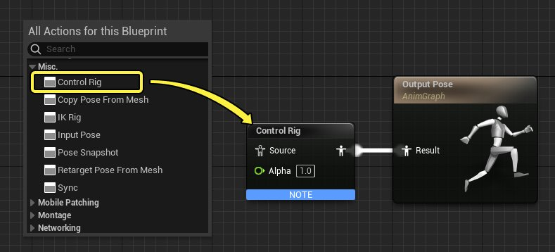
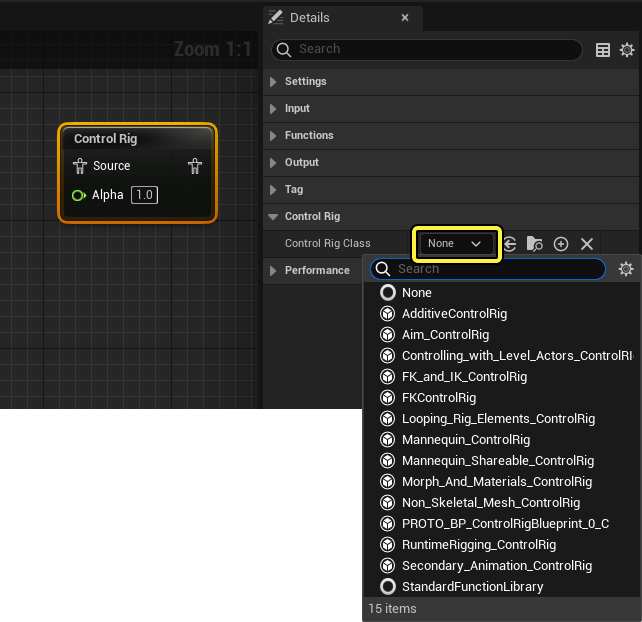
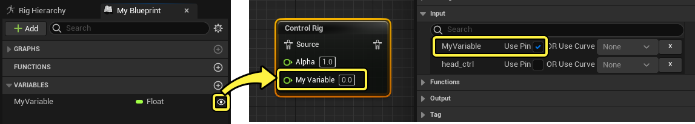
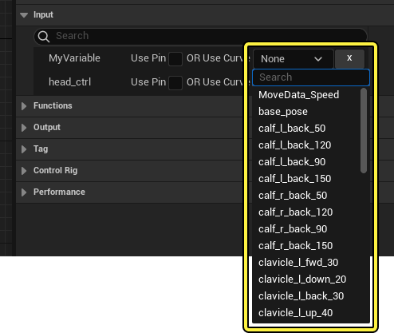
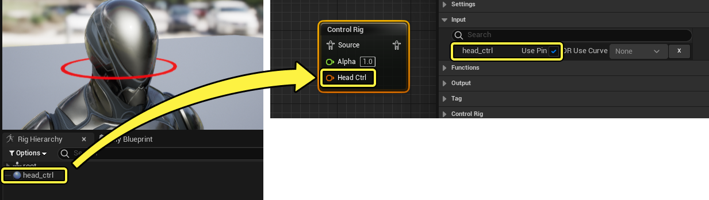

# 在动画蓝图中使用控制绑定

> 路径：虚幻引擎5.7文档 / 为角色和对象制作动画 / 控制绑定 / 使用控制绑定实现动画效果 / 在动画蓝图中使用控制绑定

> 原始页面：https://dev.epicgames.com/documentation/unreal-engine/control-rig-in-animation-blueprints-in-unreal-engine

你可以在[动画蓝图](../../../skeletal-mesh-animation-system/animation-blueprints/index.md)中引用 **控制绑定** ，从而制作能与控制点以及变量交互的动画蓝图逻辑。通常，你需要以这种方式来使用控制绑定，以便对某些控制绑定功能实现程序化的游戏逻辑，例如地面对齐，或者和任意接触点的对齐。

#### 先决条件

- 你已经为 **骨架网格体（Skeletal Mesh）** 创建了 **控制绑定资产（Control Rig Asset）** 。有关如何执行此操作的信息，请参阅 **[控制绑定快速入门指南](../../how-to-create-control-rigs/index.md)** 页面。
- 你已经为同一骨架网格体创建了 **动画蓝图资产（Animation Blueprint Asset）** 。有关如何执行此操作的信息，请参阅 **[动画蓝图](../../../skeletal-mesh-animation-system/animation-blueprints/index.md)** 页面。

## 控制绑定蓝图节点

你需要使用 **控制绑定节点（Control Rig node）** 在动画蓝图中访问控制绑定内容。右键点击 **动画图表（Anim Graph）** 并选择 **杂项 > 控制绑定（Misc > Control Rig）** 可添加此节点。务必要连接引脚，将源输出连接到结果姿势。

接下来，你需要指定合适的 **控制绑定类（Control Rig Class）** 。为此，你需要选择节点，找到 **细节（Details）** 面板，然后从 **控制绑定类（Control Rig Class）** 属性下拉菜单中选择控制绑定。

### 属性

控制绑定动画蓝图节点具有以下特定属性：

| 名称 | 说明 |
| --- | --- |
| **设置网格体的初始变换（Set Initial Transform From Mesh）** | 使用骨架网格体的初始变换来覆盖控制绑定的初始变换。 |
| **将输入姿势重置为初始值（Reset Input Pose to Initial）** | 启用此属性将使姿势重置为求值之前的初始姿势。 |
| **传输输入姿势（Transfer Input Pose）** | 当数据连接到其 **源（Source）** 引脚时，启用控制绑定节点要读取的骨骼变换信息。 |
| **传输输入曲线（Transfer Input Curves）** | 当数据连接到其 **源（Source）** 引脚时，启用控制绑定节点要读取的[动画曲线](../../../skeletal-mesh-animation-system/animation-assets-and-features/animation-sequences/animation-curves/index.md)信息。 |
| **在全局空间中传输姿势（Transfer Pose in Global Space）** | 启用后，在 **Global（全局）** 空间中对传入的姿势求值；如果禁用，则在 **本地（Local）** 空间中求值。 在全局空间中传输姿势可以确保全局姿势匹配，而本地空间则可以确保本地变换匹配。通常来说，只有在控制绑定骨架和动画蓝图骨架之间的骨架层级存在差异时，变换才会不同。禁用此功能还可以提升性能。 |
| **要传输的输入骨骼** | 当数据连接到其 **源（Source）** 引脚时，要传输的骨骼列表。只有添加到此列表中的骨骼才能传输。如果没有列出骨骼，则传输所有骨骼。 |
| **输入（Input）** | 如果控制绑定包含 **变量（Variables）** ，你可以通过启用 **使用引脚（Use Pin）** 将变量作为节点上的引脚公开；如果变量为 **浮点（Float）** ，你可以通过从"使用曲线"下拉菜单中选择曲线来使用[动画曲线](../../../skeletal-mesh-animation-system/animation-assets-and-features/animation-sequences/animation-curves/index.md)进行控制。 你还可以在控制点条目上启用 **使用引脚（Use Pin）** ，从而在此处公开所有控制点的输入数据。 |
| **控制绑定类（Control Rig Class）** | 要用于此节点的控制绑定类。 |

## 访问变量和控制点

通过操控节点上提供的 **控制点（Controls）** 或 **变量（Variables）** 可实现与控制绑定节点的主要交互。然后，你可以将其连接到相关逻辑，以便驱动其数值或变换。

点击在控制绑定的 **我的蓝图（My Blueprint）** 面板中变量旁边的 **眼睛（Eye）** ，确保变量在实例中是可编辑的，公开该变量。然后，在 **动画蓝图（Animation Blueprints）** 中，选择 **控制绑定节点（Control Rig node）** 并在 **变量（Variable）** 条目上启用 **使用引脚（Use Pin）** 。现在，变量应该以引脚形式在节点上公开。

对于 **浮点（Float）** 类型的变量，点击 **使用曲线（Uses Curve）** 旁边的下拉菜单并选择 **动画曲线（AnimCurve）** ，可为需要通过[动画曲线](../../../skeletal-mesh-animation-system/animation-assets-and-features/animation-sequences/animation-curves/index.md)驱动的变量进行指定。

默认情况下，控制绑定类中的所有控制点都列入控制绑定节点的 **输入（Input）** 属性中，你可以通过启用 **使用引脚（Use Pin）** 将其公开。这将公开该控制点的变换数据。

