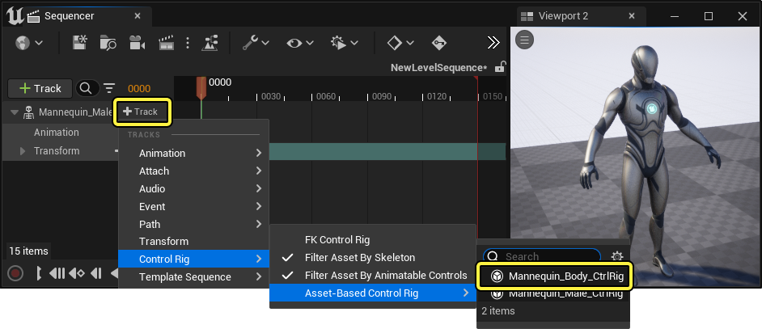
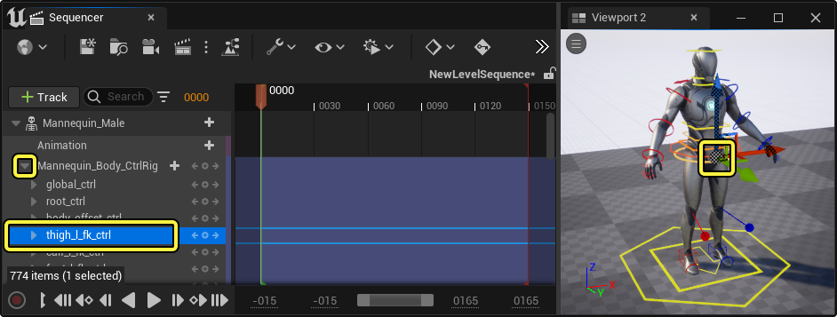
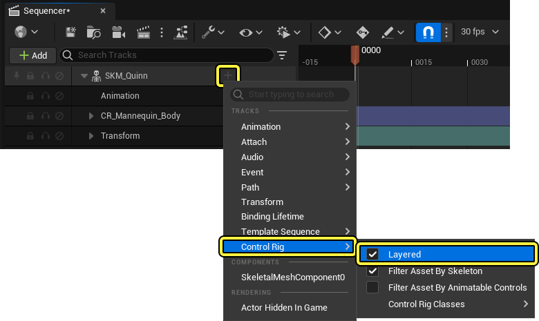
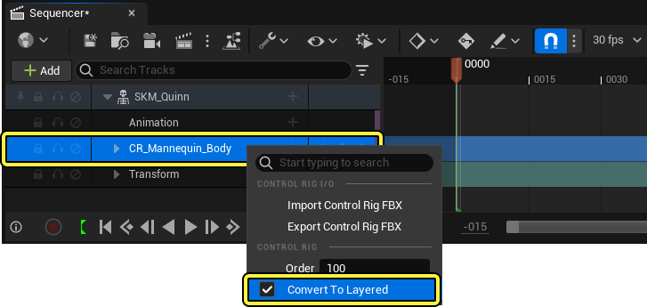
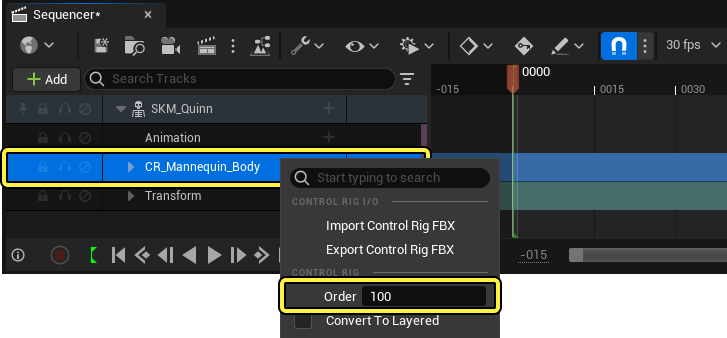

# 使用控制绑定实现动画效果

> 路径：虚幻引擎5.7文档 / 为角色和对象制作动画 / 控制绑定 / 使用控制绑定实现动画效果

> 原始页面：https://dev.epicgames.com/documentation/unreal-engine/animating-with-control-rig-in-unreal-engine

在完成[绑定控制绑定](../rigging-with-control-rig/index.md)后，你可以通过各种方式对其进行动画处理，例如直接在[Sequencer](../../cinematics-and-movie-making/index.md)中进行，或者使用[动画蓝图](../../skeletal-mesh-animation-system/animation-blueprints/index.md)以更程序化的方式进行。

本文档提供了关于这些动画方法及其工具和功能的概述。

#### 先决条件

- 你已经创建了

  控制绑定资产（Control Rig Asset）

  。有关如何执行此操作的信息，请参阅

  控制绑定快速入门指南

  页面。

## 在Sequencer中进行动画处理

**控制绑定** 可以在[Sequencer](../../cinematics-and-movie-making/index.md)中进行交互和动画处理。你可以向序列添加支持控制绑定的新角色，或向当前存在的角色添加控制绑定。

将控制绑定资产从内容浏览器拖动到关卡中，开始对控制绑定进行动画处理。这将打开新的Sequencer，并向其添加带有控制绑定轨道的骨架网格体。

> 动图已省略：ImageAltText

如果你的Sequencer已经包含 **骨架网格体Actor（Skeletal Mesh Actor）**，并且你希望向其添加控制绑定，则点击 **骨架网格体轨道（Skeletal Mesh Track）** 上的 **添加(+)轨道（Add (+) Track）** 按钮，然后选择 **控制绑定（Control Rig） > 控制绑定类（Control Rig Classes）**，从骨架网格体可用的控制绑定类列表中选择。 。

展开 **控制绑定轨道（Control Rig Track）** 将显示可以对其进行动画处理的控制点的列表。在此处选择控制点还会在 **视口（Viewport）** 中将其选中，反过来在视口中选择控制点也会选择轨道。

控制点可以像Sequencer中的大部分对象一样[设为关键帧](../../cinematics-and-movie-making/unreal-engine-sequencer-movie-tool-overview/creating-animation-keyframes/index.md)。此外，在选中控制点的情况下按 **S 键** 会在当前播放头时间在所选控制点上创建变换关键帧。

> 动图已省略：ImageAltText

### 多个控制绑定

Sequencer支持同时对多个控制绑定进行显示和动画。所有控制绑定及其控制点都会显示在视口和[动画大纲视图（Anim Outliner）](animation-editor-mode/index.md#animoutliner)中。你还可以通过点击 **眼睛** 图标来显示或隐藏控制绑定，以更改它们的可见性。

> 动图已省略：ImageAltText

### 分层的控制绑定轨道

在Sequencer中使用控制绑定时，你可能希望将其他动画或绑定分层，以便创建更动态的动画系统或工作流程。要将一个控制绑定轨道设置为分层的控制绑定（Layered Control Rig）轨道，请点击 **骨架网格体（Skeletal Mesh）轨道旁边的（**+**）**添加轨道**按钮，然后找到**控制绑定（Control Rig）**>**分层（Layered）** 并勾选此复选框。

> [!NOTE]
> 要让一个控制绑定按照分层的控制绑定运作，它必须有一个可运行的 **后向解算（Backwards Solve）** 图标。关于为控制绑定设置后向解算图图表的更多详情，请参阅控制绑定解算方向文档的[后向解算](../rigging-with-control-rig/control-rig-forwards-solve-and-backwards-solve/index.md#%E5%90%8E%E5%90%91%E8%A7%A3%E7%AE%97)一节。

> [!TIP]
> 你也可以通过 **右键点击** Sequencer时间轴的大纲视图中的轨道，并在快捷菜单中启用 **转为分层（Convert To Layered）** 属性来将其设为分层轨道。分层控制绑定轨道的默认值为 `100`。
>
> 

现在，动画轨道将通过控制绑定的后向解算图表运行，无需将动画序列烘焙到控制绑定，动画序列就将与控制绑定分层。

> 动图已省略：ImageAltText

你也可以使用多个控制绑定轨道，对你的角色姿势进行模块化编辑。在Sequencer时间轴中创建并设置分层的控制绑定轨道后，你可以设置 **控制绑定** 的分层顺序，从而设置不同轨道对最终姿势的影响行为。要编辑分层控制绑定轨道的顺序，请在Sequencer时间轴的大纲视图中 **右键点击** 轨道，设置 **顺序（Order）** 属性的值。顺序从 `100` 开始，对轨道进行降序求值，顺序值最高的轨道排在最前面。

> [!NOTE]
> 未启用分层的Sequencer轨道也可以与分层的控制绑定轨道一起使用，同样受顺序属性影响。但如果一个未被标记为"分层"的控制绑定轨道的顺序值低于分层轨道，它可能会破坏分层轨道生成的姿势。在组合使用分层和不分层的控制绑定轨道时，务必认真权衡它们的顺序。建议将分层控制绑定的改动添加到动画序列轨道或不分层的控制绑定轨道的上方，以保留它们对姿势的改动。
>
> | 错误的顺序 | 正确的顺序 |
> | --- | --- |
> | 本图中的不分层控制绑定轨道（橙色）的顺序值为 `100`，被排在末尾，因此破坏了两个顺序值分别为 `200` 和 `300` 的分层控制绑定轨道（黄色）生成的姿势。 | 本图中的不分层控制绑定轨道（橙色）的顺序值为 `300`，被排在最上面，意味着顺序值为 `100` 和 `200` 的分层控制绑定轨道（黄色）将被叠加在它的上面。 |
> | ImageAltText | ImageAltText |

你可以调整分层控制绑定轨道的权重值，或为其设置关键帧，方法是在Sequencer时间轴中 **右键点击** 轨道，并开启/关闭 **权重（Weight）** 属性。

> 动图已省略：ImageAltText

在处理多个分层控制绑定轨道时，你可以将所有选中的控制绑定轨道上选定的关键帧值恢复为默认值，方法是使用快捷键 **Ctrl**+**G**，或使用 **Ctrl**+**Shift**+**G** 将所选控制绑定轨道的所有关键帧恢复为默认值。

你还可以使用快捷键 *Ctrl**+**I**将所有选中的关键帧设为零，或使用**Ctrl**+**Shift**+**I** 将所选控制绑定的所有关键帧值设为零。

## 动画功能

虚幻引擎还提供了以下动画功能，帮你制作控制绑定动画。

- [虚幻引擎中的动画编辑器模式](animation-editor-mode/index.md) - 在虚幻引擎中启用动画模式，为动画师提供更加易用的环境和工具。

- [在动画蓝图中使用控制绑定](control-rig-in-animation-blueprints/index.md) - 通过在动画蓝图中使用控制绑定来制作程序化效果。

- [FK控制绑定](fk-control-rig/index.md) - 使用FK控制绑定快速编辑动画，无需使用任何控制绑定资产。

- [约束](animation-constraint-tools/index.md) - 使用各种约束将对象的位置、方向或缩放附加到其他对象。

- [空间切换](re-parent-control-rig-controls-in-real-time/index.md) - 在利用控制绑定实现动画时，动态地重新确定控制点的关联

- [控制绑定动画Python脚本编写](python-scripting-for-animating-with-control-rig/index.md) - 使用Python脚本驱动和扩展控制绑定动画制作。
