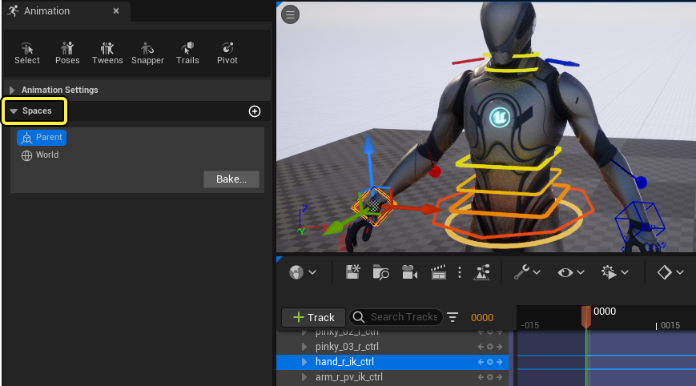
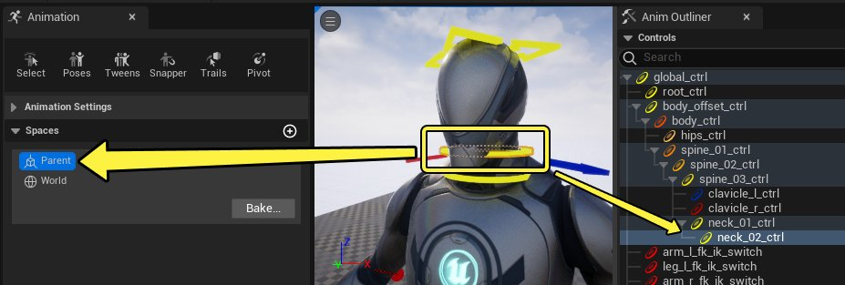
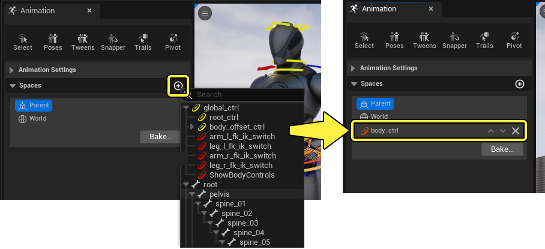
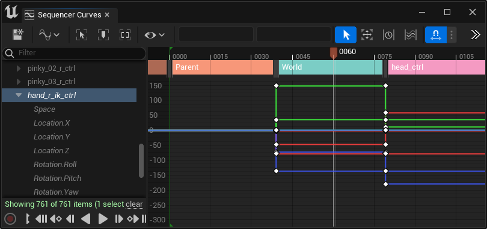
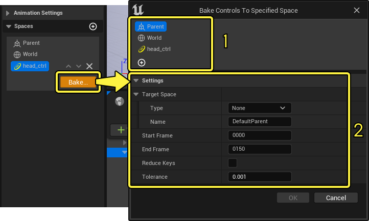
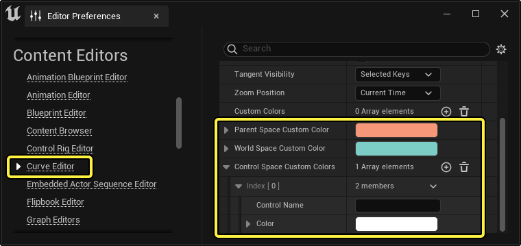
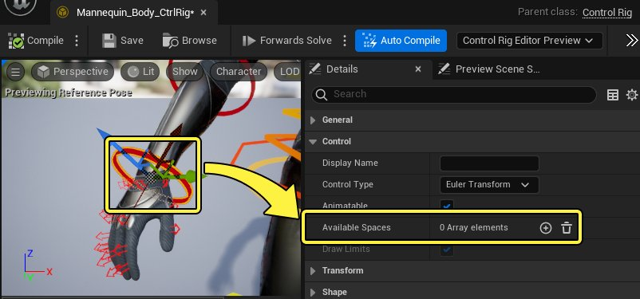
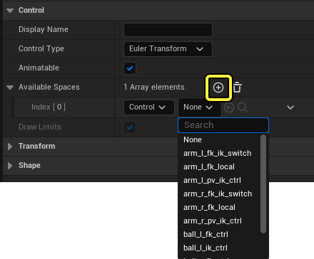

# 空间切换

> 路径：虚幻引擎5.7文档 / 为角色和对象制作动画 / 控制绑定 / 使用控制绑定实现动画效果 / 空间切换

> 原始页面：https://dev.epicgames.com/documentation/unreal-engine/re-parent-control-rig-controls-in-real-time-in-unreal-engine

在制作动画时，某些情况下，你可能需要更改控制点上的变换空间来满足不同需求，例如手与身体的一部分或其他物体接触和移动。如果绑定比较复杂，这种问题可能会比较棘手，因为需要在控制点中创建预设的约束系统。

为满足动画需求，你可以使用 **控制绑定空间切换（Control Rig Space Switching）**，轻松、动态地将控制点与其他绑定元素重新关联。空间可以在 **控制绑定资产（Control Rig Asset）** 中预定义，或者在 **Sequencer** 中创建，从而提供很大的灵活性。

本文提供了在Sequencer和控制绑定中进行空间切换的概述。

#### 先决条件

- 你已经创建

  控制绑定资产（Control Rig Asset）

  。有关如何执行此操作的信息，请参阅

  控制绑定快速入门指南

  页面。
- 动画过程中的空间切换通过

  动画模式

  面板访问，因此需要启用

  动画模式（Animation Mode）

  。
- 空间切换主要依赖于使用在

  Sequencer

  中使用控制绑定，因此需要具备Sequencer的

  基础知识

  。

## Sequencer中的空间切换

- 在启用

  动画模式

  后，你可以通过

  动画（Animation）

  面板访问控制绑定动画过程中的空间切换。点击面板中的

  空间（Spaces）

  即可打开空间切换界面。

> [!NOTE]
> 将鼠标放在 **视口（Viewport）** 上时，按 **Tab** 键还可打开临时的 **空间（Spaces）** 菜单。
>
> > 动图已省略：tab空间菜单

### 父节点和世界空间

默认情况下，你可以为控制点应用两种空间：**父节点（Parent）** 和 **世界（World）** 。

对于常见的控制点来说，默认空间将设置为 **父节点（Parent）** ，这种空间将控制点放在控制绑定框架中定义的父节点空间内。例如，选择颈部控制点将突出显示父节点空间，这意味着它是当前变换空间，可以用于关联到 **动画大纲视图工（Anim Outliner）** 中的层级。

点击 **世界（World）** 会将所选控制点的变换空间更改为相对于绝对世界坐标。实际上，这种方式会取消任何已选的控制点在其控制绑定中的层级位置的父节点地位。

> 动图已省略：世界变换空间

### 自定义空间

所有[控制点、骨骼或Null](../../rigging-with-control-rig/controls-bones-and-nulls-in-control-rig/index.md)都可以用作变换空间，这使空间切换更加全面，因为可以动态地将控制点重新设置为其他控制点的父节点。

> 动图已省略：自定义变换空间

要为所选的控制点添加自定义空间，请点击空间 **标题菜单** 中的 **添加（Add）（+）** ，然后选择 **绑定元素** 。这会将其作为可选择的空间添加到空间列表中。

> [!NOTE]
> 虽然你可以选择骨骼、控制点或Null作为自定义空间，但我们建议主要选择 **控制点（Controls）** ，以避免重新确定父节点的过程中循环发生绑定错误。

### 确定空间变换的关键帧

空间的一个主要优势在于能够更改动画中的空间。如果角色将手放在接触点上，并在随后制作这些点的动画，该功能将非常有用。

在选择不同的空间时，它会自动为该控制点创建 **空间关键帧（Space Keyframe）** ，并创建补偿性的 **变换关键帧（Transform Keyframes）** 以维持该控制点的视觉效果位置。每个空间关键帧还会在该空间存在的过程中在轨道行使用唯一的颜色。

> 动图已省略：关键帧变换空间切换

当控制点切换空间时，将会占据新父节点的本地空间。因此，其本地空间坐标将变得与之前的空间坐标不同。通过这种方式，空间切换在单个帧上发生。通过在[曲线编辑器](../../../cinematics-and-movie-making/unreal-engine-sequencer-movie-tool-overview/animation-curve-editor/index.md)中查看关键帧，能够直观地看到此过程。

你可以在不同的空间关键帧上移动播放头和操控父控制点，从而预览空间切换功能。在此示例中，当头部控制点是父节点时，将会影响手部IK控制点，而不需要将手部设置为关键帧。

> 动图已省略：关键帧变换空间切换

### 烘焙

完成动画的空间切换之后，你可以烘焙关键帧的最终效果。如果要将最终动画稳定到默认父节点空间，此功能将非常有用。

要烘焙所选的控制点，请点击空间菜单中的 **烘焙...（Bake…）** ，这将打开具有以下界面的烘焙 **对话框菜单** ：

1. 要烘焙到的变换空间。通常情况下，你需要选择

   父节点（Parent）

   才能恢复控制点的原始空间，但是如果要维持非父节点变换空间，你也可以选择或添加其他空间。
2. 烘焙设置，其中包含以下属性：

| 名称 | 说明 |
| --- | --- |
| **开始帧（Start Frame）** | Sequencer中的开始帧，用于定义烘焙范围。 |
| **结束帧（End Frame）** | Sequencer中的结束帧，用于定义烘焙范围。 |
| **减少关键帧（Reduce Keys）** | 启用此项以在烘焙过程发生后运行[简化](../../../cinematics-and-movie-making/unreal-engine-sequencer-movie-tool-overview/animation-curve-editor/index.md#%E7%AE%80%E5%8C%96)过程，这会基于公差数量删除冗余的关键帧。 |
| **容差（Tolerance）** | **容差（Tolerance）** 值越高，允许滤波曲线偏离原始值的程度就越高，在启用 **减少关键帧（Reduce Keys）** 的情况下，这会导致更多关键帧被删除。 |

### 设置和偏好

你可以从 **编辑器偏好设置（Editor Preferences）** 窗口更改Sequencer中使用的空间关键帧颜色。要访问这些设置，请从虚幻引擎菜单中选择 **编辑（Edit） > 编辑器偏好设置（Editor Preferences）** ，然后找到 **曲线编辑器（Curve Editor）** 分段，然后找到以下属性：

| 设置 | 说明 |
| --- | --- |
| **父节点空间自定义颜色（Parent Space Custom Color）** | 在当前空间设置为 **父节点（Parent）** 时，要使用的关键帧轨道颜色。 |
| **世界空间自定义颜色（World Space Custom Color）** | 在当前空间设置为 **世界（World）** 时，要使用的关键帧轨道颜色。 |
| **控制点空间自定义颜色（Control Space Custom Colors）** | 可以向其添加自定义控制点名称并设置要用于这些控制点的显式关键帧轨道颜色的可自定义数组。 |

## 控制绑定资产中的空间切换

空间切换也可以预构建到控制绑定资产中。如果要提前在控制点上定义通用空间以避免在Sequencer中持续添加，此功能将非常有用。此外，你还可以创建逻辑，以通过控制点属性来控制空间切换。

### 预定义自定义空间

在控制绑定资产中，选择 **控制点（Control）** ，找到 **细节（Details）** 面板，然后找到 **可用空间（Available Spaces）** 属性。你可以利用此数组预定义要用作变换空间的其他绑定元素。

点击 **添加（Add）(+)** 按钮添加新条目，并指定要在 **下拉菜单** 中使用的 **类型（Type）** 和 **元素（Element）** 。如上所述，虽然你可以选择骨骼、控制点或Null作为自定义空间，但我们建议主要选择 **控制点（Controls）** ，以避免重新确定父节点的过程中循环发生绑定错误。

一旦在"可用空间（Available Spaces）"属性中指定项目之后，你就可以看到此自定义空间自动显示为该控制点的可切换空间。

> 图片已省略：变换空间添加

### 动态层级节点

此外，你可以使用动态层级节点在控制绑定图表中绘制空间切换功能的图表。在 **控制绑定图表（Control Rig graph）** 中右键点击，然后在 **动态层级（Dynamic Hierarchy）** 下找到以下节点：

> 图片已省略：动态层级节点

| 名称 | 图像 | 说明 |
| --- | --- | --- |
| **添加父节点（Add Parent）** | 添加父节点 | 将第二个父节点添加到绑定元素。新父节点的权重最初为0，然后你可以使用 **设置父节点权重（Set Parent Weights）** 来设置权重。此节点包含以下选项： **子节点（Child）** ，此选项可以定义用于接收额外父节点的项目。 **父节点（Parent）** ，此选项可以定义新的父节点。 |
| **获取父节点权重（Get Parent Weights）** | 获取父节点权重 | 返回给定绑定元素的所有父节点的当前权重数组。 |
| **设置父节点权重（Set Parent Weights）** | 设置父节点权重 | 设置给定绑定元素的父节点权重数组。权重数量必须等于绑定元素的父节点数量。 |
| **切换父节点（Switch Parent）** | 切换父节点 | 将绑定元素切换为新的父节点。此节点包含以下选项： **模式（Mode）** ，此选项可以让子节点要么切换到新的 **父节点（Parent）** 、**世界空间（World Space）** ，要么切换回其 **默认空间（Default Space）** 。 **子节点（Child）** ，此选项将定义要切换空间的项目。 **父节点（Parent）** ，如果模式设置为 **父节点项目（Parent Item）** ，此选项将定义要切换到的新父节点项目。否则，你可以将此引脚保持无链接状态。 **保持全局（Maintain Global）** ，此选项将定义在切换时应该保持本地空间还是世界空间。 |

### 预览空间切换

空间变换以 **动态层级（Dynamic Hierarchy）** 系统为基础而构建，可以在控制绑定资产中预览和调试。在这个示例中，绑定层级面板在控制空间切换到 **世界空间（World Space）** 时自动更新。

> 动图已省略：dynamic hierarchy

在此示例中，它影响了将父节点切换到 **世界空间（World Space）** 的控制点。绑定层级框架还将突出显示为 **蓝色** 。以此说明启用了 **动态层级（Dynamic Hierarchy）** 。

> 图片已省略：test space switching
