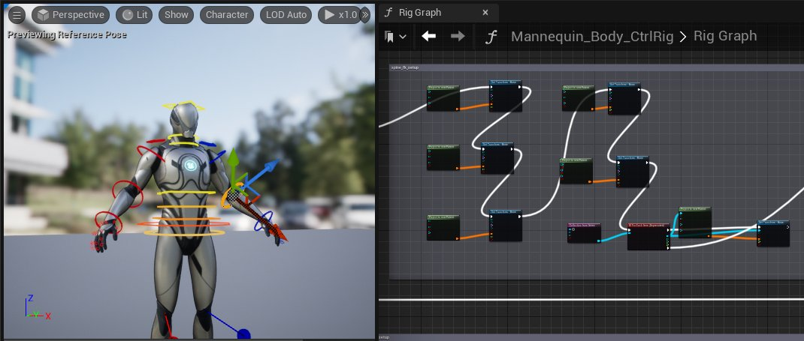
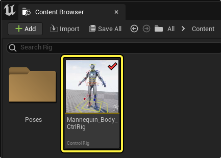
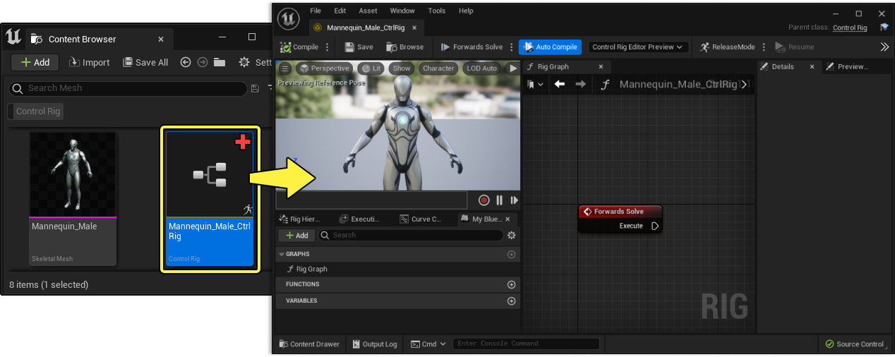
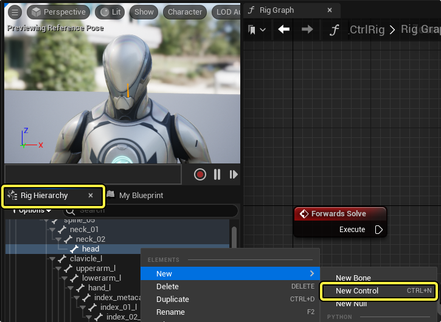
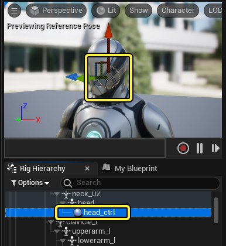
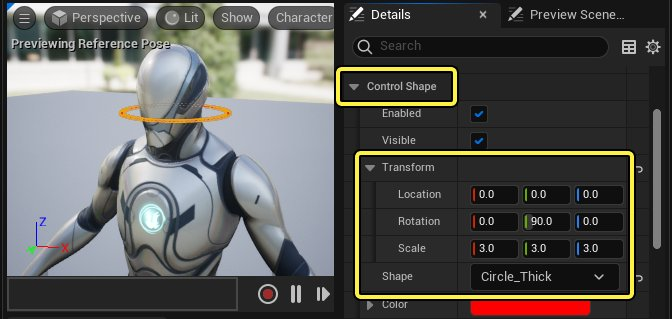
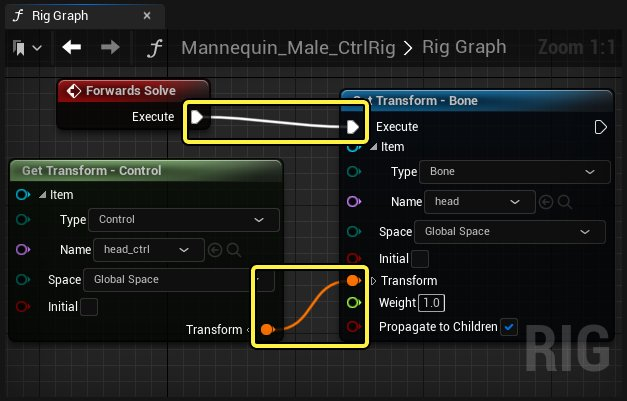

# 控制绑定快速入门指南

> 路径：虚幻引擎5.7文档 / 为角色和对象制作动画 / 控制绑定 / 控制绑定快速入门指南

> 原始页面：https://dev.epicgames.com/documentation/unreal-engine/how-to-create-control-rigs-in-unreal-engine

本文将带你了解控制绑定，并且展示虚幻引擎中如何创建并给绑定添加动画。

## 什么是控制绑定？

控制绑定是虚幻引擎在引擎中直接为角色添加动画的解决方案。

**控制绑定编辑器（Control Rig Editor）** 可以创建自定义控制点，通道，以及角色的其它操作器。创建一个绑定之后，你可以在虚幻引擎的其它区域为这些控制点添加动画，比如 **[Sequencer](../../cinematics-and-movie-making/index.md)**。

控制绑定需要先创建 **控制绑定资产**，在 **内容浏览器（Content Browser）** 中创建并储存。

## 如何创建并打开一个控制绑定？

创建新控制绑定资产的主要方式是在内容浏览器中右键点击一个 **[骨架网格体](../../../working-with-content/skeletal-mesh-assets/index.md)** 然后选择 **创建（Create） > 控制绑定（Control Rig）**。这样就会在同一目录下创建一个控制绑定资产，带有 "_CtrlRig" 后缀。

下一步，双击控制绑定资产来打开 **控制绑定编辑器（Control Rig Editor）**。

## 如何使用控制绑定？

最简单的一种控制点类型为 **FK控制点（FK Control）**。该指南讲述如何创建这种控制点并且在 **Sequencer** 中为其添加动画。

### 创建控制点

在控制绑定编辑器中，选择 **绑定层级（Rig Hierarchy）** 选项卡来查看角色中的骨架层级。找到你要添加动画的骨骼，右键点击，然后选择 **新（New）> 新控制点（New Control）**。

这样会在该骨骼同一位置和同一方向上创建一个控制点。控制点会和骨骼有一样的名称，并带有后缀"_ctrl"。

> [!NOTE]
> 尽管你可以将控制点嵌套在骨架层级内，通常建议将其取出并且在骨架旁边构建一个控制绑定层级。选中控制点并且按下 **Shift+P** 来解除控制点和骨架的嵌套关系。
>
> > 动图已省略：解除控制点嵌套

### 编辑控制点形状

为了更好地在视口中查看并选择控制点，你可以改变 **控制点形状（Control Shape）**。找到 **细节（Details）** 面板，打开 **控制点形状（Control Shape）** 属性类别。在这里你可以使用 **形状（Shape）** 属性设置新形状，也可以用 **变换（Transform）** 属性自定义大小和位置偏移。

在这个示例中，形状设置为 **Circle_Thick**，Y轴旋转为 **90**，所有缩放轴都设为 **3.0**。

### 用控制点驱动骨骼

接下来，在 **绑定图表（Rig Graph）**中引用控制点和骨骼。将控制点从 **绑定层级（Rig Hierarchy）** 面板中拖进图表，然后选择 **获取控制点（Get Control）**。

> 动图已省略：图表获取控制点

对想要控制的骨骼进行同样的操作。 将骨骼从 **绑定层级（Rig Hierarchy）** 面板中拖进图表，然后选择 **设置骨骼（Set Bone）**。

> 动图已省略：图表设置骨骼

将 **变换（Transform）** 输出数据引脚从 **获取变换-控制点（（Get Transform - Control）** 节点连接至 **设置变换-骨骼（Set Transform - Bone）** 节点的 **变换（Transform）** 输入数据引脚，然后将 **执行（Execute）** 输出引脚从 **正向解算（Forward Solve）** 节点连接至 **设置变换-骨骼（Set Transform - Bone）** 节点的输入执行引脚。

你可以在视口中操作控制点并且看到控制点驱动骨骼。

> 动图已省略：测试控制点

> [!NOTE]
> 点击 **编译（Compile）** 来将控制点重置到默认位置。

### 在Sequencer在中为控制点添加动画

现在你的控制点已经可以正常操作角色的骨骼，你可以开始在 **[Sequencer](../../cinematics-and-movie-making/index.md)** 中添加动画。

从 **内容浏览器（Content Browser）** 中将 **控制绑定资产（Control Rig Asset）** 拖入关卡视口。随后，Sequencer会启动，同时带着加入至**[轨道](../../cinematics-and-movie-making/unreal-engine-sequencer-movie-tool-overview/sequencer-track-list/index.md)**的角色

> 动图已省略：将控制绑定添加至关卡

展开 **控制绑定（Control Rig）** 轨道来找到你创建的控制点。你可以在这里将其选中，也可以在视口中选中。

> 图片已省略：Sequencer中的控制绑定

在视口中选中控制点后，按下 **S** 键来为选中的控制点在 [**播放头（Playhead）**](https://dev.epicgames.com/documentation/404) 创建一个变换 **关键帧（Keyframe）**。然后，将 **播放头（Playhead）** 拖至序列中另外的位置，操作你的控制点，然后再次按下 **S** 键来设置另一个 **关键帧（Keyframe）**。

> 动图已省略：控制绑定关键帧

现在当你播放序列时，你可以看到控制点和角色在两个关键帧之间运动。

> 动图已省略：控制绑定关键帧
