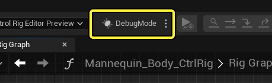
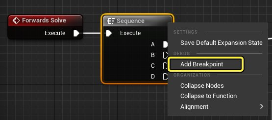
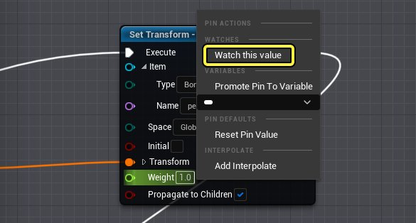
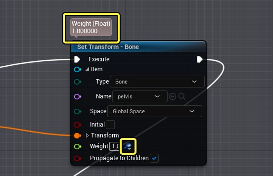
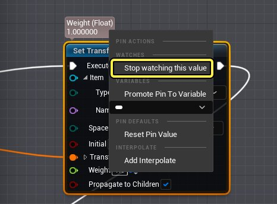
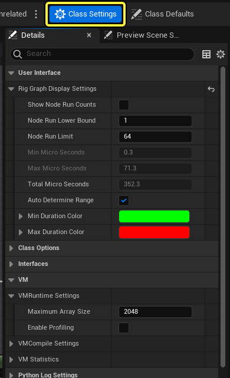
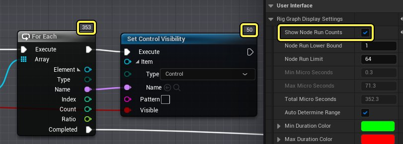
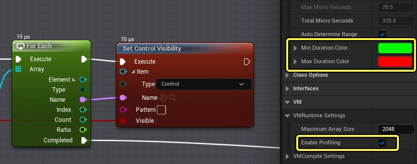

# 控制绑定调试

> 路径：虚幻引擎5.7文档 / 为角色和对象制作动画 / 控制绑定 / 使用控制绑定制作动画 / 控制绑定调试

> 原始页面：https://dev.epicgames.com/documentation/unreal-engine/control-rig-debugging-in-unreal-engine

使用控制绑定的调试工具评估你的Rig行为，并解决Rig图表中的问题。本文档提供了关于这些工具的概述。

#### 先决条件

- 你已创建了控制绑定资产。创建方法请参阅

  控制绑定快速入门指南

  页面。

## 调试模式

与 **[蓝图调试](../../../../blueprints-visual-scripting/blueprint-workflows/blueprint-debugging-example/index.md)** 类似，你可以使用 **调试模式（Debug Mode）** 调试控制绑定图表。你可以使用此模式向节点添加断点，单步调试图表逻辑，并在任意时刻查看图表中某个属性的当前值。

点击控制绑定工具栏中的 **ReleaseMode**，可以启用调试模式。此按钮可以切换 **调试（Debug）** 和 **发布（Release）** 模式。

> [!NOTE]
> 调试模式支持 **[解算方向](../control-rig-forwards-solve-and-backwards-solve/index.md)** 上下文，并将根据你当前采用 **正向解算（Forwards Solve）**、**反向解算（Backwards Solve）** 还是 **设置事件（Setup Event）** 来应用。

### 断点

调试节点图表时，使用断点在指定节点停止对图表的评估并单步调试后续节点。这样你可以临时预览在视口中断点之前评估的图表部分。使用断点时，在评估流程到达图表的末端之前，时间不会向前移动，这会导致累积时间节点不会更改其结果。

右键点击Rig图表节点并选择 **添加断点（Add Breakpoint）**，可以添加断点，以在所选节点处暂停图表评估。添加断点也会自动启用调试模式（如果尚未启用）。

指定断点后，使用 **步进（Step）** 工具栏按钮逐个节点单步调试图表评估。控制绑定只评估断点或当前已评估的节点。

> 动图已省略：控制绑定节点步进

步进按钮执行以下函数：

| 名称 | 图标 | 说明 |
| --- | --- | --- |
| **恢复（Resume）** | 恢复 | 在断点处停止后恢复执行。遇到另一个断点时将停止。 |
| **聚焦（Focus）** | 聚焦 | 将图表视图聚焦在当前正在调试的节点上。 |
| **步进下一个（Step Next）** | 步进节点 | 在断点处停止时会跳过调试焦点，来到下一个评估中的节点。 |
| **步入函数（Step Into Function）** | 步入下一个 | 在断点处停止时会跳过调试焦点，来到下一个评估中的节点。如果下一个节点包含在函数或折叠组中，则视图将进入函数，聚焦于该组的第一个节点。 |
| **步出函数（Step out of Function）** | 步出下一个 | 在断点处停止时会跳过调试焦点，来到下一个评估中的节点。如果当前节点包含在函数或折叠组中，而下一个节点位于函数或组之外，则图表视图将更改为聚焦该组之外的下一个节点。 |

### 属性监视

调试时，可以配置每个图表节点的属性值，实时显示其更新值。要启用此功能，请右键点击你要实时更新的节点引脚，并选择 **监视此值（Watch this value）**。

如果某个属性正在被监视，那么节点顶部将显示值信息，该属性旁边会有一个图标，表示它正在被监视。

要停止调试属性，请右键点击该引脚，并选择 **停止监视此值（Stop watching this value）**。

## 类设置调试和分析

类设置细节（Class Settings Details）面板包含用于调试图表性能的工具和属性。点击 **类设置（Class Settings）**，显示此面板。

启用 **显示节点运行计数（Show Node Run Counts）** 将显示节点在其执行过程中运行的次数。在确定循环或集合节点是否正确运行时，此功能非常有用。

### VM分析

**虚拟机分析（Virtual Machine Profiling）**，或 **VM分析（VM Profiling）**，也可以用于调试实时图表性能和节点执行速度。

点击 **VMRuntime设置（VMRuntime Settings）** 类别下的 **启用分析（Enable Profiling）** 开始分析Rig图表。**最小（Min）** 和 **最大时长颜色（Max Duration Color）** 属性用于显示哪些节点执行的时间最短或最长，以微秒为单位。节点旁边还会显示总微秒（μs）计数。

## 执行堆栈

执行堆栈（Execution Stack）面板提供了图表中节点操作顺序的参考。你可用它调试节点和评估事件顺序。

找到控制绑定菜单栏，并选择 **Window > 执行堆栈（Execution Stack）**，打开执行堆栈（Execution Stack）面板。

> 图片已省略：执行堆栈

打开后，执行堆栈会显示以下信息：

> 图片已省略：执行堆栈

1. **节点列（Node Column）**，显示给定解算方向所有节点的评估顺序。双击此处的节点可将Rig图表视图框定到该节点。在Rig图表（Rig Graph）中选择节点，也会突出显示与其关联的指令。
2. **节点运行计数（Node Run Count）**，显示节点已执行的次数。此数值仅当从 [**类设置**](#%E7%B1%BB%E8%AE%BE%E7%BD%AE%E8%B0%83%E8%AF%95%E5%92%8C%E5%88%86%E6%9E%90)启用 **显示节点运行计数（Show Node Run Counts）** 时才会显示。
3. **微秒计数（Microsecond Count）**，如果启用了 [**分析**](#vm%E5%88%86%E6%9E%90)，则显示节点执行所需的总时间（以微秒（μs）为单位）。
