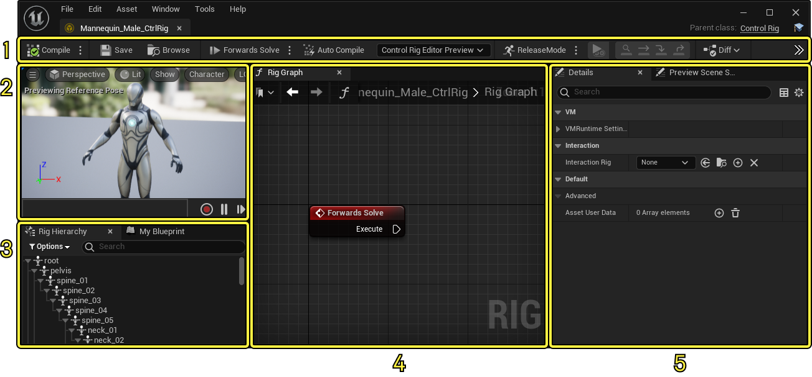
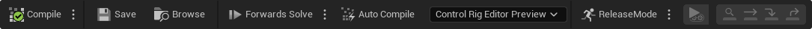
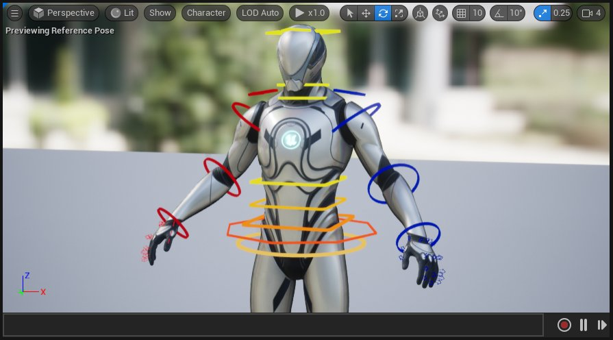
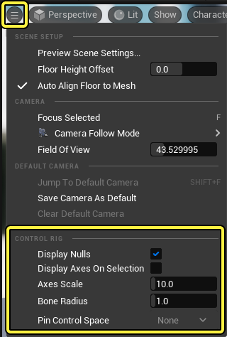
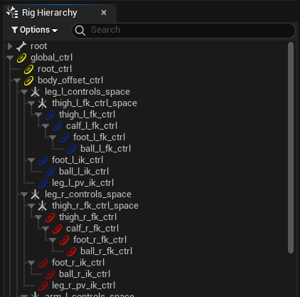
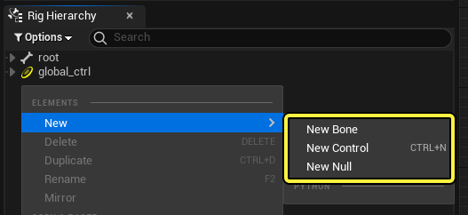
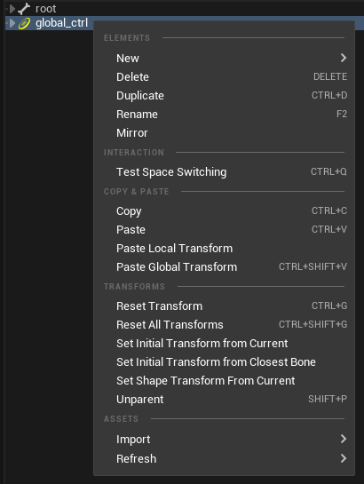
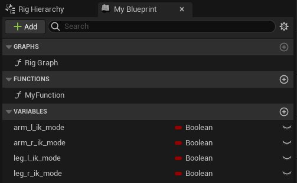

# 控制绑定编辑器

> 路径：虚幻引擎5.7文档 / 为角色和对象制作动画 / 控制绑定 / 使用控制绑定制作动画 / 控制绑定编辑器

> 原始页面：https://dev.epicgames.com/documentation/unreal-engine/control-rig-editor-in-unreal-engine

本文介绍了控制绑定编辑器的用户界面、各种工具和功能。

1. 工具栏（Toolbar）
2. 视口（Viewport）
3. 绑定层级（Rig Hierarchy）
4. 绑定图表（Rig Graph）
5. 细节面板（Details）

## 工具栏

**控制绑定** 工具栏提供了预览和编译控制绑定的相关按钮。这些按钮的具体功能如下所示：

| 名称 | 图标 | 说明 |
| --- | --- | --- |
| **编译（Compile）** | 控制绑定编译 | 和 **[蓝图](../../../../blueprints-visual-scripting/index.md)** 类似，控制绑定必须先 **编译** 才能执行逻辑并保存。点击该按钮可以编译绑定，并会提示该绑定是否需要编译。 只要绑定层级发生了改动，就需要编译。改动包括对控制点、骨骼或空间进行添加、移除、重设父子关系和重命名等操作。创建变量时，也需要重新编译。 当你在视口中操控控制点后，"编译（Compile）"按钮还能重置这些控制点。 |
| **解算方向（Solve Direction）** | 工具栏正向解算 | "解算方向（Solve Direction）"用于在不同解算器事件链之间切换。用它来预览不同的[解算方向](../control-rig-forwards-solve-and-backwards-solve/index.md)。每个选项都关联一个绑定图表（即解算方向事件节点）。选择选项后，即可预览该解算链。 解算方向菜单 点击主按钮可在当前模式与之前所选模式间切换。 |
| **自动编译（Auto Compile）** | 工具栏自动编译 | 启用 **自动编译（Auto Compile）** ，编译会在绑定图表发生改动后自动进行。这包括创建和链接节点之类的操作。上述所有其他更改仍需要手动编译。 |
| **调试对象（Debug Object）** | 控制绑定编辑器预览 | 该下拉菜单会将控制绑定视口关联到某个正在模拟或运行的控制绑定。这样就能在控制绑定视口中预览控制绑定动画。 |
| **类设置（Class Settings）** | 工具栏类设置 | 点击"类设置（Class Settings）"按钮后，蓝图类设置会在[细节](#%E7%BB%86%E8%8A%82%E9%9D%A2%E6%9D%BF)面板中显示。其中包含 **形状库（Shape Libraries）** 属性，它可以更改你在绑定时使用的控制点形状。请访问[控制点形状和控制点形状库](../control-shapes-and-control-shape-library/index.md)页面，了解有关该功能的更多信息。 形状库 你还可以访问控制绑定Python命令，如[Python上下文](../control-rig-python-scripting/index.md#python%E4%B8%8A%E4%B8%8B%E6%96%87)和[复制Python脚本](../control-rig-python-scripting/index.md#%E5%A4%8D%E5%88%B6python%E8%84%9A%E6%9C%AC). |

## 视口

你可以在视口中完成以下操作：

- 预览控制绑定节点的交互效果。
- 设置不同的显示模式和调试显示。
- 选择和操控控制点。
- 使用顶部工具栏更改预览模式。

**视图选项（View Options）** 菜单包含以下控制绑定设置：

| 名称 | 说明 |
| --- | --- |
| **显示Null（Display Nulls）** | 在视口中显示[Null](../controls-bones-and-nulls-in-control-rig/index.md)的可选择轴。 控制绑定显示Null |
| **选择时显示轴（Display Axes On Selection）** | 在你选择绑定元素时显示本地轴。 控制绑定在选择时显示轴 |
| **轴比例（Axes Scale）** | 从 **显示Null（Display Nulls）** 或 **在选择时显示轴（Display Axes On Selection）** 选项绘制轴时轴显示的大小。 控制绑定轴比例 |
| **骨骼半径（Bone Radius）** | 骨骼可见时骨骼的大小。若要显示骨骼，请将骨骼选中或从 **角色（Character）> 骨骼（Bones）** 菜单中设置。 控制绑定骨骼半径 |
| **引脚控制空间（Pin Control Space）** | 控制引脚值时，你可以从此处选择一个元素，将操控器偏移为相对于不同的元素。 |

## 绑定层级

**绑定层级（Rig Hierarchy）** 面板类似大纲视图，可以查看控制点结构并选中控制点。这也是你新建[控制点、骨骼和Null](../controls-bones-and-nulls-in-control-rig/index.md)的主要区域。

要创建这些元素，在面板中点击右键，选择 **新建（New）> 控制点（Control）、骨骼（Bone）或Null** 。你的选择将决定这些元素的创建位置。如果未做任何选择，则将在原点(0,0,0)创建新元素。

上下文菜单包含以下命令：

| 名称 | 说明 |
| --- | --- |
| **新建（New）** | 用于创建新 **控制点（Controls）**、**骨骼（Bones）** 或 **Null** 的创建菜单。 |
| **删除（Delete）** | 删除当前选择。 |
| **复制（Duplicate）** | 复制当前选择。 |
| **重命名（Rename）** | 重命名当前选择。 |
| **镜像（Mirror）** | 复制你当前所选的元素，并沿轴镜像该副本。点击后，界面上将显示对话框窗口，你可以在其中指定希望镜像操作如何运作。 控制绑定镜像控制点 **镜像轴（Mirror Axis）** 是镜像时所依据的轴。对于虚幻引擎中面向Y前向的字符，你可以将此项保持为 **X** 的默认值。 **要翻转的轴（Axis to Flip）** 是为了正确镜像旋转而要旋转180度的轴。对于虚幻引擎中面向Y前向的字符，你可以将此项保持为 **Z** 的默认值。 **搜索（Search）** 可用于指定你要搜索以替换的关键字或字母。如果你要使用后缀"_left"镜像控制点，则需要在此处写"left"。 **替换（Replace）** 可用于指定你要替换 **搜索（Search）** 中所使用文本的关键字或字母。如果你要使用后缀"_left"镜像控制点，则需要在此处写"right"。 |
| **测试空间切换（Test Space Switching）** | 打开对话框窗口以预览控制点的[空间切换](../../animating-with-control-rig/re-parent-control-rig-controls-in-real-time/index.md)行为。 控制绑定测试空间切换 **父节点（Parent）** 是默认选项。控制点将按照父节点所在的空间进行改动。 **世界（World）** 使控制点脱离父节点的影响，并与世界空间关联。 点击 **添加(+)（Add (+)）** 按钮，添加其他控制点作为父节点。 |
| **复制（Copy）** | 复制当前选择，包括本地和全局变换，可以与 **粘贴本地（Paste Local）** / **全局变换（Global Transform）** 一起使用。 |
| **粘贴（Paste）** | 粘贴当前选择。 |
| **粘贴本地变换（Paste Local Transform）** | 粘贴当前复制的控制点的本地变换。 |
| **粘贴全局变换（Paste Global Transform）** | 粘贴当前复制的控制点的世界变换 |
| **重置变换（Reset Transform）** | 将当前选择的控制点重置回初始变换。 |
| **重置所有变换（Reset All Transforms）** | 将所有控制点重置回初始变换。 |
| **从当前位置设置初始变换（Set Initial Transform from Current）** | 在视口中移动变换后，点击此项会将新位置设置为新的初始变换。 |
| **从最近骨骼设置初始变换（Set Initial Transform from Closest Bone）** | 使用此命令会将当前所选控制点捕捉到最近的骨骼，并将该位置设置为初始变换。这适用于将控制点与骨骼对齐。 |
| **从当前位置设置形状变换（Set Shape Transform From Current）** | 如果你在变换控制点，执行此命令会将控制点的枢轴点重置回初始变换，但保持控制点形状的当前视效位置。如果你想要自定义控制点的视效位置，同时保持枢轴点不变，则此命令很有用。 |
| **取消父子关系（Unparent）** | 将当前所选的元素移至层级顶部。 |
| **导入（Import）** | 将骨架层级导入到当前绑定。 |
| **刷新（Refresh）** | 从所选网格体刷新现有初始变换。这仅在找到节点时更新。 |

## 我的蓝图

**我的蓝图（My Blueprint）** 面板类似于[蓝图](../../../../blueprints-visual-scripting/index.md)中的我的蓝图面板，包含控制绑定的所有 **函数（Functions）** 和 **变量（Variables）** 。控制绑定中的变量主要用于在绑定图表中控制逻辑，而不是让关卡中的实例公开某个变量。

## 执行堆栈

**执行堆栈（Execution Stack）** 面板可用于预览图表中操作的顺序。你可用它调试节点和评估事件顺序。

> 图片已省略：控制绑定执行堆栈

右键点击一个执行节点并选择 **聚焦所选项（Focus on Selection）** ，即可在绑定图表中对准当前节点。你还可以双击节点对准它。

## 曲线容器

**曲线容器（Curve Container）** 面板会列出 **骨架（Skeleton）** 中的 **动画曲线（Anim Curves）**，并允许你在绑定图表中控制曲线。

> 图片已省略：控制绑定曲线容器

你可以使用 **Get Curve Value** 和 **Set Curve Value** 节点在绑定图表中引用曲线。

> 图片已省略：控制绑定获取设置曲线值

## 绑定图表

**绑定图表（Rig Graph）** 用于编写控制绑定的行为脚本。

将层级节点从绑定层级（Rig Hierarchy）面板拖到图表中，选择所需的引用类型，即可引用该节点。

> 图片已省略：控制绑定图表

右键点击也可创建节点。在上下文菜单中搜索并找到所需节点。

> 图片已省略：控制绑定图表

类似于[蓝图](../../../../blueprints-visual-scripting/index.md)，多个节点可以折叠为组或 **函数（Functions）**，方法是右键点击所选节点，然后选择 **折叠节点(Collapse Nodes)** 或 **折叠为函数（Collapse to Function）** 。

> 图片已省略：控制绑定函数

函数可以在 **我的蓝图（My Blueprint）** 面板中的 **函数（Functions）** 类别中访问。你可以通过函数更好地编排大型图表，复用逻辑，并轻松在控制绑定之间共享功能。

> 图片已省略：控制绑定函数

## 细节面板

**细节（Details）** 面板包含控制绑定编辑器中选中内容的相关信息。这些内容可能包括控制点、骨骼和绑定图表节点。选中控制点后，将显示以下属性：

> 图片已省略：控制绑定属性细节

| 名称 | 说明 |
| --- | --- |
| **名称（Name）** | 所选绑定元素的名称。 |
| **显示名称（Display Name）** | 控制点在[Sequencer](../../../cinematics-and-movie-making/index.md)和[动画大纲视图](../../animating-with-control-rig/animation-editor-mode/index.md#animoutliner)中所显示的名称。如果未使用，则名称将退回 **名称（Name）** 中指定的值。 |
| **控制点类型（Control Type）** | 要使用的控制点[类型](../controls-bones-and-nulls-in-control-rig/index.md#%E6%8E%A7%E5%88%B6%E7%82%B9%E7%B1%BB%E5%9E%8B)。在你希望控制点仅影响特定值时，例如控制点仅旋转、平移或提供单个属性时，这可用于限制或更改控制点的数据。 |
| **可制作动画（Animatable）** | 确定控制点在Sequencer中是否可制作动画。如果你的绑定包含纯视效的控制点，这会很有用。 |
| **可用空间（Available Spaces）** | 这是一个数组，你可以在其中为控制点添加[预定义自定义空间](../../animating-with-control-rig/re-parent-control-rig-controls-in-real-time/index.md#%E9%A2%84%E5%AE%9A%E4%B9%89%E8%87%AA%E5%AE%9A%E4%B9%89%E7%A9%BA%E9%97%B4)，用于[空间切换](../../animating-with-control-rig/re-parent-control-rig-controls-in-real-time/index.md)。 |
| **绘制限值（Draw Limits）** | 如果[变换限值](../controls-bones-and-nulls-in-control-rig/index.md#%E5%8F%98%E6%8D%A2%E9%99%90%E5%80%BC)用于所选控制点，则绘制调试行。 控制绑定绘制限值 |
| **变换（Transform）** | 显示所选绑定元素的不同[变换类型](../controls-bones-and-nulls-in-control-rig/index.md#%E5%8F%98%E6%8D%A2%E7%B1%BB%E5%9E%8B)。骨骼和Null仅显示 **初始（Initial）** 和 **当前（Current）**，而控制点将显示 **初始（Initial）**、**当前（Current）**、**偏移（Offset）** 和 **最小值/最大值（Min/Max）** 限值。 |
| **形状（Shape）** | **形状（Shape）** 类别包含用于为所选控制点[自定义形状](../control-shapes-and-control-shape-library/index.md)的属性。 |

## 预览场景设置

**预览场景设置（Preview Scene Settings）** 面板包含用于控制骨骼网格体、动画和视口环境设置的属性。

> 图片已省略：控制绑定预览场景设置

以下属性可用于调整控制绑定视口：

| 名称 | 说明 |
| --- | --- |
| **预览控制器（Preview Controller）** | 使用预览控制器在视口中播放动画。如果你要在角色播放动画时测试控制点的行为，或者测试 **[反向解算](../control-rig-forwards-solve-and-backwards-solve/index.md)** 行为，这会很有用。 控制绑定预览控制器 |
| **预览网格体（Preview Mesh）** | 要用于视口中角色的骨骼网格体。你可以将此改为带有兼容骨架的其他网格体。 |
| **服装模拟工厂（Clothing Simulation Factory）** | 要在视口中使用的布料模拟。 |
| **允许不同骨架（Allow Different Skeletons）** | 如果启用此属性，你可以在 **预览网格体（Preview Mesh）** 或 **骨骼网格体（Skeletal Meshes）** 属性中选择带有不兼容骨架的骨骼网格体。 |
| **允许自定义AnimBP覆盖（Allow Custom AnimBP Override）** | 使用预览集合时，允许动画蓝图使用这些集合覆盖。 |
| **更多网格体（Additional Meshes）** | 在此处指定 **预览集合（Preview Collection）**。 |
| **骨骼网格体（Skeletal Meshes）** | 要添加到视口的更多网格体。如果你使用的是[模块化角色](../../../skeletal-mesh-animation-system/animation-workflow-guides-and-examples/working-with-modular-characters/index.md)，这会很有用。 |
