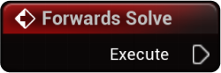
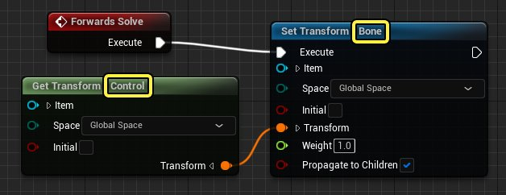
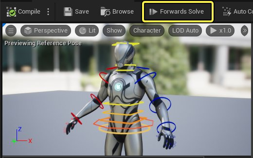
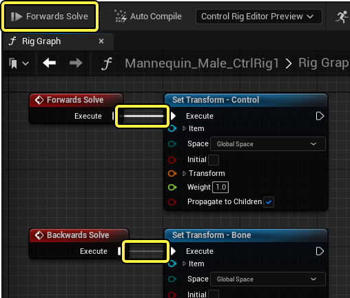
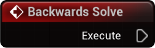
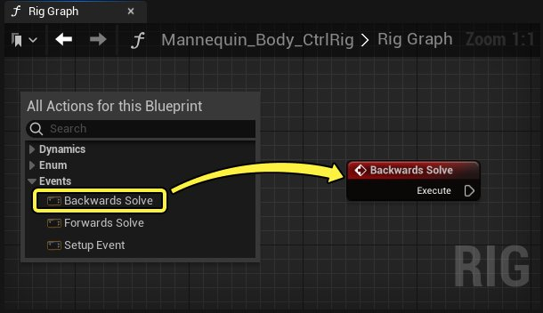
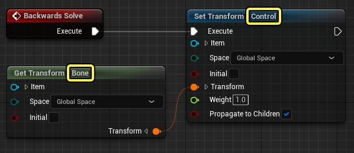
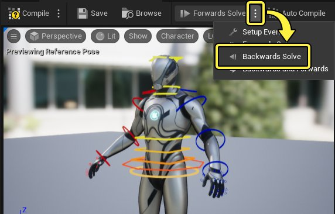

# 解算方向

> 路径：虚幻引擎5.7文档 / 为角色和对象制作动画 / 控制绑定 / 使用控制绑定制作动画 / 解算方向

> 原始页面：https://dev.epicgames.com/documentation/unreal-engine/control-rig-forwards-solve-and-backwards-solve-in-unreal-engine

控制绑定以多种方式进行计算，称为 **解算方向（solve direction）**，它们是在控制绑定的绑定图表（Rig Graph）中创建的。通过使用这些工具将绑定逻辑拆分为多个解算方向或 **解算器**，你可以展开绑定的传入数据，从而启用工作流程，如绑定共享、将动画烘焙回控制点，以及调试该行为等。

此页面概述控制绑定中可用的不同解算方向、如何使用这些解算方向，以及这些功能启用的工作流程。

#### 先决条件

- 应了解

  控制绑定编辑器

  。
- 应了解

  Sequencer

  ，知道

  如何将控制绑定角色添加到Sequencer

  。

## 前向解算

前向解算（Forwards Solve）是用于通过控制点、变量和其他绑定元素驱动骨架的解算方向。它是控制绑定的主要解算方向，将在Sequencer和动画蓝图中为控制绑定设置动画时使用。

默认情况下，所有控制绑定资产都在绑定图表（Rig Graph）中包含前向解算（Forwards Solve）节点。从这个节点创建的逻辑将作为一个基础，通过控制点、变量和其他绑定元素影响骨架的骨骼。通过这种方式，控制点以"前向"方式运行，即控制点影响骨骼。

### 预览前向解算

前向解算（Forwards Solve）是[视口](../control-rig-editor/index.md#%E8%A7%86%E5%8F%A3)中的默认预览模式。这可以通过确保解算方向[工具栏](../control-rig-editor/index.md#%E5%B7%A5%E5%85%B7%E6%A0%8F) **按钮** 设置为 **前向解算（Forwards Solve）** 进行验证。类似于AnimBP，前向解算会持续执行，无论当前关卡状态如何。

> [!NOTE]
> 根据激活的解算方向，这将影响绑定图表（Rig Graph）中突出显示的执行线。例如，如果前向解算（Forwards Solve）处于活动状态，则后向解算（Backwards Solve）的执行线将显得更加透明。
>
> 

## 后向解算

后向解算（Backwards Solve）是用于从骨架驱动控制点的解算方向。它是前向解算（Forwards Solve）的 **反向操作**，用于将动画序列中的动画烘焙到Sequencer中的控制绑定上。

要在绑定图表（Rig Graph）中创建后向解算（Backwards Solve）逻辑，你必须创建一个 **后向解算（Backwards Solve）** 节点。右键单击 **控制绑定图表（Control Rig Graph）**，然后选择 **事件（Events）> 后向解算（Backwards Solve）**。

从这个节点创建的逻辑将作为一个基础，从骨架中的骨骼影响控制点。通过这种方式，控制点以"后向"方式运行，即骨骼影响控制点。

### 预览后向解算

你可以在[视口](../control-rig-editor/index.md#%E8%A7%86%E5%8F%A3)中预览后向解算（Backwards Solve）行为，方法是打开[工具栏](../control-rig-editor/index.md#%E5%B7%A5%E5%85%B7%E6%A0%8F)中的解算方向 **下拉菜单**，然后单击 **后向解算（Backwards Solve）**。这将导致视口从Rig图表（Rig Graph）执行后向解算（Backwards Solve）逻辑，而不是进行前向解算（Forwards Solve）。

为了更好地预览这种反向控制绑定行为，可以导航到控制绑定中的 **预览场景设置（Preview Scene Settings）** 面板，指定要播放的角色动画。将 **预览控制器（Preview Controller）** 设置为 **使用指定动画（Use Specified Animation）**，然后从 **动画（Animation）** 属性中选择一个动画。现在应该看到，控制点与正在播放的动画相匹配。

> 动图已省略：preview backwards solve

> [!NOTE]
> 预览后向解算（Backwards Solve）时，视口轮廓将以 **黄色** 显示。这种颜色和其他颜色可以在 **控制绑定编辑器偏好设置（Control Rig Editor Preferences）** 中更改。
>
> > 图片已省略：solve viewport color preference

### 将动画烘焙到控制绑定

后向解算（Backwards Solve）的主要用途是将动画序列烘焙到控制绑定，从而对虚幻引擎中的动画进行进一步更改。

为此，假设你在[Sequencer](../../../cinematics-and-movie-making/how-to-make-movies/how-to-add-cinematic-animation-to-a-character/index.md)中有一个动画角色，右键单击角色轨道，选择 **烘焙到控制绑定（Bake To Control Rig）**，然后选择要烘焙到的 **控制绑定资产（Control Rig Asset）**。

> 图片已省略：bake to control rig

> [!NOTE]
> 如果控制绑定资产不使用绑定图表（Rig Graph）中的后向解算（Backwards Solve）节点，则无法在 **烘焙到控制绑定（Bake To Control Rig）** 菜单中选择控制绑定。

将出现一个对话框窗口，你可以在其中指定与烘焙操作相关的选项：

> 图片已省略：bake options

| 名称 | 描述 |
| --- | --- |
| **导出变换（Export Transforms）** | 将变换数据烘焙到控制点。 |
| **导出曲线（Export Curves）** | 将 **AnimCurve** 数据烘焙到控制点。这包括在计算后向解算（Backwards Solve）逻辑时的AnimCurve。 |
| **世界空间记录（Record in World Space）** | 在绝对世界空间坐标中烘焙。 |
| **计算所有骨架网格体组件（Evaluate All Skeletal Mesh Components）** | 烘焙时计算所有骨架网格体组件。如果将蓝图与其他骨架网格体组件一起使用，通常需要启用此功能。 |
| **暖场帧（Warm Up Frames）** | 在烘焙过程发生之前要计算的帧数。如果在计算之前，有后期处理动画蓝图效果需要额外时间才能稳定下来，这将非常有用。 |
| **开始前延迟（Delay Before Start）** | 在烘焙过程发生之前要延迟的显示率（Display Rate）帧的数量。如果在计算之前，需要重复运行后期处理动画蓝图效果，这将非常有用。 |
| **减少关键帧（Reduce Keys）** | 如果启用它，则可以在烘焙过程发生后运行[简化](../../../cinematics-and-movie-making/unreal-engine-sequencer-movie-tool-overview/animation-curve-editor/index.md#simplify)过程，从而根据公差量删除冗余关键帧。 |
| **公差（Tolerance）** | **公差（Tolerance）** 值越高，则允许过滤后的曲线偏离原始曲线越多，如果启用 **减少关键帧（Reduce Keys）**，则会导致移除更多关键帧。 |

单击 **创建（Create）** 可将动画序列烘焙到控制绑定。完成后，应该会在时间轴上看到带有关键帧的控制绑定轨道。这些关键帧应与作为烘焙来源的整体动画相对应。

> 图片已省略：bake animation to control rig

> [!NOTE]
> 你也可以直接将动画序列导入为控制绑定关键帧，方法是右键单击 **控制绑定分段（Control Rig Section）**，然后从 **将动画序列导入此序列（Import Anim Sequence Into This Sequence）** 中选择动画。动画将相对于Sequencer播放头导入。
>
> > 动图已省略：import anim sequence into this sequence

## 构造事件

> 图片已省略：setup event

和蓝图一样，你也可以创建 **构造事件（Construction Event）**，用于执行准备逻辑，例如初始化变量和设置控制点的初始位置。它在控制绑定的后初始化阶段执行一次。可以认为它类似于蓝图中的 **构造脚本（Construction Script）**。

要在绑定图表（Rig Graph）中创建构造事件逻辑，你必须创建一个 **构造事件（Construction Event）** 节点。右键单击 **控制绑定图表（Control Rig Graph）**，然后选择 **事件（Event） > 构造事件（Construction Event）**。

> 图片已省略：create setup event

从这个节点创建的逻辑将作为一个基础，影响绑定元素的初始状态。可能包括的内容有，定义控制点到其各自骨骼的初始偏移，从而启用绑定共享（Rig Sharing）。此外，你可以定义变量的初始值，或更改骨骼的初始位置。

> 图片已省略：setup event logic

### 生成绑定元素

构造事件的另一个主要用途是在初始化阶段生成绑定元素。这样就可以通过生成新的[控制点、骨骼和Null元素](../controls-bones-and-nulls-in-control-rig/index.md)来创建程序化控制绑定，并使用绑定图表（Rig Graph）逻辑将其初始化。

要创建生成节点，可在绑定图表中点击右键，并在 **动态层级（Dynamic Hierarchy）** 类别中选择一个 **生成（Spawn）** 节点。可添加的节点有：

> 图片已省略：spawn rig elements

| 名称 | 说明 |
| --- | --- |
| **生成骨骼（Spawn Bone）** | 在层级中创建一个新[骨骼](../controls-bones-and-nulls-in-control-rig/index.md#%E9%AA%A8%E9%AA%BC)。 |
| **生成Null元素（Spawn Null）** | 在层级中创建一个新[Null](../controls-bones-and-nulls-in-control-rig/index.md#nulls)元素。 |
| **生成动画通道（Spawn Animation Channel）** | 在层级中创建一个新的 **动画通道**。动画通道是一种 **控制点（Control）** [类型](../controls-bones-and-nulls-in-control-rig/index.md#%E6%8E%A7%E5%88%B6%E7%82%B9%E5%92%8C%E5%80%BC%E7%B1%BB%E5%9E%8B)，用于提供动画通道或自定义属性。 |
| **生成控制点（Spawn Control）** | 在层级中创建一个新[控制点](../controls-bones-and-nulls-in-control-rig/index.md#%E6%8E%A7%E5%88%B6%E7%82%B9)。 |

在生成 **动画通道** 或 **控制点** 时，你需要指定它们的属性类型。具体方法是右键点击 **初始值（Initial Value）** 引脚并在 **通配符（Wildcard）** 下拉菜单中选择一个类型。

在将生成节点连接到构造事件后，你就能在层级面板（Hierarchy Panel）中看到新的元素。如果是正常创建，它也会出现在视口中。所有生成的元素名称都为黄色，以区别于非生成元素。

> [!NOTE]
> 生成节点目前只能配合构造事件使用。

你也可以右键点击任何生成的元素，并点击 **选择生成器节点（Select Spawner Node*）**，这会框出生成此元素的节点，便于你在复杂的图表中轻松找到生成节点。

与非生成元素不同，生成元素的初始值和设置都是只读的，必须在节点上定义，而非通过细节面板。具体方法是展开初始值（Initial Value）和设置（Setting）引脚并编辑属性。你也可以将属性和变量连接到这些引脚，通过其他逻辑源来驱动它们。

在一个控制绑定中，可创建的生成元素有数量限制，如果你创建大量绑定，或使用 **用于循环（For Loop** 逻辑，很容易就会触及这个上限。默认情况下，这个上限为 **128**，但你可以通过启用 **类设置（Class Settings）** 并修改 **程序化元素上限（Procedural Element Limit）** 属性来修改上限值。

### 预览构造事件

通过选择[工具栏](../control-rig-editor/index.md#%E5%B7%A5%E5%85%B7%E6%A0%8F)中的"解算方向（Solve Direction）"下拉菜单，然后单击 **构造事件（Construction Event）**，可以在[视口](../control-rig-editor/index.md#%E8%A7%86%E5%8F%A3)中预览构造事件行为。这将导致视口从绑定图表（Rig Graph）而不是前向解算（Forwards Solve）执行构造事件逻辑。进入此模式对于调试构造逻辑很有用。

启用构造事件后，还可以从视口编辑骨骼和Null元素的初始位置。

> [!NOTE]
> 预览构造事件时，视口轮廓将以 **红色** 显示。

## 后向和前向

后向和前向（Backwards and Forwards）预览模式先执行后向解算（Backwards Solve），然后执行前向解算（Forwards Solve）绑定逻辑。这导致在视口中模拟[将动画烘焙到控制绑定](#%E5%B0%86%E5%8A%A8%E7%94%BB%E7%83%98%E7%84%99%E5%88%B0%E6%8E%A7%E5%88%B6%E7%82%B9)过程的行为。通常，如果需要调试烘焙过程以确保骨骼和控制点正常运行，将启用这一模式。

通过选择[工具栏](../control-rig-editor/index.md#%E5%B7%A5%E5%85%B7%E6%A0%8F)中的解算方向（Solve Direction）下拉菜单，然后单击 **后向和前向（Backwards and Forwards）**，可以在[视口](../control-rig-editor/index.md#%E8%A7%86%E5%8F%A3)中预览后向和前向（Backwards and Forwards）行为。这将导致视口从Rig图表（Rig Graph）依次执行后向解算（Backwards Solve）和前向解算（Forwards Solve）逻辑。

> [!NOTE]
> 后向和前向（Backwards and Forwards）预览时，视口轮廓将以 **蓝色** 显示。
