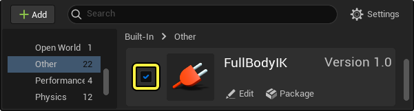
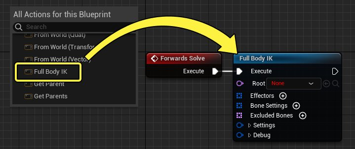
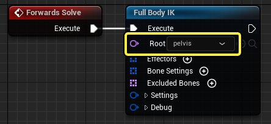
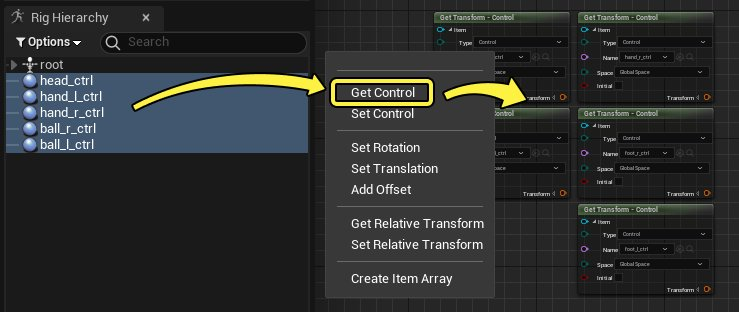
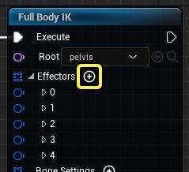
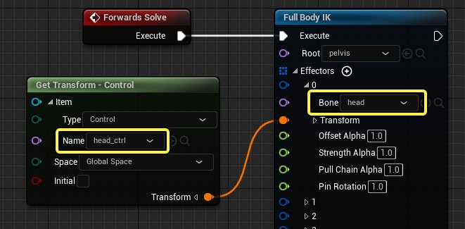
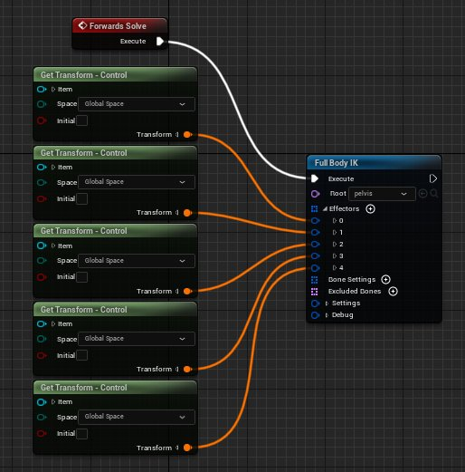
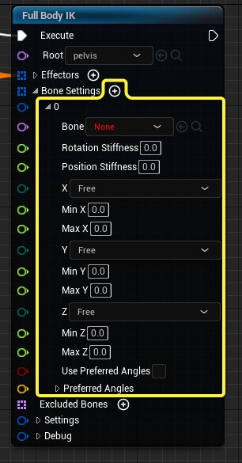

# 全身IK

> 路径：虚幻引擎5.7文档 / 为角色和对象制作动画 / 控制绑定 / 使用控制绑定制作动画 / 全身IK

> 原始页面：https://dev.epicgames.com/documentation/unreal-engine/control-rig-full-body-ik-in-unreal-engine

使用控制绑定的全身逆向运动学（FBIK）功能，在控制绑定中构建具有高度控制和灵活性的绑定。整体解算器方法在 **基于位置IK** 框架的基础上构建，可实现速度更快的绑定性能、逐骨骼设置、首选角度、挤压和拉伸等。FBIK旨在充当控制绑定中的程序调整工具，例如用于地面对齐或手臂伸展行为。

本文档概述了如何创建FBIK节点及其各种功能。

#### 先决条件

- FBIK是

  控制绑定图表

  中的节点，因此你应该了解控制绑定编辑器。
- 必须启用 **FullBodyIK** 插件。启用方法是，在虚幻编辑器菜单栏中找到 **编辑（Edit）>插件（Plugins）** ，并找到 **FullBodyIK** 。确保启用插件并重启编辑器。

  
- 你必须已经为角色创建控制绑定资产，并且知道如何创建功能按钮。有关如何执行此操作的信息，请参阅

  控制绑定快速入门指南

  页面。

## 创建和设置

创建FBIK节点，然后将骨骼和执行器分配给相应的引脚，可以在控制绑定中实现FBIK。

首先，在控制绑定图表中点击右键，并在上下文菜单中，选择 **层级（Hierarchy）>全身IK（Full Body IK）** 。这将创建Full Body IK节点。将该节点连接到 **[Forwards Solve](../control-rig-forwards-solve-and-backwards-solve/index.md#%E6%AD%A3%E5%90%91%E8%A7%A3%E7%AE%97)** 节点。

### 绑定图表设置

接下来，在Full Body IK节点上设置 **根（Root）** 骨骼属性。在标准的全身设置中，这可能是臀部或骨盆骨。

为FBIK系统创建并添加你选择的功能按钮。通常，这些功能按钮对应于你要影响的四肢，并且基于链的主要结束骨骼。在此示例中，为头、手和脚创建了功能按钮。

### 执行器设置

你需要为添加到图表中的每个功能按钮添加执行器引脚。为此，请点击 **执行器（Effectors）** 属性旁边的 **添加（Add）（+）** 按钮。需要为每个功能按钮创建执行器。

展开执行器条目之一，将显示其属性。在每个执行器中，你将为功能按钮设置相应的 **骨骼（Bone）** 值，然后从相应的 **Get Transform** 节点连接变换（Transform）引脚。

以相同的方式将每个执行器连接到其对应的Get Transform节点，直到连接所有执行器和功能按钮。

### 设置结果

现在你的角色应该有了一个基本的FBIK设置。你可以在控制绑定视口中操作功能按钮，查看效果。

> 动图已省略：全身ik执行器

## 骨骼设置

根据你的设置，基础FBIK行为可能不会按预期运行。这可能是因为没有启用某些骨骼设置。 **骨骼设置（Bone Settings）** 是Full Body IK节点中的属性，用于控制受FBIK影响的每个骨骼的行为。

点击 **骨骼设置（Bone Settings）** 旁边的 **添加（Add）（+）** 按钮，然后在 **骨骼（Bone）** 属性中指定你要影响的骨骼，将骨骼设置（Bone Settings）添加到Full Body IK节点。每个骨骼设置仅影响单个骨骼，因此你可能需要根据你的绑定遇到的特定问题，添加多个骨骼设置。

人体模型示例中可以看到以下问题：

- 臀部的旋转和平移太激进。

  > 动图已省略：fbik臀骨盆
- 腿部没有足够弯曲，外观僵硬。

  > 动图已省略：fbik腿部弯曲
- 脚踝旋转过于朝上，姿势不自然。

  > 动图已省略：fbik脚踝弯曲

**骨骼设置（Bone Settings）** 可以用于解决此类问题，以便支持你偏好的IK设置。

### 旋转和位置刚度

**旋转（Rotation）** 和 **位置刚度（Position Stiffness）** 属性用于控制IK链中受功能按钮和执行器影响的程度。使用这些属性更改骨盆骨骼受功能按钮移动影响的程度。值为 **0** 时，完全自由移动，而值为 **1** 时会完全锁定骨骼，使其无法移动。

> 图片已省略：fbik刚度

在人体模型示例中，骨盆骨骼通过骨骼设置指定，并且 **旋转（Rotation）** 和 **位置刚度（Position Stiffness）** 的值设置为 **0.8** 。在这种情况下，仍然可以做一些移动。

> 动图已省略：fbik刚度

### 偏好角度

可以使用偏好角度（Preferred Angles）优先关节沿特定轴旋转，达到执行器。在人体模型示例中，它们可以用于解决腿部和膝盖的僵硬问题。

骨骼设置的底部旁边是 **偏好角度（Preferred Angles）** 的属性。你还必须确保启用 **使用偏好角度（Use Preferred Angles）** 才能使用这些偏好角度。

> 图片已省略：fbik偏好角度

你指定的偏好角度（Preferred Angle）属性取决于角色的类型及其关节结构。对于此示例，人体模型的膝盖应该沿着 **Z轴** 向正方向弯曲，因此在本例中，**Z** 属性的值将设置为 **45**。

> 动图已省略：fbik偏好角度

### 限值

**限值（Limits）** 可以用于限制骨骼轴沿IK链旋转的范围，或完全锁定该旋转。这些设置位于刚度（Stiffness）和偏好角度（Preferred Angles）属性之间。

> 图片已省略：fbik限值

每个轴都有允许以下限制的设置：

- 自由（Free）

  ，允许骨骼自由移动。
- 有限（Limited）

  ，只允许在指定范围内移动。如果选择有限（Limited），则使用

  最小值/最大值（Min/Max）

  属性来定义移动范围。
- 锁定（Locked）

  ，禁用沿该轴的移动。

在人体模型示例中，这些限值可以用于纠正不自然的脚踝旋转问题。 **Z最小值（Min Z）** 的值设置为 **-70** ， **Z最大值（Max Z）** 的值设置为 **70** ， **Z** 轴设置为 **有限（Limited）** 。

> 动图已省略：fbik限值

## 排除骨骼

根据你的绑定需求，在某些情况下你可能要从FBIK解算中排除骨骼。在纠正看起来不自然的姿势或简化FBIK行为方面，此功能非常有用。

> 图片已省略：fbik排除骨骼

> [!NOTE]
> 建议排除骨骼，而不是专门使用骨骼设置（Bone Settings）将骨骼设置为完全僵硬或锁定。

要排除骨骼，请点击 **排除骨骼（Excluded Bones）** 旁边的 **添加（Add）（+）** 按钮，然后从下拉菜单中选择要排除的骨骼。

> 图片已省略：fbik排除骨骼

## 节点引用

以下是全身IK节点上所有引脚和设置的列表。

| 名称 | 描述 |
| --- | --- |
| **根（Root）** | FBIK链的根骨骼。 |
| 执行器（Effectors） |  |
| **骨骼（Bone）** | IK链的端点骨骼，对应于控制点。 |
| **变换（Transform）** | 用于控制端点骨骼的变换。 这通常是由链接到一个控制点的 **获取变换（Get Transform）** 节点提供的，这个控制点与端点骨骼共享相同的变换信息。 |
| **位置Alpha（Position Alpha）** | 此属性可衡量执行器或骨骼到达目标的 **位置** 的能力。 设置为 **1** 时，执行器会竭尽全力到达目标变换。 设置为 **0** 时，执行器会保持在输入姿势。 |
| **旋转Alpha（Rotation Alpha）** | 此属性可衡量执行器或骨骼到达目标的 **旋转** 的能力。 设置为 **1** 时，执行器会竭尽全力到达目标变换。 设置为 **0** 时，执行器会保持在输入姿势。 |
| **强度Alpha（Strength Alpha）** | 此属性会影响该执行器对IK链的作用强度。 设置为 **0** 时，执行器不会将IK链拉向自己，其他执行器将优先。 |
| **拉链Alpha（Pull Chain Alpha）** | 通过将值设置为大于0.0而启用此属性后，FBIK解算器会将骨架划分为多个"链"，这些"链"从执行器延伸到距离最近的骨架层级分支。 使用此方法可以改善稀疏骨骼链的结果，但对于更复杂的受约束骨骼链则会导致意料之外的结果。 |
| **固定旋转（Pin Rotation）** | 在执行器变换的旋转（**1.0**）和输入骨骼的旋转（**0.0**）之间混合执行器骨骼旋转。 |
| 骨骼设置（Bone Settings） |  |
| **骨骼（Bone）** | 这些设置应用到的指定骨骼。 该骨骼可以是层级中 **执行器（Effectors）** 与 **根（Root）** 之间的任何骨骼。 |
| **旋转/位置刚度（Rotation/Position Stiffness）** | 应用于骨骼的旋转或平移属性的刚度大小。 值为 **0** 允许自由移动，而值为 **1** 将完全锁定骨骼。 |
| **XYZ限制设置（XYZ Limit Setting）** | 所选骨骼轴上允许的移动类型。 **自由（Free）**，骨骼可以自由移动。 **受限（Limited）**，骨骼只能在指定范围内移动。 如果选择该选项，则会用 **最小值/最大值（Min/Max）** 属性定义移动范围。 **锁定（Locked）**，禁用沿该轴的移动。 |
| **最小/最大XYZ（Min/Max XYZ）** | 如果 **限制设置（Limit Setting）** 设置为 **受限（Limited）**，则可以使用"最小/最大XYZ（Min/Max XYZ）"属性指定允许的移动范围。 |
| **使用偏好角度（Use Preferred Angles）** | 启用 **偏好角度（Preferred Angles）**。 |
| **偏好角度（Preferred Angles）** | 指定压缩链后骨骼在每个轴上应旋转的量。 |
| 设置（Settings） |  |
| **迭代（Iterations）** | 增大此值，直到执行器在其所需的目标位置收敛。 增大此值也会增加FBIK链的CPU开销。 增加 **刚度（Stiffness）**、较高的 **质量乘数（Mass Multiplier）** 和 **旋转限制（Rotation Limits）** 都会影响收敛速度，因此可能需要对该值做更多调整。 |
| **质量乘数（Mass Multiplier）** | 这是一个全局值，影响骨骼对旋转和平移的抵抗程度。 值的范围通常在 **0.0** 到 **5.0** 之间，**0.0** 表示完全活络，**5.0** 表示非常僵硬。 **质量乘数（Mass Multiplier）** 值越大，实现收敛所需要的迭代次数也就越多。 |
| **允许拉伸（Allow Stretch）** | 启用此属性将使IK链上的骨骼平移以到达执行器。 "位置刚度（Position Stiffness）"值会影响该属性结果；刚度越高，拉伸越少。 |
| **根行为（Root Behavior）** | 设置解算器根的行为。 可从下列选项中选择： **预拉（Pre Pull）**，使根和所有子节点平移所拉伸的执行器的平均运动范围，这有助于在到达远距离时实现更好的收敛。 **固定为输入（Pin to Input）**，将根骨骼的平移和旋转锁定为输入姿势，并覆盖应用于根的任何骨骼设置。 这可用于短距离、非完整躯体设置。 **自由（Free）**，使根骨骼的行为与链中的其他骨骼一样，允许根骨骼自由移动或根据所应用的任何骨骼设置进行移动。 |
| **从输入姿势开始解算（Start Solve from Input Pose）** | 启用后，解算器会将每次更新重置为从当前输入姿势开始。 若禁用，则输入的动画姿势将被忽略，解算器从上一次解算结果开始工作。 |
| 调试（Debug） |  |
| **绘制比例（Draw Scale）** | 这是一个控制调试行大小的乘数。 |
| **绘制调试（Draw Debug）** | 启用此属性会显示该FBIK节点的IK链上所有受影响的骨骼。 |
