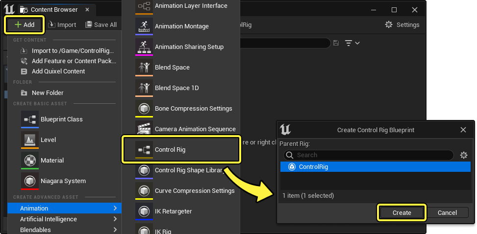
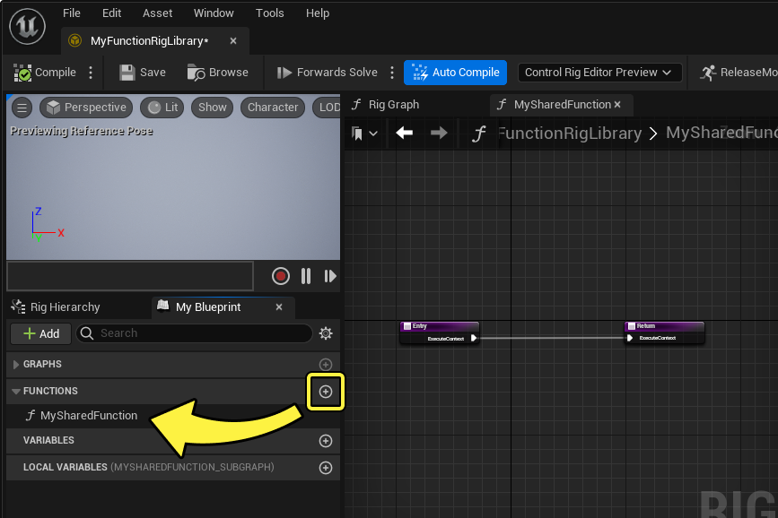
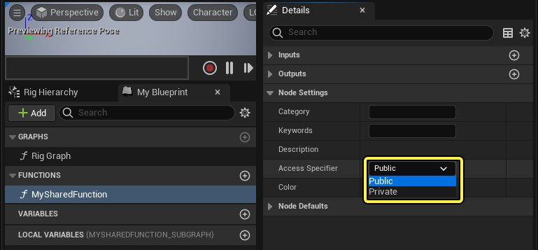
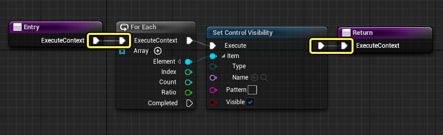
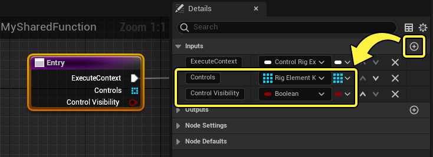
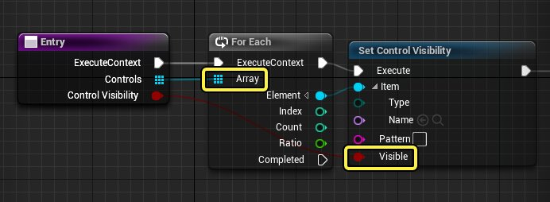
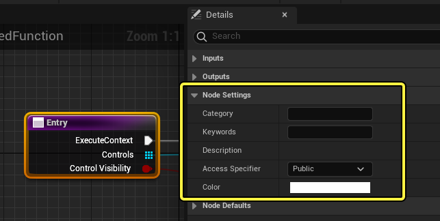
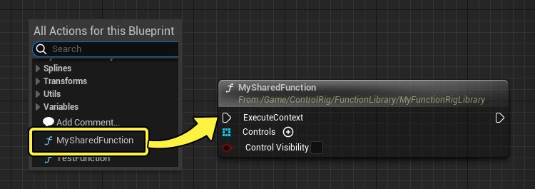

# Control Rig函数库

> 路径：虚幻引擎5.7文档 / 为角色和对象制作动画 / 控制绑定 / 使用控制绑定制作动画 / Control Rig函数库

> 原始页面：https://dev.epicgames.com/documentation/unreal-engine/control-rig-function-libraries-in-unreal-engine

类似于[蓝图](../../../../blueprints-visual-scripting/index.md)，将函数设为"公有"，可以在资产图表之间共享用户创建的函数。蓝图仅将函数共享到子类，而Control Rig函数可以在项目范围内共享。你可以创建自定义函数库，将其共享给项目中的所有Control Rig图表。

本文档提供了在Control Rig中创建函数库的最佳实践指南，并介绍了如何访问引擎提供的默认函数库。

## 新建函数库

以下步骤介绍了如何创建和使用新Control Rig函数库。

### 创建Control Rig容器

由于自定义函数只能存在于Control Rig资产内，第一步就是创建Control Rig资产。此Control Rig不应链接到特定骨骼网格体，因为它将主要用于包含你的函数。

在[内容浏览器](../../../../understanding-the-basics/content-browser/index.md)中，点击 **添加（Add (+)）** ，然后选择 **动画（Animation）> Control Rig** 。在 **创建Control Rig蓝图（Create Control Rig Blueprint）** 对话框窗口中，选择 **ControlRig** 并点击 **创建（Create）** 。在创建Control Rig后将其打开。

> [!NOTE]
> 就本资产而言，你的函数库 *是* Control Rig资产，不包含对特定骨架的依赖关系。作为函数容器，这可使资产尽量轻便。

### 创建公有函数

在[Control Rig编辑器](../control-rig-editor/index.md)中，点击 **我的蓝图（My Blueprint）** 的 **函数（Functions）** 分段上的 **添加（Add (+)）** ，创建新函数。

接下来，选择该函数，在 **细节（Details）** 面板中将 **访问说明符（Access Specifier）** 设置为 **公有（Public）** 。这使该函数在所有Control Rig中可公开访问。

### 设置函数中的数据

在函数中，你可以创建所需的任意内含逻辑，包括有关函数的元数据，例如提示文本说明和上下文菜单类别。

此示例创建了 **For Each** 和 **Set Control Visibility** 节点，并连接到了函数的 **Entry** 和 **Return** 节点。

要在Entry节点上创建变量输入，请选择 **Entry** 并点击 **细节（Details）** 面板中 **输入（Inputs）** 类别上的 **添加（Add (+)）** 。此示例创建了以下变量：

- Rig元素键（Rig Element Key）

  ，类型为

  数组（Array）

  。
- 布尔值（Boolean）

  ，类型为

  单一（Single）

  。

接下来，将变量输入连接到对应的节点。

你还可以选择编辑 **细节（Details）** 面板中的 **节点设置（Node Settings）** 属性，将分类、提示文本或其他有用属性添加到函数。

| 名称 | 说明 |
| --- | --- |
| **类别（Category）** | 填充此属性会将该节点放在具名的上下文菜单类别中。在Control Rig图表中添加该节点时，此类别可见。 |
| **关键字（Keywords）** | 添加搜索词，用于在使用上下文菜单搜索时查找此函数。 |
| **说明（Description）** | 为此函数添加提示文本说明。将光标悬停在上下文菜单项上，或悬停在添加到图表中的节点上时，你可以查看提示文本。 |
| **颜色（Color）** | 设置函数节点标题的颜色。你可以展开 **节点默认值（Node Defaults）** 类别来预览节点的外观。 |

### 引用函数

要在其他Control Rig中添加你的共享函数，请右键点击 **Rig图表（Rig Graph）** ，并从上下文菜单添加你的函数。共享函数还会在节点标题中显示其文件夹路径供参考。

> [!NOTE]
> 双击共享函数节点，将打开包含该函数的Control Rig资产，并打开函数逻辑。

### 将函数本地化

若要从共享版本分散函数逻辑，你可以将函数本地化，这会在你的当前Rig图表中创建函数的本地副本。

为此，请右键点击函数节点后选择 **将函数本地化（Localize Function）** 。在对话框窗口中，确保函数已启用，然后点击 **确定（OK）** 。

> 图片已省略：将函数本地化

该函数现在会转换为本地函数，其中你可以在本地分散逻辑。

> 图片已省略：本地化为新函数

## 标准函数库

默认情况下，虚幻引擎包含一个Control Rig **标准函数库** ，你可以参考该库来了解如何构造你自己的函数库。此外，它包含各种函数，可用于辅助你自己的操控工作流程。

标准函数库位于 **Control Rig插件（Control Rig Plugin）** 文件夹中。要访问该库，请打开 **内容浏览器（Content Browser）** ，点击 **设置（Settings）** 并启用 **显示引擎内容（Show Engine Content）** 和 **显示插件内容（Show Plugin Content）** ，确保该插件文件夹已启用。

> 图片已省略：显示引擎和插件内容

接下来，在 **引擎（Engine）> 插件（Plugins）> Control Rig内容（Control Rig Content）> StandardFunctionLibrary** 中找到并打开 **StandardFunctionLibrary** 。

> 图片已省略：标准函数库

打开后，你可以在 **我的蓝图（My Blueprint）** 面板中查看各种函数。

> 图片已省略：标准函数

> [!WARNING]
> 由于标准函数库由 **引擎内容（Engine Content）** 提供，你在该资产中所做的任何改动都会在你重新安装或更新虚幻引擎后被重载。因此我们建议你创建自己的函数库，不要修改引擎内容（Engine Content）的。
