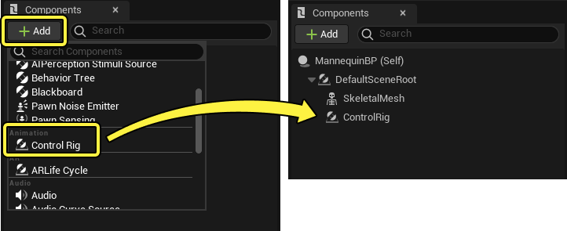
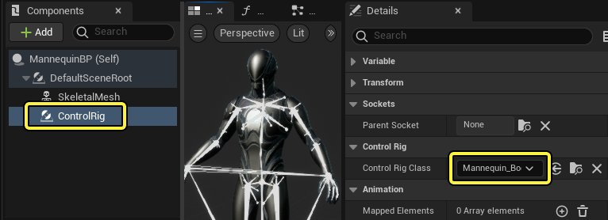
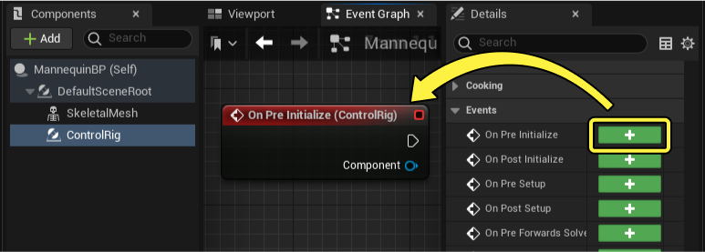
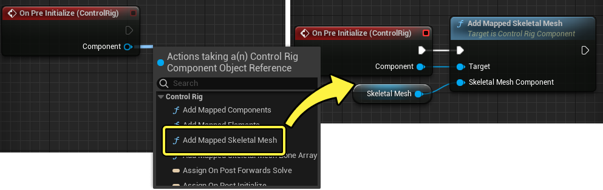
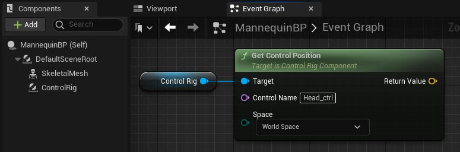
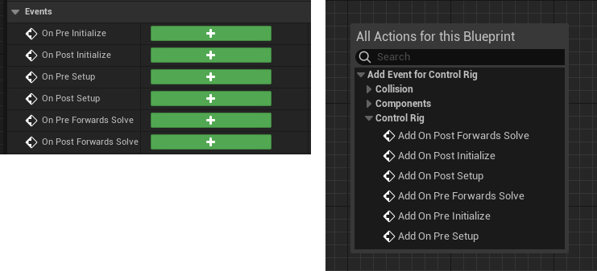
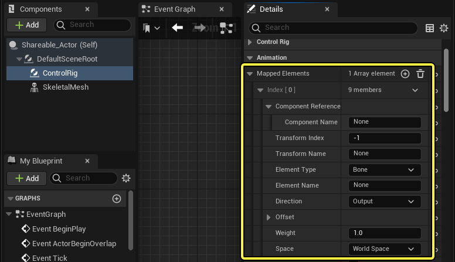
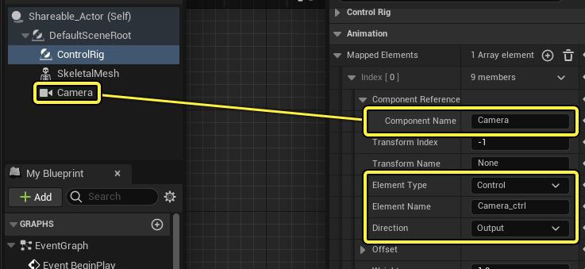

# 控制绑定组件

> 路径：虚幻引擎5.7文档 / 为角色和对象制作动画 / 控制绑定 / 使用控制绑定制作动画 / 控制绑定组件

> 原始页面：https://dev.epicgames.com/documentation/unreal-engine/control-rig-in-blueprints-in-unreal-engine

现在可以使用 **控制绑定组件（Control Rig Component）** 在蓝图中调用 **控制绑定** 。使用此组件，你可以使用蓝图中的Gameplay逻辑驱动控制绑定，重新初始化控制绑定，以便适应不同比例的角色，并将非骨骼网格体对象附加到控制绑定层级。

本文档概述了控制绑定组件、如何将其添加到你的蓝图，以及它启用的功能。

#### 先决条件

- 你已经为角色创建控制绑定资产，并且知道如何创建功能按钮。有关如何执行此操作的信息，请参阅

  控制绑定快速入门指南

  页面。
- 你已经创建包含骨骼网格体组件的

  Actor蓝图（Actor Blueprint）

  ，并且了解

  蓝图可视化脚本

  。

## 组件设置

点击蓝图组件（Blueprint Components）面板中的 **添加（Add）（+）** 按钮，并在 **动画（Animation）** 类别中，选择 **控制绑定** ，可以创建 **控制绑定组件** 。

然后，选择 **控制绑定组件（Control Rig Component）** ，并在 **细节（Details）** 面板中，指定你的默认 **控制绑定类（Control Rig Class）** 。点击控制绑定类（Control Rig Class）旁边的下拉菜单，并指定你的类。

> [!NOTE]
> 指定控制绑定类（Control Rig Class）后，控制绑定中的骨骼将在视口中可见。在控制绑定组件细节（Control Rig Component Details）面板中，禁用 **绘制骨骼（Draw Bones）** ，你可以隐藏这些骨骼。
>
> > 动图已省略：绘制骨骼

### 映射设置

最后，你需要将控制绑定 **映射** 到骨骼网格体，这必须在控制绑定组件（Control Rig Component）的 **初始化前事件（Pre Initialize Event）** 上完成。这样做是为了在 **骨骼网格体组件（Skeletal Mesh Component）** 和 **控制绑定组件（Control Rig Component）** 之间形成连接。

选择控制绑定组件（Control Rig Component）后，点击细节（Details）面板中 **初始化前（On Pre Initialize）** 旁边的 **添加（Add）（+）** 按钮。这样将在事件图表（Event Graph）中创建相应的事件。

然后，从 **组件（Component）** 引脚拖动，并从上下文菜单中，选择 **添加映射骨骼网格体（Add Mapped Skeletal Mesh）**。添加对骨骼网格体组件（Skeletal Mesh Component）的引用，并将其连接到 **骨骼网格体组件（Skeletal Mesh Component）** 引脚。

## 概述

完成[**组件设置**](#%E7%BB%84%E4%BB%B6%E8%AE%BE%E7%BD%AE)后，你就可以开始在蓝图中使用控制绑定组件（Control Rig Component）。借助它，你可以使用基本功能，例如获取或设置 **[绑定元素](../controls-bones-and-nulls-in-control-rig/index.md)**、编辑细节并创建新的映射连接。

### 细节

以下是控制绑定组件（Control Rig Component）的相关细节列表：

| 名称 | 说明 |
| --- | --- |
| **控制绑定类（Control Rig Class）** | 要实例化的控制绑定类。此处必须指定控制绑定资产。 |
| **映射元素（Mapped Elements）** | 此数组用于手动定义控制绑定的默认映射 |
| **更新函数前重置变换（Reset Transform Before Tick）** | 启用此选项将导致控制绑定变换在每次更新函数之前更新。 |
| **设置前重置初始值（Reset Initials Before Setup）** | 启用此功能将导致骨骼（Bones）、空值（Nulls）和功能按钮（Controls）上的初始变换在 **设置事件（Setup Event）** 之前重置。 |
| **每次更新函数时更新绑定（Update Rig on Tick）** | 启用此选项，可以确保在组件更新函数声时更新绑定。 |
| **在编辑器中更新（Update in Editor）** | 允许控制绑定行为在视口中可见，而无需运行或模拟。 |
| **启用惰性求值（Enable Lazy Evaluation）** | 启用此选项将使控制绑定仅求值任何映射输入是否已更改。 |
| **位置阈值（Position Threshold）** | 启用 **惰性求值（Lazy Evaluation）** 时要使用的位置或平移阈值。 |
| **旋转阈值（Rotation Threshold）** | 启用 **惰性求值（Lazy Evaluation）** 时使用的旋转阈值（以度为单位）。 |
| **比例阈值（Scale Threshold）** | 启用 **惰性求值（Lazy Evaluation）** 时使用的比例阈值。 |
| **绘制骨骼（Draw Bones）** | 启用从 **控制绑定类（Control Rig Class）** 导入的绘制骨骼。 绘制骨骼 |

### 事件

控制绑定可以从控制绑定组件调用以下事件。选择控制绑定组件（Control Rig Component ），并找到细节（Details）面板中的 **事件（Events）** 类别，或在事件图表（Event Graph）中点击右键，并选择 **添加控制绑定事件（Add Event for Control Rig）>控制绑定（Control Rig）** ，可以将这些事件添加到事件图表（Event Graph）中。

| 名称 | 图像 | 说明 |
| --- | --- | --- |
| **在初始化前（On Pre Initialize）** | 在初始化前 | 在组件的控制绑定初始化之前调用此事件。此事件可用于在初始化控制绑定组件之前，在控制绑定中设置变换或其他变量。在标准的控制绑定设置中，此事件会触发一次，类似于事件开始运行（Event Begin Play）。 |
| **初始化后（On Post Initialize）** | 初始化后 | 在组件的控制绑定初始化后调用此事件。此事件可用于在初始化控制绑定组件之后在控制绑定中设置变换或其他变量。在标准的控制绑定设置中，此事件会触发一次，类似于事件开始运行（Event Begin Play）。 |
| **设置前（On Pre Setup）** | 设置前 | 在组件控制绑定的设置事件（Setup Event）之前调用此事件。此事件可用于在控制绑定的设置事件之前，在控制绑定中设置变换或其他变量。在标准的控制绑定设置中，此事件会触发一次，类似于事件开始运行（Event Begin Play）。 |
| **设置后（On Post Setup）** | 设置后 | 在组件控制绑定的设置事件（Setup Event）之后调用此事件。此事件可用于在控制绑定设置事件之后，在控制绑定中设置变换或其他变量。在标准的控制绑定设置中，此事件会触发一次，类似于事件开始运行（Event Begin Play）。 |
| **正向解算前（On Pre Forwards Solve）** | 正向解算前 | 在组件控制绑定的正向解算（Forward Solve）之前调用此事件。此事件可用于在正向解算之前，在控制绑定中设置变换或其他变量。在标准的控制绑定设置中，此事件会持续触发，类似于事件更新函数（Event Tick）。 |
| **正向解算后（On Post Forwards Solve）** | 正向解算后 | 在组件控制绑定的正向解算（Forward Solve）之后调用此事件。此事件可用于在正向解算之后，在控制绑定中设置变换或其他变量。在标准的控制绑定设置中，此事件会持续触发，类似于事件更新函数（Event Tick）。 |

## 映射

在设置阶段，你需要将整个骨骼网格体组件（Skeletal Mesh Component）映射到控制绑定组件。但是，你也可以将控制绑定中的特定元素映射到其他组件。映射是双向的，这意味着控制绑定元素可以影响组件，也会受其影响。这样，映射有点类似于连接。

默认情况下，映射通常是通过将 **控制绑定类（Control Rig Class）** 中的骨骼名称匹配到 **骨骼网格体组件（Skeletal Mesh Component）** 来实现。通过这种方式，你可以想象当两个组件都在使用中时，你的蓝图中有两个不同的骨架在运行。映射允许这些骨架以及其他组件相互影响。

映射元素可以通过以下方式完成：

### 手动细节映射

在 **细节（Details）** 面板的 **动画（Animation）** 分段下，控制绑定组件有 **映射元素（Mapped Elements）** 数组。点击 **添加（Add）（+）** 按钮，你可以手动添加信息，以便将元素映射并连接到控制绑定。

例如，如果你想在你的蓝图中映射摄像机组件，以便功能按钮影响它的位置，那么输入以下属性：

- 将

  组件名称（Component Name）

  设置为

  摄像机（Camera）

  ，使其与摄像机组件（Camera Component）匹配。
- 将

  元素类型（Element Type）

  设置为

  功能按钮（Control）

  ，因为这是你要映射到的目标控制绑定元素。
- 将

  元素名称（Element Name）

  设置为

  Camera_ctrl

  ，这是你要映射到的目标控制绑定元素（Control Rig Element）的名称。
- 将

  方向（Direction）

  设置为

  输出（Output）

  ，以便定义映射方向。在此案例中，输出导致Control元素指示摄像机的变换。如果指定了

  输入（Input）

  ，则摄像机组件将改为指定Control元素。

以下属性可以用于创建映射设置。

| 名称 | 说明 |
| --- | --- |
| **组件引用（Component Reference）** | 要按名称定义的蓝图组件。如果控制绑定组件在基于Actor的蓝图中，在未指定名称的情况下，它默认为 **Self** 作为引用Actor。 |
| **变换索引（Transform Index）** | 具有多个变换的组件的可选索引值。 |
| **变换名称（Transform Name）** | 具有多个个性化变换名称的组件的可选名称值，例如骨骼网格体中的套接字。 |
| **元素类型（Element Type）** | 组件是其输入或输出的控制绑定中的绑定元素类型。你可以从骨骼（Bones）、功能按钮（Controls）、空值（Nulls）、曲线（Curves）、刚体（Curves）和引用（References）中进行选择。 |
| **元素名称（Element Name）** | 组件是其输入或输出的控制绑定中的绑定元素名称。 |
| **方向（Direction）** | 确定映射蓝图组件和控制绑定元素之间的控制方向。 **输出** 将导致控制绑定元素影响蓝图组件。 **输入** 将导致蓝图组件影响控制绑定元素。 |
| **偏移（Offset）** | 要应用于映射的变换偏移。 |
| **权重（Weight）** | 映射因子。 |
| **空间（Space）** | 应该在它上面定义映射的变换空间。 |

### 动态图表映射

你还可以在事件图表（Event Graph）中动态添加或更改映射。此步骤通过几个不同的函数和结构体完成，以实现不同级别的映射。

#### 添加映射骨骼网格体

该节点采用骨骼网格体组件，并将骨骼网格体的骨骼映射到控制绑定组件中使用的控制绑定中的预览网格体。这是控制绑定到骨骼网格体的映射连接。通常在蓝图中执行控制绑定的初始化时使用此节点。

> 图片已省略：添加映射的骨骼网格体

#### 添加映射骨骼网格体骨骼数组

此节点在骨骼网格体组件和控制绑定组件之间映射 **骨骼（Bones）** 或 **曲线（Curves）** 数组。此外，如果控制绑定骨架和骨骼网格体骨架的骨骼或曲线名称彼此不同，你可以指定 **源（Source）** 和 **目标（Target）** 名称。这提供了与"查找和替换（Find and Replace）"名称类似的工作流程，但它仅适用于单独的骨骼或曲线。

> 图片已省略：添加映射的骨骼网格体数组

> [!NOTE]
> 仅来自任一数组的骨骼或曲线将被映射。如果你也想映射整个骨架，那么你可以使用[**添加映射骨骼网格体**](#%E6%B7%BB%E5%8A%A0%E6%98%A0%E5%B0%84%E9%AA%A8%E9%AA%BC%E7%BD%91%E6%A0%BC%E4%BD%93)跟随此节点。

#### 添加映射元素

此节点将蓝图组件数组映射到控制绑定组件。这些组件由 **Make ComponentReference** 和 **Make ControlRigComponentMappedElement** 结构体定义。这些结构体的属性和格式与[**从细节面板映射**](#%E6%89%8B%E5%8A%A8%E7%BB%86%E8%8A%82%E6%98%A0%E5%B0%84)时相同。

> 图片已省略：添加映射元素

#### 添加映射组件

此节点将蓝图组件数组映射到控制绑定组件。这些组件通过直接引用组件和 **Make ControlRigComponentMappedComponent** 结构体来定义。此结构体的属性是 **Make ControlRigComponentMappedElement** 的简化变体，仅提供最常见的映射属性。

> 图片已省略：添加映射组件
