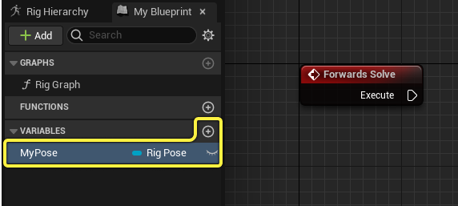
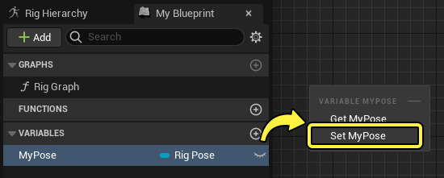
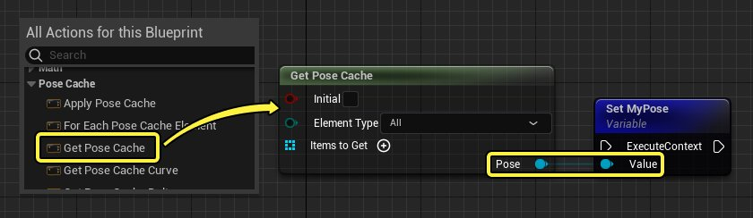
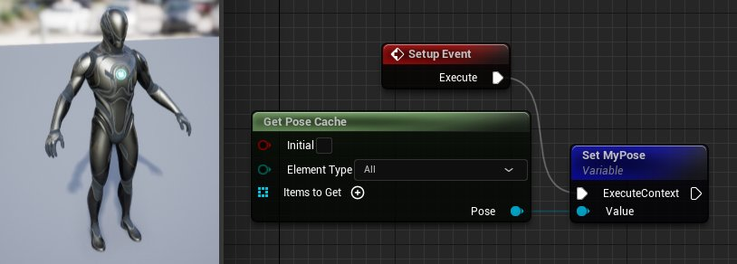
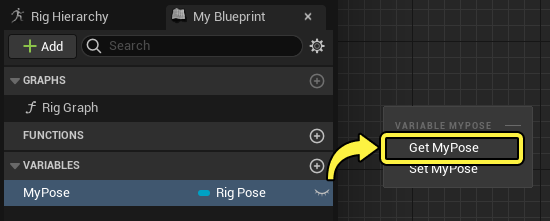
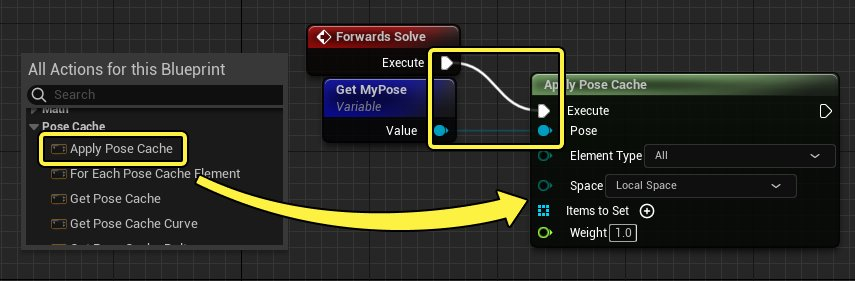
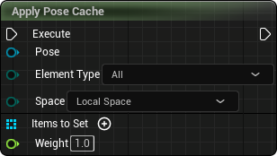
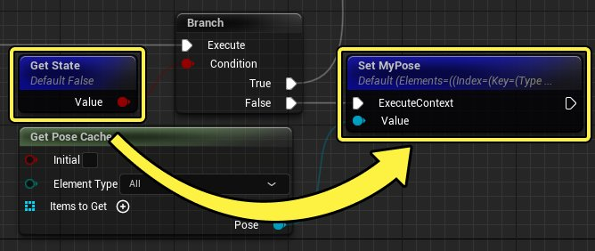

# 姿势缓存

> 路径：虚幻引擎5.7文档 / 为角色和对象制作动画 / 控制绑定 / 使用控制绑定制作动画 / 姿势缓存

> 原始页面：https://dev.epicgames.com/documentation/unreal-engine/control-rig-pose-caching-in-unreal-engine

控制绑定中的姿势缓存功能用于在控制绑定图表中的不同时间保存和应用动画姿势。所有 **[绑定元素](../controls-bones-and-nulls-in-control-rig/index.md)** 都可以缓存到姿势中，并且可以访问绑定图表中的不同属性，例如曲线值或变换。

本文档概述了姿势缓存功能以及如何存储和应用姿势。

#### 先决条件

- 你已经为角色创建控制绑定资产。有关如何执行此操作的信息，请参阅

  控制绑定快速入门指南

  页面。

## 快速入门

下面是显示如何存储和检索姿势的快速指南。

### 存储姿势

姿势在控制绑定的 **我的蓝图（My Blueprint）** 面板中存储为变量。要创建新的姿势变量，请点击 **变量（Variables）** 类别上的 **添加(+)（Add (+)）** 按钮，并将变量类型设置为 **绑定姿势（Rig Pose）** 。

接下来，将变量拖入绑定图表中并选择 **设置（Set）**，以在图表中将该变量作为 **设置（Set）** 操作进行引用。

然后，在图表中右键点击并选择 **获取姿势缓存（Get Pose Cache）**，以创建 **获取姿势缓存（Get Pose Cache）** 节点。连接 **姿势（Pose）** 和 **值（Value）** 引脚。

最后，将"设置（Set）"节点连接到一个事件。在此示例中，你可以将其连接到 **[设置事件](../control-rig-forwards-solve-and-backwards-solve/index.md#%E8%AE%BE%E7%BD%AE%E4%BA%8B%E4%BB%B6)** ，其中将存储角色的初始A姿势。

### 应用姿势

姿势使用 **应用姿势缓存（Apply Pose Cache）** 节点来应用，该节点从你的绑定姿势变量读取值。

首先，将绑定姿势变量拖入图表中并选择 **获取（Get）**，以在图表中将该变量作为 **获取（Get）** 操作进行引用。

然后，在图表中右键点击并选择 **应用姿势缓存（Apply Pose Cache）**，以创建 **应用姿势缓存（Apply Pose Cache）** 节点。连接 **姿势（Pose）** 和 **值（Value）** 引脚。还要将其连接到一个事件，这样你可以预览其评估，比如 **[正向解算](../control-rig-forwards-solve-and-backwards-solve/index.md#forwardssolve)** 事件。

由于你应用的是整个姿势，因此你可以编辑 **权重（Weight）** 值来预览姿势效果。对于此示例，你还可以使用 **[预览场景设置](../control-rig-editor/index.md#%E9%A2%84%E8%A7%88%E5%9C%BA%E6%99%AF%E8%AE%BE%E7%BD%AE)** 中的预览控制器，以便更好地查看姿势应用情况。

> 动图已省略：应用姿势

## 姿势缓存节点

以下姿势缓存节点可供在控制绑定图表中使用：

| 名称 | 图像 | 说明 |
| --- | --- | --- |
| **应用姿势缓存（Apply Pose Cache）** | 应用姿势缓存 | 应用保存的姿势。包括用于设置绑定元素的属性、变换空间、要设置的项目以及权重。 |
| **对于每个姿势缓存元素（For Each Pose Cache Element）** | 对于每个姿势缓存元素 | 此节点在给定姿势中的所有项目中以迭代方式执行。 |
| **获取姿势缓存（Get Pose Cache）** | 获取姿势缓存 | 基于 **要获取的项目（Items to Get）** 绑定元素类型的输入来保存姿势。如果未指定项目，则将使用所有项目。 |
| **获取姿势缓存曲线（Get Pose Cache Curve）** | 获取姿势缓存曲线 | 从保存的姿势获取单个 **[动画曲线](../../../skeletal-mesh-animation-system/animation-assets-and-features/animation-sequences/animation-curves/index.md)** 。 |
| **获取姿势缓存增量（Get Pose Cache Delta）** | 获取姿势缓存增量 | 比较两个姿势并输出比较检查布尔值。 |
| **获取姿势缓存项目（Get Pose Cache Items）** | 获取姿势缓存项目 | 在项目数组中返回绑定元素。 |
| **获取姿势缓存变换（Get Pose Cache Transform）** | 获取姿势缓存变换 | 从姿势中的单个绑定元素获取变换或动画曲线值。 |
| **获取姿势缓存变换数组（Get Pose Cache Transform Array）** | 获取姿势缓存变换数组 | 获取姿势中所有项目的变换并将其作为变换数组返回。 |
| **姿势缓存是否为空（Is Pose Cache Empty）** | 姿势缓存是否为空 | 检查姿势是否为空。 |
| **绘制姿势缓存（Draw Pose Cache）** | 绘制姿势缓存 | 在视口中保存的姿势上绘制轴调试信息。它仅绘制姿势中保存的元素。 绘制姿势缓存 |

与姿势缓存相关的大多数节点都包含以下常见属性：

| 名称 | 说明 |
| --- | --- |
| **元素类型（Element Type）** | 保存姿势时要筛选的绑定元素。你可以从以下元素选择： **骨骼（Bones）** **Nulls** **功能按钮（Controls）** **曲线（Curves）** **所有（All）** |
| **空间（Space）** | 姿势信息应该在变换空间中存储和应用。可以是 **本地（Local）** 或 **全局（Global）** 空间。 |
| **要设置的项目（Items to Set）** | 保存姿势时要包含的绑定元素的数组。如果此处未设置内容，则将根据指定的 **元素类型（Element Type）** 包含所有元素。 |

## 工作流程示例

通过使用数组构建节点（如 **获取子节点（Get Children）** ），你可以仅获取一部分绑定元素以保存到姿势中。这一步在你只想将姿势保存并应用到特定元素中时很有用。

> 动图已省略：部分应用姿势

**分支（Branch）** 之类的执行节点可用于在特定时间或状态保存姿势。

