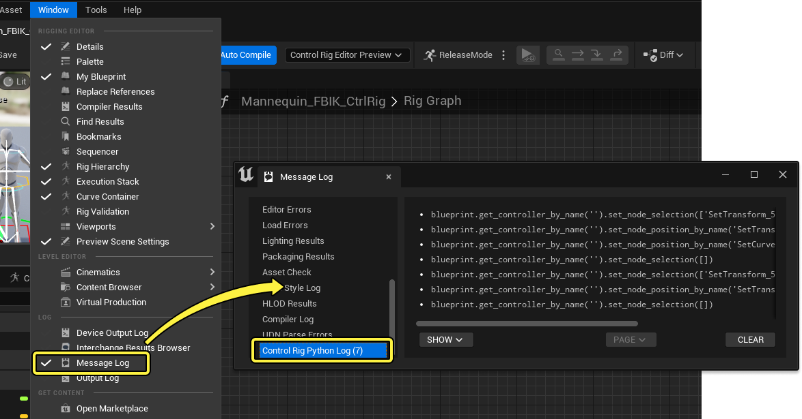
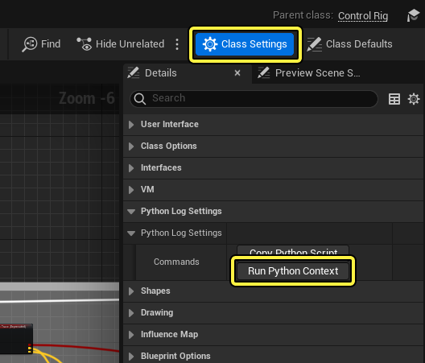
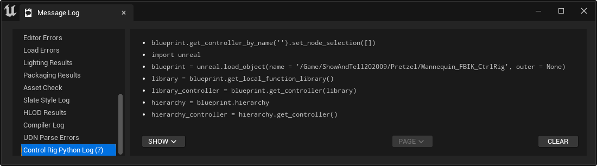
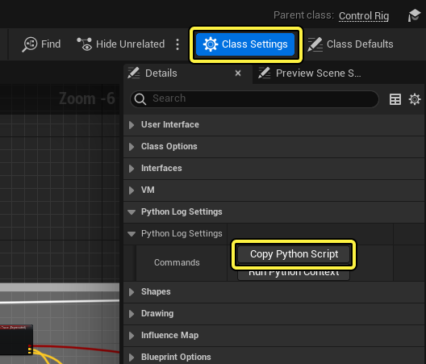
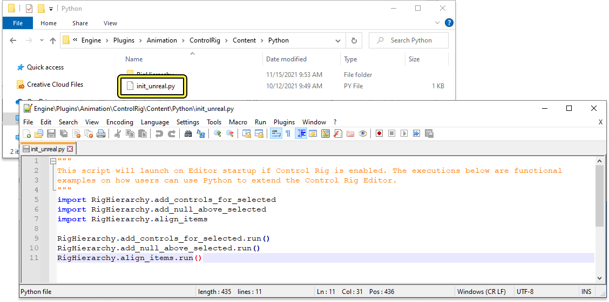
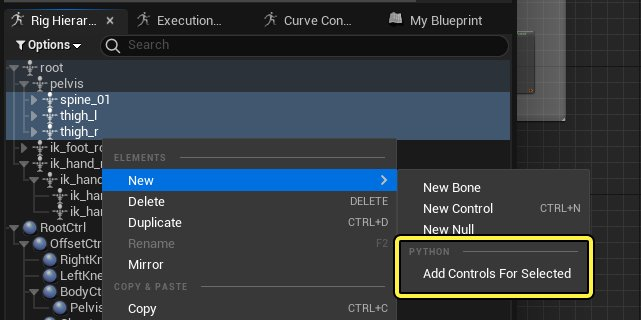

# 控制绑定中的Python脚本

> 路径：虚幻引擎5.7文档 / 为角色和对象制作动画 / 控制绑定 / 使用控制绑定制作动画 / 控制绑定中的Python脚本

> 原始页面：https://dev.epicgames.com/documentation/unreal-engine/control-rig-python-scripting-in-unreal-engine

控制绑定中的[Python脚本](https://dev.epicgames.com/documentation/404)功能能让你将工作流程自动化，并创建可用于绑定流程的工具。你还可以使用 **控制绑定Python日志（Control Rig Python Log）** 对命令进行逆向工程，复制脚本以便共享到其他项目。

本文介绍了控制绑定的Python脚本功能、控制绑定Python Log功能，以及一些脚本示例。

#### 先决条件

- 你已经打开了控制绑定资产。
- 你有一些[在虚幻引擎中编写Python脚本](https://dev.epicgames.com/documentation/404)的经验。

## 脚本编写概述

Python主要用于在控制绑定中与绑定图表（Rig Graph）进行交互，绑定图表包含多个模块：

| 模块名称 | 说明 |
| --- | --- |
| **ControlRig** | 包含绑定运行时。 |
| **ControlRigDeveloper** | 包含更改绑定的所有功能。 |
| **ControlRigEditor** | 包含前端和用户界面逻辑。 |

控制绑定图表使用 **模型（Model） - 视图（View） - 控制器（Controller）** 设计模式实现。模型层就是图表本身，其中使用了以下术语：

| 控制绑定Python术语 | 说明 |
| --- | --- |
| **RigUnit** | 为绑定定义函数的C++结构体（示例：FRigUnit_GetBoneTransform）。 |
| **引脚（Pin）** | 函数的单个输入或输出。 |
| **链接（Link）** | 两个引脚之间的连接。 |
| **节点（Node）** | RigUnit的视觉效果表示。 |
| **图表（Graph）** | 定向图表，包含绑定中所有节点和链接。 |
| **PinPath** | 描述图表中引脚地址的字符串（示例：NodeA.Translation.X）。 |
| **控制器（Controller）** | 用于在图表中做出更改的对象。 |
| **RigElementKey** | 从骨骼（Bone）、控制点（Control）、空（Null）或曲线（Curve）中选择。 |
| **骨骼（Bone）** | 骨架中用于变形的绑定元素。 |
| **控制点（Control）** | 用于交互的绑定元素。 |
| **空（Null）** | 用于中间变换的绑定元素。 |
| **曲线（Curve）** | 用于存储浮点通道的绑定元素。 |
| **形状（Shape）** | 视口中控制点的视觉效果表示。 |
| **层级（Hierarchy）** | 用于存储绑定中所有骨骼、控制点、空和曲线的容器。 |
| **HierarchyController** | 与控制器类似，HierarchyController用于更改层级。 |
| **编译器（Compiler）** | 将控制绑定图表转换为高性能运行时的对象。 |
| **VM** | 用于执行绑定的虚拟机运行时。 |
| **常量（Constant）** | 运行时不会更改的值。 |
| **参数（Parameter）** | 可以用作绑定输入或输出的值 |
| **变量（Variable）** | 可以在运行时更改并在绑定执行后保留的值。 |
| **ControlRigBlueprint** | 包含图表（Graph）、控制器（Controller）、编译器（Compiler）和VM的资产。 |
| **工厂（Factory）** | 负责创建和导入新对象的对象。在整个虚幻编辑器中用于创建资产。 |

> [!NOTE]
> Python通过 **Python编辑器脚本插件（Python Editor Script Plugin）** 启用，它本身在虚幻引擎中默认启用。当启用 **控制绑定插件（Control Rig Plugin）** 时，该插件也会自动启用，因为它是依赖项。

### 访问控制绑定

编写脚本的第一步是访问你将与之交互的主要对象，此处为 **ControlRigBlueprint** 对象。你有几种访问方法，但是你的第一个命令通常是加载ControlRigDeveloper模块，以便更改控制绑定。

```
unreal.load_module('ControlRigDeveloper')
```

要访问现有绑定，请使用以下示例命令加载资产：

```
rig = unreal.load_object(name = '/Game/ControlRig/Samples/Mannequin_ControlRig', outer = None)
```

你还可以使用以下内容加载当前打开的控制绑定资产：

```
rigs = unreal.ControlRigBlueprint.get_currently_open_rig_blueprints()
```

使用以下内容新建控制绑定资产：

```
factory = unreal.ControlRigBlueprintFactory()rig = factory.create_new_control_rig_asset(desired_package_path = '/Game/TestRig')
```

最后，你可以使用以下示例代码基于骨架或骨骼网格体创建控制绑定资产：

```
# load a skeletal meshmesh = unreal.load_object(name = '/Game/Mannequin/Character/Mesh/SK_Mannequin.SK_Mannequin', outer = None)  # create a control rig for the meshfactory = unreal.ControlRigBlueprintFactoryrig = factory.create_control_rig_from_skeletal_mesh_or_skeleton(selected_object = mesh)
```

## Python日志

**Python日志（Python Log）** 提供了你在控制绑定编辑器中执行的所有操作的文本日志。其中包括视口、层级和图表中的操作。你可以使用它引用要在Python脚本中使用的命令。

要访问日志，请从控制绑定主菜单中，点击 **窗口（Window）>消息日志（Message Log）**，然后从消息日志（Message Log）侧边栏中选择 **控制绑定Python日志（Control Rig Python Log）**。



你现在可以在绑定图表中执行操作并查看日志中记录的操作。

> 动图已省略：Python日志记录操作

如果你要保存命令以便在其他地方共享或使用，你可以从日志中选择任意行，并按 **Ctrl + C** 复制，然后粘贴到文本编辑器中。你还可以按住 **Shift** 选择多行。

> 动图已省略：Python日志复制粘贴

将命令粘贴到 **输出日志（Output Log）** 中并执行即可测试命令，确保将日志类型设置为Python。在此示例中，创建了新控制点。

> 动图已省略：Python输出日志命令

### Python上下文

Python上下文用于设置在运行Python命令时应该影响哪个控制绑定资产的上下文。默认情况下，查看控制绑定时不设置上下文。在 **类设置（Class Settings）** 细节（面板中，点击 **运行Python上下文（Run Python Context）**，你可以设置当前控制绑定的上下文。



这将执行一系列将当前控制绑定资产绑定到Python上下文的命令。这允许在此控制绑定资产中粘贴和执行从Python日志复制的命令。



```
blueprint.get_controller_by_name('').set_node_selection([])import unrealblueprint = unreal.load_object(name = '/Game/ShowAndTell202009/Pretzel/Mannequin_FBIK_CtrlRig', outer = None)library = blueprint.get_local_function_library()library_controller = blueprint.get_controller(library)hierarchy = blueprint.hierarchyhierarchy_controller = hierarchy.get_controller() 
```

### 复制Python脚本

你还可以将控制绑定的节点、绑定元素和属性全部复制到剪贴板。然后，你可以将其粘贴到外部脚本编辑器中，或粘贴回输出日志，以便在另一个控制绑定上执行。复制Python脚本对于共享、调试和比较不同绑定之间的逻辑很有用。与复制单个命令类似，复制整个绑定对于从控制绑定对Python命令进行逆向工程也很有用。

要复制控制绑定，请点击 **类设置（Class Settings）** 细节面板中的 **复制Python脚本（Copy Python Script）**。



## Python脚本示例

### 添加节点

由于节点是 **RigUnit** 结构体的视觉效果表示，因此你需要访问该单元才能将节点添加到图表中。

```
unreal.load_module('ControlRigDeveloper') # get an array of all available unitsunits = unreal.ControlRigBlueprint.get_available_rig_units() # print details about the unitsfor unit in units:      print(unit.get_path_name())      print(unreal.EditorAssetLibrary.get_metadata_tag(unit, 'Keywords'))
```

然后，你需要访问控制器。控制器是用于对图表做出更改的中心对象。

```
controller = rig.get_controller()
```

要将节点添加到图表中，你可以使用 `add_struct_node`、`add_comment_node`、`add_parameter_node` 或 `add_variable_node` 函数。下面的示例重点关注结构体节点，这是最常见的类型。结构体节点是RigUnit的视觉效果表示，因此图表中的大多数节点都是结构体节点。

```
# get the unit - you might also get this by path or similarunit = unreal.RigUnit_MathFloatAdd.static_struct() # add the node to the graph provided the unit struct, the method (is always Execute) and 2D position in the graphnode = controller.add_unit_node(script_struct = unit, method_name = "Execute", position = unreal.Vector2D(0, 0))
```

### 编辑层级

除了编辑图表，你还可以使用Python代码编辑层级。控制绑定层级中的每个绑定元素都使用 **RigElementKey** 标识，其中包含元素的名称和类型。当你创建层级中的元素或与之交互时，你将需要使用此键。

控制绑定元素是结构体，这意味着复制它们时使用的是其总值。因此，如果你更改了元素，你可能必须在层级中重新设置。

**层级** 可用于查询元素、获取或设置全局/局部变换，以及将元素重置回初始值。

**HierarchyController** 可以用于添加、删除和编辑元素。如有必要，你还可以使用它来重命名和重新确定父元素。

要检查当前层级，可以使用以下Python代码：

```
# access the hierarchy objecthierarchy = rig.hierarchy # get all element keys and print themelements = hierarchy.get_all_keys()for element in elements:      print(element)
```

要创建绑定元素，例如骨骼，你可以使用以下代码：

```
# access the hierarchy controller objecthierarchy_ctrlr = rig.get_hierarchy_controller() # add a new bonenew_bone_key = hierarchy_ctrlr.add_bone(name = "MyBone", parent = unreal.RigElementKey(), transform = unreal.Transform()) # add a new child bone to a parent that is 10 units away on Zchild_transform = unreal.Transform(location = [0, 0, 10]) new_child_bone_key = hierarchy_ctrlr.add_bone(name = "ChildBone", parent = new_bone_key, transform = child_transform)
```

### 变量和资产操作

要使用getter和setter节点创建控制绑定变量，你可以使用以下代码：

```
rig.add_member_variable("MyVariable", "Transform", is_public = True, is_read_only = False, default_value ="") # Create variable getter nodecontroller.add_variable_node_from_object_path(MyVariable, 'FTransform', '/Script/CoreUObject.Transform', is_getter = True, default_value = '', position = unreal.Vector2D(), node_name = 'MyVariable_Getter') # Create variable setter nodecontroller.add_variable_node_from_object_path(MyVariable, 'FTransform', '/Script/CoreUObject.Transform', is_getter = False, default_value = '', position = unreal.Vector2D(), node_name = 'MyVariable_Setter')
```

预览网格体也可以使用以下代码更改：

```
# load a skeletal meshmesh = unreal.load_object(name = '/Game/Mannequin/Character/Mesh/SK_Mannequin.SK_Mannequin', outer = None) # create a new (empty) assetfactory = unreal.ControlRigBlueprintFactory()rig = factory.create_new_control_rig_asset(desired_package_path = '/Game/TestRig') # set the preview meshrig.set_preview_mesh(preview_mesh = mesh)
```

你可以使用以下代码编译控制绑定，具体取决于你的上下文：

```
# force a recompile of the VMrig.recompile_vm() # compile the VM if there are pending changesrig.recompile_vm_if_required() # request a compilation if auto compile is enabled and the editor is openrig.request_auto_vm_recompilation() # request the control rig to run an init pass (initialize all units)rig.request_control_rig_init() # request the control rig to run a full blueprint compileunreal.BlueprintEditorLibrary.compile_blueprint(rig)
```

## 编辑器启动

Python脚本可以在编辑器启动时加载，这对于加载自定义工具和内置Python函数很有用。你可以从以下文件夹路径的项目目录中找到此脚本和示例脚本函数：

```
Engine\Plugins\Animation\ControlRig\Content\Python
```

此文件夹中是init_unreal.py脚本，其中包含以下代码：

```
import RigHierarchy.add_controls_for_selectedimport RigHierarchy.add_null_above_selectedimport RigHierarchy.align_items RigHierarchy.add_controls_for_selected.run()RigHierarchy.add_null_above_selected.run()RigHierarchy.align_items.run()
```



此代码将加载启用了额外功能的示例脚本。

例如，**add_controls_for_selected** 将启用使用附加规则在选定骨骼上创建控制点的功能。这些规则由自定义Python脚本确定，脚本位于Engine\Plugins\Animation\ControlRig\Content\Python\RigHierarchy\add_controls_for_selected.py中。


