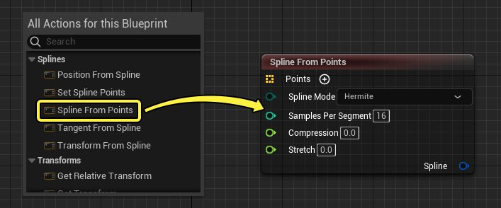
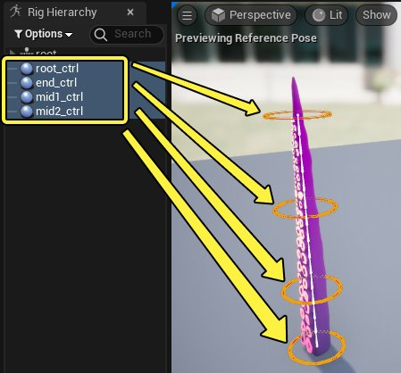
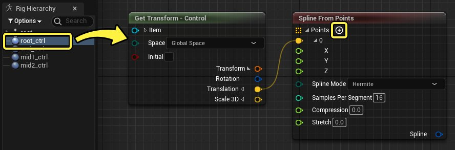
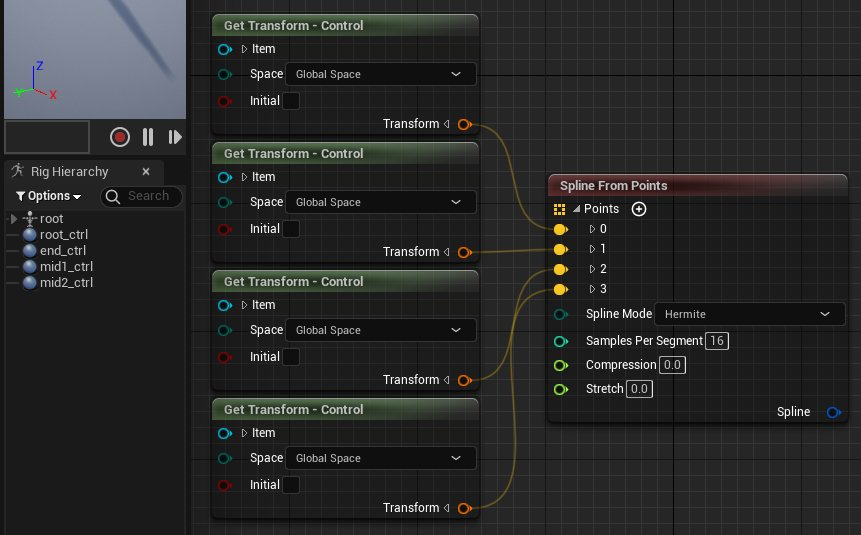
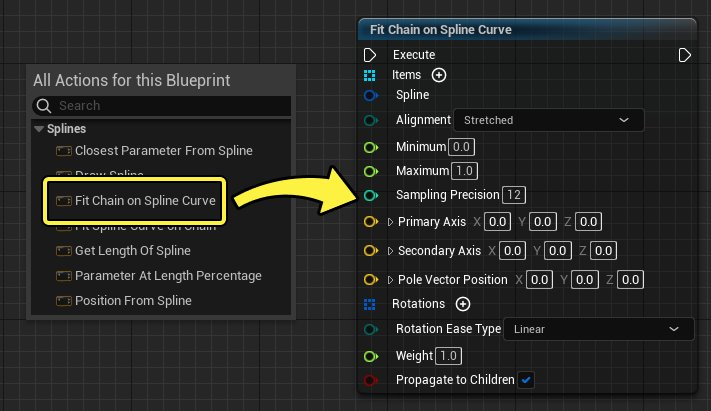
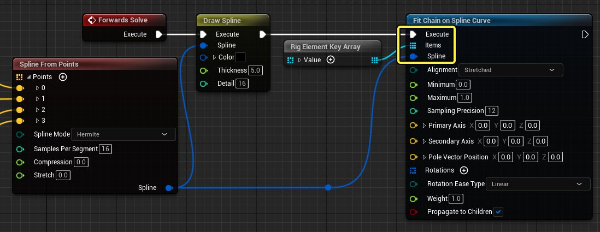
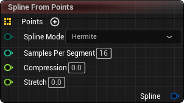
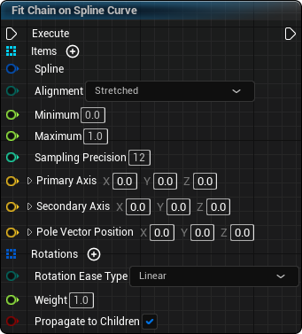

# 样条线操控

> 路径：虚幻引擎5.7文档 / 为角色和对象制作动画 / 控制绑定 / 使用控制绑定制作动画 / 样条线操控

> 原始页面：https://dev.epicgames.com/documentation/unreal-engine/control-rig-spline-rigging-in-unreal-engine

样条线可以在控制绑定中构建和使用，以便创建动态的程序动作，无论骨架层级如何。利用样条线，你可以创建更复杂的姿势，同时对肢体（如触角、脊柱和蛇）使用更少的必需功能按钮。

本文档概述了如何在绑定中创建和使用样条线。

#### 先决条件

- 你已经为骨架网格体创建控制绑定资产，该网格体包含适合样条线的关节结构，如尾巴。有关如何执行此操作的信息，请参阅

  控制绑定快速入门指南

  页面。
- 你熟悉如何创建和摆放

  功能按钮

  。

## 创建样条线

控制绑定中的样条线创建操作是通过指定任意平移点来完成的，这些平移点用于构造样条线。在典型的设置中，这些点基于 **功能按钮（Controls）** 中的变换信息。

首先，在绑定图表中右键点击并选择 **来自点的样条线（Spline From Points）** ，以创建 **来自点的样条线（Spline From Points）** 节点。

接下来，创建用于定义样条线中的点的绑定元素。在本示例中，会创建四个功能按钮，并沿触角的长度均匀分布。功能按钮数量不需要对应于链中的骨骼数量。

接下来，将根绑定元素引用到绑定图表，然后点击 **来自点的样条线（Spline From Points）** 节点上的 **添加(+)（Add (+)）** 按钮以添加数组中的第一个样条线点。展开元素引用上的 **变换（Transform）** 引脚，并将 **变换（Transform）** 引脚连接到 **点（Points）** 引脚上的输入。

继续为你想用于构成样条线的所有绑定元素添加更多样条线点。你必须确保将其连接到 **来自点的样条线（Spline From Points）** 节点的顺序对应于样条线的方向。

> [!NOTE]
> 控制绑定中的样条线需要至少四个点，才能成功创建样条线。

现在，你可以使用 **绘制样条线（Draw Spline）** 节点预览样条线，该节点直观显示了样条线的内容。右键点击图表并选择 **绘制样条线（Draw Spline）**，然后连接 **来自点的样条线（Spline From Points）** 中的 **样条线（Spline）** 引脚以及 **正向解算（Forwards Solve）** 中的 **执行（Execute）** 事件，从而创建此节点。在视口中操控功能按钮可预览样条线行为。

> 动图已省略：控制绑定样条线预览

### 将样条线应用于骨骼

创建样条线后，你就可以将其应用于关节链。

首先，右键点击图表并选择 **适应样条线曲线上的链（Fit Chain on Spline Curve）**，以创建 **适应样条线曲线上的链（Fit Chain on Spline Curve）** 节点。

接下来，从 **绑定层级（Rig Hierarchy）** 面板对你想包括在样条线中的骨骼进行多选，将它们拖入绑定图表，然后选择 **创建项目数组（Create Item Array）**。对于此操作，选择顺序很重要，可确保生成的骨骼数组匹配样条线点的顺序。

> 动图已省略：样条线骨骼数组

最后，将 **绑定元素（Rig Element）** 数组连接到 **项目（Items）** 引脚、**来自点的样条线（Spline From Points）** 中的 **样条线（Spline）** 引脚，并确保 **执行（Execute）** 事件连接到你的控制绑定逻辑链。

你的样条线现在应该会影响骨骼链。

> 动图已省略：控制绑定样条线

## 样条线属性

**来自点的样条线（Spline From Points）** 节点中提供了以下属性。

| 名称 | 说明 |
| --- | --- |
| **点（Points）** | 将用于构造样条线的位置信息。可以是数组，也可以通过点击 **添加(+)（Add (+)）** 按钮使用单个平移引脚来构建。 |
| **样条线模式（Spline Mode）** | 要使用的样条线的类型。你可以从以下选项中选择： **Hermite**，这将确保样条线通过所有定义的 **点（Points）**。 hermite样条线类型 **BSpline**，这是更平滑的样条线，将仅通过开始和结束点。它基于 **[TinySpline](https://msteinbeck.github.io/tinyspline/)** 库。 bspline类型 |
| **每个片段的取样数（Samples Per Segment）** | 此属性控制样条线的近似准确性。更高的数字将导致样条线更准确、更平滑。更低的数字将导致样条线看起来锯齿状更突出、准确性更低。性能成本会随取样数量增加，所以最好确保此数字不要设置得太高。 |
| **压缩（Compression）** | 样条线在缩短其长度时应该压缩的数量。 |
| **拉伸（Stretch）** | 样条线在增加其长度时应该拉伸的数量。 |
| **样条线（输出）（Spline (Output)）** | 从此节点生成的样条线。 |

**适应样条线曲线上的链（Fit Chain on Spline Curve）** 节点中提供了以下属性。

| 名称 | 说明 |
| --- | --- |
| **项目（Items）** | 要与提供的 **样条线（Spline）** 对齐的绑定元素的数组。 |
| **样条线（Spline）** | 要对齐到的 **样条线（Spline）** 曲线。 |
| **对齐（Alignment）** | 是否将对齐的元素拉伸到整个样条线长度。 **拉伸（Stretched）** 将导致实现最大程度的拉伸。 样条线拉伸对齐 **前端（Front）** 将禁用拉伸。 样条线前端对齐 |
| **最小值（Minimum）** | 要用于曲线的最小 **U** 值。 **U** 是所有组合的控制点之间的规格化（0-1）百分比。 |
| **最大值（Maximum）** | 要用于曲线的最大 **U** 值。 **U** 是所有组合的控制点之间的规格化（0-1）百分比。 |
| **取样精度（Sampling Precision）** | 此属性控制样条线的近似准确性。更高的数字将导致样条线更准确、更平滑。更低的数字将导致样条线看起来锯齿状更突出、准确性更低。这会覆盖 **来自点的样条线（Spline From Points）** 中的 **每个片段的取样数（Samples Per Segment）** 属性。性能成本会随取样数量增加，所以最好确保此数字不要设置得太高。 |
| **主轴（Primary Axis）** | 在链中对齐的主轴。在简单的设置中，可以忽略此属性，但你通常需要将其设置为项目链的进展方向。 样条线主轴 |
| **次轴（Secondary Axis）** | 在链中对齐的次轴或"up"轴。在简单的设置中，可以忽略此属性，但你通常需要将其设置为极向量（如果使用）的方向。 样条线次轴 |
| **极向量位置（Pole Vector Position** | 可选的极向量功能按钮的位置。这仅在设置了 **次轴（Secondary Axis）** 时起作用。 |
| **旋转（Rotations）** | 要以递增方式应用于总体样条线的旋转的数组。 |
| **旋转缓动类型（Rotation Ease Type）** | 要在每个旋转元素之间使用的缓动类型。 |
| **权重（Weight）** | 在将元素应用于曲线时要使用的因子。 |
| **传播到子项（Propagate to Children）** | 绑定元素中的更改是否应该以递归方式应用于所有子项。 |

## 样条线节点

以下样条线节点可供在控制绑定图表中使用：

| 名称 | 图像 | 说明 |
| --- | --- | --- |
| **样条线中最接近的参数（Closest Parameter From Spline）** | 样条线中最接近的参数 | 从给定样条线和位置检索最接近的 **U** 值。 |
| **绘制样条线（Draw Spline）** | 绘制样条线 | 在视口中显示样条线曲线以用于预览用途。包括用于控制 **颜色（Color）** 、**厚度（Thickness）** 和取样 **细节（Detail）** 的属性。 |
| **适应样条线曲线上的链（Fit Chain on Spline Curve）** | 适应样条线曲线上的链 | 沿项目数组适应给定样条线。执行包括样条线的反向解算时，通常会使用此节点。 |
| **适应链上的样条线曲线（Fit Spline Curve on Chain）** | 适应链上的样条线曲线 | 将绑定元素链应用于样条线。 |
| **获取样条线长度（Get Length Of Spline）** | 获取样条线长度 | 获取样条线的长度。 |
| **长度百分比处的参数（Parameter At Length Percentage）** | 长度百分比处的参数 | 在给定长度百分比处时，返回样条线的 **U** 值。 |
| **样条线中的位置（Position From Spline）** | 样条线中的位置 | 在给定 **U** 值时，返回样条线上的位置。 |
| **设置样条线点（Set Spline Points）** | 设置样条线点 | 将样条线的当前现有点设置为新值，然后输出生成的新样条线。 |
| **来自点的样条线（Spline From Points）** |  | 根据平移点的数组构建样条线。 |
| **样条线中的切线（Tangent From Spline）** |  | 返回 **U** 定义的样条线上某个点的切线角度。 |
| **样条线中的变换（Transform From Spline）** |  | 根据基于给定 **Up** 和 **Roll** 的给定 **样条线（Spline）** 和 **U** 值，返回相应的变换。 |
