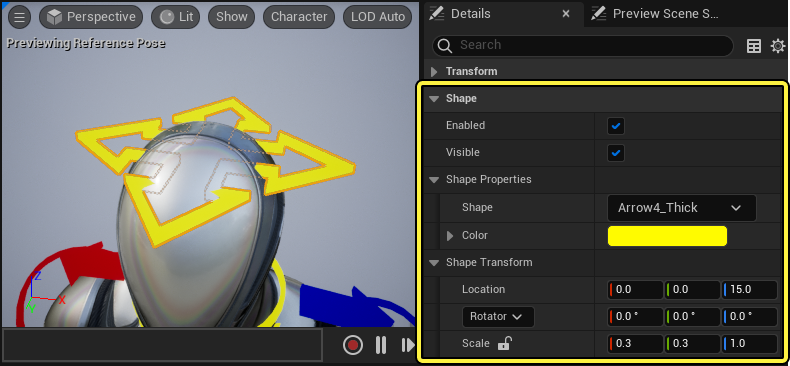
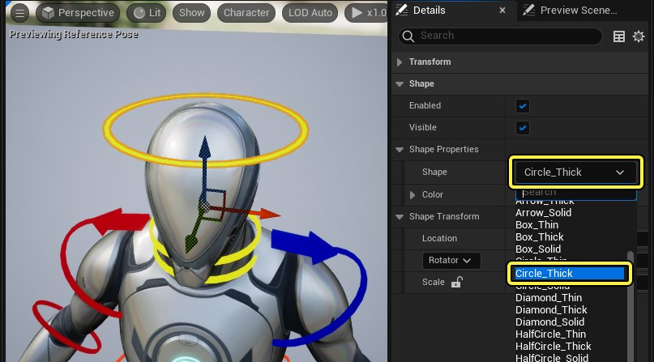
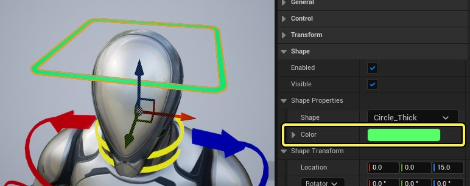
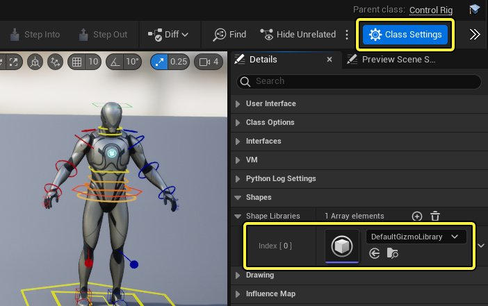
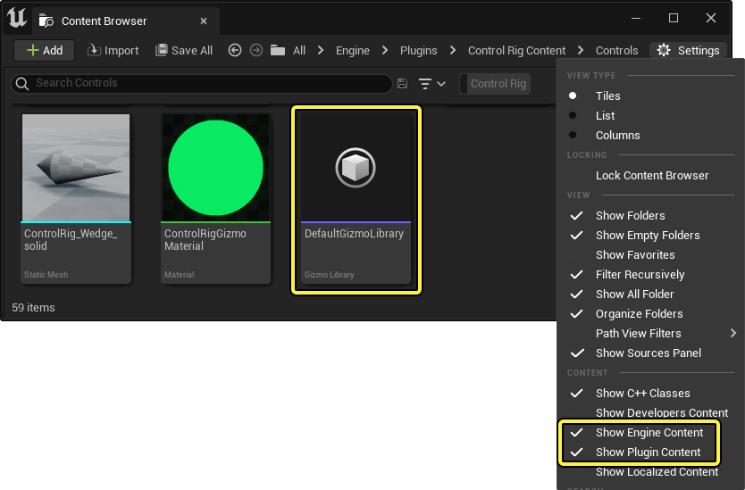
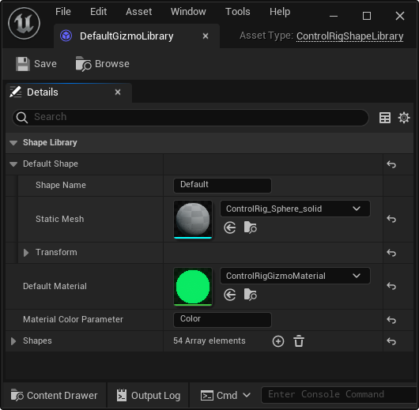
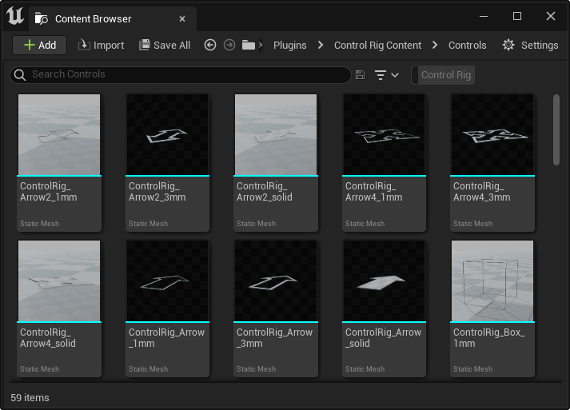
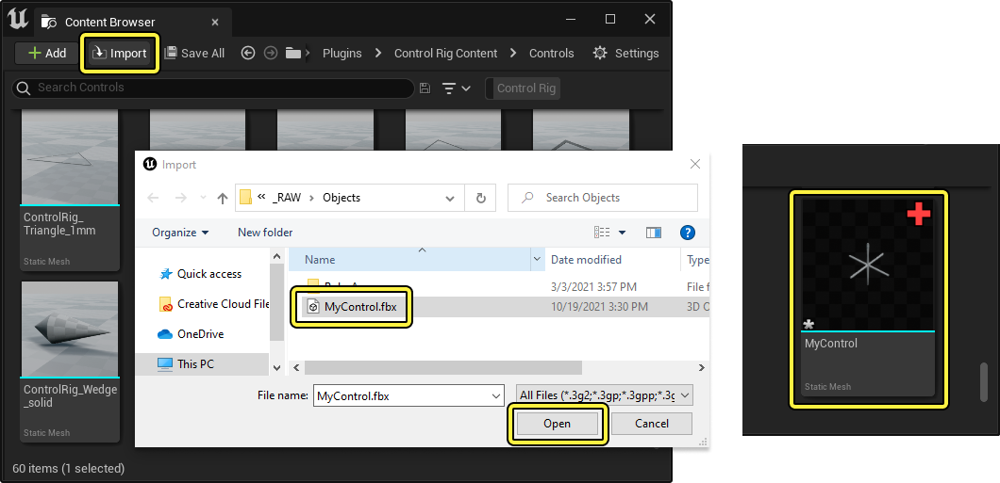

# 控制点形状和控制点形状库

> 路径：虚幻引擎5.7文档 / 为角色和对象制作动画 / 控制绑定 / 使用控制绑定制作动画 / 控制点形状和控制点形状库

> 原始页面：https://dev.epicgames.com/documentation/unreal-engine/control-shapes-and-control-shape-library-in-unreal-engine

为你的控制绑定创建控制点时，你需要在视觉效果上将它们区分开来，或者使用更合适的控制点形状。使用 **控制点形状（Control Shape）** 属性，你可以影响控制点的变换、颜色和形状。你还可以创建和编辑 **控制点形状库（Control Shape Libraries）**，进而添加或更改你可以用的控制点形状。

本文档提供了关于这些工具和功能的概述。

#### 先决条件

- 你对 **[控制绑定编辑器](../index.md)** 有了一定的了解。
- **[控制点](../controls-bones-and-nulls-in-control-rig/index.md)** 添加到你的控制绑定。

## 控制点形状

要查看控制点的属性，请在 **控制绑定编辑器（Control Rig Editor）** 中选择它，然后在 **细节（Details）** 面板中，找到 **控制点形状（Control Shape）** 属性。

### 更改形状

要更改控制点的形状，请从 **形状（Shape）** 下拉菜单中选择一个选项。

点击 **颜色（Color）** 属性，会打开 **取色器**，你还可以更改形状的颜色。选择颜色，并点击 **确定（OK）** ，可以更改控制点形状的颜色。

## 控制点形状库

如果你要添加或更改可用形状列表，你可以使用 **控制点形状库（Control Shape Library）**。每个控制绑定资产都包含对库的引用，点击控制绑定编辑器（Control Rig Editor）中的 **类设置（Class Settings）** ，然后在 **细节（Details）** 选项卡中，找到 **Gizmo库（Gizmo Library）** 属性，你可以查看库。

> [!NOTE]
> 你可以选择使用现有库，或将不同的 **ControlRigGizmoLibrary** 分配给控制绑定类。

双击 **细节（Details）** 选项卡中的资产，或在 **内容浏览器（Content Browser）** 中，手动找到它，即可打开该库。它位于 **引擎（Engine）>插件（Plugins）>控制绑定内容（Control Rig Content）>控制点（Controls）** 文件夹中。因为它位于 **引擎（Engine）>插件（Plugins）** 文件夹中，你必须从内容浏览器（Content Browser） **设置（Settings）** ，启用 **显示引擎内容（Show Engine Content）** 和 **显示插件内容（Show Plugin Content）** 。

### 库属性

打开后，该库将自动填充以下属性：

| 名称 | 说明 |
| --- | --- |
| **Gizmo名称（Gizmo Name）** | 添加新控制点时，初始控制点形状的名称。 |
| **静态网格体（Static Mesh）** | 添加新控制点时，用于初始控制点形状的网格体。 |
| **变换（Transform）** | 添加新控制点时，用于初始控制点形状的位置、旋转和缩放。 |
| **默认材质（Default Material）** | 用于所有控制点的 **[材质](https://dev.epicgames.com/documentation/404)**。 |
| **材质颜色参数（Material Color Parameter）** | 来自 **默认材质（Default Material）** 的向量3 **[材质参数](../../../../designing-visuals-rendering-and-graphics/unreal-engine-materials/instanced-materials/index.md#materialparameterization)**，在你更改控制点形状（Control Shape）上的 **颜色（Color）** 属性时产生作用。 |
| **Gizmos** | 填充控制点的 **形状（Shape）** 下拉菜单的数组。你可以在此处指定每个形状的 **名称（Name）**、**静态网格体（Static Mesh）** 和 **变换（Transform）** 。可以使用 **添加元素（Add Element）** 按钮添加新形状。点击下拉按钮，并选择 **删除（Delete）** ，可以删除形状。 |

### 添加新形状

控制点形状使用 **[静态网格体](../../../../working-with-content/static-meshes/index.md)** 表示，你可以在和控制绑定库（Control Rig Library）资产相同的文件夹中查看。

你可以导入你自己的 `.fbx` 静态网格体，进而使用自定义形状扩展你的库。为此，假定你已经导出 `.fbx` 模型文件，在内容浏览器（Content Browser）中，点击 **导入（Import）** ，选择你的 `.fbx` 文件，然后点击 **导入（Import）** ，可以将其导入到虚幻引擎中。

> [!NOTE]
> 导入新网格体用作控制点形状时，无需导入任何纹理或为其创建材质。因此，请确保在 **FBX导入选项（FBX Import Options）** 菜单中， **导入纹理（Import Textures）** 为 **禁用** ，并且 **材质导入方法（Material Import Method）** 设置为 **不创建材质（Do Not Create Material）** 。
>
> > 图片已省略：控制点形状导入设置

导入静态网格体后，点击 **Gizmos** 属性上的 **添加元素（Add Element）** 按钮，将新形状条目添加到数组中。展开数组列表，并找到底部的新建条目，你可以在其中填写 **Gizmo名称（Gizmo Name）**、**静态网格体（Static Mesh）** 和 **变换（Transform）** 属性。

> 图片已省略：添加新控制点形状

现在，当你返回控制绑定时，应该可以从 **形状（Shape）** 属性中，选择你的新控制点。

> 图片已省略：新控制点形状
