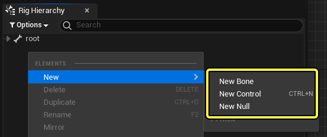
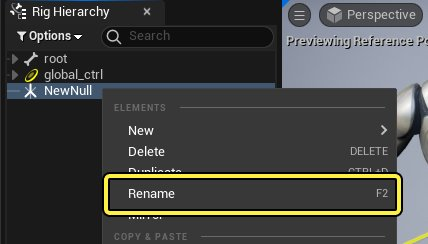
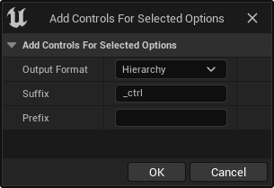
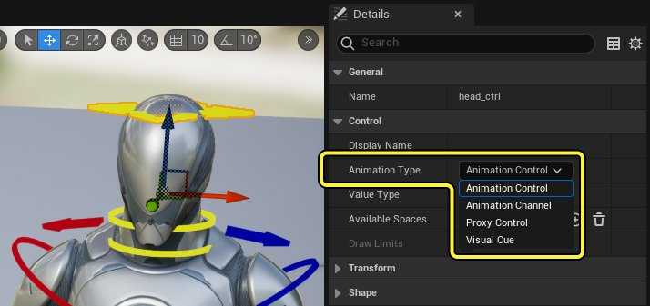
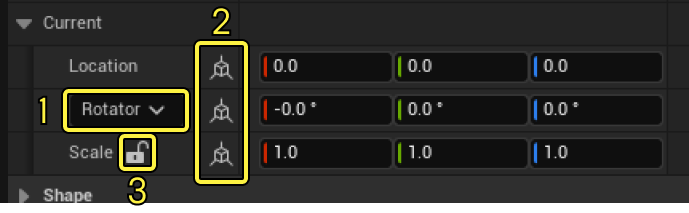
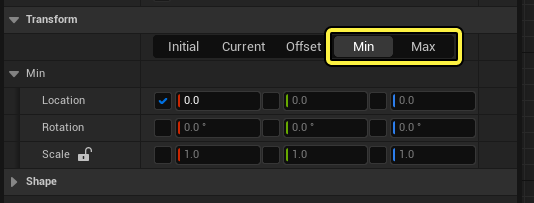
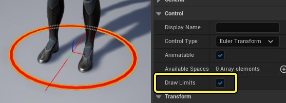
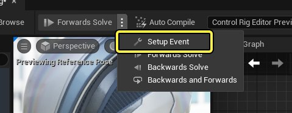

# 控制点、骨骼和Null

> 路径：虚幻引擎5.7文档 / 为角色和对象制作动画 / 控制绑定 / 使用控制绑定制作动画 / 控制点、骨骼和Null

> 原始页面：https://dev.epicgames.com/documentation/unreal-engine/controls-bones-and-nulls-in-control-rig-in-unreal-engine

在控制绑定中创建可靠的绑定效果时，离不开 **控制点（Controls）** 、**骨骼（Bones）** 和 **Null** 这三个主要绑定元素。它们每个都拥有十分广泛的应用，搭配后可以创建完整的骨骼绑定。

本文介绍了控制点、骨骼和Null，并提供了使用简单的工作流程示例。

#### 先决条件

- 你已创建并打开骨骼网格体的

  控制绑定

  。

## 元素介绍

控制点、骨骼和Null的创建方式是在 **绑定层级（Rig Hierarchy）** 面板中右键点击，然后在 **新建（New）** 菜单中选择对应的选项。

默认情况下，新建元素位于视口原点(0,0,0)。如果创建前，你在"绑定层级（Rig Hierarchy）"面板中选中了某个元素，则会在该元素位置创建，并以该元素为父节点。这样有助于不同元素彼此排列整齐。

> 动图已省略：创建控制点

### 组织

你可以在 **绑定层级（Rig Hierarchy）** 中右键点击元素并选择 **重命名（Rename）** ，或者按 **F2** 来重命名元素。

你可以在 **绑定层级（Rig Hierarchy）** 中拖动元素来重新组织结构。

- 将一个元素拖到另一个元素上，会使前者成为子节点，后者成为父节点。
- 将一个元素拖到空区域会取消父子关系。
- 按

  Shift+P

  也会取消所选元素的父子关系。

> 动图已省略：控制点拖放重设父子关系

## 控制点

**控制点（Controls）** 是实现控制绑定交互的主要元素。它们用于驱动骨骼链，在 **Sequencer** 中制作动画，并提供更多自定义属性。你还可以让控制点以使用自定义的[形状和颜色](../control-shapes-and-control-shape-library/index.md)、属性类型和变换限值。

### 创建上下文

当你为于某个骨骼创建控制点时，控制点会自动继承该骨骼的名称，并添加 `_ctrl` 作为后缀。

> 动图已省略：创建控制点

#### 创建多个控制点

除了一般创建方法之外，你还可以在选中多个骨骼时，使用提供的[Python脚本](../control-rig-python-scripting/index.md#%E7%BC%96%E8%BE%91%E5%99%A8%E5%90%AF%E5%8A%A8)创建控制点。在[Rig层级](../control-rig-editor/index.md#%E7%BB%91%E5%AE%9A%E5%B1%82%E7%BA%A7)中，选择多个骨骼，然后右键点击，选择 **新建（New）> 为所选内容添加控制点（Add Controls For Selected）** 。这将为所有所选骨骼创建控制点，使用后缀 `_ctrl` 匹配其名称，并匹配层级结构。

> 动图已省略：为所选内容添加控制点

你可以按住 **Alt** 并点击 **新建（New）> 为所选内容添加控制点（Add Controls For Selected）** 来自定义此创建方法。这会打开对话框窗口，你可以在其中自定义以下设置：

| 名称 | 说明 |
| --- | --- |
| **输出格式（Output Format）** | 在创建控制点之后如何编排。你可以选择以下选项： **层级（Hierarchy）** ：复制与所选骨骼相同的层级，并取消最顶层的控制点与骨骼层级的父子关系。 **列表（List）** ：将所有创建的控制点取消父子关系，使其作为平面列表显示在绑定层级的根节点。 **子节点（Child）** ：将所有创建的控制点放在关联的骨骼下面作为子节点。 |
| **后缀（Suffix）** | 要在控制点名称后应用的文本，该名称是从骨骼名称复制的。 |
| **前缀（Prefix）** | 要在控制点名称前应用的文本，该名称是从骨骼名称复制的。 |

### 控制点和值类型

你可以为控制点指定各种控制点类型，这些类型会指定替代属性或限制性更强的属性。如果你想要创建基于属性的控制、代理控制或者回馈控制，该设置十分有用。

你可以在"细节（Details）"面板中点击所选控制点的 **控制点类型（Control Type）** 下拉菜单来指定控制点的类型。可以选择以下控制点类型：

| 控制点类型 | 描述 |
| --- | --- |
| **动画控制（Animation Control）** | 默认控制点类型，提供普通的可视动画控制。 |
| **动画通道（Animation Channel）** | 用于提供动画通道或者自定义属性的控制点。如果启用了 **通道组（Group Channel）**，那么该属性可以在父级控制点上访问，和其它属性一起加入动画。 |
| **代理控制（Proxy Control）** | 代理控制点能够以 **驱动/被驱动** 的关系链接到其它控制点。这通过在 **驱动的控制点（Driven Controls）** 数组中添加要驱动的控制点来完成。代理控制点不能直接添加动画，但是你可以通过 **Get Driven** 和 **Set Driven** 节点来整体驱动其它控制点。 |
| **Visual Cue** |  |

除了动画类型以外，你还可以调整 **数值类型（Value Type）**，从而设置控制点的输出数据。从 **数值类型（Value Type）** 下拉菜单中，可以设置以下类型：

| 名称 | 说明 |
| --- | --- |
| **布尔（Bool）** | 将控制点设置为 **布尔类型** ，这样你可以在动画中设置 **True / False** 状态。布尔类型的控制点在 **视口（Viewport）** 中不可见。 控制点类型布尔 |
| **浮点（Float）** | 将控制点设置为 **浮点类型**，这样你可以沿某根位置轴移动控制点。如果 **动画类型（Animation Type）** 设为 **动画控制点（Animation Control）**，那么你可以指定使用的轴，从 **主要轴（Primary Axis）** 属性中进行选择。使用此类型时，控制点可以移动的范围[默认限制](#%E5%8F%98%E6%8D%A2%E9%99%90%E5%80%BC)在 **0 - 100** 之间。如果你想创建滑块型控制点，浮点会很有用。 控制点类型浮点 |
| **整型（Integer）** | 将控制点设置为 **整型类型**，这样你可以沿某根位置轴移动控制点，以1为增量。 如果 **动画类型（Animation Type）** 设为 **动画控制点（Animation Control）**，那么你可以指定使用的轴，从 **主要轴（Primary Axis）** 属性中进行选择。使用此类型时，控制点可以移动的范围[默认限制](#%E5%8F%98%E6%8D%A2%E9%99%90%E5%80%BC)在 **0 - 100** 之间。你还可以在 **控制点枚举（Control Enum）** 属性中引用 **枚举（Enumeration）**，将此控制点类型转换为枚举。 控制点类型整型枚举 |
| **向量2D（Vector 2D）** | 将控制点设置为 **向量2D类型**，这样你可以沿两根位置轴移动控制点。如果 **动画类型（Animation Type）** 设为 **动画控制点（Animation Control）**，那么 **主要轴（Primary Axis）** 属性中指定的轴会被排除，而使用剩余的轴来定义2D平面。使用此类型时，控制点可以沿两个轴移动的范围[默认限制](#%E5%8F%98%E6%8D%A2%E9%99%90%E5%80%BC)在 **0 - 100** 之间。 控制点类型向量2D |
| **位置（Position）** | 将控制点设置为 **位置类型**，你只能调整控制点的位置。 控制点类型位置 |
| **缩放（Scale）** | 将控制点设置为 **缩放类型**，你只能调整控制点的缩放比例。 控制点类型缩放 |
| **旋转（Rotator）** | 将控制点设置为 **旋转类型**，你只能调整控制点的旋转角度。 控制点类型旋转体 |
| **欧拉变换（Euler Transform）** | 将控制点设置为 **变换类型**，你可以自由调整控制点的所有平移、旋转和缩放。这是默认类型。 控制点类型欧拉变换 |

对于空间类控制点，例如 **欧拉变换（Euler Transform）** 、 **旋转（Rotator）** 、 **缩放（Scale）** 和 **位置（Position）** ，在"细节（Details）"面板中查看 **变换（Transform）** 属性时，会显示一些额外的变换功能：

1. 旋转（Rotation）

   下拉菜单可用于选择不同旋转插值模式，如

   欧拉（Euler）

   、

   四元数（Quaternion）

   或

   轴和角度（Axis and Angle）

   。
2. 本地/世界空间（Local /World Space）

   按钮将在本地和世界空间之间交换所显示的轴信息。按住Shift键并点击将更改所有三个轴。
3. 锁定

   缩放（Scale）

   ，这会导致在更改缩放时，在每个方向均匀地缩放。

### 变换限值

你可以为空间类控制点指定限定范围，使其只在特定范围内移动。如果你想创建基于滑块或2D的控制点并限制其移动范围，这会很有用。

要为控制点设置限值，请定义其范围最小值和最大值。你可以在 **细节（Details）** 面板中的 **变换（Transform）** 类别下点击 **最小值（Min）** 或 **最大值（Max）** ，找到相关属性。

启用任意一个轴通道，以便启用该值的限值，在旁边的区域中定义数值。在本示例中，最小值设为 - **50** ，最大值设为 **50** 。若现在操控控制点，它将在该范围内移动。

> 动图已省略：控制点限值最小值最大值

启用 **绘制限值（Draw Limits）** ，查看视口中所有控制点的限值。

## 骨骼

除了骨架中已有的骨骼，你还可以在控制绑定中新建骨骼。这些骨骼可用于辅助用途，或为特定操作提供额外的骨骼（例如在IK链中创建结束执行器），或以合并方式使"虚拟"骨骼控制点成为"真实"的骨骼。

> [!NOTE]
> 在控制绑定编辑器中创建的骨骼，其层级图标显示为中空，以便区别于一般骨骼网格体骨骼。

创建新骨骼后，你可以进入 **设置事件（Setup Event）** 模式，在视口中移动它，这样就可以在视口中编辑元素的 **初始姿势（Initial Pose）** 。在工具栏中，点击[解算方向](../control-rig-forwards-solve-and-backwards-solve/index.md)下拉菜单并选择 **设置事件（Setup Event）** 。

启用 **设置事件（Setup Event）** 后，你可以在视口中移动骨骼。

> 动图已省略：设置事件骨骼操控

> [!NOTE]
> 默认情况下，只有所选骨骼会显示在视口中。要更改此视图模式，请在视口工具栏中点击 **角色（Character）> 骨骼（Bones）** ，然后选择所需的骨骼绘制设置。
>
> > 图片已省略：骨骼显示

### 工作流程示例

在此示例中，控制绑定中创建的骨骼用作手指IK链的结束执行器。

> 动图已省略：骨骼控制点示例

## Null

**Null** 是一种容器元素，能以任意方式收集、分组和变换其他绑定元素。在经典的人体模型控制绑定设置中，它们能将对称控制点（例如腿部和手臂）分组，以便镜像这些控制点。Null这个概念类似于Autodesk Maya中的 **组（Groups）** ，旨在管理骨骼绑定的结构。

> 图片已省略：新建Null

默认情况下，Null在视口中不可见。要查看Null，你可以在视口工具栏启用 **显示Null（Display Nulls）** 。

> 图片已省略：显示Null

类似于骨骼，在[解算方向](../control-rig-forwards-solve-and-backwards-solve/index.md)下拉菜单中启用 **设置事件（Setup Event）** 后可以编辑Null。启用 **设置事件（Setup Event）** 后，你可以在视口中移动Null。

> 动图已省略：设置事件Null移动

> [!NOTE]
> 启用 **设置事件（Setup Event）** 还会在视口中的所有Null上启用可视性。

### 工作流程示例

在此示例中，Null用于将左右两侧肢体的控制点分别进行分组。这能让组织、镜像操作和其他操控更轻松。

## 变换类型

绑定元素的位置、旋转和缩放由多种变换源决定，这些源名为 **初始（Initial）** 、 **当前（Current）** 和 **偏移（Offset）** 。这些变换类型各自在控制绑定的不同执行阶段对绑定元素执行变换。你可以在选中的绑定元素的细节面板中查看这些类型。

为控制点指定不同的[控制点类型](#%E6%8E%A7%E5%88%B6%E7%82%B9%E7%B1%BB%E5%9E%8B)时，你只能指定 **初始（Initial）** 和 **当前值（Current Values）** 。

> [!NOTE]
> 按住 **Shift** 键并点击不同类型，将在"细节（Details）"面板中并排显示它们。

### 初始

**初始（Initial）** 是绑定图表中控制绑定逻辑执行前元素的起始值。它还将指定其操作范围内绑定元素的默认值，并将影响 **当前（Current）** 的默认值。

要编辑初始值，你可以从"细节（Details）"面板编辑，或者启用[设置事件](../control-rig-forwards-solve-and-backwards-solve/index.md#%E8%AE%BE%E7%BD%AE%E4%BA%8B%E4%BB%B6)并在视口中操控该元素（如果它有变换）。

### 当前

**当前（Current）** 是在 **正向解算（Forwards Solve）** 模式中操作时的元素值。它旨在作为控制点的实时实际变换，并且操控视口中的控制点将编辑当前姿势。在控制绑定编辑器中，当前姿势是临时的，可以通过重新编译或重新打开资产来重置。

> [!NOTE]
> 在Sequencer中对控制绑定制作动画时，你会对当前值制作动画。

### 偏移变换

**偏移（Offset）** 仅对 **控制点类型（Control Type）** 设置为 **欧拉变换（Euler Transform）** 的控制点显示。它用于在空间上偏移控制点，而不更改初始值或当前值，并提供更改控制点的"零位置"的能力。在Autodesk Maya等其他操控工具中，偏移类似于 **冻结变换（Freeze Transformations）** 或 **变换偏移父矩阵（Transform Offset Parent Matrix）** 。

> [!NOTE]
> 如果你要从指定了偏移的控制点输出变换值，生成的变换将组合 **偏移（Offset）** 和 **当前（Current）** ，用于其最终计算的变换。若要更改，你可以将 **空间（Space）** 属性设置为 **本地空间（Local Space）** ，这样它会仅输出 **当前（Current）** 。
