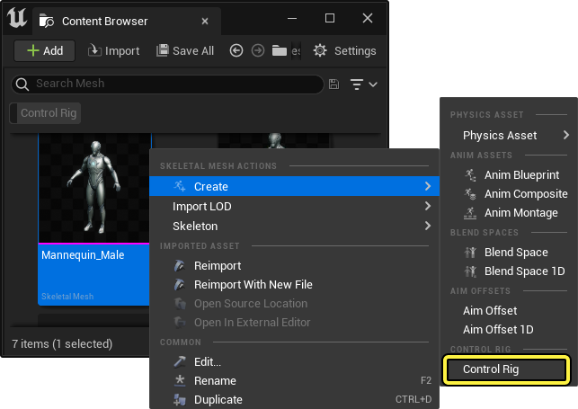
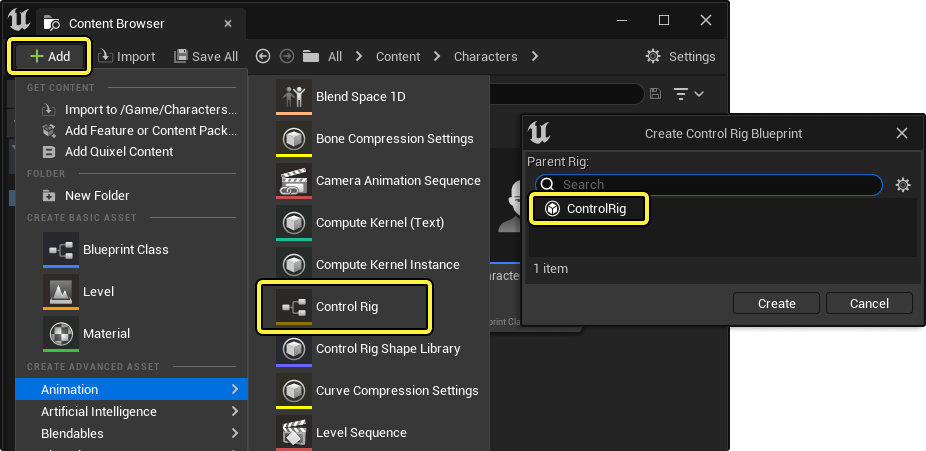
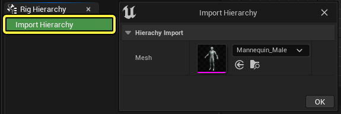

# 使用控制绑定制作动画

> 路径：虚幻引擎5.7文档 / 为角色和对象制作动画 / 控制绑定 / 使用控制绑定制作动画

> 原始页面：https://dev.epicgames.com/documentation/unreal-engine/rigging-with-control-rig-in-unreal-engine

在虚幻引擎中为角色制作动画时，你必须首先创建控制点。控制绑定（Control Rig）提供了各种功能和工具，能为各种形状和大小的角色创建绑定。

本页提供了关于创建控制绑定的概述，以及钻机的主要功能。

## 创建控制绑定资产

在[内容浏览器](../../../understanding-the-basics/content-browser/index.md)中打开 **控制绑定资产** 后，你会看到 **控制绑定编辑器**。该资产可以通过以下方式创建。

第一种方法是右键点击骨骼网格体资产，选择 **创建 > 控制绑定**。这将在同一目录下创建一个后缀为 `_CtrlRig` 的控制绑定资产。双击资产打开它。

第二种方法是手动创建一个控制绑定。你可以点击内容浏览器，选择 **动画 > 控制绑定** 来完成。然后在弹出窗口中，选择 **控制绑定（Control Rig）** 并点击 **创建（Create）**。双击资产打开它。

> [!NOTE]
> 如果以这种方式创建控制绑定，你需要在打开后手动将骨架网格体指定给你的控制绑定资产。方法是点击 **绑定层级（Rig Hierarchy）** 标签中的 **导入层级（Import Hierarchy）** ，然后指定你的骨架网格体。
>
> 

请参考[控制绑定编辑器](control-rig-editor/index.md)页面，了解更多关于控制绑定编辑器的界面和功能。

## 绑定功能

以下功能有助于你在虚幻引擎Control Rig中完成绑定。

- [控制绑定编辑器](control-rig-editor/index.md) - 学习控制绑定编辑器中的各种工具和区域。

- [模块化控制绑定](modular-control-rigs/index.md) - 在虚幻引擎中使用模块化绑定工具快速绑定角色。

- [控制点、骨骼和Null](controls-bones-and-nulls-in-control-rig/index.md) - 了解构成控制绑定的主要绑定元素。

- [解算方向](control-rig-forwards-solve-and-backwards-solve/index.md) - 了解控制绑定中的不同解算方向以及它们启用的功能。

- [全身IK](control-rig-full-body-ik/index.md) - 为你的角色创建全身IK。

- [样条线操控](control-rig-spline-rigging/index.md) - 利用控制绑定中的样条线，在比较长的关节链上实现更简单的程序动画。

- [姿势缓存](control-rig-pose-caching/index.md) - 文档主题的一句话概述。

- [控制点形状和控制点形状库](control-shapes-and-control-shape-library/index.md) - 使用控制点形状库中的不同控制点形状，自定义你的控制点。

- [控制绑定组件](control-rig-in-blueprints/index.md) - 在虚幻引擎蓝图中使用控制绑定组件。

- [Control Rig函数库](control-rig-function-libraries/index.md) - 构造和引用公有Control Rig函数以加速操控工作流程。

- [控制绑定中的Python脚本](control-rig-python-scripting/index.md) - 使用Python脚本，扩展并自定义控制绑定的功能。

- [控制绑定调试](control-rig-debugging/index.md) - 使用控制绑定调试工具查找并修复控制绑定图表中的问题。
