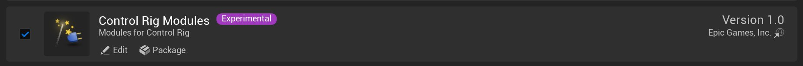
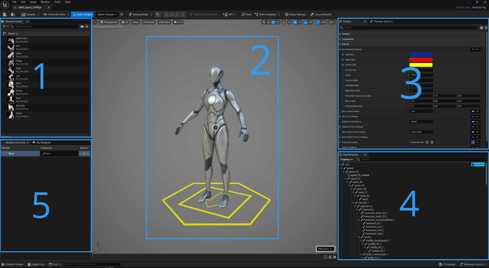
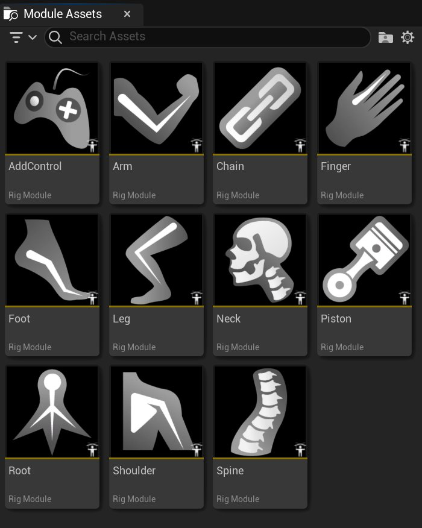
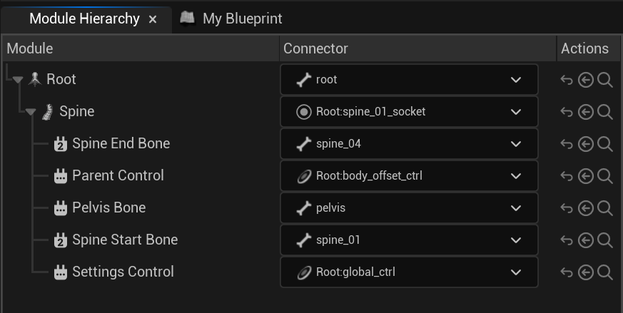
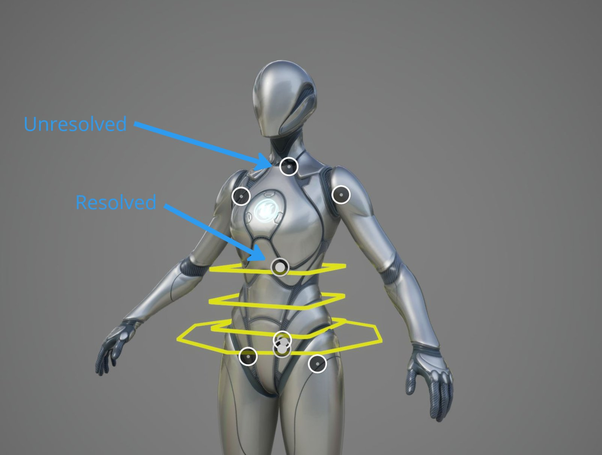
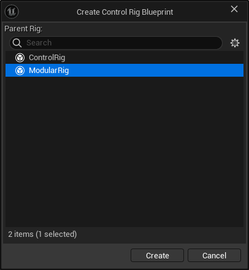
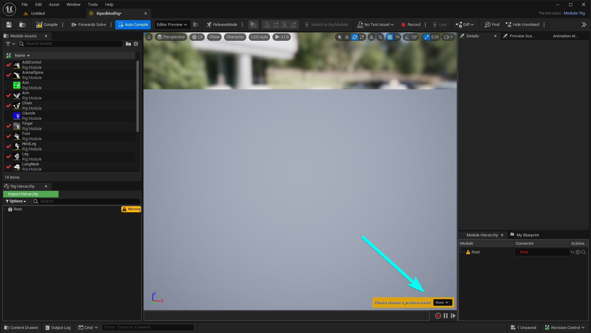
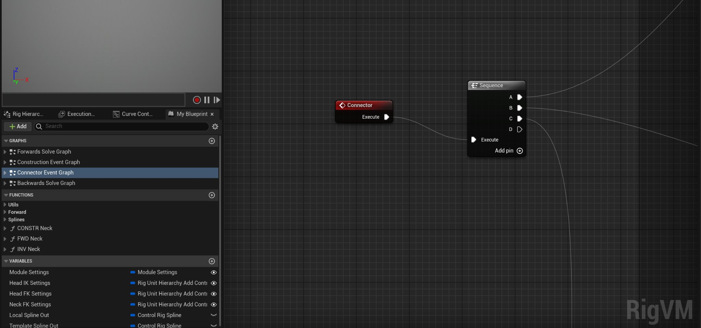

# 模块化控制绑定

> 路径：虚幻引擎5.7文档 / 为角色和对象制作动画 / 控制绑定 / 使用控制绑定制作动画 / 模块化控制绑定

> 原始页面：https://dev.epicgames.com/documentation/unreal-engine/modular-control-rigs-in-unreal-engine

**模块化控制绑定** 是虚幻引擎中的数字动画绑定，通过组合一系列称为 **模块** 的预编译[控制绑定](../../index.md)资产而创建。**模块** 是一个控制绑定组件，代表角色的某个身体部位，例如手臂、腿或脊椎，可用于自动创建一组控制点并绑定该身体部位，使其能够接收动画数据。模块可以 **连接** 在一起，形成完整的动画绑定，从而通过关节来驱动骨架。

本文档将概述如何使用模块化控制绑定框架来绑定角色。

> 动图已省略：ImageAltText

通过组合一系列模型来创建模块化控制绑定，这称为 **视觉绑定（Visual Rigging）** 。**通过视觉绑定，你可以利用**图解覆层（Schematic Overlay）** 在视口中完整编译和连接模块。

## 入门指南

你可以在本小节中了解使用模块化绑定框架绑定角色的入门知识。

#### 先决条件

- 你的项目中有一个骨骼网格体角色。本文档中提供的工作流程示例使用的是人体模型角色。
- 启用 **控制绑定模块** [插件](../../../../understanding-the-basics/foundational-knowledge-in/working-with-plugins/index.md)。方法是在 **菜单栏** 中找到 **编辑（Edit）> 插件（Plugins）** ，并在 **动画（Animation）** 分段找到 **控制绑定模块（Control Rig Modules）** 插件，或使用 **搜索栏**。启用插件并重启编辑器。



> [!NOTE]
> 在虚幻引擎中使用模块化控制绑定时，不一定需要此插件，但此插件包含工作流程示例所使用的预配置[模块](#%E6%A8%A1%E5%9D%97)，建议使用此插件以便开始使用模块化控制绑定。该插件为可选项，可以根据项目需要加载和卸载。

### 预览场景设置

在开始绑定网格体之前，你可以在 **预览场景设置（Preview Scene Settings）** 面板中调整一些设置，使 **视口** 更易于导航。建议进行以下设置：

| 属性 | 建议设置 |
| --- | --- |
| **显示环境（Show Environment）** | **关闭（Off）** |
| **显示地面（Show Floor）** | **关闭（Off）** |
| **后期处理（Post Processing）** > **镜头（Lens）** > **曝光（Exposure）** > **测光模式（Metering Mode）** | **手动（Manual）** |
| **后期处理（Post Processing）** > **镜头（Lens）** > **曝光（Exposure）** > **曝光补偿（Exposure Compensation）** | `11.0` |

> 动图已省略：ImageAltText

### UI概述

你可以在本小节中简单了解模块化控制绑定编辑器。



1. **模块资产**：你可以在这里找到能够添加到控制绑定的可用模块资产。
2. **视口**：你可以在这里查看你的网格体和绑定，以及 **图解覆层插槽（Schematic Overlay Sockets）**。这些插槽指示网格体上可以放置模块的点。
3. **细节**：你可以在此处调整绑定的设置。
4. **绑定层级**：你可以在此处引用和编辑绑定层级。
5. **模块层级**：你可以在此处引用和编辑控制绑定控制点的层级。

### 术语

你可以在本小节中了解绑定模块化控制绑定时使用的各种术语。

### 模块

**模块** 是模块作者创建的控制绑定的组件，可以在模块化控制绑定框架内使用。

通常，模块代表角色的常见部位，例如手臂、腿或脊柱，但并不局限于这些概念。



### 连接器

为了编译完整的角色绑定，需要使用 **连接器** 将模块连接在一起。**连接器** 是两个模块之间的关联。模块可以有多个连接点。这些连接点由 **模块作者** 创建，以指示模块在模块化控制绑定内如何相互连接。

> 动图已省略：ImageAltText

连接器需要被 **解析** 到绑定元素，以使模块正常运行。在将模块添加到模块化控制绑定时，连接器通常会自动解析，但是，你可以在模块层级（Module Hierarchy）面板中使用与每个模块和模块组件相关的下拉菜单手动分配这些解析。



### 插槽

**插槽** 是可用于通过连接器在特定位置将绑定模块连接在一起的节点。例如，将手臂的肩部与脊柱的胸部位置连接起来。连接器将自动 **解析** 到插槽。插槽可以解析到以下类型的层级元素：

- 骨骼（Bones）
- 控制点（Controls）
- Nulls

你将在编辑器视口中直观地看到连接器是否解析到插槽。如果圆圈内有一个大灰圈，就表示已解析连接器。如果圆圈内有一个小灰点，则表示未解析插槽。如果有多个连接器解析到同一插槽，那么将出现一个数字，表示解析到同一插槽的连接器的数量。

| 插槽 | 说明 |
| --- | --- |
| ImageAltText | 插槽 **未解析** 到连接器。 |
| ImageAltText | 插槽 **已解析** 到连接器。 |
| ImageAltText | 多个连接器 **已解析** 到该插槽。 |



连接器可能有 **规则** ，这意味着连接器只能解析特定类型的插槽。例如，一些连接器仅能解析到骨骼或插槽。

## 创建你的首个模块化绑定

在本小节中，你可以按照示例演示了解如何入门。

### 创建模块化绑定资产

在 **内容浏览器（Content Browser）** 中使用 (**+**)**添加（Add）** ，并选择 **动画（Animation）** > **控制绑定（Control Rig）** > **控制绑定（Control Rig）**，就可以创建模块化绑定。

> 动图已省略：ImageAltText

出现提示时，在 **创建控制绑定蓝图（Create Control Rig Blueprint）** 窗口中选择 **ModularRig** 选项，然后选择 **创建（Create）** 按钮。



现在，在 **内容浏览器（Content Browser）** 中 **双击** 控制绑定资产即可将其打开。打开资产后，使用 **细节（Details）** 面板中 **预览网格体（Preview Mesh）** 属性的下拉菜单，或按照视口右下角的提示，选择你要绑定的骨骼网格体角色。



定义角色网格体后，你可以将 **脊柱（Spine）** 模块从模块资产（Module Assets）面板 **拖放** 至视口中的未解析插槽上。

> 动图已省略：ImageAltText

添加脊柱模块后，将出现更多连接器，你可以向其中添加其他模块。然后，将 **颈部（Neck）** 模块 **拖放** 至未解析的颈部插槽上。

> 动图已省略：ImageAltText

然后，将 **腿部（Leg）** 模块 **拖放** 至每个可用的腿部插槽上。

> 动图已省略：ImageAltText

然后，将脚部（Foot）模块 **拖放** 至每个可用的脚部插槽上。

> 动图已省略：ImageAltText

与添加腿部和脚部模块的过程类似，将 **肩部（Shoulder）** 模块 **拖放** 到每个肩部插槽上，然后将 **手臂（Arm）** 模块拖放到每个手臂插槽上。

> 动图已省略：ImageAltText

最后，选择每个手指插槽，然后将手指模块拖放到一个选定插槽上，以同时创建多个模块。

> 动图已省略：ImageAltText

### 镜像

你还可以镜像模块，从而提高模块化控制绑定的创建效率。要镜像模块，首先在模块层级（Module Hierarchy）面板中选择你要镜像的一个或多个模块。然后，右键点击选项，并使用快捷菜单中的 **镜像（Mirror）** 属性。然后，你可以定义用于镜像所选模块的属性，例如 **镜像轴（Mirror Axis）** 、 **翻转轴（Axis to Flip）** ，以及用于重命名新模块的 **搜索** 和 **替换** 功能。镜像操作将尝试基于原始模块的名称和在绑定中的位置根据上下文重命名模块。

> 动图已省略：ImageAltText

> [!NOTE]
> 镜像后的模块连接器需要有插槽才能正确解析。

### 解析连接器

有时模块无法自动解析连接器，需要手动解析。未解析的模块将在视口中显示为未解析连接器，并在模块层级（Module Hierarchy）面板中具有红色 `none` 定义。可以使用以下方法手动解析连接器：

- 在视口中选择一个未解析元素，然后使用模块层级（Module Hierarchy）面板中该元素旁边的 **使用选定箭头（Use Selected Arrow）** 按钮，将该元素输入到连接器，即可解决问题。 ImageAltText
- 在模块层级（Module Hierarchy）面板中，使用未解析连接器上的层级下拉菜单，可以手动分配要用作解析的骨骼或插槽。这将遵守连接器规则，并仅显示按规则过滤后的类型。 ImageAltText
- 将模块添加到绑定时，模块中包含的 **连接器事件** 将自动执行，从而尝试使用提供的逻辑解析所有连接器。



你还可以手动执行此功能，方法是在 **模块层级（Module Hierarchy）** 面板中 **右键点击** 一个或多个未解析的连接器，然后在快捷菜单**中选择**自动解析（Auto Resolve）**选项。**ImageAltText

## 对模块化控制绑定进行动画处理

模块化控制绑定的工作方式与Sequencer和视口内的常规控制绑定完全相同。如需详细了解虚幻引擎中的动画控制绑定，请参阅以下文档：


- [使用控制绑定实现动画效果](../../animating-with-control-rig/index.md)

你可以将模块化控制绑定资产直接拖放到关卡中，以开始对角色进行动画处理。

> 动图已省略：ImageAltText

## 模块创作

**模块作者** 负责创建模块化控制绑定将要使用的模块。虚幻引擎的控制绑定是用来创作模块的底层框架，因此了解如何创建控制绑定图表是先决条件。如需详细了解虚幻引擎中的控制绑定，请参阅以下文档：

%animating-characters-and-objects/ControlRig:topic%

### 控制绑定模块插件

模块化控制绑定系统不需要安装控制绑定模块插件，并且无需使用该插件即可在虚幻引擎中开始编译和使用模块化控制绑定。但是，为了使用预配置模块，你可以选择安装控制绑定模块插件来使用、编辑或学习。该插件包含示例自定义模块，你可以用它们来编译模块化控制绑定，或创建你自己的自定义模块。该插件为可选项，可以根据项目需要加载和卸载。

> 图片已省略：ImageAltText

#### 根模块

如果你正在创建和使用自定义控制绑定模块，则可以设置在创建新的模块化控制绑定时应使用哪些根模块。你可以使用 **控制绑定** 分段中的 **默认根模块（Default Root Module）** 设置，在 **项目设置（Project Settings）** 中更改初始根模块。默认的根模块资产位于控制绑定插件文件夹中，应 **谨慎编辑** 。

> 图片已省略：ImageAltText

> [!NOTE]
> 建议按原样使用此模块。最好创建一个新的根模块，以便在你的项目中编辑或使用资产进行编辑。

## 创建你的第一个模块

你可以参考本小节中为模块化控制绑定创建自定义模块的工作流程示例。

### 创建新模块

1. 在内容浏览器中创建新的 **控制绑定** 资产。
2. 打开控制绑定并使用 **切换到绑定模块（Switch to Rig Module）** 将其转换为模块。

> 图片已省略：ImageAltText

> 图片已省略：ImageAltText

1. 导入骨骼网格体。这将作为编译模块的

   模板

   。

   ControlRigModules

   插件中有预编译的

   模板

   可供使用，具体如下图所示。你也可以使用自己的模板。

   > 图片已省略：ImageAltText

> [!NOTE]
> 由于该模块将引用此资产，因此资产应该尽可能轻便。

1. 在

   类设置（Class Settings）

   中设置以下属性：

| 属性 | 设置 |
| --- | --- |
| **名称（Name）** | 设置将在模块化绑定编辑器中显示的模块名称。 |
| **类型（Type）** | 设置模块的类型（默认为模块）。 |
| **图标（Icon）** | 设置一个在模块化绑定编辑器中显示的可视图标。你可以使用属性中的下拉菜单选择一个提供的图标。 控制绑定模块插件附带一系列预编译图标，你可以将这些图标用于新模块或对其进行修改。你可以在以下文件路径中找到这些资产： `…Engine > Plugins > Control Rig Modules Content > Modules > Icons` ImageAltText |
| **类别（Category）** | 你可以在此处设置模块的分类值。 |
| **关键词（Keywords）** | 用来描述模块的关键词。 |
| **说明（Description）** | 你可以在此处提供模块的说明，当你在编辑器中将鼠标悬停在模块上时，该描述将会在实例中显示。 |

> 图片已省略：ImageAltText

### 创建连接器

绑定作者需要向模块表明如何连接到骨架。这通过使用 **连接器** 来实现。连接器负责返回骨骼和控制点等层级信息。连接器充当这些层级元素的引用，因此作者可以创建一个模块，该模块可能适用于具有不同层级结构或命名方案的许多不同骨架。

连接器的 **类型** 有两种：

| 类型 | 说明 |
| --- | --- |
| **主连接器（Primary）** | 模块只能包含一个主连接器。建议将主连接器解析到骨骼网格体上的插槽。 创建主连接器时，你应考虑以下几点： 每个模块只能有一个主连接器，在控制绑定资产转换为模块时，会自动创建主连接器。 主连接器是第一个需要解析的连接器，并且应该解析到骨骼网格体上的插槽。 建议赋予主连接器插槽类型规则。 |
| **辅助连接器（Secondary）** | 模块可能包含多个辅助连接器。建议将这些连接器解析为骨骼、Null或控制点。 创建辅助连接器时，你可以将它们视为需要解析的附加连接器，以使模块能够按照你设计的目的运行。 每个模块可以有多个辅助连接器。 建议为辅助连接器提供骨骼、控制点或Null类型规则，具体取决于其如何解析到骨骼网格体。 如果辅助连接器可选，则该连接器不必为模块解析即可正常工作。 |

连接器可能包含 **规则**。这些规则决定了什么可以解析到该连接器。你可以参考本小节中可分配给连接器的可用规则列表及其功能说明：

> 图片已省略：ImageAltText

| 规则 | 说明 |
| --- | --- |
| 与规则（And Rule） | 解析的元素必须满足所有设定的规则。 |
| 主连接器的子项（Child of Primary） | 元素存在于主连接器的层级下。 |
| 或规则（Or Rule） | 解析的元素必须满足任一设定的规则。 |
| 标签规则（Tag Rule） | 解析的元素必须标有此标签。 |
| 类型规则（Type Rule） | 解析的元素属于指定类型。 |

#### 连接器事件

连接器事件提供了一种编译图形逻辑的方法，该方法将在绑定模块化资产的拖放阶段创建时尝试 **自动解析** 模块中的辅助连接器。

> 图片已省略：ImageAltText

### 插槽

角色的骨架资产中定义了 **插槽（Socket）** ，用于将模块连接到骨骼网格体。例如，可以设置手臂模块，然后将其连接到脊柱插槽，从而让脊柱驱动手臂。插槽在编辑器视口中以圆圈的形式显示。

### 元数据

模块可以包含外部模块可以访问的模块级别的元数据。有两个控制绑定节点使用此元数据：

| 控制绑定节点 | 说明 |
| --- | --- |
| 获取模块元数据（Get Module Metadata） | 在提供的域内检索特定元数据。 |
| 设置模块元数据（Set Module Metadata） | 在提供的域内创建新的元数据。 |

可以在根、父级或当前模块级别访问元数据。例如，用于存储控制点的全局尺寸的元数据可能位于根级别，而在手臂模块中创建的手部控制点可能位于父级元数据域中。

> 图片已省略：ImageAltText

### 正向解算之前和之后

**正向解算之前** 允许在执行正向解算之前执行绑定逻辑。**正向解算之后** 允许在执行正向解算之后执行绑定逻辑。

这有助于让模块编辑另一个预先存在模块的绑定逻辑，例如让脚部模块编辑腿部模块以创建脚部滚动设置。

> 图片已省略：ImageAltText

## 技术附录

你可以参考本小节中有关在虚幻引擎中使用模块化控制绑定的更多技术信息。

### 执行顺序

模块化控制绑定包含对其模块的引用。每个模块独立于其他模块运行，但有具体的执行顺序。模块按照在模块树中的显示顺序执行，例如从根到叶，或 *脊柱 > 腿部 > 脚部*。所有模块均按顺序在同一个线程上执行，因此无法对模块化控制绑定图表执行进行多线程处理。

例如，构造事件针对所有模块运行，正向解算针对所有模块运行，等等。

> 图片已省略：ImageAltText

> [!NOTE]
> 在未来的版本中，我们可能会提供更多用来确定模块执行顺序的控制点。某些场景可能需要暂时跳过某个模块，或者运行某个模块两次。我们也可能提出彻底改变执行顺序的方案。

### 执行堆栈

虽然每个模块可能会使用一个虚拟机（VM），但模块化控制绑定本身不使用虚拟机。因为执行堆栈的原因，模块化绑定在用户界面为空或不可见。

> [!NOTE]
> 在未来的版本中，我们可能会添加更多功能，让模块化绑定在高级场景中使用自己的虚拟机，届时执行堆栈可能会再次变得可见。

### 性能

目前，相比单个内联控制绑定，模块化控制绑定的性能开销更高，但性能差异应该很小。

> [!NOTE]
> 我们预期，易于使用和角色绑定的编译速度更快，这两点所带来的好处将超过性能损失。然而，我们未来会改进性能，以缩小差距，甚至可能成功使模块化绑定比同类内联控制绑定的速度更快。我们期待未来会出现许多潜在的性能改进。

### API

模块化绑定 *(`UModularRig`)* 由其 *模型 (`FModularRigModel`)* 管理，其中包含模块引用、已解析连接器和变量绑定的列表。此外，我们还提供 *控制器 (`UModularRigController`)* ，可用于对模块化绑定进行更改。

模块化绑定是一种特殊的控制绑定，因此它有全部的控制绑定API，并添加了自己的附加 API。

#### Python

在Python中，可以使用以下脚本访问模型和控制器：

```
 model = rig_blueprint.modular_rig_model controller = rig_blueprint.get_modular_rig_controller() 
```
