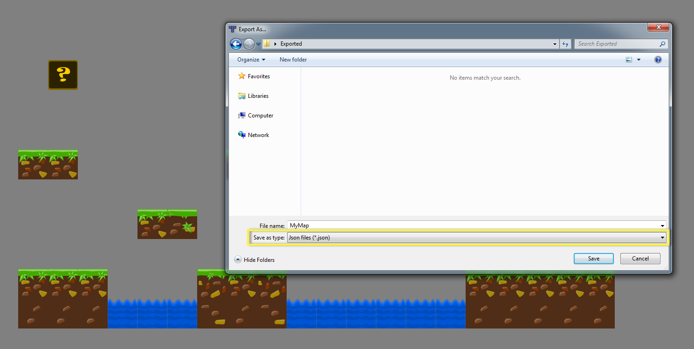

# Paper 2D 导入选项

> 路径：虚幻引擎5.7文档 / 为角色和对象制作动画 / 虚幻引擎 / Paper 2D 导入选项

> 原始页面：https://dev.epicgames.com/documentation/unreal-engine/import-sprites-in-unreal-engine

虚幻引擎 4 的 Paper 2D 支持大量的导入选项，以便使用以其他软件创建的资源。以下部分讲述从常用资源创建软件导入资源的范例。

## 从 Texture Packer 进行导入

如您使用第三方 sprite 表单生成工具 **Texture Packer** 进行内容创建，可通过其内置插件创建一个 **.paper2dsprites** 文件，将内容轻松导入虚幻引擎 4。此文件导入 UE4 时将把 sprite 表单作为纹理自动导入、从它抽取并创建 sprite，并创建一个 **Sprite 资源**，用于从 sprite 自动生成 **Flipbooks**。

**工作流范例**

1. 在 **Texture Packer** 中选择 **UnrealEngine - Paper2d** 框架选项。
2. 添加包含在 sprite 表单中的资源。
3. 在 **Layout** 下将 **Size Constraints** 设为 **POT（2 的幂次方）**。
4. 在 **Sprites** 下点击 show advanced，将 **Border** 和 **Shape Padding** 设为 **0**。

   此操作将消除 sprite 之间的空白，便于将它们平铺在一起或创建 **Flipbook** 动画。
5. 点击 **Publish** sprite 选项（此操作将创建一个 **.paper2dsprites** 文件以及一个 **.png** sprite 表单）
6. 将 **.paper2dsprites** 文件拖入项目的 **内容浏览器** 完成导入。

   .Paper2dsprites 文件已包含 .png 文件，因此无需再对其进行单独导入。
7. 此操作将创建一个 **Sprite 表单** 资源和两个文件夹 **Frames**（抽取的 sprite）和 **Textures**（使用的 sprite 表单）。

在此可执行以下 **右键单击操作**：

- 右键单击

  Sprite 表单

  资源，基于 sprite 自动生成

  Flipbooks

  。
- 右键单击导入的纹理调整其设置，将其配置为 retro sprite 或基于其创建一个

  图块集

  。
- 右键单击单独的帧，手动将它们添加到

  Flipbook

  。

## 从 Tiled / Adobe Flash CS6 进行导入

如在外部内容生成工具（如 **Tiled** 或 **Adobe Flash CS6**）中创建内容，可将资源以 **.json** 文件格式导入虚幻引擎 4。这将自动导入用于地图创建的 sprite 表单，并基于这些资源创建 **图块集** 和 **图块地图**。

**Tiled 的工作流范例**

1. 在 **Tiled** 中选择 File/Save As 选项，然后另存为 **.json** 类型。

   

   *点击查看全图。*
2. 将 **.json** 资源拖放到项目的 **内容浏览器** 中。
3. 此操作将导入 sprite 表单纹理，并从这些纹理创建 **图块集** 和 **图块地图**。

   打开创建好的 **图块地图** 即可在虚幻引擎 4 中修改外部软件中构建的地图。
