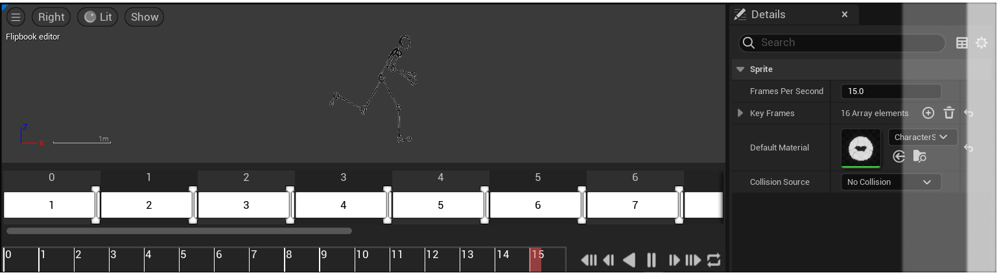
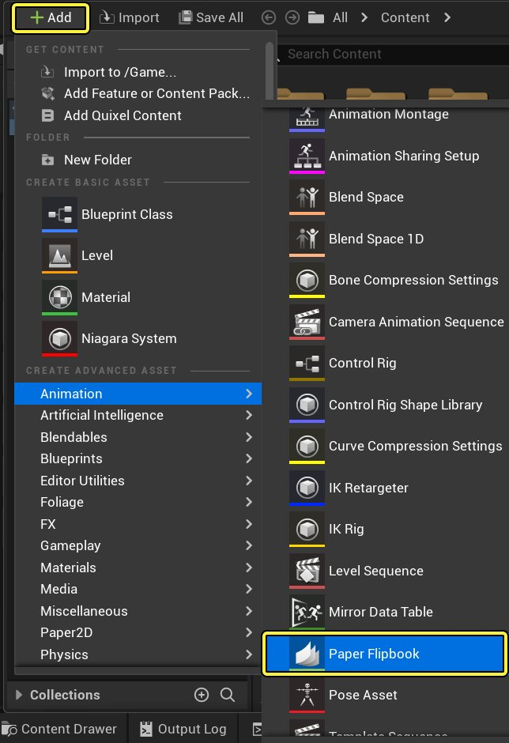
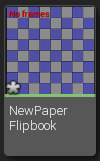
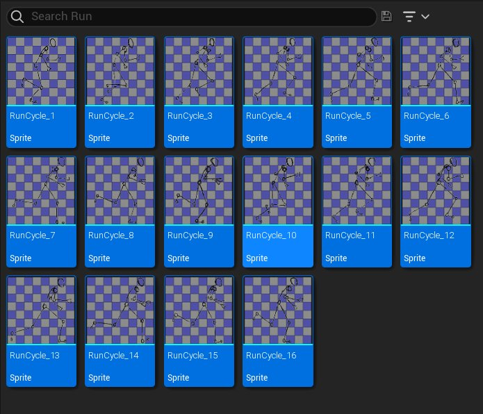
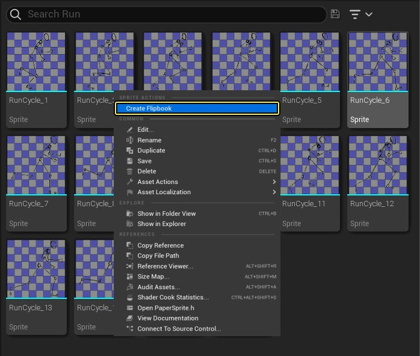
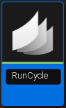
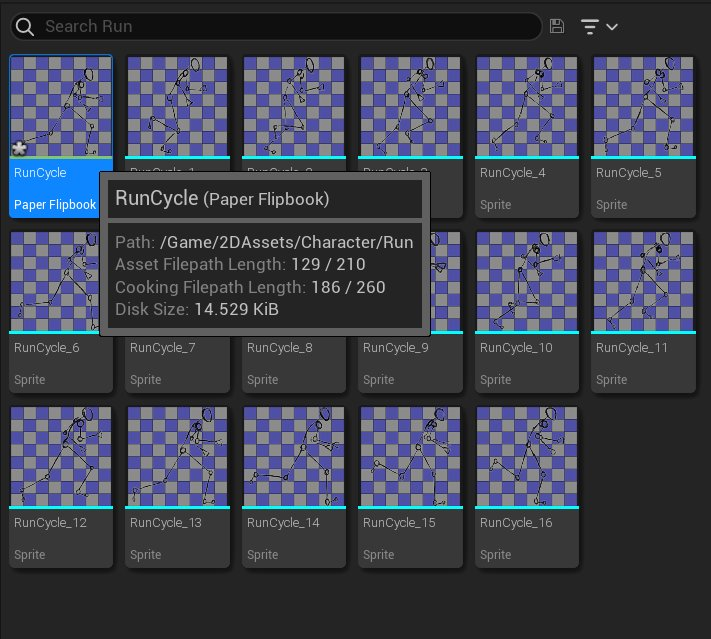

# Paper 2D Flipbooks

> 路径：虚幻引擎5.7文档 / 为角色和对象制作动画 / 虚幻引擎 / Paper 2D Flipbooks

> 原始页面：https://dev.epicgames.com/documentation/unreal-engine/paper-2d-flipbooks-in-unreal-engine

理解 **Paper 2D Flipbooks** （简称 **Flipbooks**）的最佳方式是把它看做一种手绘动画的表现形式。原理是一系列有细微不同之处的图片快速"翻过"，从而产生动画的效果。在虚幻引擎中，Flipbooks由一系列关键帧组成，每帧均包含一个需要展示的[Sprite](../paper-2d-sprites/index.md) 和展示时长（以帧数为单位）。 **每秒帧率** 选项将决定帧的播放速度，确定每秒中存在多少动画"节奏"；可在 **细节** 面板中编辑关键帧，或使用 **Flipbook编辑器** 下方的 **时间轴** 进行编辑。

## 创建一个Flipbook

可通过多种方法进行Flipbook的创建。可创建一个需自行填入sprite的空白Flipbook或基于一系列选中的sprite自动生成一个Flipbook。

> [!NOTE]
> 可导入一个JSON格式化sprite表单描述，它将导入相关纹理并为描述的帧创建sprite和一个Flipbook。查看 [Paper 2D 导入选项](../import-sprites/index.md) 中的详细内容。

### 空白Flipbooks

可通过下列方法创建一个空白 Flipbook。

**打开内容浏览器**：

1. 点击 **新建** 按钮，然后在 *动画* 的快捷菜单下选择 **纸质 Flipbook** 选项。

   

   > [!NOTE]
   > 除点击 **新建** 外，也可在 **内容抽屉** 中 **单击右键** 打开快捷菜单。
2. 弹出输入新Flipbook名称的提示。

   
3. 选定名字之后，Flipbook资产便已成功创建。

   

   左下角的星号提醒资源尚未保存，保存成功后将自动消失。

### 自动生成Flipbooks

以下是创建自动生成 Flipbook 的步骤。

**打开内容抽屉**：

1. 在 **内容抽屉**.中找到并选择需要被加入Flipbook的每个sprite。

   
2. 在任意sprite上 **单击右键**，然后从快捷菜单选择 **创建Flipbook** 选项。

   
3. 弹出输入新Flipbook名称的提示。

   
4. 选定名字之后，Flipbook资产便成功创建。

   

   在 **内容抽屉**.中将鼠标悬停在Flipbook上即可预览Flipbook动画。

> [!WARNING]
> 自动生成Flipbook时，用于sprite的命名规则 **十分重要**，因为sprite将以字母顺序添加至Flipbook。在以上示例中每个sprite皆被命名，**Idle_x** 中的X就是序列的播放顺序。
