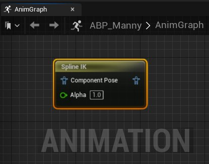
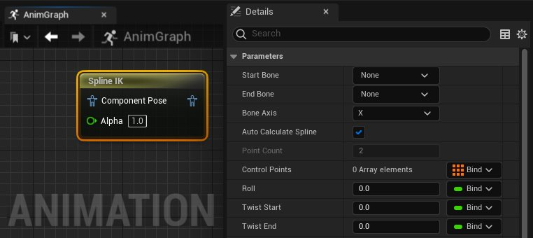

# Spline IK

> 路径：虚幻引擎5.7文档 / 为角色和对象制作动画 / 骨架网格体动画系统 / 动画蓝图 / 动画节点参考 / 骨骼控制 / Spline IK

> 原始页面：https://dev.epicgames.com/documentation/unreal-engine/animation-blueprint-spine-ik-in-unreal-engine

借助 **Spline IK（Spline IK）** [动画蓝图](../../../../../skeletal-mesh-animation-system/animation-blueprints/index.md)节点，可以将角色[骨架](../../../../../skeletal-mesh-animation-system/animation-assets-and-features/skeletons/index.md)内的骨骼链定义为脊柱。

选择骨骼链作为脊柱后，"Spline IK（Spline IK）"节点将根据你在节点 **细节（Details）** 面板中设置的参数，沿脊柱创建 **控制点（Control Points）**。

> 动图已省略：spline ik animation blueprint node demo

可以手动操作这些 **控制点** 来设置脊柱在动画播放期间做出反应的位置。还可以使用内部函数通过动态值来驱动这些控制点，或者在 **AnimGraph** 中以引脚的形式进行驱动。此外，还能够以相同方式使用动态值驱动多个"Spline IK（Spline IK）"节点属性，例如 **扭曲（Twist）**、**滚动（Roll）** 和 **拉伸（Stretch）**。

使用"Spline IK（Spline IK）"节点可以为尾巴或其他可延展的角色结构（这些结构可能受速度和运动方向等动态变量的影响）创建更逼真的运动。

> 动图已省略：spline ik animation blueprint node tail dino demo

## 属性参考

"Spline IK（Spline IK）"节点的属性列表如下。

| 属性 | 描述 |
| --- | --- |
| **起始骨骼（Start Bone）** | 从角色的[骨架](../../../../../skeletal-mesh-animation-system/animation-assets-and-features/skeletons/index.md)中选择一个骨骼，作为构成脊柱的骨骼链的起点。 |
| **末端骨骼（End Bone）** | 从角色的[骨架](../../../../../skeletal-mesh-animation-system/animation-assets-and-features/skeletons/index.md)中选择一个骨骼，作为构成脊柱的骨骼链的终点。 |
| **骨骼轴（Bone Axis）** | 选择控制点与脊柱将沿着移动的运动轴（**X**、**Y** 或 **Z**）。 |
| **自动计算脊柱（Auto Calculate Spline）** | 启用此属性可根据 **起始骨骼（Start Bone）** 和 **末端骨骼（End Bone）** 之间的骨骼数量自动计算 **控制点（Control Points）** 的数量。 |
| **点数（Point Count）** | 如果已禁用 **自动计算脊柱（Auto Calculate Spline）**，可以指定沿着脊柱在 **起始骨骼（Start Bone）** 和 **末端骨骼（End Bone）** 之间添加的 **控制点（Control Points）** 数量。 |
| **控制点（Control Points）** | 在此处可沿着脊柱对每个 **控制点（Control Points）** 应用变换。默认情况下，可以在视口中手动应用这些变换，也可以在每个控制点的每个数组元素下使用变换属性应用这些变换。还可以动态调整这些属性，方法是在 **AnimGraph** 中将 **控制点（Control Points）** 作为引脚公开，或者使用内部函数。 |
| **滚动（Roll）** | 设置 **起始骨骼（Start Bone）** 与 **末端骨骼（End Bone）** 之间的 **控制点（Control Points）** 沿脊柱方向应用在其他运动之上的旋转程度。值为0将禁用额外滚动，正值将沿 **骨骼轴（Bone Axis）** 正向滚动中间 **控制点（Control Points）**，负值将沿 **骨骼轴（Bone Axis）** 负向滚动中间 **控制点（Control Points）**。 |
| **扭曲起点（Twist Start）** | 设置沿脊柱方向应用在其他运动之上的第一个 **控制点（Control Point）**（即 **控制点0（Control Point 0）**）的扭曲程度。值为0将禁用扭曲，正值将沿 **骨骼轴（Bone Axis）** 正向扭曲起始 **控制点（Control Point）**，负值将沿 **骨骼轴（Bone Axis）** 负向扭曲起始 **控制点（Control Point）**。 |
| **扭曲终点（Twist End）** | 设置沿脊柱方向应用在其他运动之上的最后一个 **控制点（Control Point）**（最高数值的 **控制点X（Control Point X）**）的扭曲值。值为0将禁用扭曲，正值将沿 **骨骼轴（Bone Axis）** 正向扭曲末端 **控制点（Control Point）**，负值将沿 **骨骼轴（Bone Axis）** 负向扭曲末端 **控制点（Control Point）**。 |
| **扭曲混合（Twist Blend）** | 选择应用于 **扭曲起点（Twist Start）** 和 **扭曲终点（Twist End）** 的扭曲属性。 **混合时间（Blend Time）**：设置混合两个扭曲姿势的时间（以秒为单位）。 **混合选项（Blend Option）**：选择用于在两个扭曲姿势之间混合的混合类型。 **自定义曲线（Custom Curve）**：在此处可设置曲线来驱动两个扭曲姿势之间的混合。 |
| **拉伸（Stretch）** | 设置将骨骼放入脊柱时允许的最大拉伸。值为0.0将禁用沿脊柱长度的结构拉伸。值为1.0将使结构完全拉伸到脊柱的长度。 |
| **偏移（Offset）** | 设置从约束骨骼的 **起始骨骼（Start Bone）** 沿脊柱偏移的距离。值为0不会使结构偏移，大于0的值会使结构朝着 **末端骨骼（End Bone）** 方向偏移。 |
