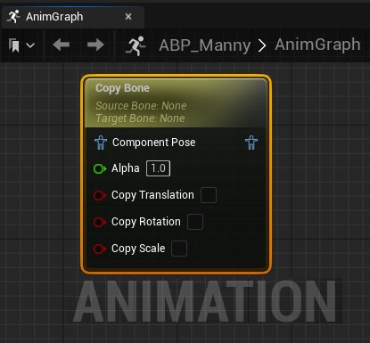
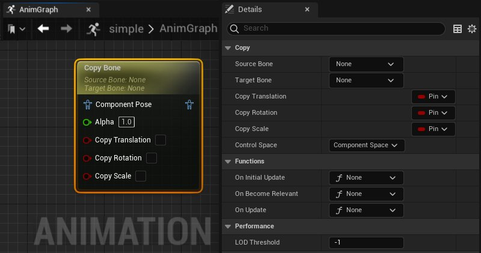

# 复制骨骼

> 路径：虚幻引擎5.7文档 / 为角色和对象制作动画 / 骨架网格体动画系统 / 动画蓝图 / 动画节点参考 / 骨骼控制 / 复制骨骼

> 原始页面：https://dev.epicgames.com/documentation/unreal-engine/animation-blueprint-copy-bone-in-unreal-engine

借助 [动画蓝图](../../../../../skeletal-mesh-animation-system/animation-blueprints/index.md)中的 **复制骨骼（Copy Bone）**节点，你可以将 **平移（Translation）**、**旋转（Rotation）** 和 **缩放（Scale）** 等变换数据从 **源骨骼（Source Bone）** 复制到 **目标骨骼（Target Bone）**。

得益于一种简单的实现方式，你可以用"复制骨骼（Copy Bone）"节点将 **源骨骼（Source Bone）** 的位置和运动复制到 **目标骨骼（Target Bone）**。例如，此处选择了角色的右手辅助武器骨骼（`weapon_r`）作为 **目标骨骼（Target Bone）**，然后复制 **源骨骼（Source Bone）**，也就是角色的左手骨骼（`hand_l`）、位置和运动。现在，我们可以看到"复制骨骼（Copy Bone）"节点的效果：在运行时将武器骨骼从角色的右手移动到左手。

| copy bone demo disabled | copy bone demo enabled |
| --- | --- |
| 禁用了复制骨骼 | 启用了复制骨骼 |

使用"复制骨骼（Copy Bone）"节点的这一实现方式可以在动画播放期间将某个对象从[骨骼网格体（Skeletal Mesh）](../../../../../../working-with-content/skeletal-mesh-assets/index.md)的一只手传递到另一只手。

在 **AnimGraph** 中，你可以切换不同的运动组件，包括 **平移（Translation）**、**旋转（Rotation）** 和 **缩放（Scale）**，从而将 **源骨骼（Source Bone）** 运动应用到 **目标骨骼（Target Bone）**。

使用 **Alpha** 值或引脚，可以控制生成的输出姿势的混合程度。值为 **1** 将使用生成的输出姿势，而值为 **0** 将会输出源姿势。

## 属性参考

"复制骨骼（Copy Bone）"节点的属性如下。

| 属性 | 描述 |
| --- | --- |
| **源骨骼（Source Bone）** | 从角色的[骨架](../../../../../skeletal-mesh-animation-system/animation-assets-and-features/skeletons/index.md)中选择一个骨骼作为应用于 **目标骨骼（Target Bone）** 的运动数据源。 |
| **目标骨骼（Target Bone）** | 从角色的[骨架](../../../../../skeletal-mesh-animation-system/animation-assets-and-features/skeletons/index.md)中选择一个骨骼作为运动数据目标。 |
| **复制平移（Copy Translation）** | 将 **平移（Translation）** 运动从 **源骨骼（Source Bone）** 应用到 **目标骨骼（Target Bone）**。默认情况下，此属性在 **AnimGraph** 中的节点上显示为布尔值。 |
| **复制旋转（Copy Rotation）** | 将 **旋转（Rotation）** 运动从 **源骨骼（Source Bone）** 应用到 **目标骨骼（Target Bone）**。默认情况下，此属性在 **AnimGraph** 中的节点上显示为布尔值。 |
| **复制缩放（Copy Scale）** | 将 **缩放（Scale）** 运动从 **源骨骼（Source Bone）** 应用到 **目标骨骼（Target Bone）**。默认情况下，此属性在 **AnimGraph** 中的节点上显示为布尔值。 |
| **控制空间（Control Space）** | 选择在哪个空间中计算 **源骨骼（Source Bone）** 运动并应用于 **目标骨骼（Target Bone）**。 **世界空间（World Space）**：复制 **源骨骼（Source Bone）** 在世界空间中的绝对位置。 **组件空间（Component Space）**：在[骨骼网格体（Skeletal Mesh）](../../../../../../working-with-content/skeletal-mesh-assets/index.md)的参考框架内复制 **源骨骼（Source Bone）** 的位置和运动数据。 **父骨骼空间（Parent Bone Space）**：复制 **源骨骼（Source Bone）** 相对于父骨骼的位置和运动数据。 **骨骼空间（Bone Space）**：复制 **源骨骼（Source Bone）** 在其自己的参考框架内的位置和运动数据。 |
