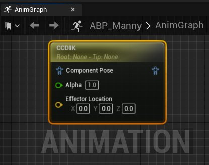
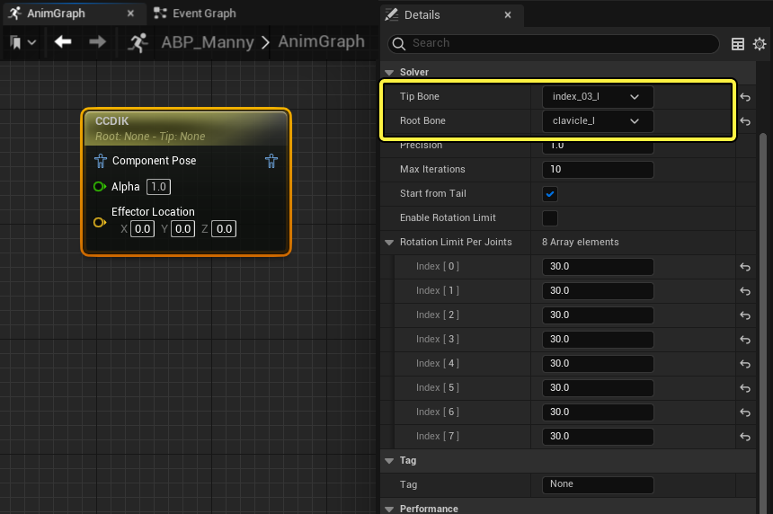
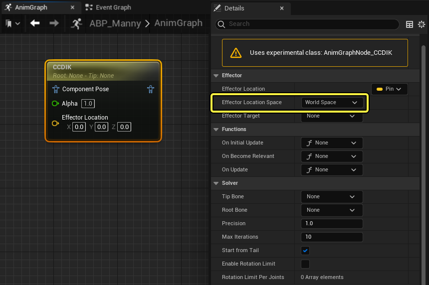
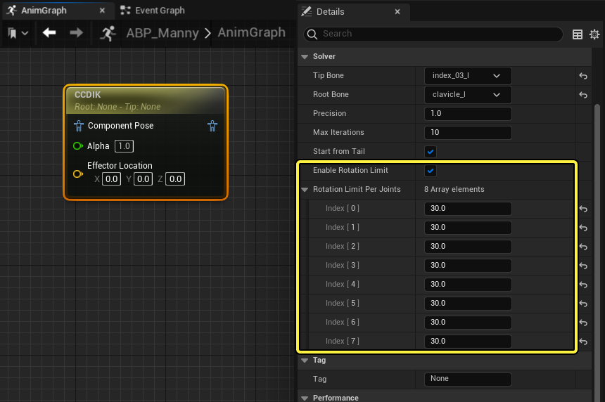
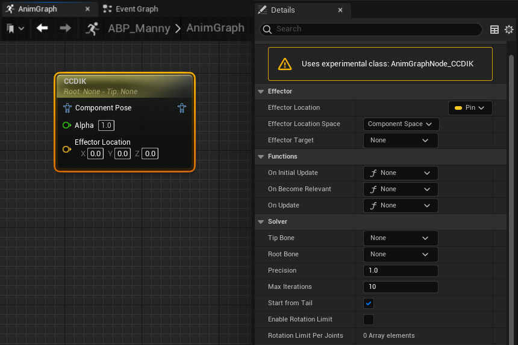
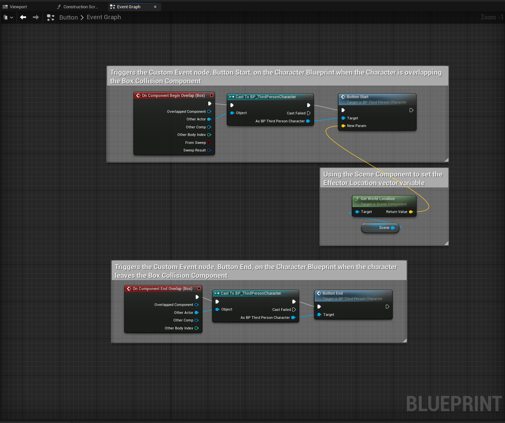

# CCDIK

> 路径：虚幻引擎5.7文档 / 为角色和对象制作动画 / 骨架网格体动画系统 / 动画蓝图 / 动画节点参考 / 骨骼控制 / CCDIK

> 原始页面：https://dev.epicgames.com/documentation/unreal-engine/animation-blueprint-ccdik-in-unreal-engine

CCDIK（循环坐标下降逆向运动学）[动画蓝图](../../../../../skeletal-mesh-animation-system/animation-blueprints/index.md)节点是一个轻量级的IK解算器，通常用于将骨骼链驱动至 **执行器位置（Effector Location）**。CCDIK节点与 [FABRIK](../../../../../skeletal-mesh-animation-system/animation-blueprints/animation-blueprint-nodes/fabrik-animation-blueprint/index.md)节点类似，不过，CCDIK提供了定义角约束的功能，需要在解算中限制任意骨骼的旋转时较为实用。

这里CCDIK节点在 **动画图表** 中被选中，并且在视口窗口中使用调试运动工具操作 **执行器位置**。

> 动图已省略：ccdik动画蓝图节点

改变执行器位置时，选中的骨骼链（通过红色调试线条高光显示）会将末端骨骼与执行器位置匹配。通过给执行器位置使用动态矢量变量，并且应用旋转限制，该节点可以为[骨骼网格体](../../../../../../working-with-content/skeletal-mesh-assets/index.md)做出动态调整，以此来实现角色与游戏世界中物体的互动。

通过 **Alpha** 值（引脚），你可以控制姿势中的运动角度。如果把值设置为 **1**，则完全使用输出姿势。如果是 **0**，则完全使用源姿势。

## 设置

在该示例流程中，CCDIK节点会用于动态调节角色的手指来按下游戏世界中的一个按钮。

CCDIK节点在 **组件空间（Component Space）** 中运行，所以需要执行[空间转换](../../../../../skeletal-mesh-animation-system/animation-blueprints/animation-blueprint-nodes/animation-blueprint-component-space-022a8e09/index.md)才能将节点应用到角色的动画蓝图中。

将CCDIK节点添加到你的动画蓝图(animating-characters-and-objects\SkeletalMeshAnimation\AnimBlueprints)后，在动画图表中选中节点来打开细节面板。

在细节面板中可以选择末端骨骼，其位于骨骼链的末端，还可以选择根骨骼，会将调节施加到一个 **本地（local）** 根骨骼。在该示例中，**末端骨骼** 设为食指，(**index_03_l**) 而 **根骨骼** 设为锁骨 (**clavical_l**)。

将 **执行器位置空间（Effector Location Space）** 调整为 **世界空间（World Space）**，以此计算关卡中的 **执行器位置（Effector Location）** 向量。

切换 **启用旋转限制（Enable Rotation Limit）** 属性可以启用旋转限制并且在 **每个关节的旋转限制（Rotation Limit Per Joints）** 部分进行调整。在本地 **根骨骼** 和 **末端骨骼** 之间，[骨架](../../../../../skeletal-mesh-animation-system/animation-assets-and-features/skeletons/index.md)中的每个关节都会有一个 **数字（Index）**。你可以对这些旋转进行调整，避免出现不想要的几何体重叠以及角色关节的过度伸展。

CCDIK节点现在会调整 **末端骨骼**，受 **根骨骼** 和旋转限制的限制，并试图匹配 **执行器位置（Effector Location）**，这样角色可以从任何角度和高度动态地与按钮互动。

> 动图已省略：ccdik节点按钮示例

## 属性参考

以下是CCDIK节点的各个属性。

| 属性 | 描述 |
| --- | --- |
| **执行器位置（Effector Location）** | 该属性默认显示为 **动画图表** 中节点上的引脚。其数值是解算时要将 **末端骨骼** 调节至的目标点。 |
| **执行器位置空间（Effector Location Space）** | **执行器位置（Effector Location）** 使用的空间参考系。 |
| **执行器目标（Effector Target）** | 当 **执行器位置空间（Effector Location Space）** 设为 **骨骼（Bone）**，你可以在该属性中定义目标骨骼。 |
| **末端骨骼（Tip Bone）** | 从[骨骼网格体](../../../../../../working-with-content/skeletal-mesh-assets/index.md)中选择骨骼来将其调节至 **执行器位置（Effector Location）**。 |
| **根骨骼（Root Bone）** | 从[骨骼网格体](../../../../../../working-with-content/skeletal-mesh-assets/index.md)中选择骨骼作为骨骼链的终点，将骨骼链的动作锁定在本地根骨骼点上。 |
| **精确度（Precision）** | 这里可以设置从 **执行器位置（Effector Location）** 到 **末端骨骼** 差量的容差。默认数值1适用于大多数项目。增加数值可以增加精度，减小数值可以减少精度。 |
| **最大迭代数（Max Iterations）** | 在这里可以设置节点允许进行的的解算迭代的最大数量。更高的数值会影响性能但是计算的数值更为准确，较低的数值会带来更佳的性能但会牺牲精度。默认数值10对大多数项目都适用。 |
| **从尾部开始（Start from Tail）** | 启用后骨骼链的调试绘图会从 **末端骨骼** 开始，在 **根骨骼** 结束。 |
| **启用旋转限制（Enable Rotation Limit）** | 启用后，节点会基于 **每个关节的旋转限制（Rotation Limit Per Joints）** 属性中的 **数字（Index）** 限制骨骼链中的每一个关节的旋转。 |
| **每个关节的旋转限制（Rotation Limit Per Joints）** | 在这里可以为骨骼链上 **末端骨骼** 和 **根骨骼** 之间的每个关节定义旋转限制。起始的 **数字（Index）** 会应用到直接连接在 **末端骨骼** 上的关节，然后顺着骨骼链依次应用直到 **根骨骼** 邻近的关节。 |

## 按钮蓝图参考

在这里可以参考用来创建按钮示例的按钮蓝图、角色蓝图以及角色的动画蓝图。

*按钮Actor蓝图 | 角色蓝图 | 角色动画蓝图*
