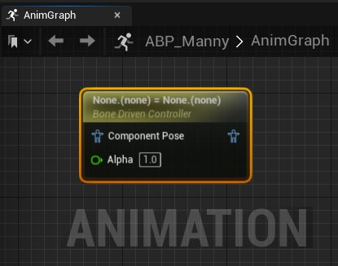
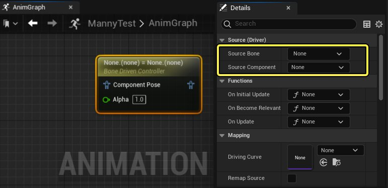
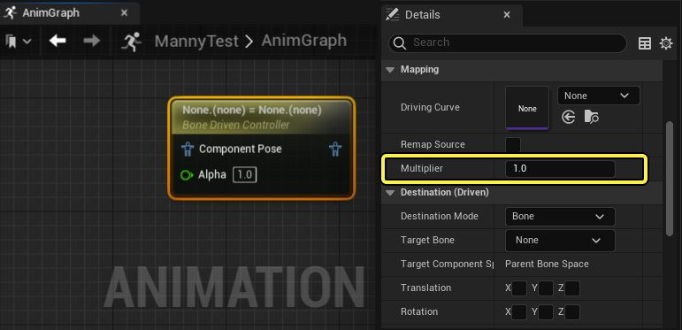
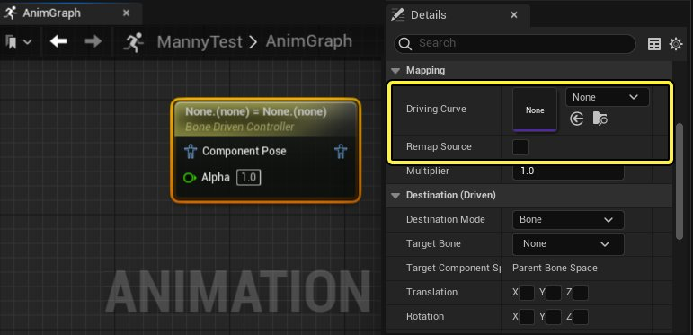
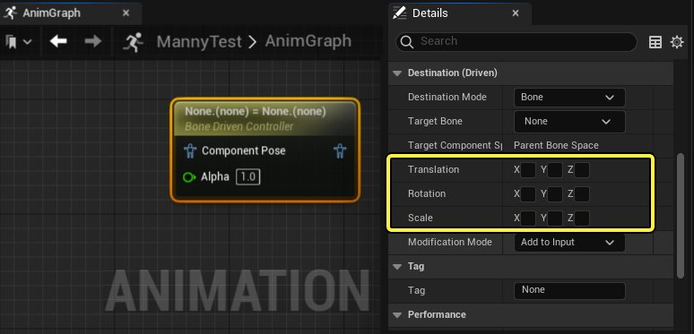
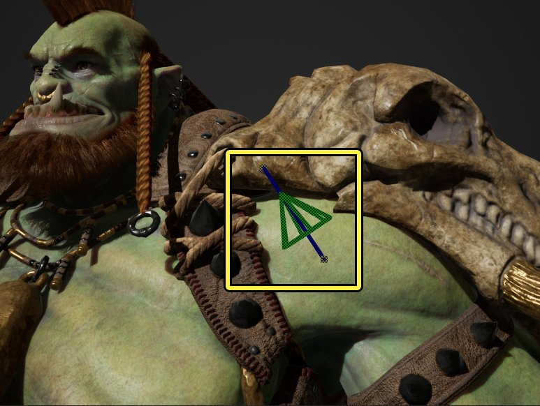
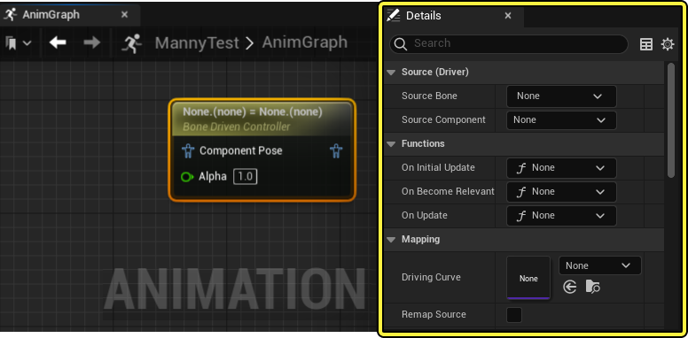

# 骨骼驱动控制器

> 路径：虚幻引擎5.7文档 / 为角色和对象制作动画 / 骨架网格体动画系统 / 动画蓝图 / 动画节点参考 / 骨骼控制 / 骨骼驱动控制器

> 原始页面：https://dev.epicgames.com/documentation/unreal-engine/animation-blueprint-bone-driven-controller-in-unreal-engine

**骨骼驱动控制器（Bone Driven Controller）** [动画蓝图](../../../../../skeletal-mesh-animation-system/animation-blueprints/index.md)节点可以用于动态影响 **目标对象（Target Object）** 的动作，比如另一个 [骨骼](../../../../../skeletal-mesh-animation-system/animation-assets-and-features/skeletons/index.md)、**变形对象（Morph Target）** 或者 **材质参数（Material Parameter）**。

## 概览

通过该节点，可以应用来自 **源骨骼（Source Bone）** 的运动数据，以此来动态调整[骨骼网格体](../../../../../../working-with-content/skeletal-mesh-assets/index.md)上的另一个对象，比如角色的配件物体，从而避免几何体在动画中重叠。

这里角色的手臂骨骼被选为 **源骨骼（Source Bone）**，护肩骨骼选作 **目标骨骼（Target Bone）**。当手臂旋转时，骨骼驱动控制器节点使用手臂骨骼的动作来类似的旋转驱动护肩骨骼，以此来由于护肩不运动导致二者发生重叠。

| 不使用骨骼驱动控制器节点 | 使用骨骼驱动控制器节点 |
| --- | --- |
| **禁用** 骨骼驱动控制器 | **启用** 骨骼驱动控制器 |

## 设置

骨骼驱动控制器节点在 **组件空间（Component Space）** 中运作，所以需要进行[空间转换](../../../../../skeletal-mesh-animation-system/animation-blueprints/animation-blueprint-nodes/animation-blueprint-component-space-022a8e09/index.md)才能在角色的动画蓝图中使用该节点。

使用 **Alpha** 属性或引脚，你可以控制生成的输出姿势上应用动作的程度。数值 **1** 会使用生成的输出姿势，数值 **0** 会使用源姿势。

在骨骼驱动控制器节点的 **细节** 面板上，首先要定义 **源骨骼（Source Bone）**。然后在 **源组件属性（Source Component Property）** 中，可以选择动作类型 (**位移（Translation）**、**旋转（Rotation）** 或者 **缩放（Scale）**)，以及 **源骨骼（Source Bone）** 的哪一个轴 (**X**、**Y** 或者 **Z**) 要用作驱动目标对象的动作。

通过 **乘数（Multiplier）** 属性可以定义数值来在 **源骨骼（Source Bone）** 驱动目标对象的时候乘以其原来的动作。

> [!NOTE]
> 如果 **乘数（Multiplier）** 属性为0，那么将不会应用动作。当 **驱动曲线（Driving Curve）** 被选中时，**乘数（Multiplier）** 属性会被忽略。

在 **驱动曲线（Driving Curve）** 属性中可以分配一个曲线来修改 **源骨骼（Source Bone）** 的动作。曲线可以对于 **源骨骼（Source Bone）** 的动作如何驱动目标对象实施更精准的控制。

如果 **目标模式（Destination Mode）** 属性设为 **骨骼（Bone）**，那么必须定义一个应用的动作类型。通过在 **位移（Translation）**、**旋转（Rotation）** 和 **缩放（Scale）** 属性中切换不同动作轴，便可以定义 **源骨骼（Source Bone）** 动作如何驱动 **目标骨骼（Target Bone）**。你可以任意组合启用这些属性，源骨骼的运动数据将会各自叠加应用。

> [!NOTE]
> 如果不选择应用的动作类型，那么便不会应用任何动作。

### 调试

在 **动画图表** 中选中骨骼驱动控制器节点后，视口中将会绘制一个调试物体来显示相关联的对象。**蓝色线条** 会连接 **源骨骼（Source Bone）** 和目标对象，而 **绿色锥体** 会在蓝色线条上指向目标对象。

## 属性参考

以下可以参考骨骼驱动控制器的各个属性。

| 属性 | 描述 |
| --- | --- |
| **源骨骼（Source Bone）** | 选择用作控制器驱动目标对象的骨骼。 |
| **源组件（Source Component）** | 选择 **源骨骼（Source Bone）** 的哪一个动作组件用来驱动目标骨骼。 你可以选择源对象的 **位移（Translation）**、**旋转（Rotation）** 和 **缩放（Scale）** 组建的任意轴(**X**、**Y**、**Z**)。 |
| **驱动曲线（Driving Curve）** | 这里可以选择从**源骨骼（Source Bone）** 属性映射到目标对象属性的曲线。如果不选用曲线，那么骨骼驱动控制节点将使用 **乘数（Multiplier）** 来判断 **源骨骼（Source Bone）** 属性应用到目标对象属性的程度。 |
| **重映射源（Remap Source）** | 启用后，骨骼驱动控制器节点会抓取 **源骨骼（Source Bone）** 属性，并在 **缩放数值之前** 将其重映射到曲线上。 |
| **乘数（Multiplier）** | 应用到 **源骨骼（Source Bone）** 属性的乘数来驱动目标对象。 |
| **目标模式（Destination Mode）** | 选择 **源骨骼（Source Bone）** 动作将要驱动的对象类型。可以选择另一个 [骨骼](../../../../../skeletal-mesh-animation-system/animation-assets-and-features/skeletons/index.md)、**变形目标（Morph Target）** 或者 **材质参数（Material Parameter）** |
| **目标骨骼（Target Bone）** | 当 **目标模式（Destination Mode）** 属性中选择的是 **骨骼（Bone）** 时，可以在这里选择一个要用 **源骨骼（Source Bone）** 驱动的骨骼。 |
| **目标组件空间（Target Component Space）** | 这里可以引用 **目标骨骼（Target Bone）** 的组件空间。 |
| **修改模式（Modification Mode）** | 按照需求切换你想让 **源骨骼（Source Bone）** 驱动的任意 **位移（Translation）** 轴 (**X**、**Y**、**Z**)。 |
| **位移（Translation）** | 按照需求切换你想让 **源骨骼（Source Bone）** 驱动的任意 **位移（Translation）** 轴 (**X**、**Y**、**Z**)。 |
| **Rotation）** | 按照需求切换你想让 **源骨骼（Source Bone）** 驱动的任意 **旋转（Rotation）** 轴 (**X**、**Y**、**Z**)。 |
| **缩放（Scale）** | 按照需求切换你想让 **源骨骼（Source Bone）** 驱动的任意 **缩放（Scale）** 轴 (**X**、**Y**、**Z**)。 |
| **修改模式（Modification Mode）** | 这里可以选择骨骼驱动控制器节点驱动 **目标骨骼（Target Bone）** 的方法。 **添加至输入（Add to Input）**: 会将驱动属性值添加到已有的输入属性值中。 **替换组件（Replace Component）**: 用驱动属性数值替换输入属性数值。 **添加到参考姿势（Add to Reference Pose）**: 将驱动属性数值添加到角色的参考姿势。 |
| **参数名称（Parameter Name）** | 当 **目标模式（Destination Mode）** 属性设为 **变形目标（Morph Target）** 或者 **材质参数（Material Parameter）**，在该属性中输入对象名称可以指定要用 **源骨骼（Source Bone）** 驱动哪个对象。 |
