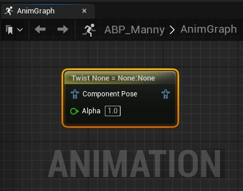
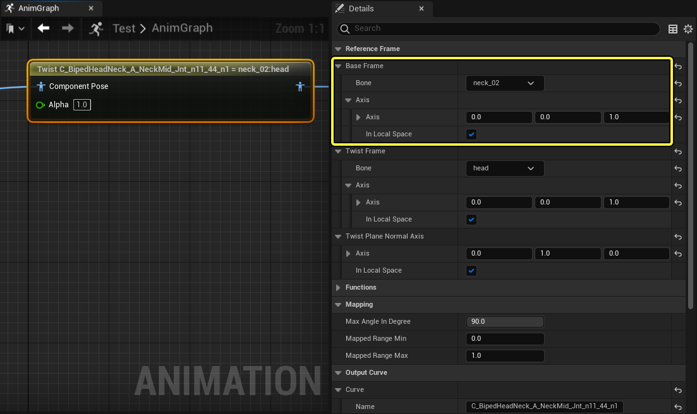
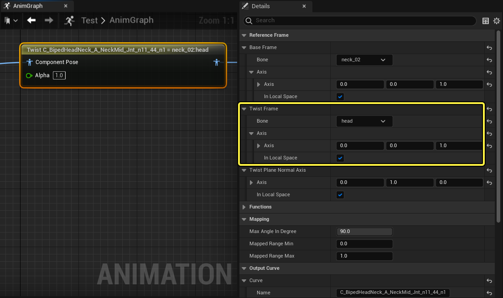
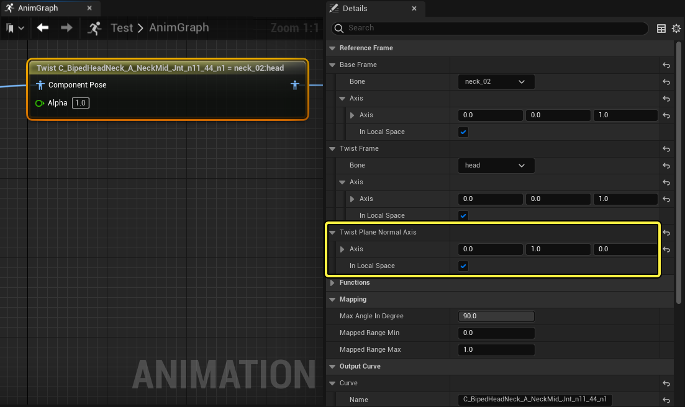
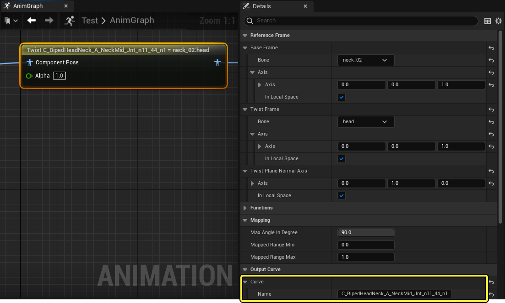
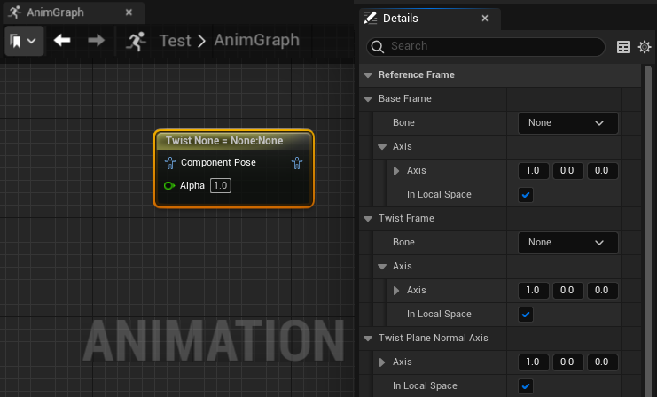

# Twist Corrective

> 路径：虚幻引擎5.7文档 / 为角色和对象制作动画 / 骨架网格体动画系统 / 动画蓝图 / 动画节点参考 / 骨骼控制 / Twist Corrective

> 原始页面：https://dev.epicgames.com/documentation/unreal-engine/animation-blueprint-twist-corrective-in-unreal-engine

你可以使用 **Twist Corrective** [动画蓝图](../../../../../skeletal-mesh-animation-system/animation-blueprints/index.md)节点来控制[动画曲线](../../../../../skeletal-mesh-animation-system/animation-assets-and-features/animation-sequences/animation-curves/index.md)，例如[变形目标](../../../../../skeletal-mesh-animation-system/animation-assets-and-features/skeletons/index.md)。在此过程中你需要用到增量角度的变换，而增量角度要根据 **扭转平面（Twist Planer）** 的方向使用 **基础帧（Base Frame）** 和 **扭转帧（Twist Frame）** 计算得出。

## 概述

你可以使用Twist Corrective节点根据一个骨骼相对于另一个骨骼的扭转来驱动[动画曲线](../../../../../skeletal-mesh-animation-system/animation-assets-and-features/animation-sequences/animation-curves/index.md)值，例如[变形目标](../../../../../skeletal-mesh-animation-system/animation-assets-and-features/skeletons/index.md)。

在下面的示例中，角色的嵌接变形目标随着头部骨骼扭转而调整，这样看起来更自然。

| twist corrective已禁用 | twist corrective已启用 |
| --- | --- |
| 已禁用Twist Corrective | 已启用Twist Corrective |

### 示例工作流程

Twist Corrective节点在 **组件空间（Component Space）** 中运行，因此需要进行[空间转换](../../../../../skeletal-mesh-animation-system/animation-blueprints/animation-blueprint-nodes/animation-blueprint-component-space-022a8e09/index.md)，以在角色的动画蓝图中实现该节点。

首先，你必须选择充当 **基础帧（Base Frame）** 的骨骼，或选择一个参考骨骼，来计算扭转骨骼的alpha。此外，请务必定义扭转alpha所在的运动是相对于哪个轴。在轴（Axis）属性中，将值设置为1，定义运动将在哪个轴中发生。在提供的示例中，使用了neck_02骨骼，并为Z轴提供了值1。

接下来，选择经历扭转运动的骨骼作为 **扭转帧骨骼（Twist Frame Bone）** ，在示例中，使用了 **头部** 骨骼。你还必须定义运动的轴，在本例中，该属性将仅使用 **Z** 轴上的值 **1**，复制 **基础帧轴（Base Frame Axis）** 。

你还必须设置扭转平面作为参考点，以计算alpha运动。在示例中，在 **Y** 轴（Y-Axis）字段中设置了值 **1** 来启用 **Y** 轴。

最后，你必须输入[动画曲线](../../../../../skeletal-mesh-animation-system/animation-assets-and-features/animation-sequences/animation-curves/index.md)的名称，在本例中，这是供Twist Corrective节点遵循的变形目标。在工作流程示例中，是变形目标 `C_BipedHeadNeck_A_NeckMid_Jnt_n11_44_n1`，它表示演示中可见的嵌接运动。

编译动画蓝图后，效果应该可见，因为头部骨骼在视口中沿 **Z** 轴旋转。

## 属性参考

下面你可以参考Twist Corrective节点的一系列属性。

| 属性 | 说明 |
| --- | --- |
| **基础帧（Base Frame）** | 基础帧系列的属性定义了计算 **扭转帧（Twist Frame）** 的运动alpha的参考点。 在 **骨骼（Bone）** 属性中，你可以从角色的[骨架](../../../../../skeletal-mesh-animation-system/animation-assets-and-features/skeletons/index.md)选择要用作基础帧的骨骼。 在 **轴（Axis）** 属性中，你可以选择要计算运动的运动轴。值为 **0** 时不会计算运动，值为 **1** 时将计算正向运动，值为 **-1** 时将计算负向运动。 你还可以启用在 **在本地空间中（In Local Space）** 属性以在本地空间中计算运动，或禁用 **在本地空间中（In Local Space）** 以在世界空间中计算运动。 |
| **扭转帧（Twist Frame）** | 扭转帧系列属性定义了扭转骨骼，以相对于 **基础帧（Base Frame）** 和 **扭转刨刀法线轴（Twist Planer Normal Axis）** 计算运动alpha。 在 **骨骼（Bone）** 属性中，你可以从角色的[骨架](../../../../../skeletal-mesh-animation-system/animation-assets-and-features/skeletons/index.md)选择要用作扭转帧的骨骼。 在 **轴（Axis）** 属性中，你可以选择要计算运动的运动轴。值为 **0** 时不会计算运动，值为 **1** 时将计算正向运动，值为 **-1** 时将计算负向运动。 你还可以启用在 **在本地空间中（In Local Space）** 属性以在本地空间中计算运动，或禁用 **在本地空间中（In Local Space）** 以在世界空间中计算运动。 |
| **扭转刨刀法线轴（Twist Planer Normal Axis）** | 此处你可以设置平面的法线，以计算 **扭转帧（Twist Frame）* 相对于**基础帧（Base Frame）** 的角度alpha。 在 **轴（Axis）** 属性中，你可以选择要计算运动的运动轴。值为 **0** 时不会计算运动，值为 **1** 时将计算正向运动，值为 **-1** 时将计算负向运动。 你还可以启用在 **在本地空间中（In Local Space）** 属性以在本地空间中计算运动，或禁用 **在本地空间中（In Local Space）** 以在世界空间中计算运动。 |
| **最大角度度数（Max Angle in Degree）** | 设置将值输出到 **曲线（Curve）** 的扭转的最大限制。例如，在怎样的度数下扭转才会导致输出最大曲线值。值不能超过180。 |
| **映射的范围下限（Mapped Range Min）** | 要应用于曲线的最小值。值0表示曲线开头，值 **1** 表示曲线结尾。 |
| **映射的范围上限（Mapped Range Max）** | 要应用于曲线的最大值。值0表示曲线开头，值 **1** 表示曲线结尾。 |
| **曲线（Curve）** | 输入你想根据 **扭转帧骨骼（Twist Frame Bone）** 中计算的扭转alpha来应用 **映射的范围下限（Mapped Range Min）** 和 **映射的范围上限（Mapped Range Max）** 的[曲线](../../../../../skeletal-mesh-animation-system/animation-assets-and-features/animation-sequences/animation-curves/index.md)或[变形目标](../../../../../skeletal-mesh-animation-system/animation-assets-and-features/skeletons/index.md)的名称。 |
