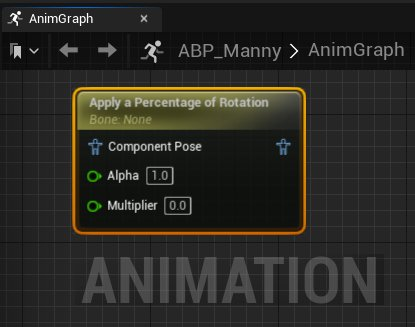
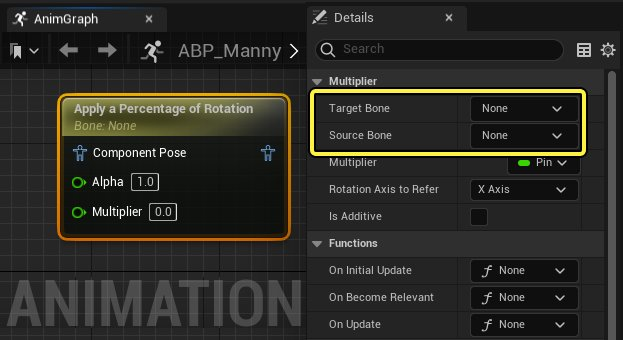
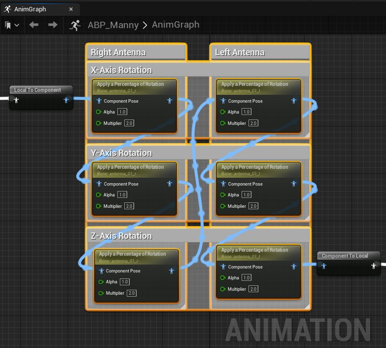
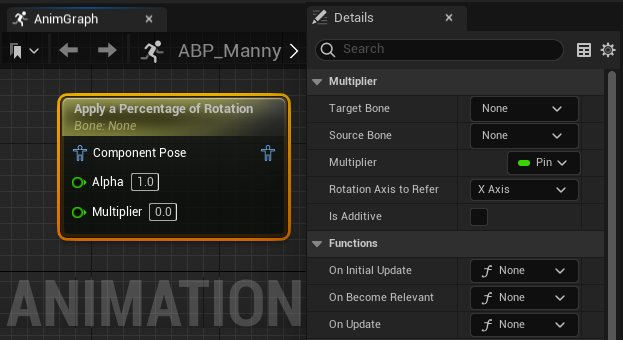

# 应用旋转百分比

> 路径：虚幻引擎5.7文档 / 为角色和对象制作动画 / 骨架网格体动画系统 / 动画蓝图 / 动画节点参考 / 骨骼控制 / 应用旋转百分比

> 原始页面：https://dev.epicgames.com/documentation/unreal-engine/animation-blueprint-apply-percent-of-rotation-in-unreal-engine

借助[动画蓝图](../../../../../skeletal-mesh-animation-system/animation-blueprints/index.md)中的 **应用旋转百分比（Apply a Percentage of Rotation）** 节点，你可以将 **源骨骼（Source Bone）** 的旋转运动应用到 **目标骨骼（Target Bone）** 上。

这里，机器人的天线骨骼结匹配了其头部骨骼的X轴旋转运动。

| 不应用旋转百分比 | 应用旋转百分比 |
| --- | --- |
| 不应用旋转百分比 | 应用旋转百分比 |

## 概况

应用旋转百分比节点在 **组件空间（Component Space）** 中运作，所以角色的动画蓝图中必须有一个[空间转换](../../../../../skeletal-mesh-animation-system/animation-blueprints/animation-blueprint-nodes/animation-blueprint-component-space-022a8e09/index.md)才能实现这个节点。

通过 **Alpha** 属性（引脚），你可以控制在生成的输出姿势上应用旋转的程度。数值 **1** 会使用生成的输出姿势，而数值 **0** 会直接输出源姿势。

**乘数（Multiplier）** 属性（引脚）允许你在 **源骨骼（Source Bones）** 旋转度的基础上实现更大的旋转。

> [!NOTE]
> **乘数（Multiplier）** 数值为0时，不会在目标骨骼上进行任何旋转。

应用旋转百分比节点的 **细节（Details）** 面板中可以选择要复制动作的 **源骨骼**，以及要应用复制来的旋转的 **目标骨骼**。

请参阅[属性参考](#propertyreference)表格来了解应用旋转百分比节点的更多属性。

### 叠加节点

叠加多个应用旋转百分比节点可以实现多轴旋转，并且可以给每个节点分配不同的旋转轴。

> [!NOTE]
> 叠加应用旋转百分比节点时，要确保 **细节** 面板中的 **可叠加（Is Additive）** 属性已启用，才能让多个节点给一块骨骼应用旋转。在同一块骨骼上同时使用应用旋转百分比节点和其它动画或者节点时也需要选用该属性。

## 属性参考

下表罗列了应用旋转百分比节点的各个属性。

| 属性 | 描述 |
| --- | --- |
| **目标骨骼（Target Bone）** | 从角色的[骨骼](../../../../../skeletal-mesh-animation-system/animation-assets-and-features/skeletons/index.md)中选择一块骨骼用于应用来自 **源骨骼（Source Bone）** 的旋转。目标骨骼的子骨骼也会根据父骨骼的动作而运动。 |
| **源骨骼（Source Bone）** | 旋转要从中复制旋转动作的骨骼，使用的旋转轴由 **引用旋转轴（Rotation Axis To Refer）** 属性决定。该旋转会被应用到 **目标骨骼（Target Bone）**。 |
| **乘数（Multiplyer）** | 设置乘数，将 **源骨骼（Source Bone）** 的旋转运动应用到 **目标骨骼（Target Bone）** 上。数值1意味着原样复制旋转。 默认给属性可以在选中节点的 **动画图表（AnimGraph）** 中找到。 |
| **引用旋转轴（Rotation Axis To Refer）** | 这里可以旋转复制 **源骨骼（Source Bone）** 上的哪一个旋转轴并将其应用到 **目标骨骼（Target Bone）**。 |
| **可叠加（Is Additive）** | 启用该属性可以让应用到骨骼上的旋转动作叠加。禁用该属性将会覆盖之前 **目标骨骼（Target Bone）** 的所有动作。 |
