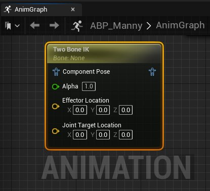
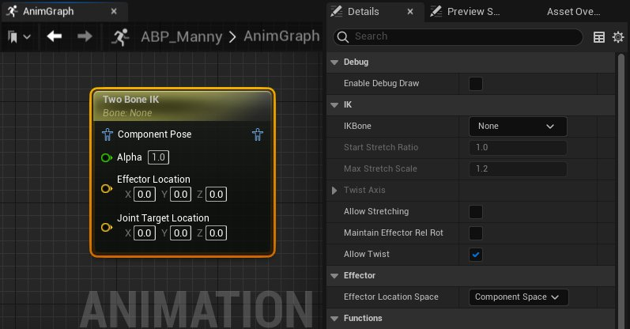

# Two Bone IK

> 路径：虚幻引擎5.7文档 / 为角色和对象制作动画 / 骨架网格体动画系统 / 动画蓝图 / 动画节点参考 / 骨骼控制 / Two Bone IK

> 原始页面：https://dev.epicgames.com/documentation/unreal-engine/animation-blueprint-two-bone-ik-in-unreal-engine

使用 **Two Bone IK** [动画蓝图](../../../../../skeletal-mesh-animation-system/animation-blueprints/index.md)节点，你可以控制双骨链，例如[骨骼网格体](../../../../../../working-with-content/skeletal-mesh-assets/index.md)、角色的手足，使用 **关节目标位置（Joint Target Location）** 参考点控制骨骼链的中点，与 **执行器位置（Effector Location）** 或端点接触。

使用Two Bone IK节点的 **执行器位置（Effector Location）**，你可以驱动双骨链末端骨骼的位置。此属性可以在 **AnimGraph** 中设置，以跟随可交互对象上的插槽位置，或与关卡中的某个点建立接地的接触点。

> 动图已省略：执行器位置演示

使用Two Bone IK节点的 **关节目标位置（Joint Target Location）** ，你可以设置骨骼链的中间关节的位置，以控制骨骼链的旋转行为。

> 动图已省略：关节目标位置演示

你还可以设置 **拉伸（Stretching）** 和 **扭转（Twisting）** 等其他属性，以控制双骨链的行为。

## 属性参考

你可以在此处参考Two Bone IK节点的属性。

| 属性 | 说明 |
| --- | --- |
| **启用调试绘制（Enable Debug Draw）** | 启用该属性后，将在预览视口中绘制调试工具。**执行器位置（Effector Location）** 将使用红色对象表示，**关节目标位置（Joint Target Location）** 将绘制为绿色对象。此外还会绘制从每个骨骼位置（包括链的根骨骼）到 **关节目标位置（Joint Target Location）** 的线条，以显示其位置。 |
| **IK骨骼（IK Bone）** | 将角色的[骨架](../../../../../skeletal-mesh-animation-system/animation-assets-and-features/skeletons/index.md)中的骨骼设置为要控制的骨骼。从此骨骼开始，节点将考虑链上的两个骨骼，以构建双骨链。第一个父骨骼将充当关节，第二个父骨骼将成为链的根骨骼。 |
| **开始拉伸率（Start Stretch Ratio）** | 启用 **允许拉伸（Allow Stretching）** 属性时，你可以设置阈值来控制双骨链何时能够开始拉伸。该值决定何时开始拉伸。例如，值为0.9时，会在达到手足全长的90%之后开始向结构应用拉伸。 |
| **最大拉伸比例（Max Stretch Scale）** | 启用 **允许拉伸（Allow Stretching）** 属性时，你可以设置限制来控制该结构允许的最大拉伸比例。该值将决定最大拉伸比例是多少。例如，值为1.5时，会拉伸到手足全长的150%为止。 |
| **扭转轴（Twist Axis）** | 禁用 **允许扭转（Allow Twist）** 属性时，你可以指定骨骼对齐到哪个轴（**X**、**Y** 和 **Z**）。此属性在隔离结构的扭转时最有帮助。禁用 **允许扭转（Allow Twist）** 属性时，你还可以允许扭转在本地空间中计算。 |
| **允许拉伸（Allow Stretching）** | 启用后，将允许拉伸设定的双骨链。你可以在 **开始拉伸率（Start Stretch Ratio）** 和 **最大拉伸比例（Max Stretch Scale）** 属性中设置拉伸的限制。 |
| **维护执行器相对旋转（Maintain Effector Rel Rot）** | 保留末端骨骼的本地旋转。 |
| **允许扭转（Allow Twist）** | 启用该属性后，骨骼链将在正常结构约束下运行。禁用该属性后，你可以在 **扭转轴（Twist Axis）** 属性中手动设置允许结构扭转所围绕的扭转轴。 |
| **执行器位置空间（Effector Location Space）** | 你可以在此设置参考帧来计算 **执行器位置（Effector Location）** 的位置。你可以通过以下选项设置参考帧： **世界空间（World Space）** ：执行器位置的绝对位置将使用世界空间来计算。 **组件空间（Component Space）** ：执行器位置的设定位置将在骨骼网格体组件的参考帧中计算。 **父骨骼空间（Parent Bone Space）** ：执行器位置的设定位置将在设定为 **执行器目标（Effector Target）** 的骨骼的父骨骼空间中计算。 **骨骼空间（Bone Space）** ：执行器位置的设定位置将在设定为 **执行器目标（Effector Target）** 的骨骼的参考帧中计算。 |
| **从执行器空间获取旋转（Take Rotation from Effector Space）** | **执行器位置空间（Effector Location Space）** 属性设置为 **父骨骼空间（Parent Bone Space）** 或 **骨骼空间（Bone Space）** 时，你可以启用该属性，获取执行器位置的旋转，并将其应用于 **IKBone**。禁用该属性后，将忽略旋转。 |
| **执行器目标（Effector Target）** | **执行器位置空间（Effector Location Space）** 属性设置为 **父骨骼空间（Parent Bone Space）** 或 **骨骼空间（Bone Space）** 时，你可以从角色的[骨架](../../../../../skeletal-mesh-animation-system/animation-assets-and-features/skeletons/index.md)选择一个骨骼用作执行器位置。 |
| **执行器位置（Effector Location）** | 默认情况下，该属性显示为 **AnimGraph** 中Two Bone IK节点上的引脚。执行器位置会驱动双骨链的端点位置。启用 **启用调试绘制（Enabled Debug Draw）** 属性时，该属性将在预览视口中显示为红色对象。 |
| **关节目标位置空间（Joint Target Location Space）** | 你可以在此设置参考帧来计算 **关节目标位置（Joint Target Location）** 的位置。你可以通过以下选项设置参考帧： **世界空间（World Space）** ：关节目标位置的绝对位置将使用世界空间来计算。 **组件空间（Component Space）** ：关节目标位置的位置将使用骨骼网格体组件的参考帧计算。 **父骨骼空间（Parent Bone Space）** ：关节目标位置的位置将使用设定为 **关节目标（Joint Target）** 的骨骼的父骨骼空间计算。 **骨骼空间（Bone Space）** ：关节目标位置的位置将在设定为 **关节目标（Joint Target）** 的骨骼的参考帧中计算。 |
| **关节目标（Joint Target）** | **关节目标位置空间（Joint Target Location Space）** 属性设置为 **父骨骼空间（Parent Bone Space）** 或 **骨骼空间（Bone Space）** 时，你可以从角色的[骨架](../../../../../skeletal-mesh-animation-system/animation-assets-and-features/skeletons/index.md)选择一个骨骼用作参考空间来计算 **关节目标位置（Joint Target Location）** 的设定位置。 |
| **关节目标位置（Joint Target Location）** | 默认情况下，该属性显示为 **AnimGraph** 中Two Bone IK节点上的引脚。你可以使用关节目标位置控制双骨链的中间关节的运动和行为。关节目标充当弯曲关节的参考点。启用 **启用调试绘制（Enabled Debug Draw）** 属性时，该属性将在预览视口中显示为绿色对象。 |
