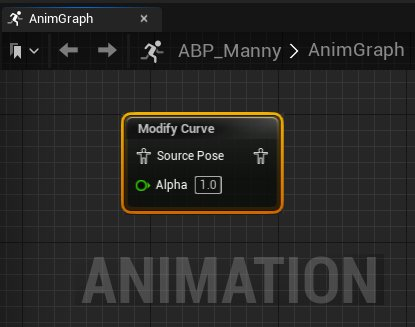
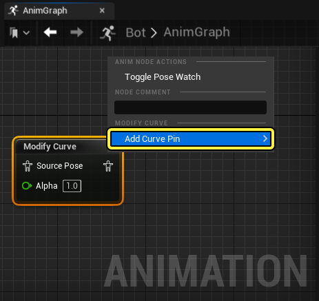
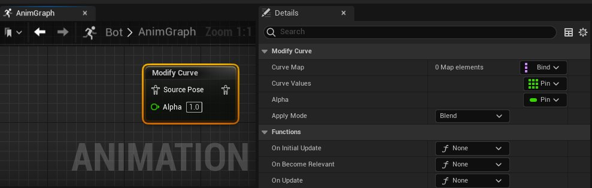

# Modify Curve

> 路径：虚幻引擎5.7文档 / 为角色和对象制作动画 / 骨架网格体动画系统 / 动画蓝图 / 动画节点参考 / 骨骼控制 / Modify Curve

> 原始页面：https://dev.epicgames.com/documentation/unreal-engine/animation-blueprint-modify-curve-in-unreal-engine

借助 [动画蓝图](../../../../../skeletal-mesh-animation-system/animation-blueprints/index.md)的 **Modify Curve** 节点，你可以在运行时混合、缩放并重新映射[动画曲线](../../../../../skeletal-mesh-animation-system/animation-assets-and-features/animation-sequences/animation-curves/index.md)。

在 **AnimGraph** 中右键点击Modify Curve节点，在上下文菜单的 **添加曲线引脚（Add Curve Pin）** 中选择角色的[动画曲线](../../../../../skeletal-mesh-animation-system/animation-assets-and-features/animation-sequences/animation-curves/index.md)，添加对应的[动画曲线](../../../../../skeletal-mesh-animation-system/animation-assets-and-features/animation-sequences/animation-curves/index.md)。

这里，我们在Modify Curve节点 添加了 **色调偏移（Hue Shift）** 曲线，以便改变角色材质的色调。

| 说明 | 图表 | 结果 |
| --- | --- | --- |
| 此处，**色调偏移（Hue Shift）** 曲线已在 **AnimGraph** 中的Modify Curve节点上设置为静态值 **1.0** 。这会从曲线返回一个静态值，从而使角色显示单一颜色材质。 | modify cuuve animaiton blueprint node disabled | modify curve animation blueprint node bot demo disabled |
| 此处设置了 **正弦波**，用于控制 **AnimGraph** 中Modify Curve节点上的 **色调偏移（Hue Shift）** 曲线值。这会返回一个动态值，从而使角色材质重复显示几种颜色。 | modify cuuve animaiton blueprint node disabled | modify curve animation blueprint node bot demo enabled |

## 属性参考

你可以在此处参考Modify Curve节点的属性列表。

| 属性 | 说明 |
| --- | --- |
| **曲线映射（Curve Map）** | 此处你可以设置曲线映射。曲线映射是关联式无序容器，它将一组键与一组值关联起来。映射中的每个键都必须唯一，但值可以重复。 |
| **曲线值（Curve Values）** | 曲线值是用于驱动曲线修改行为的值。右键点击 **AnimGraph** 中的Modify Curve节点，并从上下文菜单的添加曲线引脚（Add Curve Pin）选项中选择角色的一个动画曲线，你可以添加新曲线。然后，这些添加的曲线引脚可以用值驱动它们各自的曲线。 |
| **Alpha** | 设置alpha值可控制修改后曲线姿势和源动画姿势的混合。默认情况下，此属性显示为 **AnimGraph** 中节点上的引脚。 |
| **应用模式（Apply Mode）** | 设置将修改应用于[动画曲线](../../../../../skeletal-mesh-animation-system/animation-assets-and-features/animation-sequences/animation-curves/index.md)的方法。应用修改选项包括： **添加（Add）** ：将新值添加到输入曲线值。 **缩放（Scale）** ：按新值缩放输入值。 **混合（Blend）** ：使用节点上的alpha设置将输入与新曲线值混合。 **加权移动平均线（Weighted Moving Average）** ：使用Alpha将新曲线值与上一个曲线值混合，确定eht权重。例如，0.5为移动平均值，值越高，对新值的响应越快，值越低，响应越慢。 **重新映射曲线（Remap Curve）** ：重新映射曲线值条目和1.0之间的新曲线值。例如，例如，曲线值0.5使0.51映射到0.02。 |
