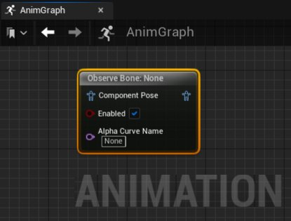

# 观察骨骼

> 路径：虚幻引擎5.7文档 / 为角色和对象制作动画 / 骨架网格体动画系统 / 动画蓝图 / 动画节点参考 / 骨骼控制 / 观察骨骼

> 原始页面：https://dev.epicgames.com/documentation/unreal-engine/animation-blueprint-observe-bone-in-unreal-engine

借助[动画蓝图](../../../../../skeletal-mesh-animation-system/animation-blueprints/index.md)中的 **观察骨骼（Observe Bone）** 节点，你可以观察选定骨骼的平移、旋转和缩放运动以便进行调试。

此处正在动画过程中观察角色的 `upperarm_l`。

> 动图已省略：observe bone animation blueprint node demonstration

该节点将在 **AnimGraph** 中使用 **要观察的骨骼（Bone to Observe）** 运动的坐标来显示调试数据。调试数据的每一行显示每个轴上运动数据的元素。

例如：

- TX

  表示在X轴上"平移（Translation）"。
- RY

  表示在Y轴上"旋转（Rotation）"。
- SZ

  表示在Z轴上"缩放（Scale）"。

## 属性参考

该节点的 **细节（Details）** 面板中可访问的"观察骨骼（Observe Bone）"属性如下。

| 属性 | 描述 |
| --- | --- |
| **要观察的骨骼（Bone to Observe）** | 在此处可定义角色[骨架](../../../../../skeletal-mesh-animation-system/animation-assets-and-features/skeletons/index.md)中的骨骼以追踪位置和运动数据。 |
| **显示空间（Display Space）** | 在此处可选择在哪个空间中计算 **要观察的骨骼（Bone to Observe）** 运动。 **世界空间（World Space）**：观察 **要观察的骨骼（Bone to Observe）*** 在世界空间中的绝对位置。 **组件空间（Component Space）**：观察 **要观察的骨骼（Bone to Observe）** 在[骨骼网格体（Skeletal Mesh）](../../../../../../working-with-content/skeletal-mesh-assets/index.md)的参考框架内的位置。 **父骨骼空间（Parent Bone Space）**：观察 **要观察的骨骼（Bone to Observe）** 相对于父骨骼的位置。 **骨骼空间（Bone Space）**：观察 **要观察的骨骼（Bone to Observe）** 在其自己的参考框架内的位置。 |
| **相对于参考姿势（Relative to Ref Pose）** | 启用此属性后，将根据 **显示空间（Display Space）** 属性中定义的空间，追踪与[骨骼网格体（Skeletal Mesh）](../../../../../../working-with-content/skeletal-mesh-assets/index.md)的参考姿势相关的 **要观察的骨骼（Bone to Observe）** 的位置和运动数据。 |
