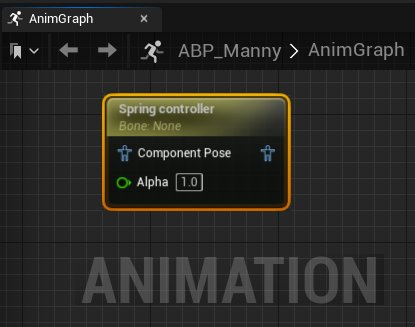
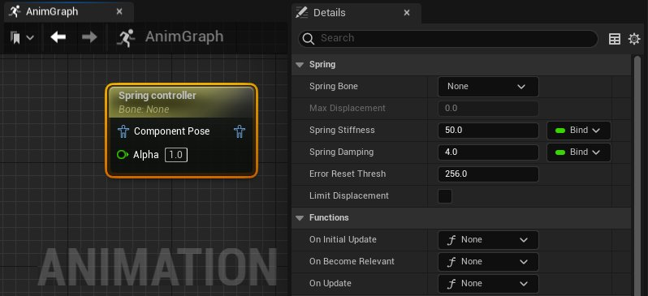

# 弹簧控制器

> 路径：虚幻引擎5.7文档 / 为角色和对象制作动画 / 骨架网格体动画系统 / 动画蓝图 / 动画节点参考 / 骨骼控制 / 弹簧控制器

> 原始页面：https://dev.epicgames.com/documentation/unreal-engine/animation-blueprint-spring-controller-in-unreal-engine

借助 **弹簧控制器（Spring Controller）** [动画蓝图](../../../../../skeletal-mesh-animation-system/animation-blueprints/index.md)节点，你可以将拉伸效果应用于角色骨架中的骨骼。

此示例中的"弹簧控制器（Spring Controller）"节点用于对角色运动施加反方向的力，模拟非动画骨骼的运动。

| (convert:false) | spring controller demo enabled |
| --- | --- |
| 禁用了"弹簧控制器（Spring Controller）" | 启用了"弹簧控制器（Spring Controller）" |

## 属性参考

"弹簧控制器（Spring Controller）"节点的属性列表如下。

| 属性 | 描述 |
| --- | --- |
| **弹簧骨骼（Spring Bone）** | 从角色的骨架中选择要应用"弹簧控制器（Spring Controller）"节点的骨骼。 |
| **最大位移（Max Displacement）** | 启用 **限制位移（Limit Displacement）** 后，设置骨骼可从参考姿势位置处拉伸的最大距离（采用虚幻引擎单位）。 |
| **弹簧刚度（Spring Stiffness）** | 设置用于计算弹簧刚度的乘数值。值越大，骨骼位移时要求的骨骼速度就越高，因此应用的力也越大，反应运动也更快。 |
| **弹簧阻尼（Spring Damping）** | 设置乘数以降低 **弹簧骨骼（Spring Bones）** 的速度，使产生的效果更平滑、更可控。 |
| **错误重置阈值（Error Reset Thresh）** | 设置一个阈值，超过此阈值将重置弹簧骨骼（采用虚幻引擎单位）。如果 **弹簧骨骼（Spring Bone）** 拉伸超过此值，则会重置以避免突然的大位移（例如由传送Actor引起）造成错误。 |
| **限制位移（Limit Displacement）** | 启用此属性后，**最大位移（Max Displacement）** 属性将生效。 |
