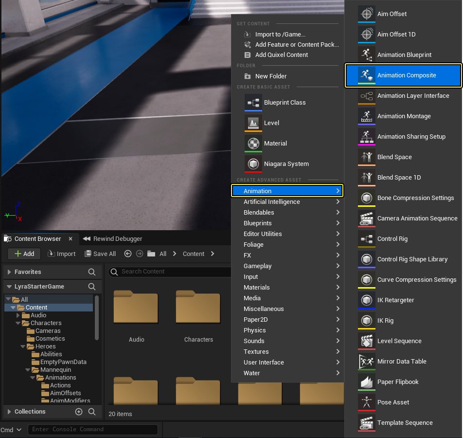
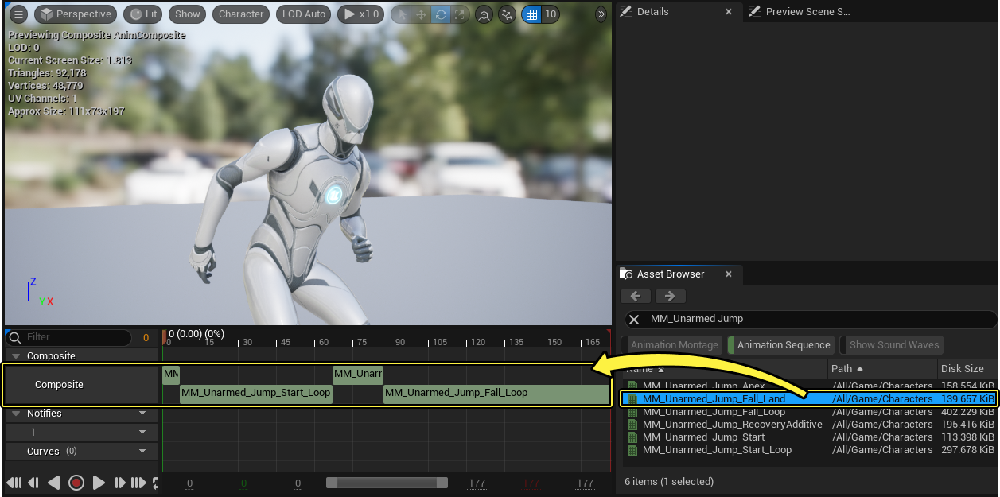
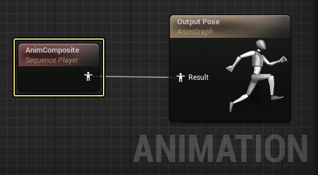
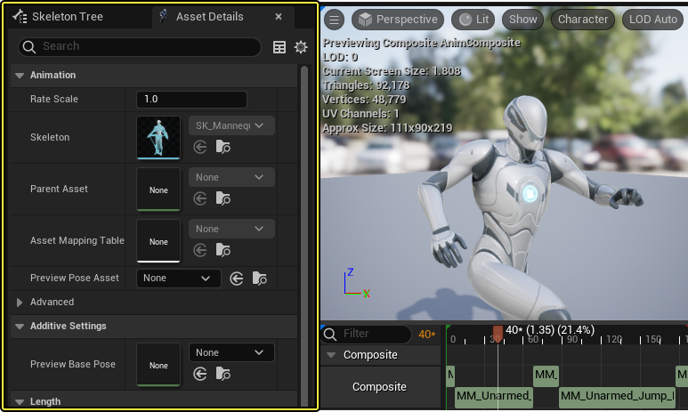

# 动画合成

> 路径：虚幻引擎5.7文档 / 为角色和对象制作动画 / 骨架网格体动画系统 / 动画资产和功能 / 动画合成

> 原始页面：https://dev.epicgames.com/documentation/unreal-engine/animation-composites-in-unreal-engine

使用 **动画合成（Animation Composites，简称合成）** 你可以将多个[动画序列](../animation-sequences/index.md) 合并为一个资产并且可以作为一个序列来播放。请注意，合成只能将动画合并用于播放但不能提供其他任何功能，比如混合。想要功能更全面更高级的资产类型，参阅[动画蒙太奇](../animation-montage/index.md)。

> 动图已省略：动画合成多序列播放示例

和动画序列类似，动画合成也可以使用[动画通知](../animation-sequences/animation-notifies/index.md) 和 [动画曲线](../animation-sequences/animation-curves/index.md)。

## 创建动画合成

你可以在内容浏览器中创建一个新的动画合成，**右键点击** (或选择 **添加新按钮**) 然后选择 **动画（Animation）** **> 动画合成（Animation Composite）**。

创建新的动画合成之后，需要选择要关联新动画合成的[骨骼](../skeletons/index.md)

你也可以从已有的[动画序列](../animation-sequences/index.md)创建动画合成，在内容浏览器中 **右键点击** 序列然后选择 **创建（Create）> 创建动画合成（Create AnimComposite）**。

> [!NOTE]
> 从动画序列创建动画合成时，默认情况下已有的动画通知或动画曲线都不会被复制。你可以手动复制这些资产，选中它们，使用快捷键 **CTRL** + **C** ，在新的动画合成资产中选择动画通知轨道，然后按下快捷键**CTRL** + **V**。
>
> > 动图已省略：将动画通知从源动画复制到新的动画合成

现在这个动画合成可以使用了，并且用淡绿色将其与动画序列区分开。

## 编辑动画合成

**双击** 动画合成会打开[动画序列编辑器](../../animation-editors/animation-sequence-editor/index.md) ，相关的属性和功能会显示在编辑器中。

在 **时间轴（Timeline）** 上，你可以从 **资产浏览器（Asset Browser）**中将序列添加至动画合成轨道上。

你可以通过拖动来更改序列在合成中的顺序。序列在其他序列前后会自动吸附。

你可以移除一个序列，选中它并 **右键点击** ，选择 **删除片段（Delete Segment）**。你也可以选择 **打开资产（Open Asset）** 在对应的资产编辑器中将其打开，

## 使用动画合成

合成后，动画合成可以像动画序列一样在 **动画蓝图（Animation Blueprint）** 的 **动画图表（AnimGraph** 中使用。

你也可以在资产浏览器中用与单个动画序列相同的方式将一个动画合成添加至另一个动画合成，或者添加至一个[动画蒙太奇](../animation-montage/index.md)。

## 动画资产细节

在动画序列编辑器中打开动画合成的时候， **资产细节（Asset Details）** 面板上有几个特有的属性。动画合成的属性如下所示。

| 属性 | 描述 |
| --- | --- |
| **预览基本姿势（Preview Base Pose）** | 这里你可以为一个 **叠加混合空间（Additive BlendSpace）** 分配和引用基本姿势。更多混合空间的相关信息，参阅[混合空间](../blend-spaces/index.md)。 |
| **序列长度（Sequence Length）** | 选中动画序列的播放时长（以秒为单位），默认播放速度因子为1.0。 |
