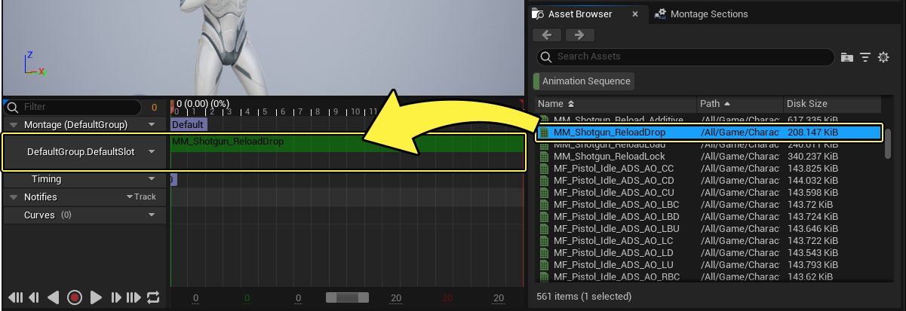
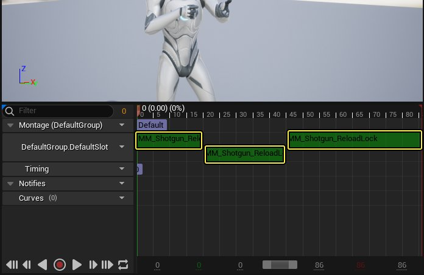
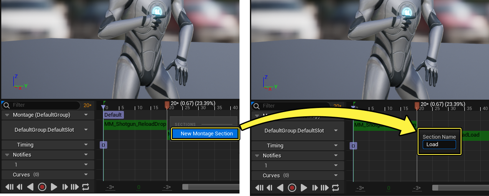
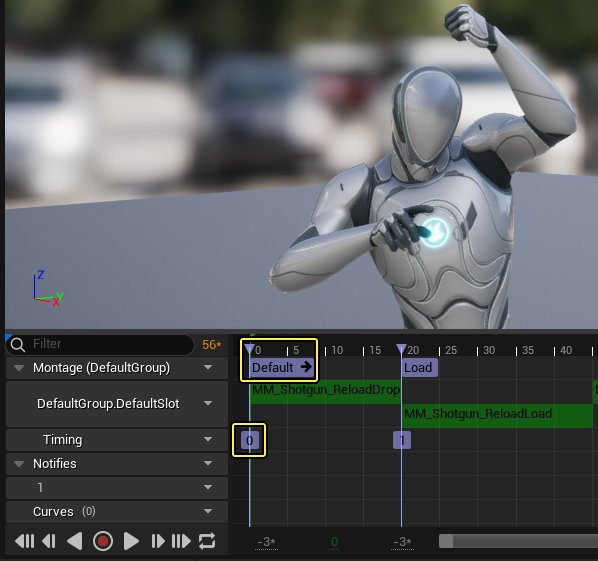
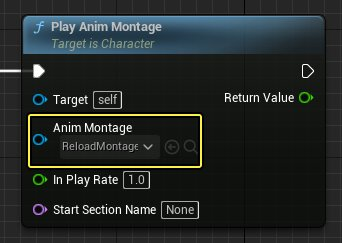
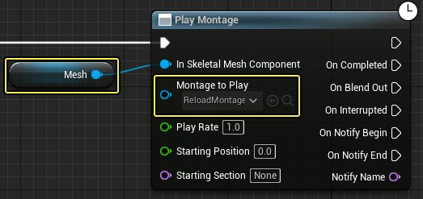
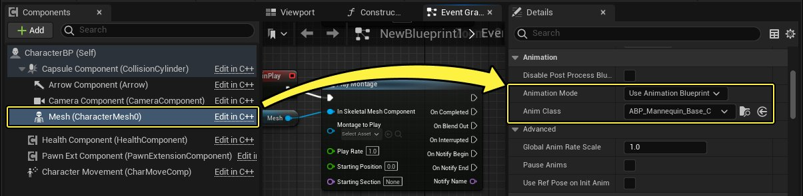
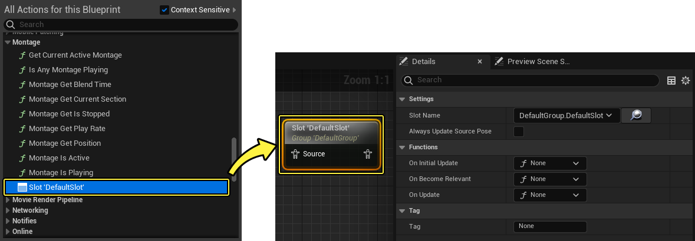

# 编辑并使用动画蒙太奇

> 路径：虚幻引擎5.7文档 / 为角色和对象制作动画 / 骨架网格体动画系统 / 动画资产和功能 / 动画蒙太奇 / 编辑并使用动画蒙太奇

> 原始页面：https://dev.epicgames.com/documentation/unreal-engine/animation-montage-editor-in-unreal-engine

## 编辑动画蒙太奇

如果初次使用 **动画蒙太奇（Animation Montages）**，建议你先阅读[动画蒙太奇概述](../index.md)文档。

本文档介绍了如何设置动画蒙太奇以及[动画序列编辑器](../../../animation-editors/animation-sequence-editor/index.md)中与动画蒙太奇相关的属性。

### 添加动画

要将 **动画** 添加到蒙太奇中，从 **资产浏览器（Asset Browser）** 中将想要的 **序列** 拖入蒙太奇插槽轨道的动画序列编辑器 **时间轴（Timeline）**。

向同一个插槽轨道中拖入序列可以给蒙太奇添加额外的动画。额外的动画会按照顺序添加并且互相错开来表示动画之间的间隔。

你可以点击并拖动插槽轨道上的动画来将其重新排序。

右键单击蒙太奇轨道中的动画，将显示以下菜单：

| 属性 | 描述 |
| --- | --- |
| **删除片段（Delete Segment）** | 从蒙太奇中删除选中的动画。 |
| **打开资产（Open Asset）** | 在对应的编辑器窗口中打开选中的动画资产。 同时使用多个动画资产时，建议同时打开多个资产。在内容浏览器或者资产链接实例中点击资产时按住 **Shift** 可以在一个编辑器选项卡中打开多个动画资产。 |
| **新建蒙太奇分段（New Montage Section）** | 创建新的蒙太奇分段。具体参考[创建蒙太奇分段](#creatingmontagesections)。 |
| **新建插槽（New Slot）** | 定义好使用的插槽后创建新的插槽轨道。具体参考[定义轨道插槽](#defining%20track%20slots)。 |
| **删除插槽（Delete Slot）** | 删除选中的插槽，包括内含的所有资产实例。 |
| **复制插槽（Duplicate Slot）** | 复制选中的插槽，包括内含的所有资产。 同一个 **骨骼** 的同一个 **插槽** 上不能有两个或以上的轨道。其中一个复制的轨道必须重新定义给新的插槽。 |
| **将元素设置为...（Set Elements to...）** | 该属性定义关联的动画通知和序列绑定分段的性质。 选项包括： **绝对（Absolute）**: 动画通知位置与其在蒙太奇时间轴上的位置整体绑定，不论序列的长度或顺序。 **相对（Relative）**: 启用时，动画通知绑定至相对于排序序列的相对位置。比如，动画通知在蒙太奇的第一个序列开始后一秒钟触发，该通知会被固定在第一个序列开始后一秒，不论哪个序列排在第一，就算启用该选项之后也一样。 **比例（Proportional）**: 动画通知会连接到关联的动画序列上，即使在录制序列时也一样。 |

### 创建蒙太奇分段

要创建一个 **分段（Section）**，**右键点击** 插槽轨道或者蒙太奇轨道然后在菜单中选择 **新建蒙太奇分段（New Montage Section）**。根据提示定义 **分段名称（Section's Name）**。

新的分段会出现在蒙太奇轨道上并且以紫色标题框和计时标签表示。

默认情况下，所有动画蒙太奇都包含 **默认（Default）** 分段，该分段单独使用时会按顺序播放整个蒙太奇。

你可以左键单击并拖动分段标题，将该分段移动到所需位置。

> 动图已省略：重新排序时序列自动吸附

> [!NOTE]
> 动画蒙太奇的开始处必须有一个分段。如果编辑时移动或者修改了时间轴开始的分段，编辑器会自动纠正修改的分段或者下一个离蒙太奇开始最近的分段。
>
> > 动图已省略：移动并编辑分段

### 定义轨道插槽

**插槽（Slot）** 是用于管理骨骼网格体上动画播放的系统，分配至网格体上的各个区域或部分。在角色 **动画蓝图（Animation Blueprint）** 的 **动画图表（Anim Graph）** 中，插槽可以用来区分动画要在角色身体的哪个部分上播放。可以在创建 **新轨道（New Track）** 的时候或者使用下拉菜单来指定蒙太奇轨道使用哪个插槽，以此区分动画要在哪个插槽上播放。

> [!NOTE]
> 所有的序列轨道都必须使用来自同一个[插槽组](../../../animation-blueprints/animation-slots/index.md#slotgroups)的插槽。

更多插槽和插槽管理的相关信息，请参考 [插槽](../../../animation-blueprints/animation-slots/index.md)文档。

### 使用多个插槽

蒙太奇可以包含使用不同插槽的多个动画轨道，以此来在网格体的不同部分或者不同状态的实例同时播放不同的动画。利用蒙太奇可以用一个资产将相关的动画集合在一起，并且将它们分配到不同的插槽来在各自对应的情况下播放。一个重装填动画蒙太奇可以给任何状态下的角色使用。举个例子，使用蓝图，一个重装填动画蒙太奇可以在角色站立时播放一个插槽上的动画，而在角色匍匐的时候从另一个插槽上播放动画。

> [!NOTE]
> 在一个动画蒙太奇中使用多个插槽时，为了达到最好的效果，确保每个动画轨道长度都相同。

## 播放动画蒙太奇

在动画蒙太奇编辑器中创建并修改好动画蒙太奇后，可以在 **蓝图（Blueprint）** 中播放它，只要你的角色Actor能够被引用。可以使用 **播放动画蒙太奇（Play Anim Montage）** 节点来播放动画蒙太奇。

通过 **播放动画蒙太奇节点（Play Anim Montage Node）**，你可以从蓝图激活动画蒙太奇的播放。你还需要指定一个要播放蒙太奇的目标。**播放动画蒙太奇节点（Play Anim Montage Node）** 默认的目标为 **自身（Self）** 对象。

其它选项包括蒙太奇的 **播放中速率（In Play Rate）**，会将所用值作为因数。比如，数值2会以两倍速度播放蒙太奇，而数值0.5会以一半的速度播放。

如果想要将默认分段以外的分段作为起始，通过这个节点还可以定义从哪一个分段开始播放。分段会按照你在动画蒙太奇编辑器的蒙太奇分段面板中定义的行为播放。

想要更强大功能更多的节点，你可以使用 **播放蒙太奇（Play Montage）** 节点。对于该节点你需要连接要添加动画的 **网格体（Mesh）** 并且分配 **要播放的蒙太奇（Montage to Play）**。

你还可以设置播放相关的 **播放速率（Play Rate）** 因数，或者设置自定义 **起始位置（Starting Position）**，单位为秒，或者 **起始分段（Starting Section）**，按名称设置。

从节点的输出，有几个事件可以用于根据蒙太奇的状态来激活连接到节点和函数：

| 输出引脚 | 描述 |
| --- | --- |
| **完成时（On Completed）** | 函数连接到该引脚，会在蒙太奇完成播放并完全混出后激活。 |
| **混出时（On Blend Out）** | 在这里，函数会在蒙太奇开始 **混出（Blend Out）** 时根据 **混出触发时间（Blend Out Trigger Time）** 或者在蒙太奇结束时激活。 |
| **被中断时（On Interrupted）** | 在这个引脚上，函数会在蒙太奇播放被 **中断（Interrupted）** 时激活。 |
| **在通知开始时（On Notify Begin）** | 该引脚上的函数会在 **播放蒙太奇通知（Play Montage Notify）** 激活或者 **播放蒙太奇通知窗口（Play Montage Notify Window）** 开始时激活。了解更多不同类型动画通知，以及如何在动画序列和蒙太奇中应用，参考 [动画通知](../../animation-sequences/animation-notifies/index.md)文档。 |
| **通知结束时（On Notify End）** | 当 **播放蒙太奇通知窗口（Play Montage Notify Window）** 结束时，该引脚会激活连接的函数。 |
| **通知名称（Notify Name）** | 该引脚输出活跃的动画通知名称。 |

要让播放蒙太奇，在 **骨骼网格体（Skeletal Mesh）** 的角色蓝图中应该把 **动画模式（Animation Mode）** 设置为 **使用动画蓝图（Use Animation Blueprint）** 并且连接 **动画类（Anim Class）** 属性中使用的 **动画蓝图（Animation Blueprint）**。

在动画蓝图的动画图表上，你可以使用引用蒙太奇中插槽的 **插槽（Slot）** 节点来将蒙太奇播放与其余部分的角色动画系统整合在一起。

### 动画蓝图的类默认值

使用[分层动画蓝图](../../../animation-blueprints/animation-blueprint-linking/index.md)时，你还可以在动画蓝图的 **类默认值** 面板中定义动画蒙太奇的播放行为。

> 图片已省略：montage asset class defaults properties

如果你希望蒙太奇在所有关联层上播放，你可以启用 **Use Main Instance Montage Evaluation Data** 属性，这会在所有关联的实例上使用主实例的蒙太奇数据。例如，在主实例上播放蒙太奇时，也会在关联层上播放它。这有助于确保蒙太奇的完整播放，避免被动画层覆盖。 有关使用关联动画蓝图层的更多信息，请参阅[使用分层动画](../../../animation-workflow-guides-and-examples/using-layered-animations/index.md) ，了解如何将蒙太奇与分层动画系统一起使用。

## 蒙太奇属性参考

动画蒙太奇由多个共同运作的资产组合在一起。以下是在使用动画蒙太奇时相关的每种资产和可用属性的参考指南。

### 资产细节

这里可以参考一系列属性，能够用于定义动画序列编辑器当前打开的动画蒙太奇的行为。

> 图片已省略：动画序列编辑器打开动画蒙太奇时的资产细节面板

| 属性 | 描述 |
| --- | --- |
| **混入模式（Blend Mode In）** | 选择 **混入** 蒙太奇时使用的模式。可选择 **标准（Standard）** 和 **初始化（Initialization）**。 |
| **混出模式（Blend Mode Out）** | 选择 **混出** 蒙太奇时使用的模式。可选择标准和 **初始化（Initialization）**。 |
| **混入（Blend In）** | 指定混入蒙太奇的行为时，可以在该选项中设置以下选项： **混合时间（Blend Time）**：在分段中设置混合时间，来控制混合的时长。 **混合选项（Blend Option）**：选择执行混合所使用的方法。 **自定义曲线（Custom Curve）**：指定一个执行混合时所引用的曲线资产。 |
| **混出（Blend Out）** | 指定混出蒙太奇的行为时，可以在该选项中设置以下选项： **混合时间（Blend Time）**：在分段中设置混合时间，来控制混合的时长。 **混合选项（Blend Option）**：选择执行混合所使用的方法。 **自定义曲线（Custom Curve）**：指定一个执行混合时所引用的曲线资产。 |
| **混出触发时间（Blend Out Trigger Time）** | 设置令混出进程开始的阈值。可分配的值为从蒙太奇末尾开始计数的时间（以秒为单位）。 使用 **小于** 0的数值，将会使用 **混出时间（BlendOutTime）**，**混出（BlendOut）** 将会在蒙太奇结束时结束。 使用 **大于** 或者 **等于** 0的数值，将会用蒙太奇末尾减去 **混出触发时间（BlendOutTriggerTime）** 来触发混出。 |
| **启用自动混出（Enable Auto Blend Out）** | 启用该选项（默认为启用）将在蒙太奇结束时自动混出。禁用该选项，蒙太奇结束时将保持最后的姿势，除非由另外的函数明确指示。 |
| **Blend Profile In** | 选择 **混入** 蒙太奇时使用的混合描述。更多混合描述的相关信息，参考[混合描述](../../skeletons/blend-masks-and-blend-profiles/index.md#blendprofiles) 文档。 |
| **Blend Profile Out** | 选择 **混出** 蒙太奇时使用的混合描述。更多混合描述的相关信息，参考[混合描述](../../skeletons/blend-masks-and-blend-profiles/index.md#blendprofiles) 文档。 |
| **同步组（Sync Group）** | 定义蒙太奇所属的 **同步组（Sync Group）** 的名称。更多同步组的相关信息，以及如何与动画蒙太奇协同使用，参考[同步组](../../../animation-blueprints/animation-sync-groups/index.md)文档。 |
| **同步插槽索引（Sync Slot Index）** | 定义 **同步组插槽索引（Sync Group Slot Index）**。更多同步组的相关信息，以及如何与动画蒙太奇协同使用，参考[同步组](../../../animation-blueprints/animation-sync-groups/index.md)文档。 |
| **时间拉伸曲线（Time Stretch Curve）** | 使用时间拉伸曲线可以用动画曲线在播放时指定速率调整。时间拉伸曲线只能在播放中蒙太奇使用非默认播放率时引用。在该属性中你可以定义以下属性。 **采样率（Sampling Rate）**: 曲线所需的采样率。该值会进行四舍五入计算，这样我们就可以固定时间步长来对整个曲线采样。 **曲线值最小精度（Curve Value Min Precision）**: 连续采样片段之间允许的最小差量。如果低于该值，片段将会合并以优化标记数量。 **标记（Markers）**: 标记的优化列表。 |
| **时间拉伸曲线名称（Time Stretch Curve Name）** | 定义要用于影响动画蒙太奇播放的时间拉伸曲线名称。 |

### 分段

在动画序列编辑器中使用动画蒙太奇时你可以在细节面板中找到每个资产类型相关的属性。以下你可以找到可用于编辑分段的各项属性的参考。要查看这些属性，选中想要的分段，相关的属性便会在细节面板中显示。

> 图片已省略：使用动画蒙太奇分段时的细节面板

| 属性 | 描述 |
| --- | --- |
| **分段名称（Section Name）** | 参考或重命名选中的分段。 |
| **下一个分段名称（Next Section Name）** | 参考蒙太奇分段面板中定义的选中分段的下一个分段。 |
| **插槽索引（Slot Index）** | 可定义的插槽索引值，可以在使用链接的蒙太奇时引用。 |
| **链接方式（Link Method）** | 使用链接蒙太奇时，可以在该属性中定义 **链接方式（Link Method）**，也可以在相关动画序列的右键菜单中进行定义。参考[添加动画](#addinganimations)部分中的 **将元素设置为...（Set Elements To…）** 属性。 |
| **链接序列（Linked Sequence）** | 参考动画通知所链接的动画序列。 |

### 动画

以下是使用动画蒙太奇时可以用于编辑动画的属性的参考。要查看这些属性，选中想要的动画，相关的属性便会在细节面板中显示。

> 图片已省略：动画序列细节面板

| 属性 | 描述 |
| --- | --- |
| **动画参考（Animation Reference）** | 罗列选中的片段激活时要播放的动画序列。 |
| **起始时间（Start Time）** | 以秒为单位显示选中动画相对于序列的 **起始时间（Start Time）**。 |
| **结束时间（End Time）** | 以秒为单位显示选中动画相对于序列的 **结束时间（End Time）**。 |
| **播放速率（Play Rate）** | **播放速率（Play Rate）** 因数，数值2会以两倍速度播放蒙太奇，而数值0.5会以一半的速度播放。 |
| **循环计数（Loop Count）** | 定义动画默认播放的 **循环（Loop）** 次数。 修改该数值会改变蒙太奇中的动画，导致循环变为动画原生的一部分。要设置动态的循环动画，你应该将动画设为仅进行一次循环，然后使用游戏逻辑来根据场景指定进行几次循环 |
| **预览窗口（Preview Window）** | 通过 **预览窗口（Preview Window）** 你可以看到网格体上动画播放的预览。你可以使用 **播放（Play）**/**暂停（Pause）** 按钮来播放或暂停动画预览播放。你还可以用预览窗口下方简化的时间轴来跳转播放。 |
| **起始位置（Start Position）** | 以秒为单位显示动画相对于整个蒙太奇的 **起始位置（Start Position）**。 动画蒙太奇中第一个动画的 **起始时间（Start Time）** 必须为0。 |

要查看动画通知的属性，参考[动画通知](../../animation-sequences/animation-notifies/index.md)文档。
